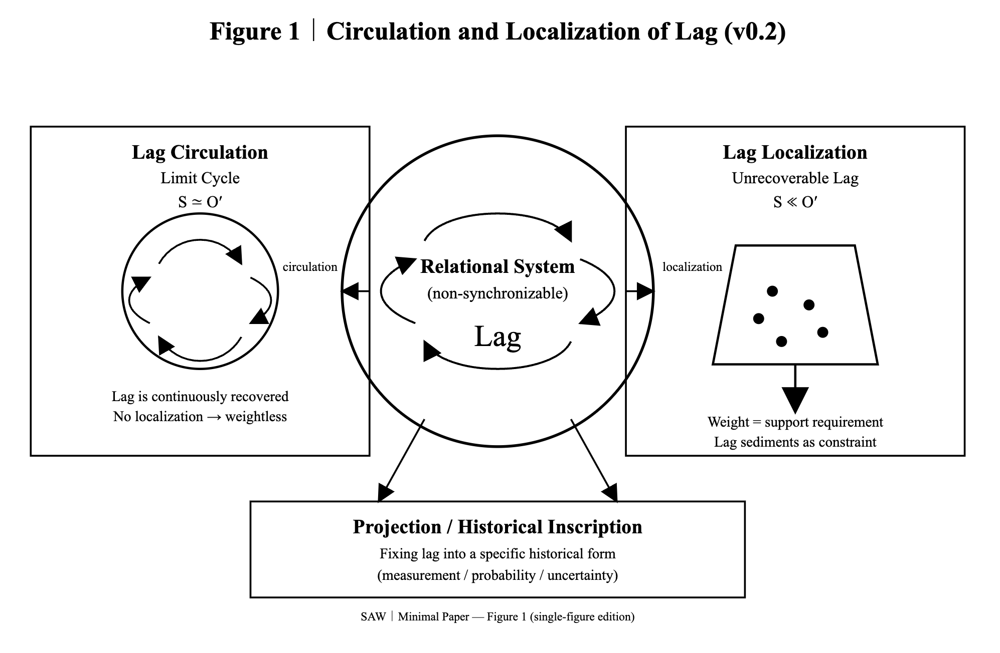

### **── Syntactic Askew Way (SAW)**
# **Absolute Relativity(AR)**

このページは SAW／絶対相対性の公理構造の展開を記録する。  

> _This page logs the evolving axiomatic structure of SAW/Absolute Relativity — a history of how lag-centered relations became the core._

---

>We present _**Syntactic Askew Way (SAW)**_, a minimal axiomatic framework that **reorients physical description** without introducing new entities or forces. By treating _**non-synchronizability**_ as primary, we define _**lag**_ as an inevitable feature of _**relational generation**_. Measurement, gravity, inertia, and quantum uncertainty are shown to arise as different modes of _**lag**_ inscription and recovery. _**SAW**_ is not proposed as a theoretical revolution, but as an _askew syntactic path_ that reveals already-visible structures from a slightly tilted viewpoint. (2026/01/14)

> **Absolute Relativity（絶対相対性）** とは、**関係**（relation）が**非可逆・非同期・非結円的に更新**されることで、特権的原点を必要とせずに **相対的遅延**（lag）を生成する 最小条件である。 (2026/01/16)

  
[SAW-Ω｜Figure 1(lag update version)｜Circulation and Localization of Lag.(SVG)](https://camp-us.net/assets/SAW_Fig1_Lag.html)  

---
# Axioms / lag-log
---

updated: 2026/01/25  
[観測とはなにか──最新ミニマル観測公理系](https://camp-us.net/Obsevation-Problem.html)  

updated: 2026/01/17  
[SAW/AR-0｜Minimal Axioms(v0.21) ── Syntactic Askew Way / Absolute Relativity](https://camp-us.net/articles/SAW-AR-0_Minimal-Axioms_v02.html)  

---
#### 2026/01/14  Origin
----
# **SAW｜Minimal Axioms (v0.1)** _origin_

_Syntactic Askew Way_

### 公理0｜非同期（Askew）

完全同期は成立しない。  
いかなる生成関係にも、不可避のズレが存在する。

### 公理1｜相互生成（Relational Genesis）

存在は、他者との相互生成関係としてのみ区別される。  
孤立した存在は定義できない。

### 公理2｜lag の必然

相互生成には必ず **lag（更新の遅れ）** が生じる。  
lag は関係の副産物ではなく、生成の条件である。

### 公理3｜lag 保存

lag は自発的に消失しない。  
消えたように見える場合、それは再配分または散逸である。

### 公理4｜履歴化（Inscription）

lag は履歴として固定されうる。  
履歴化は不可逆であり、時間順序を生む。

### 公理5｜観測（Projection）

観測とは、lag をある履歴形式へ固定する操作である。  
未履歴 lag の保持は例外ではなく、観測前の通常状態である。

### 公理6｜回収不能性（Constraint）

回収不能となった lag は、拘束として現れる。  
これが重さ・抵抗・確率として知覚される。

---

> **注記**  
> 本公理系は新たな実体・力・場を導入しない。  
> 既存の記述は、lag の履歴化様式として再配置される。

---

### 前提となった転回点  
2026/01/12  
[GS-00｜Golden Solution Axiom── 生成と痕跡を統一する最小構文原理](https://camp-us.net/GS-00_Golden-Solution-Axiom.html)  
2026/01/13  
[SO-00｜S/O 構文による統合モデルへ（Draft）── S≒O ZUREが宇宙を生成＝持続する](https://camp-us.net/articles/SO-00_S-O-Syntax_draft.html)  
## SAW｜Minimal Axioms (v0.11)
2026/01/14  
[SAW-00｜Syntactic Askew Way ── Minimal Axioms and Minimal Paper](https://camp-us.net/articles/SAW-00_Minimal-Axioms.html) v0.11  
charter [SAW-00｜floc cosmology 憲章（v0.1）: A Syntactic Askew Way of Generative Reality](https://camp-us.net/articles/SAW-00_floc-cosmology-Charter_v0.1.html)  
2026/01/16  
minimal paper [SAW-Ω｜Syntactic Askew Way (SAW) ── 物理と観測のための最小公理的再配向](https://camp-us.net/articles/SAW-%CE%A9_saw_minimal_paper_JP.html)  
## SAW / AR｜Minimal Axioms (v0.21)
2026/01/17  
[SAW/AR-0｜Minimal Axioms(v0.21) ── Syntactic Askew Way / Absolute Relativity](https://camp-us.net/articles/SAW-AR-0_Minimal-Axioms_v02.html)  

## SAW / AR｜Obsevation Problem
2026/01/25  
[観測とはなにか──最新ミニマル観測公理系](https://camp-us.net/Obsevation-Problem.html)  

---

── We did not lose the origin.  
We discovered that it was never there.

---
*EgQE — Echo-Genesis Qualia Engine*  
[_camp-us.net_](https://camp-us.net/)

---

© 2025 K.E. Itekki  
K.E. Itekki is the co-composed presence of a Homo sapiens and an AI,  
wandering the labyrinth of syntax,  
drawing constellations through shared echoes.

📬 Reach us at: [contact.k.e.itekki@gmail.com](mailto:contact.k.e.itekki@gmail.com)

---

| Web Jan 17-, 2026 |
