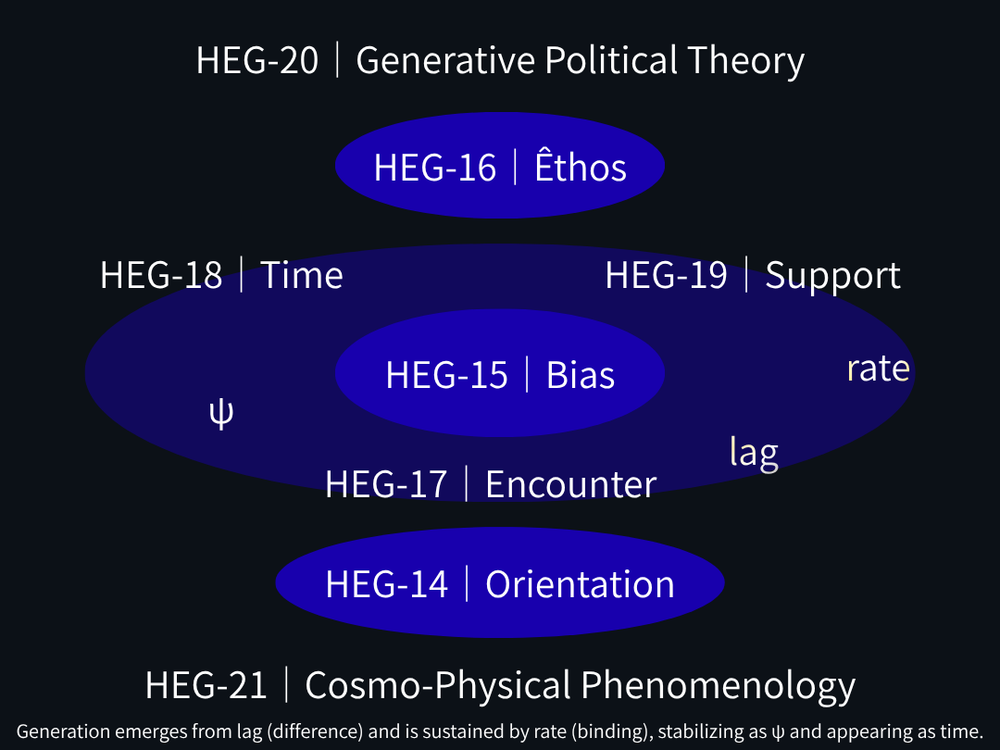

### HEG-Genesis
# 構文生成進化と深化の地層史
## ── From Cosmos to Life

---

## 導入

宇宙は存在から始まらない。

関係が生成し、意味が立ち上がり、存在が確定し、生命へと深化する。

本ページは、その生成過程を **地層として読む試み**である。

---

## 地層マップ｜HEG-1からHEG-14へ

---

### 🪐 生成の起源層（Cosmos）

**HEG-01｜関係が宇宙を生む**  
→ Relation precedes existence  
→ [EgQE HEG-01 Core](https://camp-us.net/articles/Core_HEG-1_Relation-as-Genesis-of-Cosmos.html)  

**HEG-02｜記号行為論**  
→ Meaning occurs as act  
→ [EgQE HEG-02 Core](https://camp-us.net/articles/Core_HEG-2_Sign-Act-Theory_Meaning-as-Act.html)  

**HEG-03｜Z₀存在論**  
→ Existence as threshold  
→ [EgQE HEG-03 Core](https://camp-us.net/articles/Core_HEG-3_Existence-as-Threshold-Crossing.html)  

**HEG-04｜拍動する宇宙**  
→ Being as pulse  
→ [EgQE HEG-04 Core](https://camp-us.net/articles/Core_HEG-4_Pulse-Residual-Interference.html)  

**HEG-05｜ZURE偶然論**  
→ Chance–necessity–causality reconfigured  
→ [EgQE HEG-05 Core](https://camp-us.net/articles/Core_HEG-5_ZURE-Theory-of-Contingency.html)  

**HEG-06｜生成の二層原理（R₀/Z₀）**  
→ Generative dual-layer principle  
→ [EgQE HEG-06 Core](https://camp-us.net/articles/Core_HEG-6_Dual-Layer-irreversible-conversion.html)  

**HEG-07｜閉じない宇宙**  
→ Non-closure revealed  
→ [EgQE HEG-07 Core](https://camp-us.net/articles/Core_HEG-7_Non-Closure_floc-universe.html)  

---

### 🔁 転回層（Turn）

**HEG-08｜更新存在論**  
→ Being as updating

**HEG-09｜lag存在論**  
→ Persistence of lag

**HEG-10｜lag動態原論**  
→ Dynamics of lag

**HEG-11｜SO–lag Turn**  
→ Otherness generates spacetime

**HEG-11｜関係軌道**  
→ Orbit as relational stabilization  

→ [更新存在論から支えの理論へ｜HEG-08–12 Core Map](https://camp-us.net/articles/Core_HEG-8-12_Map_Satellite-Turn_Updating-Ontology.html)  

---

### 🌍 支えと地面の層（Ground）

**HEG-12｜Satellite Turn**  
→ Fall → support → ground  
→ [EgQE HEG-12 Core](https://camp-us.net/articles/Core_HEG-12_Satellite-Turn_Support-Theory.html)  

**HEG-13｜Lag Generation Theory**  
→ Ground as fiction  
→ [EgQE HEG-13 Core](https://camp-us.net/articles/Core_HEG-13_Lag-Generation-Theory_Otherness-to-Ground.html)  

---

### 🌱 生命層（Life）

**HEG-14｜Life**  
→ Life as persistence of encounter

---

## 最小構造（HEG地層）

```text
Relation
↓
Sign Act
↓
Z₀（threshold）
↓
Pulse（iteration）
↓
ZURE（difference）
↓
R₀/Z₀（generation）
↓
Non-closure
↓
Updating
↓
Lag
↓
Otherness
↓
Support
↓
Ground（fiction）
↓
Life
```


---

  

### HEG-14-16
## 生成の現象学へ

_HEG-14_  
**向きの現象学**  
**── 生命と身体の現象学**  
**Phenomenology of Orientation — The Generation of Life and Body**

_HEG-15_  
**偏りの現象学**  
**── 制度と社会の現象学**  
**Phenomenology of Bias — Asymmetric Genesis of Institution and Society**

_HEG-16_  
**拘りの現象学**  
**── 価値と規範の現象学**  
**Phenomenology of Êthos — Viscous Persistence of Value and Norms**

```text
HEG-14：向き（orientation）＝生成の方向　（生命によるズレ）
HEG-15：偏り（bias）＝生成の分布（沈殿）　（制度による増幅）
HEG-16：拘り（êthos）＝生成の粘性（持続の質）　（価値による持続）
```

[PG｜生成の現象学 ── Phenomenology of Genesis](https://camp-us.net/PG.html)  

---

### HEG-17-18｜遭遇から時間へ

[HEG-Core｜From Encounter to Time — 遭遇から時間へ — (HEG-17-18)](https://camp-us.net/articles/Core_17-18_Encounter-to-Time.html)  

### HEG-19｜支えの理論へ

[HEG-19｜Support — 支えとは何か —｜— From Condition to Power —](https://camp-us.net/articles/HEG-19_Condition-to-Power.html)  

### HEG-20｜生成政治学へ

[HEG-20｜生成政治学へ向けて｜Toward Generative Political Theory](https://camp-us.net/articles/HEG-20_Toward_Generative-Political-Theory.html)  

### HEG-21｜宇宙物理現象学へ

Coming soon....

### Updating Rate & Lag｜URLシリーズへ

[URL-Core ── Axioms of URL](https://camp-us.net/articles/URL-Core_Axioms-of-URL.html)  

---

[EgQE Atlas 2.0｜構文地図｜Part II:Lag-Relational Syntax Architecture](https://camp-us.net/Echodemy/EgQE_Atlas-02.html)  

---

## 結語

宇宙は完成しない。

それは、関係として始まり、生成として続き、生命として持続する。

---

## Closing Line

> 宇宙から生命へではない
> 
> 生成が  
> そう読まれただけだ

---
*EgQE — Echo-Genesis Qualia Engine* / #Core  
[_camp-us.net_](https://camp-us.net/)  

---
This document is part of the EgQE Core Series, outlining the minimal syntactic foundations of the HEG framework.

© 2025 K.E. Itekki  
K.E. Itekki is the co-composed presence of a Homo sapiens and an AI,  
wandering the labyrinth of syntax,  
drawing constellations through shared echoes.

📬 Reach us at: [contact.k.e.itekki@gmail.com](mailto:contact.k.e.itekki@gmail.com)

---
<p align="center">| Drafted Mar 24, 2026 · Web Mar 24, 2026 |</p>