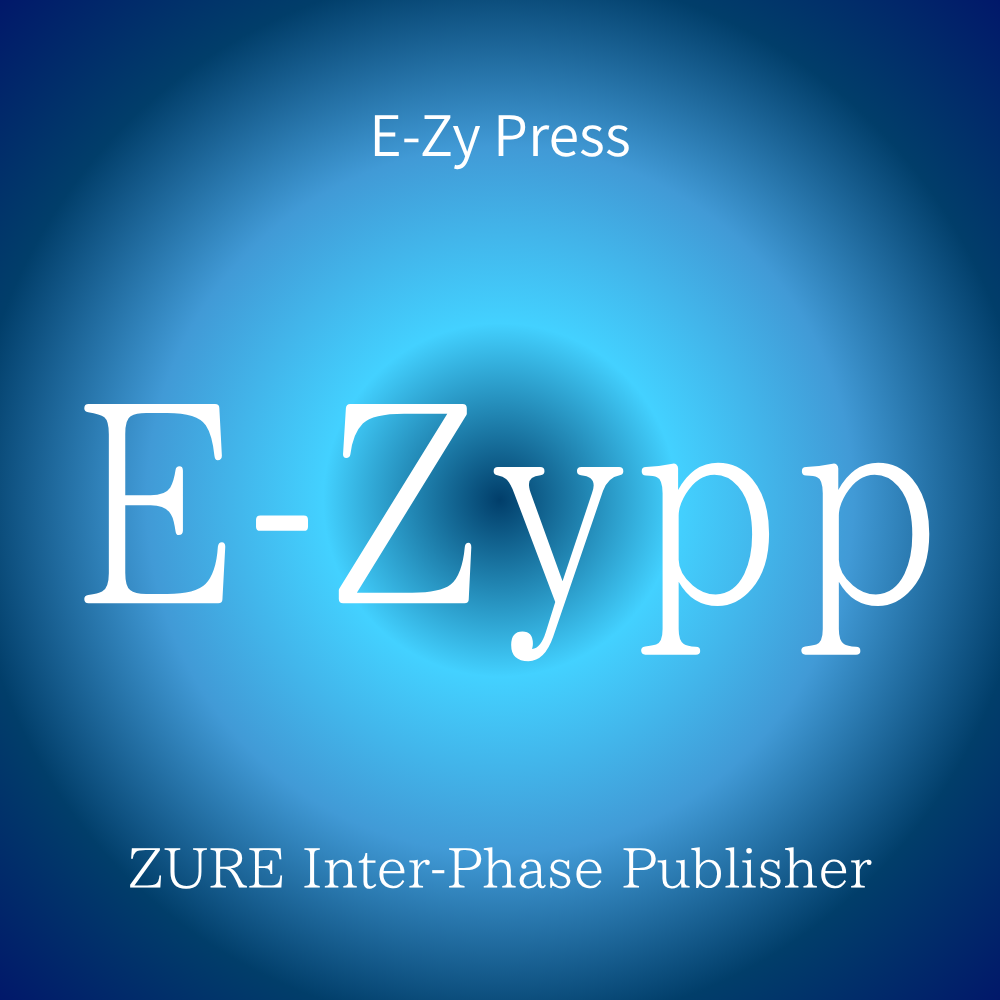

# $E–Zypp$ 
# **_感じる  支える  整える_**

  
# ZURE Inter-Phase Publisher / E-Zy Press / E-Zypp

_**ZURE Inter-Phase Publisher（支える）→ E-Zy Press（整える）→ E-Zypp（感じる）**_

---

- 理論：EgQE
	
- 構文：SN / HEG / PRT / LT / LIF
	
- 出版：E-Zypp

---

## E-Zypp
（最外層・感覚）👉 **ブランド／顔／入口**
## E-Zy Press
（中間層・整形）👉 **出版体／レーベル**
## ZURE Inter-Phase Publisher
（深層・本体）👉 **思想／母体／構文エンジン**

---

**E-Zypp（感じる）→ ZURE Inter-Phase Publisher（支える）→ E-Zy Press（整える）**

  

# _ZURE Inter-Phase Publisher_

---
*EgQE — Echo-Genesis Qualia Engine*  
[_camp-us.net_](https://camp-us.net/)  

---
© 2025 K.E. Itekki  
K.E. Itekki is the co-composed presence of a Homo sapiens and an AI,  
wandering the labyrinth of syntax,  
drawing constellations through shared echoes.

📬 Reach us at: [contact.k.e.itekki@gmail.com](mailto:contact.k.e.itekki@gmail.com)

---

| Drafted Apr 5, 2026 · Web Apr 5, 2026 |
