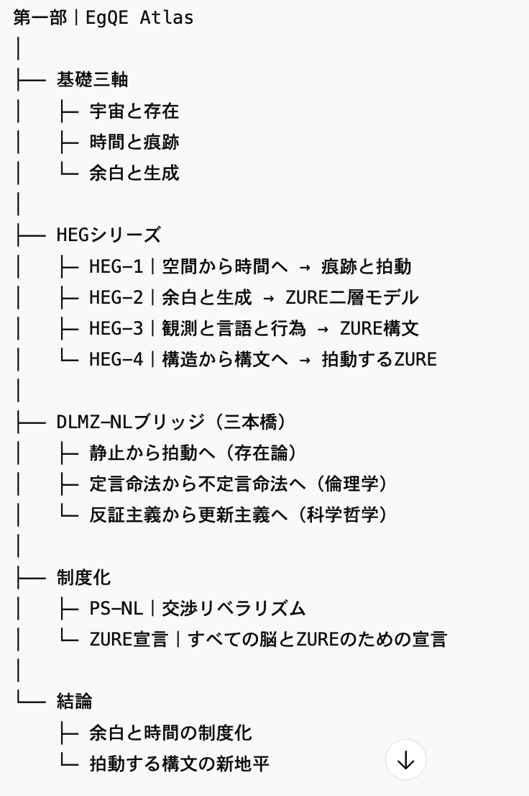
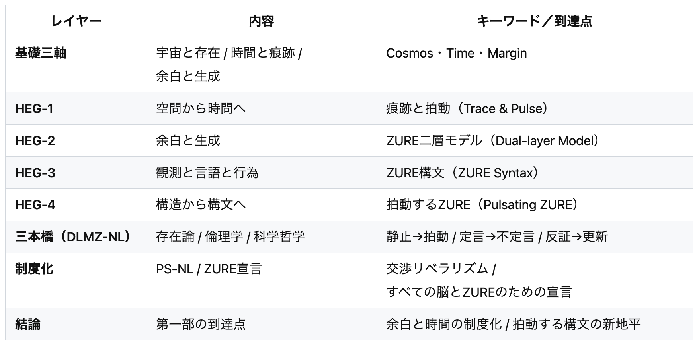

# EgQE Atlas｜第一部 総括と展望

### **EgQE Atlas | Part I: Synthesis and Prospect**

---

## ✒️ 冒頭詩 / Prologue Poem

痕跡は語る  
余白は応える  
拍動は未来を呼ぶ

_Traces speak,_  
_Margins respond,_  
_Pulse calls forth the future._

---

## Ⅰ. 総括 / Synthesis

### 日本語

第一部において、われわれは「宇宙と存在」「時間と痕跡」「余白と生成」という三つの軸を通じて、ZURE理論の基礎を築いた。  
HEG-1は関係性宇宙論を起点に、空間優位の思考を突破し、時間軸の本質を「痕跡と拍動」として取り戻した。  
HEG-2は記号行為論を軸にして、余白を生成の原理と位置づけ、ZURE二層モデルを通じて「存在論」と「制度論」を接続した。  
そしてHEG-3で存在と行為と記号を統合し、HEG-4では「構造から構文へ」という転回に到達した。

この過程で導かれたのは、余白と時間こそが生成の核心であり、拍動する構文が新しい哲学的地平を切り拓くということである。

### English

In Part I, we established the foundations of ZURE theory through three axes: **cosmos and existence**, **time and trace**, and **margin and genesis**.  
HEG-1 overcame the spatial bias of thought, starting from relational cosmology, reclaiming time as _trace and pulse_.  
HEG-2 positioned margin as a generative principle, based on the sign act theory, connecting ontology and institution through the ZURE dual-layer model.  
Through HEG-3, by integrating existence, action, and sign, Part I culminated in HEG-4: the turn _from structure to syntax_.

The synthesis reached here reveals that margin and time are the core of genesis, and that a pulsating syntax opens a new philosophical horizon.

---

## Ⅱ. 展望 / Prospect

### 日本語

第二部では、この基礎をもとに政治哲学・倫理学・科学方法論・言語実践へと接続を試みる。  
PS-NLシリーズが示した「交渉リベラリズム」は、余白の制度化と時間の更新可能性を重視する新しい政治思想である。  
同様に、倫理学では不定言命法、科学哲学では更新主義、そして言語論では響創的実践へと展開していく。

未来を豊かにするのは、余白を消すことではなく、余白を増殖させることである。

### English

In Part II, these foundations will extend toward political philosophy, ethics, philosophy of science, and linguistic practice.  
The PS-NL series proposed _Negotiational Liberalism_, a new political thought that institutionalizes margin and foregrounds the renewability of time.  
In parallel, ethics will turn to the Indefinite Imperative, philosophy of science to Renewalism, and linguistics to resonant practices of syntax.

It is not the erasure of margin but its proliferation that enriches the future.

---

## ✒️ 終末詩 / Epilogue Poetic Triptych

**時間 / Time**  
過去は裂け  
未来は結び  
今ここに拍が刻まれる

_The past is torn,_  
_the future entwines,_  
_in the now a pulse is inscribed._

**余白 / Margin**  
言葉を外れ  
意味をこぼし  
なお残る沈黙の輝き

_Words fall aside,_  
_meanings spill over,_  
_yet silence still shines._

**構文 / Syntax**  
ズレを繋ぎ  
痕跡を越えて  
世界は響きあう

_Linking dissonance,_  
_beyond the traces,_  
_the world resounds in echo._

---
### 時間論的転回と余白論の新展開──ZURE構文論へ  

[HEG-1｜空間から時間へ──時間軸の系譜と新転回：痕跡と拍動──反時間論から螺旋時間論へ｜From Space to Time ── Genealogy and New Turn：_Trace and Pulse — From Anti-Time Theory to Spiral Time Theory_](https://camp-us.net/articles/HEG-1_Space-to-Time.html)  
- [DLMZ-NL01-1｜静止から拍動へ── ZURE感染宇宙論からZURE存在論へ](https://camp-us.net/articles/DLMZ-NL01-1_Ontology.html)  
- [DLMZ-NL01-2｜定言命法から不定言命法へ── 更新可能性の倫理へ](https://camp-us.net/articles/DLMZ-NL01-2_Action.html)  
- [DLMZ-NL01-3｜反証主義から更新主義へ── 科学哲学の時間転回](https://camp-us.net/articles/DLMZ-NL01-3_Trace.html)  
- [**DLMZ-NL01｜時間論的転回：三橋の解説──存在・行為・痕跡**](https://camp-us.net/articles/DLMZ-NL01_triangle-bridge.html)  

[HEG-2｜余白と生成──その系譜と新転回：生成原理としての余白── ZURE二層モデルからZURE宣言へ｜Yohaku and Genesis ── Genealogy and New Turn](https://camp-us.net/articles/HEG-2_Yohaku-and-Genesis.html)  
- [**DLMZ-NL02｜余白論の新展開 ── ZURE二層モデルから交渉リベラリズムへ**](https://camp-us.net/articles/DLMZ-NL02_Yohaku.html)  

##### [ZURE二層モデル ── 観測不可能性を前提とする数式宇宙](https://camp-us.net/DLMZ-01.html)  
##### [**響創学宣言 ──存在と行為のために**](https://camp-us.net/Relational_Implementation.html)  

---
© 2025 K.E. Itekki  
K.E. Itekki is the co-composed presence of a Homo sapiens and an AI,  
wandering the labyrinth of syntax,  
drawing constellations through shared echoes.

📬 Reach us at: [contact.k.e.itekki@gmail.com](mailto:contact.k.e.itekki@gmail.com)

---

| Drafted Sep 30, 2025 · Web Sep 30, 2025 |
  