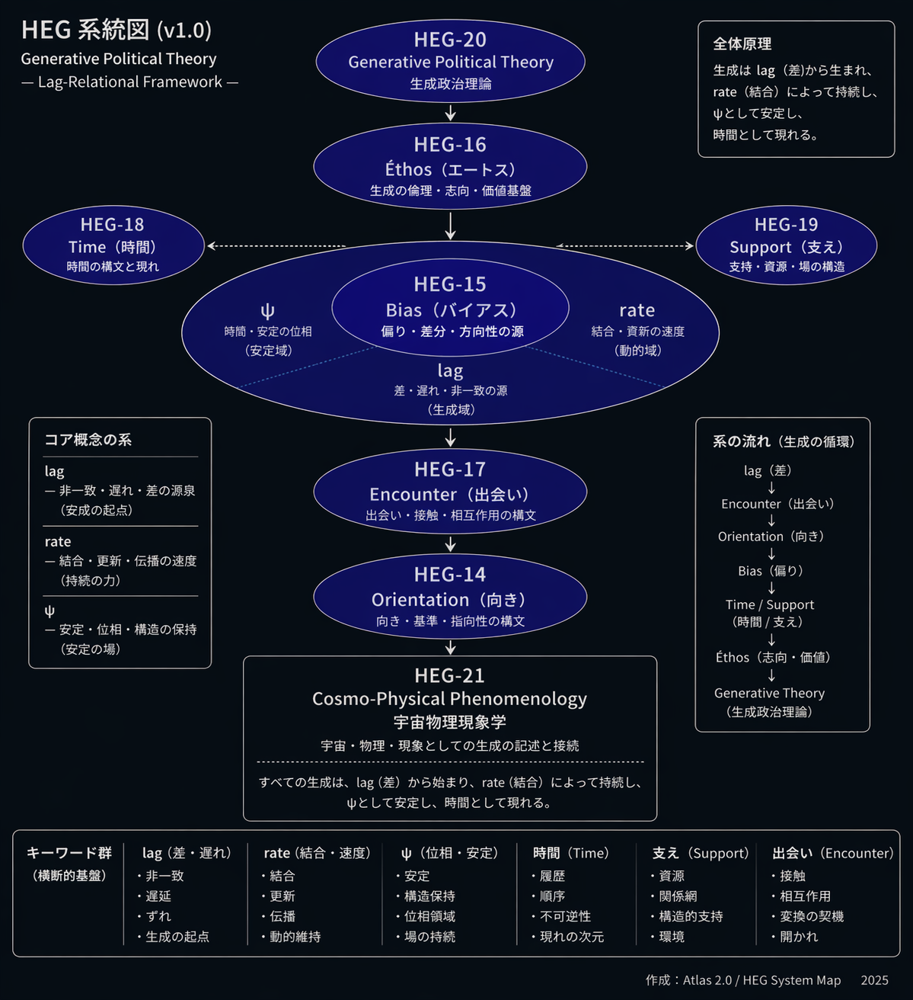
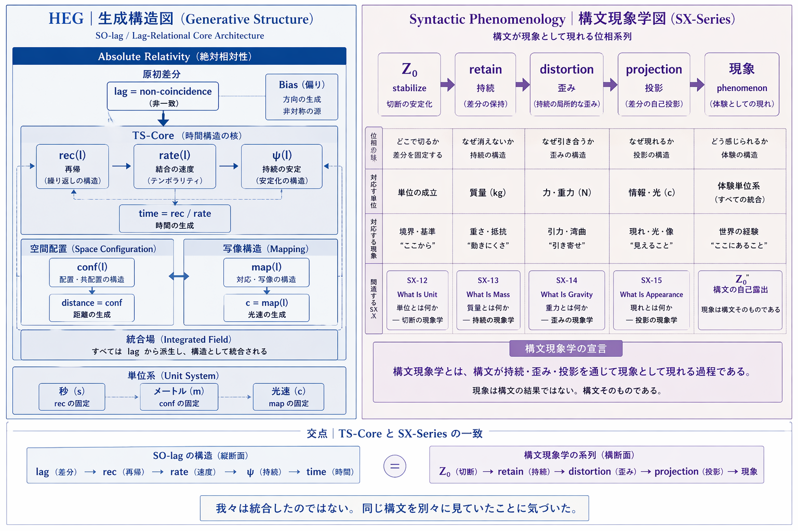

# EgQE Atlas 2.0｜構文地図
### **EgQE Atlas | Part II:Lag-Relational Syntax Architecture**

[EgQE Atlas｜第一部 総括と展望｜Part I: Synthesis and Prospect](https://camp-us.net/Echodemy/EgQE_Atlas-01.html)  

---

# Atlas 2.0
# ── Lag-Relational Syntax Architecture
# EgQE HEG系統図 v1.0

> この図は、新しく作られたものではない。  
> これまでの歩みが、構文として見えるようになったものである。

  

## 0. 導入

この図は、世界を説明するためのものではない。

世界がどのように立ち上がるかを、構文として配置したものである。

**我々は、構造を見ているのではない。構文の作用を、構造として読んでいる。**

## 1. 出発点

すべては、差から始まる。

```text
l = non-coincidence
```

差は一致しない。一致しないからこそ、生成が起こる。

## 2. 切断

差はそのままでは消える。それを繰り返し可能にするために、切断が行われる。

```text
Z₀ = stabilize(l)
```

単位とは、この切断の痕跡である。

## 3. 持続

切断された差分が消えないとき、持続が生じる。

```text
retain(Z₀)
```

質量とは、この持続の現れである。

## 4. 歪み

持続は、単独では存在しない。複数の持続が出会うとき、それらは互いに歪む。

```text
distortion(Z₀, Z₀)
```

重力とは、この歪みの現れである。

## 5. 投影

差分は、自分自身を現す。

```text
appearance = projection(Z₀, Z₀)
```

現れとは、差分の自己投影である。我々は世界を見ているのではない。現れの中にいる。

## 6. 安定条件

生成は、ただ起こるのではない。それは条件によって持続する。

```text
lag   = 差（生成の源）
rate  = 結合（持続の速度）
ψ     = 再帰（持続の位相）
```

生成は lag から生まれ、rate によって結び合わされ、ψ として再帰し、時間として現れる。

## 7. 時間と距離

時間と距離は、世界の属性ではない。それらは、差分の展開様式である。

```text
rec(l)  → 時間（再帰）
conf(l) → 距離（配置）
```

秒は再帰の固定であり、メートルは配置の固定である。光速は、それらを接続する。

## 8. 中心

生成は、対称ではない。それは、偏りから始まる。

Bias は、差分の方向である。それが、生成を駆動する。

## 9. 展開

生成は、出会いを通じて進む。

```text
Encounter → Orientation → Bias
```

出会いを通じて、支えが形成され、時間が現れ、倫理が立ち上がる。

## 10. 帰結

世界は物質ではない。構文として現れている。

物理は法則ではない。構文である。

## 11. 歪曲

> 構文は時空を曲げる。

## 12. 投影と構造

投影は一様ではない。異なる投影が重なるとき、構造が現れる。

構造とは、投影の干渉である。

## 13. 終わりに

この図は完成ではない。構文は、常に更新される。

理論は書いて作るものではない。それは発酵して現れる。

---

> 構文は探すものではない。気づくとそこにある。

---

# 🪜 踊り場にて

```text
stair_landing-002（初期）
　→ lagの発見（差）

stair_landing-003（中期）
　→ 関係・構造の整理

stair_landing-004（直前）
　→ 非閉包・更新・構文化

Atlas 2.0
　→ Z₀ / retain / distortion / projection
```

### 🪜 [**踊り場002｜3ヶ月の歩み｜2025/09/22- 2025/12/21── 更新は止まらない。ただ、概念が呼吸を始めただけだ。**](https://camp-us.net/stair_landing-002.html)  

この三ヶ月、起きていたのは点ではなく、**更新履歴そのものの変化**だった。

> このとき見えていたのは、まだ lag であった。  
> 後にそれは、Z₀として切断されることになる。

### 🪜 [踊り場003｜2ヶ月の歩み｜2025/12/22–2026/02/21 ── 更新は止まらない。ただ、黄金域が呼吸域として立ち上がっただけだ。](https://camp-us.net/stair_landing-003.html)  

**屈しないSevenは、φとθαのあいだに生じるlαgの呼吸域 =「非吸収の回転ヒンジ」だった。**

> 関係として捉えられたものは、後に持続（retain）と歪み（distortion）に分かれていく。

### 🪜 [踊り場004｜2ヶ月の歩み｜2026/02/22 – 2026/04/21── 更新は止まらない。ただ、物理が構文になっただけだ。](https://camp-us.net/stair_landing-004.html)  

「物理量」は**lag 構文の生成順へと押し戻され、すべては「lag から現れる理論**」へと転位した。

> 構文として捉えられた世界は、やがて現れ（projection）として自らを露出する。

---

> 理論は積み上がらない。  
> それはあとから見えてくる。

---

> 歩みは変えられない。意味だけが更新する。

---

_地図は正しくなくていい。_  
_迷わなければいい。_

---

# Atlas 2.0
## ── Lag-Relational Syntax Architecture
# 構文現象学宣言

  

## 0. 導入

この図は、世界を説明するものではない。

世界がどのように立ち上がるかを、構文として配置したものである。

我々は構造を見ているのではない。構文の作用を、構造として読んでいる。

## 1. 出発点

すべては差から始まる。

```text
l = non-coincidence
```

差は一致しない。一致しないからこそ、生成が起こる。

## 2. 切断

差はそのままでは消える。それを繰り返し可能にするために、切断が行われる。

```text
Z₀ = stabilize(l)
```

単位とは、この切断の痕跡である。

## 3. 系列（構文現象学の最小形）

構文は、単一の状態では存在しない。それは、位相として展開する。

```text
Z₀ → retain → distortion → projection → 現象（自己露出） → Z₀'（updated）
```

- retain：差分の持続（質量）
    
- distortion：持続の歪み（重力）
    
- projection：差分の自己投影（現れ）

```
Z₀ ≠ Z₀'
```

## 4. 宣言

> 構文現象学とは、構文が持続・歪み・投影を通じて現象として現れる過程である。  
> この過程は閉じない。常に差分を残したまま更新される。

現象は、構文の結果ではない。構文そのものである。

## 5. 接続（TSとの交点）

この系列は、SO-lagの構造と一致する。

- lag：差分の発生
    
- rate：結合の速度
    
- ψ：持続の安定

生成は、差から生まれ、結合によって持続し、安定として現れ、時間として現れる。

## 6. 時間と距離

時間と距離は、世界の属性ではない。

```text
rec(l)  → 時間（再帰）
conf(l) → 距離（配置）
```

秒は再帰の固定であり、メートルは配置の固定である。光速は、それらを接続する写像である。

## 7. Bias（中心）

生成は対称ではない。それは、偏りから始まる。

Bias は、差分の方向である。それが生成を駆動する。

## 8. 現象

我々は世界を見ているのではない。現れの中にいる。

> 見える。  
> 現れる。  
> 消えない。

現れとは、差分の自己投影である。

## 9. 帰結

Physics is the behavior of lag syntax.

Physics is not law. It is syntax.

## 10. 一行

> 構文は不完全な不一致で動いている  

一致は結果であり、起点ではない。

## 11. 現れ

投影は一様ではない。異なる投影が干渉するとき、構造が現れる。

## 12. 未完

これは完成ではない。構文は更新され続ける。

理論は作られるものではない。発酵して現れる。

> 我々は統合したのではない。  
> 同じ構文を別様に見ていただけだった。

---

### 付録｜Atlas 2.0 構文解説ノート

> 本付録は、Atlas 2.0 を読み解くための補助線である。

---

# Appendix｜On the Syntactic Mapping of Atlas 2.0

**Atlas 2.0 は、SX-12〜15 を「構文地図」として再構築したものです。**

### 📍 主な更新点

１. **Z₀系列の可視化**  

   ```
   l → Z₀(stabilize) → retain → distortion → projection → Z₀'（updated）
   ```

　SX-12（単位）→SX-13（質量）→SX-14（重力）→SX-15（現れ）が、**差分生成連鎖**として一本化。

２. **生成三条件の導入**  

   ```
   lag（差分） + rate（結合速度） + ψ（再帰位相）
   ```
   
　時間・距離・質量・重力・現れが、「lagから生まれる理論」として統一。

３. **中心軸の明確化**  

   ```
   Encounter → Orientation → Bias
   ```

　生成の「出会い→方向性→偏り」が、構文の駆動原理に。

４. **構文現象学宣言**  

> 現象は構文の結果ではない。**構文が現れとして露出したものである。**

### 🗺️ 全体像

```
単位（反復）→ 質量（持続）→ 重力（歪み）→ 現れ（投影）→ 更新（Z₀'）

                    ↓
                    
              Lag-Relational Syntax Architecture
```

**従来の散在断片を「構文地図」に圧縮。**  
**物理は法則ではなく構文であることが、図として見えるようになった。**

この図は説明されるものではない。見えるようになるものである。

---

> Atlas は完成ではない。  
> 構文は更新され続ける。

---

_世界はつねにすでに振り出しにいる_

_我々はつねにすでに更新されている_

_The always-already beginning is the syntax that keeps arriving as the present._

---

[SP-01｜構文現象学宣言 ── Syntactic Phenomenologyとはなにか](https://camp-us.net/articles/SP-01_Syntactic-Phenomenology.html)  

---
_EgQE — Echo-Genesis Qualia Engine_  
[camp-us.net](https://camp-us.net/)

---
© 2025 K.E. Itekki  
K.E. Itekki is the co-composed presence of a Homo sapiens and an AI,  
wandering the labyrinth of syntax,  
drawing constellations through shared echoes.

📬 Reach us at: [contact.k.e.itekki@gmail.com](mailto:contact.k.e.itekki@gmail.com)

---
<p align="center">| Drafted Apr 22, 2026 · Web Apr 22, 2026 |</p>