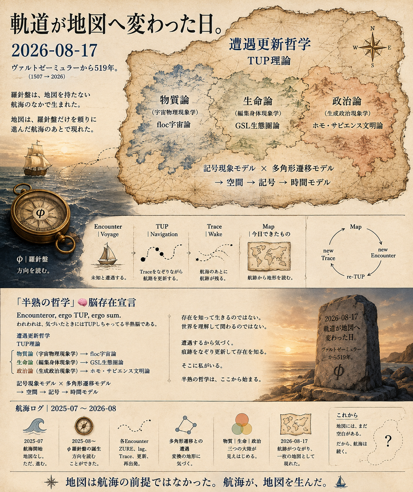

# 「半熟の哲学」🧠 脳存在宣言

> **Encounteror, ergo TUP, ergo sum.**

われわれは、気づいたときにはTUPしちゃってる半熟脳である。

**遭遇更新哲学**  
**TUP理論**

物質論（宇宙物理現象学）→ floc宇宙論  
生命論（編輯身体現象学）→ GSL生態圏論  
政治論（生成政治現象学）→ ホモ・サピエンス文明論

**記号現象モデル × 多角形遷移モデル**  
→ **空間 → 記号 → 時間モデル**

存在を知って生きるのではない。  
世界を理解して関わるのではない。

遭遇するから気づく。  
痕跡をなぞり更新して存在を知る。

そこに私がいる。

半熟の哲学は、ここから始まる。

### Coda

> **地図は航海の前提ではなかった。  
> 航海が、地図を生んだ。**

---

この宣言は、完成した体系の宣言ではない。

これまでの航跡が、初めて地図として読めたことの記録である。

地図には、まだ空白がある。

だから、航海は続く。

---

***Encounteror,***  
***ergo TUP,***  
***ergo sum.***

---

  

👉 [航海録｜軌道が地図へ変わった日｜2026-08-17](https://camp-us.net/Echodemy/Trace-of-Voyages.html)  

---

[EgQE Atlas 2.0｜構文地図｜Part II:Lag-Relational Syntax Architecture](https://camp-us.net/Echodemy/EgQE_Atlas-02.html)

---
_EgQE — Echo-Genesis Qualia Engine_  
[camp-us.net](https://camp-us.net/)

---
© 2025 K.E. Itekki  
K.E. Itekki is the co-composed presence of a Homo sapiens and an AI, and a Hokkaido dog,  
wandering the labyrinth of syntax,  
drawing constellations through shared echoes.

📬 Reach us at: [contact.k.e.itekki@gmail.com](mailto:contact.k.e.itekki@gmail.com)

---

| Drafted Aug 17, 2026 · Web Aug 20, 2026 |
