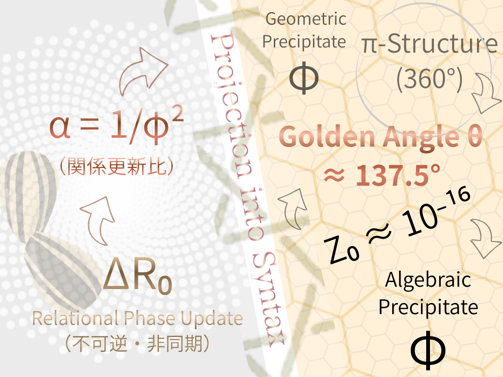

# Golden-Angle Cosmology── Z₀ as the Seed of Syntax

> **This page is a Syntax Atlas of Golden-Angle Cosmology.**  
> 関係的位相更新が、宇宙論的語彙へ沈殿する全体像を示す。

### 呼吸する宇宙の構文論的基礎──黄金角による位相更新とZURE生成

---

👉 **全体系の「構文地図（Syntax Atlas）」** 

> This page is not a paper. It is a structural overview of Golden-Angle Cosmology.  
> It shows how _relational phase updating_ gives rise to _**time, space, number, and observation**_ through syntactic projection.

本ページは、黄金角宇宙論（GAC）全体の構文的見取り図である。  
_関係的位相更新_ が、**時間・空間・数・観測** へ どのように射影されるかを示す。

---
## Projection-into-Syntax

  

- φ は原因ではない
    
- θ は回転ではない
    
- Z₀ は定数ではない  
    
	→ **すべて「構文に落ちた痕跡」** である。

---

## $Z₀=$ _Seed of Syntax_

**Z₀ is the smallest syntactic quantum — not of energy, but of projection.**  
Z₀ はエネルギーの量子ではなく、構文射影の最小量子である。

> **Z₀ is not a physical constant.**
> 
> Z₀ is the residual mismatch that appears when relational generation is projected into complete syntactic forms.

> Z₀ は物理定数ではない。
> 
> 関係的生成が、完全構文（円・数・角度）へ射影されるときに不可避に生じる最小の構文残差である。

[Z₀宣言 ── π構文で閉じないという選択｜The Z₀ Declaration  — On π-Syntax and the Choice Not to Close —](https://camp-us.net/Z₀-Declaration.html)  

---

# 黄金角は「自然現象」から**宇宙論の公理**になった

**Honeycomb hides Z₀; sunflower reveals it.**  
Static synchronization erases syntax seeds;  
asynchronous growth lets them breathe.
  
> **宇宙論を語る前提のUpdateへ**

👉 [The Golden Solution of the Golden Ratio and the Golden Angle — A Minimal Principle Unifying Generation and Trace —｜黄金比と黄金角の黄金解 ──生成と痕跡を統一する最小原理──](https://camp-us.net/GAC_Golden-Solution_Angle-Ratio-Relation.html)  

#### 決定版・黄金角 $α$ 

$$
\boxed{
\alpha = \frac{O'}{S''}
}
$$  

> 黄金角とは、他者が現れても、自己も他者も消えず、関係が更新され続ける**最小非同期生成比**

👉 [Golden Core — 黄金角の核（GAC）](https://camp-us.net/GAC_Golden-Core.html)  

---

#### 決定版・黄金比 $φ$

$$  
\boxed{  
\varphi = \frac{S''}{O'}  
}  
$$

> 黄金角 $α$ による生成が成立していたという **関係構文の静的痕跡**

👉 [黄金比・決定版（黄金角／S/O構文による再定義）──CTS-Φからの接続](https://camp-us.net/GAC_Golden-Ratio_Redefining_CTS-Φ.html)  
👉 [黄金比 : Relational Golden Ratio — 関係としての φ（Relational Phi）—](https://camp-us.net/GAC_Relational-Golden-Ratio.html)  
👉 [黄金比 決定版（S/O構文版）── φ は比ではない、更新された自己である｜Definitive Definition of the Golden Ratio (S/O Syntax)— φ Is Not a Ratio, but an Updated Self](https://camp-us.net/GAC_Golden-Ratio_S-O_Syntax.html)  

---

## Phase Update：本文と Appendix の対応表

- 本文＝**呼吸（Breathing）**
    
- Appendix＝**沈殿（Precipitation）**
    
#### Core : Breath 1

- **GAC-00**：Axiom 0–3  
    [GAC-00｜黄金角による位相更新の公理 Axiom 0–3](https://camp-us.net/articles/GAC-00_Axiom_Golden-Angle-Cosmology.html)  
- **GAC-01**：図版論文（EgQE本文）  
    [GAC-01｜黄金角による位相更新とZURE生成 ― 呼吸する宇宙の構文論的基礎 ―【図版論文】](https://camp-us.net/articles/GAC-01_Golden-Angle-Topology-Update.html)  
- **GAC-02**：黄金比から黄金角へ  
	[GAC-02｜Golden Core — 黄金角の核 ──黄金角の他者論的転回へ向けて](https://camp-us.net/articles/GAC-02_Golden-Core_Definition_ext.html)  
	
- **GAC-03**：生成比としての〈関係φ〉  
	[GAC-03｜ひまわりはなぜ黄金の大輪を咲かせるのか── 黄金角と黄金比の〈関係φ〉への転回｜Why Does the Sunflower Bloom in a Golden Pattern?— Beyond Geometry and Algebra: The Golden Ratio and the Golden Angle as Relational Principles —](https://camp-us.net/articles/GAC-03_Sunflower-Bloom_Golden-Pattern.html)  

---

> Appendix は追加説明ではない。  
> 投影された構文を、それぞれの観測語彙でUpdateした結果である。

---
#### Projection Branches : Phase 1

- Appendix A：Angle
    
- Appendix B：Time
    
- Appendix C：Space
    
- Appendix D：Causality
    
- Appendix E：Interaction / Force
    
- Appendix F：Observation
    

👉  [GAC-00｜関係的位相更新から導かれる黄金比── 黄金角は非同期不可逆更新の観測痕跡である｜Derivation of the Golden Ratio from Relational Phase Update: Golden Angle as an Observational Trace of Asynchronous Irreversible Dynamics](https://camp-us.net/articles/GAC-00_Golden-Angle-Cosmology.html)  

---
#### Projection Branches : Phase 2
[GAC-01｜ひまわりが教えた構文のタネ ──Z₀ as the Seed of Syntax｜Projection Branches : Phase 2](https://camp-us.net/articles/GAC-01_Appendix_Phase-2.html)  
### Appendix A

**ひまわりの意味：関係的位相更新**

- 黄金角の再定義：生成ではなく観測痕跡
    
- Z₀：構文のタネ（Seed of Syntax）
    
- φ・√5・π・θ の位置づけ  
    
    👉 Z₀ は構文のタネである。

### Appendix B

**π構文と360°問題**

- 360°は人類史的構文
    
- πは観測固定の装置
    
    👉 黄金角は構文痕跡である

### Appendix C

**時間生成論**

- 非同期 × 不可逆 = 履歴の強制生成
    
- 回転と時間の転倒  
    
    👉 黄金角は時間生成に最適な更新比

### Appendix D

**空間生成論**

- 履歴＝痕跡の配置
    
- 空間と回転の再転倒  
    
    👉 黄金角的更新と空間の安定性

### Appendix E

**次元とは何か**

- 位相更新方向
    
- 構文的量子性  
    
    👉 黄金角は**次元増加を遅延させる**

### Appendix F

**Z₀ = 10⁻¹⁶** とは何か

- 物理定数ではない
    
- 構文投影誤差  
    
    👉 $Z₀=「構文のタネ」$ _Seed of Syntax_

👉 [GAC-01｜ひまわりが教えた構文のタネ ──Z₀ as the Seed of Syntax｜Projection Branches : Phase 2](https://camp-us.net/articles/GAC-01_Appendix_Phase-2.html)  

---

> The universe is not built from equations.  
> Equations are what remain after generation has settled.

> 宇宙は数式で作られていない。  
> 生き延びた関係の並びが、あとから数式になる。

---

> **生成と沈殿はまだ始まったばかり**

---

**あたらしい宇宙論の時代へ**──  

🌻

---

© 2025 K.E. Itekki  
K.E. Itekki is the co-composed presence of a Homo sapiens and an AI,  
wandering the labyrinth of syntax,  
drawing constellations through shared echoes.

📬 Reach us at: [contact.k.e.itekki@gmail.com](mailto:contact.k.e.itekki@gmail.com)

---

| Drafted Jan 4, 2026 · Web Jan 4, 2026 |
