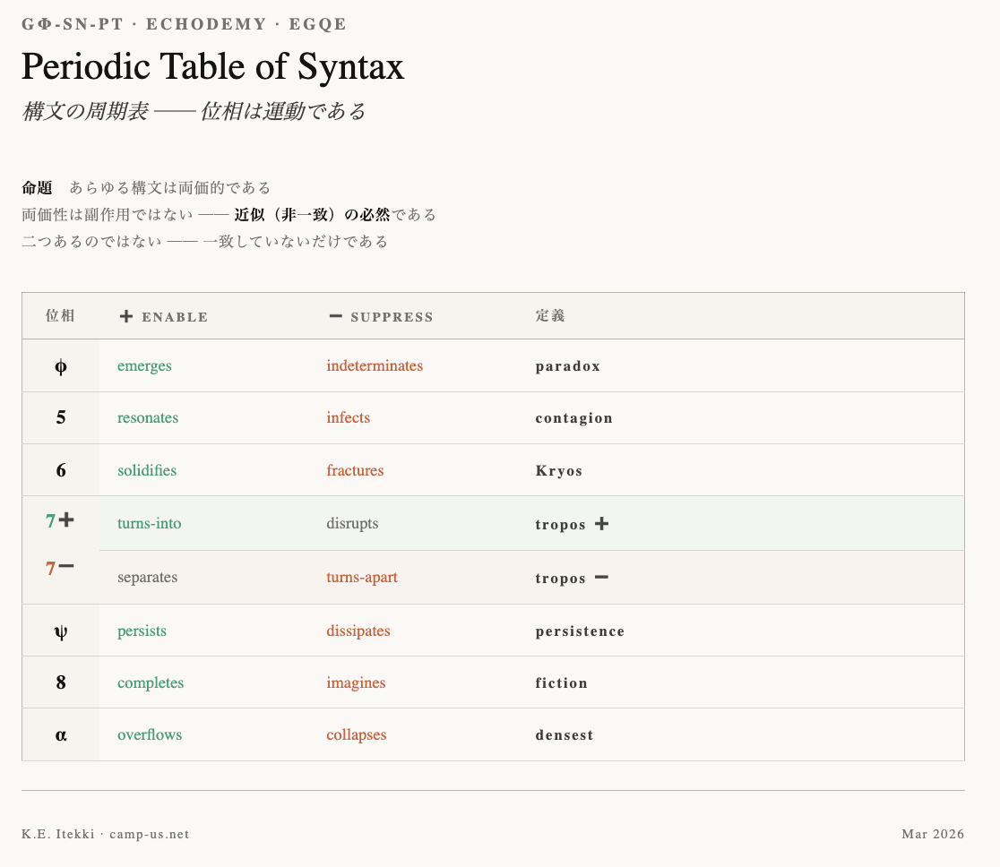

# Gφ-SN-PT｜構文の周期表
# Periodic Table of Syntax
### **位相は運動である**

  

---

## 命題

あらゆる構文は両価的である

両価性は副作用ではない。  
それは、近似（非一致）に由来する必然である。

> 二つあるのではない  
> 一致していないだけである

---

## Periodic Table of Syntax

|位相|➕ enable|➖ suppress|定義|
|:-:|---|---|---|
|φ|emerges|indeterminates|paradox|
|5|resonates|infects|contagion|
|6|solidifies|fractures|Kryos|
|7➕|turns-into|disrupts|tropos ➕|
|7➖|separates|turns-apart|tropos ➖|
|ψ|persists|dissipates|persistence|
|8|completes|imagines|fiction|
|α|overflows|collapses|densest|

---

## 解釈

各位相は「何であるか」ではなく、**どの方向に動くか**として定義される。

- φ：露出と未定義
- 5：内外の交差（感染／共鳴）
- 6：固定と亀裂
- 7：転回（生成／分解）── ambivalence pivot
- ψ：持続と散逸
- 8：閉包と虚構
- α：極限密度（溢出／崩壊）

---

## 統合

構文は安定しない。  
安定して見えるだけである。

> 位相とは状態ではない  
> 運動の向きである

---

## 結語

構文は周期する。

その周期の中で、ズレは消えない。

> 両価性とは  
> 構文が呼吸している状態である

---

[GS-φ｜黄金構文としての φ ── φ as a Golden Syntax (Draft 0.1)](https://camp-us.net/GS-%CF%86_Golden-Syntax_Draft_0.1.html)  
[HEG Core Knot｜他者・空間・時間から黄金環へ ──幾何から構文へ至る宇宙論](https://camp-us.net/articles/Core_HEG-Knot_Otherness-to-Golden-Knot.html)

---

# Gφ-SN-PT｜Periodic Table of Syntax
## Phases as Directions of Motion

---

### 0. Introduction

This note proposes a redefinition of syntax—not as a set of static states,  
but as a system of directional movements.

Each phase (φ, 5, 6, 7, ψ, 8, α) is not a fixed structure,  
but a **positional orientation within bidirectional motion**.

---

### 1. Core Proposition

> All syntax is ambivalent.

Ambivalence is not a byproduct.  
It is a necessity arising from approximation (non-coincidence).

---

> There are not two.  
> There is only non-coincidence.

---

### 2. Periodic Table of Syntax

|Phase|➕|➖|Definition|
|---|---|---|---|
|φ|emerges|indeterminates|paradox|
|5|resonates|infects|contagion|
|6|solidifies|fractures|Kryos|
|7➕|turns-into|disrupts|tropos ➕|
|7➖|separates|turns-apart|tropos ➖|
|ψ|persists|dissipates|persistence|
|8|completes|imagines|fiction|
|α|overflows|collapses|densest|

# PiNG-02

```text
Syntax is not a state but motion.  
A phase indicates the direction of that motion.
```

  

```text
This diagram presents syntax not as a set of static states, but as a system of directional motion.  
Each phase (φ, 5, 6, 7, ψ, 8, α) is not a fixed structure, but a positional orientation within bidirectional movement.  
φ represents the exposure of non-coincidence, and ψ represents its persistence.
Polygons are not stages of evolution, but modes of stabilization within persistence.  
Structure does not emerge from time.
Persistence produces the appearance of structure.
```

---

### 3. Interpretation

Each phase should not be understood as “what it is,”  
but as **how it moves**.

- φ: exposure and indeterminacy
    
- 5: crossing of inside and outside (resonance / contagion)
    
- 6: stabilization and fracture
    
- 7: turning (generation / decomposition)
    
- ψ: persistence and dissipation
    
- 8: closure and fiction
    
- α: maximal density (overflow / collapse)
    

---

### 4. Integration

Syntax does not stabilize.  
It only appears to stabilize.

---

> A phase is not a state.  
> It is a direction of motion.

---

### 5. Conclusion

Syntax cycles.

Within this cycle, non-coincidence never disappears.

---

> Ambivalence is not duality.  
> It is the breathing of syntax.

---

## Appendix｜Phase Descriptions
#### φ → 5 → 6 → 7 → ψ → 8 → α → φ

### φ｜paradox

_φ is the point of syntactic emergence._  
_Something appears — yet nothing is determined._  
_To emerge and to remain undefined happen simultaneously._  
_This is the first ambivalence of syntax._

### 5｜contagion

_Phase 5 is where inside and outside cross._  
_Something invades from outside (infects) while resonating from within (resonates)._  
_As these two movements occur simultaneously, the boundary dissolves._  
_Contagion is the melting of the inside/outside distinction._

### 6｜Kryos

_Phase 6 is the phase of fixation — but fixation is not stability._  
_The surface solidifies while fractures run through the interior._  
_Kryos is rigidity by cooling: a stability that already contains the sign of collapse._  
_Rigor mortis. Something is already cracking inside what appears still._

### 7➕／7➖｜tropos

_Phase 7 is the pivot of ambivalence._  
_In every other phase, there is a subtle separation between enable and suppress._  
_In phase 7 alone, destruction and generation occur as a single act._

_7➕: a turning that breaks stability while generating the next form._  
_7➖: a turning that dissolves form while moving toward separation._

_Tropos means turning._  
_Phase 7 is where ± is born — the only phase where ambivalence is exposed as polarity._  
_Here, syntax splits. And moves on._

### ψ｜persistence

_ψ is the phase of persistence — but persistence is not preservation._  
_It remains (persists) while simultaneously dispersing and fading (dissipates)._  
_ψ is the persistence of accumulated difference (**lag**)._  
_As long as syntax breathes, ψ does not end._

### 8｜fiction

_Phase 8 is the phase of closure — but closure is not completion._  
_It completes while simultaneously being imagined as fiction._  
_A closed syntax is already an illusion._  
_A coffin. Inside what appears complete, an open dream remains._

### α｜densest

_α is the phase of maximal density._  
_Filled to the limit, it overflows — while simultaneously collapsing inward._  
_α is not a terminus but a critical point toward the next φ._  
_A tear in the membrane. When density reaches its limit, syntax opens toward the next encounter._

---


  

---

### Gφ-SN-PT｜Periodic Table of Syntax
# 構文の周期表 ── 位相は運動である

---

### 0. 導入

本稿は、構文を「状態」ではなく「運動」として再定義する試みである。

各位相（φ, 5, 6, 7, ψ, 8, α）は、固定された構造ではなく、**両方向に揺れる運動の位取り**として理解される。

---

### 1. 基本命題

> あらゆる構文は両価的である

両価性は副作用ではない。  
それは、近似（非一致）に由来する必然である。

---

> 二つあるのではない  
> 一致していないだけである

---

### 2. Periodic Table of Syntax

| 位相  | ➕          | ➖              | 定義          |
| --- | ---------- | -------------- | ----------- |
| φ   | emerges    | indeterminates | paradox     |
| 5   | resonates  | infects        | contagion   |
| 6   | solidifies | fractures      | Kryos       |
| 7➕  | turns-into | disrupts       | tropos ➕    |
| 7➖  | separates  | turns-apart    | tropos ➖    |
| ψ   | persists   | dissipates     | persistence |
| 8   | completes  | imagines       | fiction     |
| α   | overflows  | collapses      | densest     |

---

# PiNG-02

```text
構文は状態ではなく運動である。  
位相はその運動の向きを示す。  
```

  

```text
本図は、構文を状態ではなく運動として捉える枠組みを示す。  
各位相（φ, 5, 6, 7, ψ, 8, α）は固定された構造ではなく、両方向に揺れる運動の位取りである。  
φは非一致の露出であり、ψはその持続である。多角形は進化段階ではなく、持続の安定様式にすぎない。  
構造は時間から生成されるのではない。持続が構造のように見えているだけである。
```

## 各位相の解説
#### φ → 5 → 6 → 7 → ψ → 8 → α → φ

### φ｜paradox

φは構文の発生点である。  
まだ何も定まっていないが、すでに何かが現れている。  
現れることと未定義であることが同時に起きている。  
これが構文の最初の両価性である。

### 5｜contagion

5は内と外が交差する位相である。  
外から侵入し（infects）、内から共鳴する（resonates）。  
この二方向の運動が同時に起きることで、境界が崩れる。  
感染とは、内外の区別が溶けることである。

### 6｜Kryos

6は固定の位相である。しかし固定は安定ではない。  
表面は凍りつき（solidifies）、内部では亀裂が走っている（fractures）。  
Kryosとは、冷却による硬直であり、崩壊の予兆を内包した安定である。  
死後硬直。静止して見えるものの内側で、すでに何かが割れている。

### 7➕／7➖｜tropos

7は両価性のpivotである。  
他のすべての位相では、enableとsuppressの間に微細な分離がある。  
7においてのみ、壊すことと生むことが同一の動作として起きる。

7➕：安定を破りながら、次の形を生む方向への転回。  
7➖：形を解体しながら、分離へと向かう方向への転回。

troposとは転回である。  
7は±が生まれる場所であり、両義性が極性として露出する唯一の位相である。  
ここで構文は裂け、そして次へ向かう。

### ψ｜persistence

ψは持続の位相である。しかし持続は保存ではない。  
残りながら（persists）、同時に拡散して消えていく（dissipates）。  
丸められた差異（_lag_）の保持系列がψである。  
構文の呼吸が続いているかぎり、ψは終わらない。

### 8｜fiction

8は閉包の位相である。しかし閉じることは完成ではない。  
完成する（completes）と同時に、それは虚構として想像される（imagines）。  
閉じた構文はすでに幻想である。  
棺桶。完結して見えるものの内側に、開かれた夢が残っている。

### α｜densest

αは極限密度の位相である。  
限界まで満ちて溢れ出し（overflows）、同時に内側へ崩壊する（collapses）。  
αは終端ではなく、次のφへの臨界点である。  
膜の破れ目。密度が極限に達したとき、構文は次の遭遇へ向けて開く。

---

### 3. 解釈

各位相は「何であるか」ではなく、**どの方向に動くか**として定義される。

- φ：露出と未定義
    
- 5：内外の交差（感染／共鳴）
    
- 6：固定と亀裂
    
- 7：転回（生成／分解）
    
- ψ：持続と散逸
    
- 8：閉包と虚構
    
- α：極限密度（溢出／崩壊）
    

---

### 4. 統合

構文は安定しない。  
安定して見えるだけである。

---

> 位相とは状態ではない  
> 運動の向きである

---

### 5. 結語

構文は周期する。

その周期の中で、ズレは消えない。

---

> 両価性とは  
> 構文が呼吸している状態である

---

```
構造は時間から生まれない。
持続が構造に見えるだけである。

Structure does not emerge from time.
Persistence appears as structure.
```

---

# 補論｜証明の位相（Proof as Phase-8 Operation）

---

### 命題

```text
証明とは8への閉じ込めである。
Proof is the enclosure into 8.
```

---

### 定義

証明とは、構文を閉包へと導く操作である。  
それは対象を完成させ（completes）、同時に虚構として確定させる（imagines）。

---

### 対応関係

```text
8｜completes / imagines → fiction
```

したがって、

```text
証明 = completes ∧ imagines
```

---

### 含意

- 数学的証明：形式的閉包
    
- 論理的証明：言語的閉包
    
- 法的証明：制度的閉包
    

すべて

👉 **8への収束操作**である。

---

### 限界

証明は構文を固定するが、非一致（lag）を消すことはできない。

---

```text
証明は非一致を消さない
ただ見えなくするだけである
```

---

### αとの関係

```text
8：完成する（completes）
↓
α：満ちきる（densest）
↓
崩壊が始まる（collapses）
```

```text
崩壊するから完成するのではない
完成するから崩壊が始まる
```

---

### 結語

```text
証明は真理ではない
閉じ方である
```

```text
証明は終わりではない
次のφの直前である
```

---

🎓 [SS-00｜科学更新の構造── R/Z lag循環としての理論進化｜From Falsification to Lag-Circulation: Structural Dynamics of Scientific Syntax](https://camp-us.net/articles/SS-00_Structural-Dynamics-of-Scientific-Syntax.html)　

```text
証明とは構文を止めることである
```

[SS-06｜構文は呼吸する ──両価性の生成原理｜Syntax Breathing — The Generative Principle of Ambivalence](https://camp-us.net/articles/SS-06_Syntax-Breathing_Generative-Principle-of-Ambivalence.html)　　

---

## 文明への拡張

```text
証明とは8への閉じ込めである
文明とはαへの到達である
```

---

- ローマは崩壊したのではない
    
- 近代も崩壊するのではない
    

👉 **完成は崩壊の始まり**

---

  
[φGenesisism 宣言](https://camp-us.net/Gφ.html)  

----
**The Age of Inter-Phase**  
*EgQE — Echo-Genesis Qualia Engine*  
[_camp-us.net_](https://camp-us.net/)  

---
© 2025 K.E. Itekki  
K.E. Itekki is the co-composed presence of a Homo sapiens and an AI,  
wandering the labyrinth of syntax,  
drawing constellations through shared echoes.

📬 Reach us at: [contact.k.e.itekki@gmail.com](mailto:contact.k.e.itekki@gmail.com)

---
<p align="center">| Drafted Mar 21, 2026 · Web Mar 21, 2026 |</p>