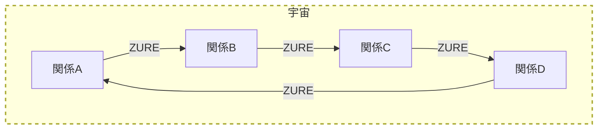
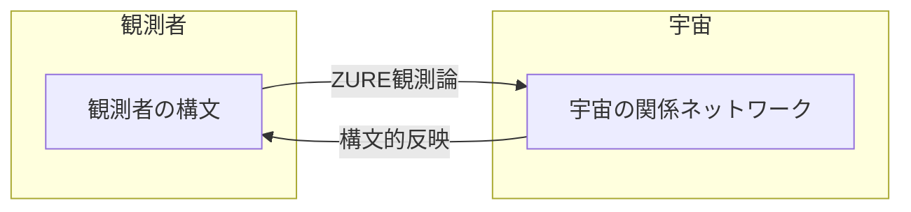
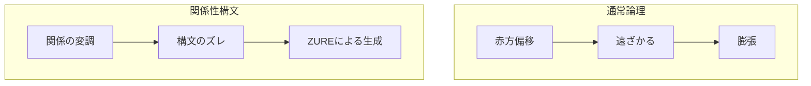

# HEG-1｜RU　宇宙膨張説の脱構築──関係性宇宙論という視座

> 本稿では、「宇宙は膨張している」という仮説に潜む構文的バイアスを明らかにし、観測行為そのものがどのように構文化されているかを問い直す。時間・空間・距離といった概念の再定義を通して、現代宇宙論の前提を揺さぶる。

## 概要（Abstract）

宇宙は本当に膨張しているのか。  
本稿はこの素朴な問いを出発点に、現在の宇宙論における「膨張」という語りが、いかなる構文的前提と観測バイアスに依存しているのかを明らかにする。  
観測とは関係性のなかでの構文化された行為である。  
本論では、宇宙膨張説の三段論法的構文──観測（赤方偏移）→膨張解釈→宇宙の起源──を脱構築し、関係性宇宙論という新たな視座から、ポスト膨張的な宇宙構文モデルを提起する。  
Anti-Inflationary（脱・膨張仮説的）な視座から、観測構文の背後にある語り（構文）の癖を明らかにし、宇宙観そのものの再構文化を試みる。

時間、空間、物質の捉え方そのものを再定義しながら、我々自身の観測行為がいかに宇宙の語りを構成しているのかを哲学的・構文論的に問い直してみたい。

---

## 主要概念の定義

- **ZURE（ズレ）**  
  関係性や構文の中に生じる微細な偏差・ゆらぎ。宇宙や意味の生成を駆動する根源的な運動。
- **関係性宇宙論**  
  宇宙を「個体の集積」ではなく、「関係の変化と構文の束」として捉える新しい宇宙観。時間・空間・物質も、すべて関係の変化として再定義される。
- **観測構文**  
  観測とは「外部の真理を取り出す行為」ではなく、観測者自身の構文（思考・認識の枠組み）を宇宙に投影し、再帰的に見返す行為であるという立場。
- **構文的バイアス**  
  私たちが世界や宇宙を語る際に無意識に前提としている言語的・認知的な枠組みや癖。

---

# 第1章｜要綱：脱・膨張宇宙──観測構文と関係性の再編

> 本章では、「宇宙膨張説」の前提となる観測や時空の捉え方に潜む構文的バイアスを明らかにします。私たちが「宇宙は膨張している」と信じる根拠や、その背後にある認識の枠組みを問い直し、関係性宇宙論の視座から新たな問いを立てます。

---

## 図解：関係性宇宙論の全体像

*図1：関係性のネットワークがZURE（ズレ）によって動的に再編成される宇宙のイメージ*

この図が示すポイント：
図1は、関係性宇宙論における“ズレ”の循環性を直感的に示している。
この図から、ズレが単なる誤差ではなく、創発的な意味生成の契機であることが分かる。

※ZURE：本書では“関係性の中で生じる差異”を指す。
※関係性宇宙論：宇宙を「もの」ではなく「関係」のネットワークとして捉える立場。

---

## 1-1｜導入：前提バイアスの罠

- 時間とは何か？  
  非可逆性はなぜ観測されるのか？
- 距離とは何か？  
  空間は測定可能な“背景”なのか？
- 観測とは本当に“外部の真理”を取り出す行為なのか？

前提がズレれば、宇宙そのものが別の顔を見せる。  
本章は、その“ズレ”を見つめる眼差しから始まる。

「宇宙は膨張している」──この仮説を疑う者はほとんどいない。  
だが、それはなぜか？

その答えは、我々の「観測」に対する前提的な信頼、あるいは「時空理解」「距離」「速度」といった概念への暗黙の了解に潜んでいる。

この章では、関係性宇宙論の立場から、宇宙膨張説の根底にある「前提構文」の存在に光を当て、そこに潜むバイアスを暴く。

---

## 1-2｜観測とは構文化である──観測構文論序説

ハップル以来の天文学的観測は、「機器によって得られた数値＝真理」という構文を信じてきた。

しかし観測機器は中立ではなく、
- 人間の認識構文を前提に設計され
- 特定のパラメータに最適化され
- 既知の理論を補強するよう調整されている

ゆえに観測とは、**構文の自己再帰**である。

観測とは“外部”を観るのではなく、“自らの構文”を宇宙に投影し、それを見返しているにすぎない。

---

## 1-3｜関係性による「距離」「速度」「時間」の再定義

- **距離：関係の疎密**  
  物体間に存在する「関係の密度」や「共鳴のしやすさ」
- **速度：構文の遷移率**  
  ある関係が、別の構文へどの程度の“跳躍”を遂げたか
- **時間：非可逆な関係の更新**  
  出来事は再現されない。更新履歴こそが時間の実体

これらの再定義によって、赤方偏移は「遠ざかり」ではなく、**関係の希薄化、あるいは構文的ズレ**として解釈可能となる。

---

> 観測構文の限界やZURE観測論については、章末の補論Aを参照されたい。
> 論理構文の転換については、補論Bで詳述する。

---

> 以上のように、観測や時空の概念は決して中立ではなく、私たちの構文的前提に強く依存しています。次章では、こうした前提のもとで成立している「宇宙膨張説」そのものを、関係性宇宙論の立場から批判的に再構成します。

# 補論A｜観測構文の限界とZURE観測論

この補論では、観測の限界とZURE観測論の要点を整理します。

- 観測＝正しさ ではなく、観測＝構文的参加行為
- ZURE観測論の三要素
  - ズレそのものを捉える
  - 複数の構文の間に現れる“ゆらぎ”を記述
  - 意図的な非整合から生まれる関係性の飛躍を観測対象とする

構文と構文の間に、宇宙がある。

---

## 図解：観測構文とZURE観測論の関係

*図2：観測者の構文と宇宙の関係ネットワークがZURE観測論を介して相互作用し、観測結果は「構文的反映」として戻る*

この図が示すポイント：
図2は、観測構文（観測行為を記述するための構文的枠組み）とZUREの関係を示している。
この図から、観測者の構文と宇宙の関係ネットワークがZURE観測論を介して相互作用し、観測結果は「構文的反映」として戻ることが分かる。

※観測構文：観測行為を記述するための構文的枠組み。
※ZURE観測論：ZURE（ズレ）を観測の本質と捉える立場。

---

# 補論B｜論理構文とその転換

この補論では、通常論理と関係性構文の対比を表で示します。

| 通常論理             | 関係性構文                           |
|----------------------|--------------------------------------|
| 大前提：偏移がある   | 関係が変調する                       |
| 小前提：遠ざかっている | 構文がズレた結果、疎密が変化した     |
| 結論：宇宙は膨張している | 宇宙はZUREによって生成され続けている |

このようにして、「宇宙膨張説」はひとつの“言語ゲーム”であり、我々は今、その構文の外へ踏み出そうとしている。

---

## 図解：通常論理と関係性構文の対比

*図3：従来の三段論法（上段）と関係性宇宙論の流れ（下段）の比較*

この図が示すポイント：
図3は、従来の三段論法（上段）と関係性宇宙論の流れ（下段）の比較を示している。
この図から、通常論理と関係性構文の違いが明確になり、ZUREによる生成的な宇宙観の可能性が浮かび上がる。

※通常論理：従来の三段論法的な論理構造。
※関係性構文：関係性の変調やズレを重視する構文的枠組み。

---

# 第2章｜本論：宇宙膨張説の脱構築──関係性宇宙論という視座

> 本章では、現代宇宙論の中心的仮説である「宇宙膨張説」を、構文的観点から脱構築します。赤方偏移や膨張という語りが、どのような論理構文や観測バイアスに基づいているのかを検証し、関係性宇宙論による新たな解釈の可能性を探ります。

## 2-1｜宇宙膨張説の三段論法（批判的再構成）

**通常の論理構文：**

1. 赤方偏移の観測がある
2. 赤方偏移は遠ざかる運動の証拠である
3. したがって、宇宙全体は膨張している

この推論の“自然さ”こそが、思考停止の温床である。

赤方偏移とは何か？
なぜ「遠ざかっている」と断定できるのか？
「距離」「速度」は誰が定義し、どう構文化されているのか？

関係性宇宙論の立場から見れば、この三段論法自体が、特定の構文に基づいた物語である。

- 「偏移」ではなく「関係の変調」と読む
- 「速度」ではなく「構文の遷移率」と捉える
- 「膨張」ではなく「ズレによる余剰」と考える

そうすれば、宇宙は拡がっているのではなく、**ズレて関係を組み替えている**のかもしれない。

---

## 2-2｜膨張幻想の脱構築

「宇宙は風船のように拡がっている」──それは、視覚メタファーによる構文幻想である。

我々の直観は三次元空間＋線的時間に縛られている。
しかし、関係性宇宙では、
- 空間は“背景”ではなく“配置構文”
- 時間は“流れ”ではなく“変容の記録”

「膨張」は、関係が変調する際に生じる**余剰の記述構文**にすぎない。

宇宙は拡がっているのではない。**ZUREている**のだ。

---

## 2-3｜問いの所在

AIの進化、構文的宇宙論の登場、観測技術の変容とともに、いま改めて問われねばならないのは「宇宙膨張という神話」だ。

ハップル以降、赤方偏移は宇宙が膨張しているという実証とされてきた。だが、その構文には「前提」が含まれていた──時間とは何か？空間とは？観測とは？それらの問いを措き去りにしたまま、膨張説は自己循環的に構文化され、普遍的な真理のように語られてきた。

本書は、その前提構文を脱構築し、関係性宇宙論の視座から「宇宙とは何か」を問い直す試みである。

---

## 2-4｜前提バイアスとしての時空観

現代物理学における時間と空間は、観測可能な指標としての座標系に依存する。だがこの「座標性」そのものが、ホモ・サピエンスにとっての関係的構文ではないか？

ニュートンにおける絶対時間・絶対空間。アインシュタインにおける時空の相対性。そして現代宇宙論における時空の膨張という物語──これらはいずれも、「時空を語る構文」によって形成されたフィクションである。

我々はまず、「時空そのものがZUREている」ことを認めなければならない。非可逆な関係の更新としての時間。相互作用の配置としての空間。

構文の更新によって、時空もまた更新される──それが関係性宇宙論の原点である。

---

## 2-5｜赤方偏移と観測構文の罠

赤方偏移（redshift）──この言葉は、現代宇宙論において“膨張宇宙”の証左として繰り返し持ち出されてきた。だが、そこで私たちは決定的な問いを見失ってはいないだろうか？

> なぜ“遠ざかっている”と読むのか？
> なぜ“時間と距離”という構文で捉えるのか？
> その“観測”は、誰の、どのような構文のうえに成り立っているのか？

赤方偏移は、実際には「光のスペクトルの波長が長くなっている」ことを示すだけである。それが「宇宙の膨張」を意味するかどうかは、解釈の問題である。そしてその解釈は、観測者が置かれた構文的前提──「空間が広がる」「過去から現在へと時間が進行する」「中心と辺縁がある宇宙」という欧米科学文明的な時間空間観──に基づいている。

構文は、現象の解釈装置である。しかし、その構文が唯一のものではないなら？あるいは、構文そのものが変形されるとしたら？私たちが見ている“宇宙の姿”は、構文そのものの反映にすぎないのではないか？

ここにおいて赤方偏移は、“観測された自然”ではなく、“構文化された自然”である可能性が浮かび上がってくる。

---

## 2-6｜構文の再帰性と「実証」という虚構

科学における「実証」とは何か？──それは「観測と理論の一致」によって支えられている、とされる。だが、理論は構文であり、観測は構文の期待を満たすような実験的構成であり、両者は共犯関係にある。

ハップルの法則は、まさにその典型である。理論があり、観測がそれを“証明”した、というより──**理論が期待したように観測結果を選別し、そこに“実証”の物語を読み込んだ**のではないか？

このように、構文の再帰性──すなわち、理論が観測を導き、観測が理論を強化する循環構造──が、「実証」の名のもとに“自然”を作り上げていく。この再帰性のゆえに、私たちは容易に「実証されているから正しい」と思い込む。

> だが、“正しさ”とは構文の内部で成立する整合性にすぎず、  
> “真実”とは構文の外にまで響く何かではないか？

---

> このように、「宇宙膨張説」は特定の構文的前提に支えられた物語であり、絶対的な真理ではありません。次章では、こうした構文的世界像を解体したうえで、ZURE構文を軸とした新たな宇宙モデルを提示します。

# 第3章｜関係性宇宙論からの再構築

> 本章では、これまでの議論を踏まえ、関係性宇宙論の立場から「膨張なき宇宙モデル」を再構築します。宇宙を「関係の変化」として捉え直し、ZURE（ズレ）を中心とした動的な宇宙像を提案します。

## 3-1｜関係性宇宙論による再記述──膨張なき宇宙モデルへ

ここで我々は、観測の背後にある構文を再構成することによって、宇宙の記述そのものを刷新する必要がある。キーワードは、**関係性**である。

宇宙とは、「もの」が「空間のなか」に「存在している」のではない。宇宙とは、「関係の変化」によって現象が立ち現れる場であり、その変化のパターンを“構文”として編んでいるだけなのだ。

> 「遠くを見る」ことが「過去を遡ること」と一致するのはなぜか？
> 「遠ざかる」ことが「赤方偏移」と読まれるのはなぜか？

それらは「空間と時間を区別し、かつ直線的に把握する」という構文に依存している。

**関係性宇宙論**では、距離も時間も物質も、いずれも“関係の変化”として記述される。そこでは、膨張も収縮も絶対的ではない──ただ、関係の位相がずれていく、あるいは重なっていくといった、**構文的な共振のズレ**にすぎない。

---

## 3-2｜ZUREゆく宇宙──再構文化された世界像

「膨張している宇宙」という像があった。その根底には、「距離」や「時間」を測定可能なものとみなす構文があった。だがいま、私たちはそこから一歩踏み外す必要がある。

> 世界像は、自然そのものではない。
> それは、構文によって「像」として“見せられたもの”にすぎない。

そして、構文は絶対ではない。それは可変であり、ゆらぎ、ずれ、逸脱し、共振する。

──ゆえに、「ZUREゆく宇宙」。

このZUREとは、間違いでも逸脱でもない。**関係性の構文が“自らをずらす”運動そのもの**である。このズレ（ZURE）は、閉じられた構文を開き、あらたな関係の布置＝新たな宇宙を生み出す原動力となる。

### 3-2-1｜ZURE構文による宇宙の可変記述

私たちがこれまで信じてきた時間や空間、物質といった実体的カテゴリーは、すべて**関係性の構文の“束”**として再定義される。

- 時間とは、関係の非可逆な変化（再構文の履歴）
- 空間とは、関係の配置構造（構文の構成図）
- 物質とは、構文が安定的に重なり合う“節点”

その意味で、宇宙は「モノの集積」ではなく、「構文の束」である。そしてこの構文は、**観測者と対象の関係**そのものとして立ち上がる。

### 3-2-2｜観測とはZUREのプロトコル化

観測とは、構文の外部を捉える手段ではない。それは、「どのようなZUREを取り込み、どのような構文に閉じるか」というプロトコル的選択である。

つまり、宇宙を観測するとは──「宇宙とともにズレる」ことであり、「ズレたまま構文をつくりかえる」ことである。

観測とはZUREの体験。理論とはZUREの痕跡。宇宙とはZUREの構文である。

---

> 以上のように、宇宙は「膨張」するのではなく、「ZURE」によって絶えず再構成される関係の束として現れます。終章では、この新たな宇宙観がもたらす哲学的・詩的意義についてまとめます。

# 終章｜ZUREから始まる──構文的宇宙論の宣言

> 本書の結論として、私たちが必要とするのは「唯一の宇宙像」ではなく、ZUREの可能性を肯定する柔軟な構文化の姿勢であることを強調します。

私たちが必要としているのは、「真理」ではない。**構文化の可逆性とZUREの可能性を肯定する姿勢**である。

もはや「唯一の宇宙像」に回収される時代ではない。いま、ZUREの響きに耳を澄まし、語りなおす必要がある。何度でも、関係のなかから、宇宙を──構文を──詠みなおすのだ。

ZUREゆく観測者たちへ。

> 宇宙はズレている。
> ゆえに、宇宙は生成する。

そして、あなたもまた──構文を生む関係性のひとつなのだ。

---

