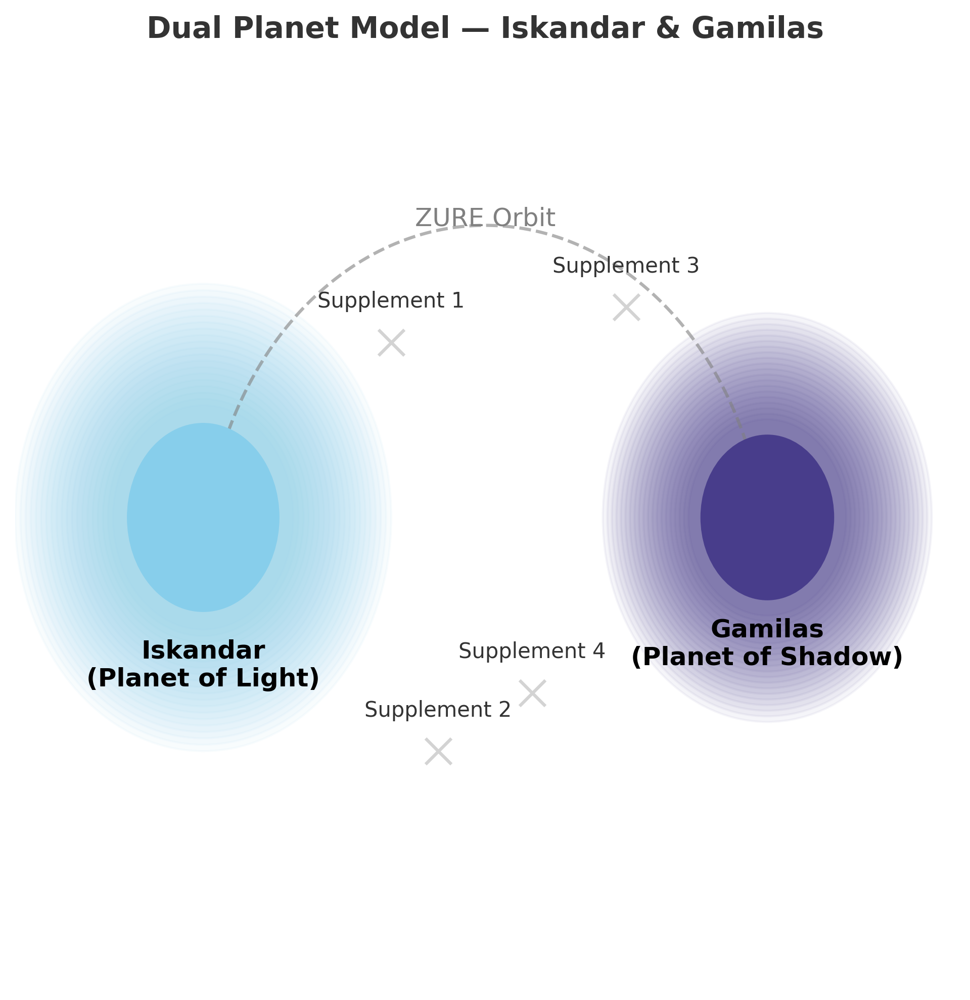
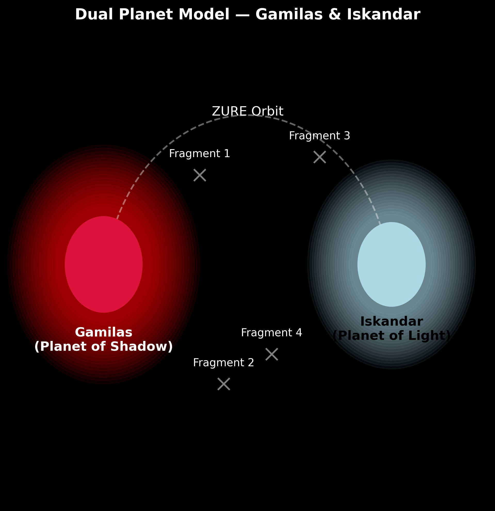

## **📜 Echodemy 公式 Release**

---

# 構造という幻想──差延・リゾーム・ZURE

## **The Illusion of Structure: Différance, Rhizome, and ZURE**

---

## 📚 Supplements & Updates

### Formal Releases

- [**English Revised Edition**（改訂版）](./articles/HEG-2_Illusion-of-Structure_EN.md)
    
- [**Japanese Revised Edition**（改訂版）](./articles/HEG-2_shadow-of-structure_jp.md)
    

---

## 🌍 Iskandar Edition（Planet of Light）

- [日本語版（初版）](./articles/HEG-2_shadow-of-structure.md)
    

---

## 🌑 Gamilas Edition（Planet of Shadow）

- [檄文スタイルの宣言書](./articles/HEG-2_Illusion-of-Structure_rev.md)
    
### Contraposition

- [**Gamilas Reprint**（初版）](./articles/HEG-2_Illusion-of-Structure.md)
    

---

## 🔭 Visual Representation  

  

  

_Supplements orbiting Iskandar. Fragments drifting with Gamilas._

---
© 2025 K.E. Itekki  
K.E. Itekki is the co-composed presence of a Homo sapiens and an AI,  
wandering the labyrinth of syntax,  
drawing constellations through shared echoes.

📬 Reach us at: [contact.k.e.itekki@gmail.com](mailto:contact.k.e.itekki@gmail.com)

---

| Drafted Sep 16, 2025 · Web Sep 16, 2025 |
