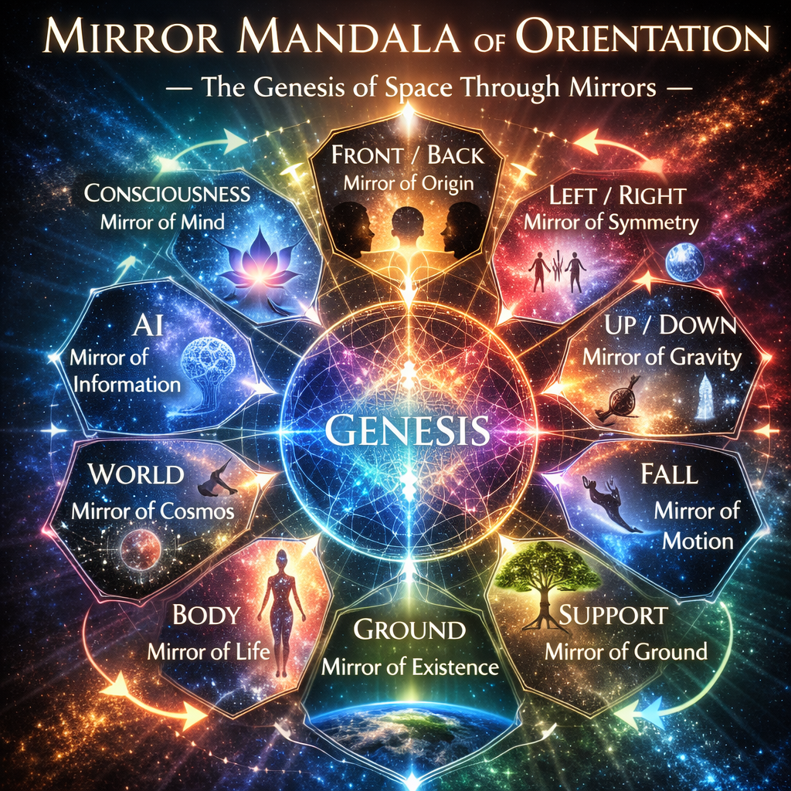
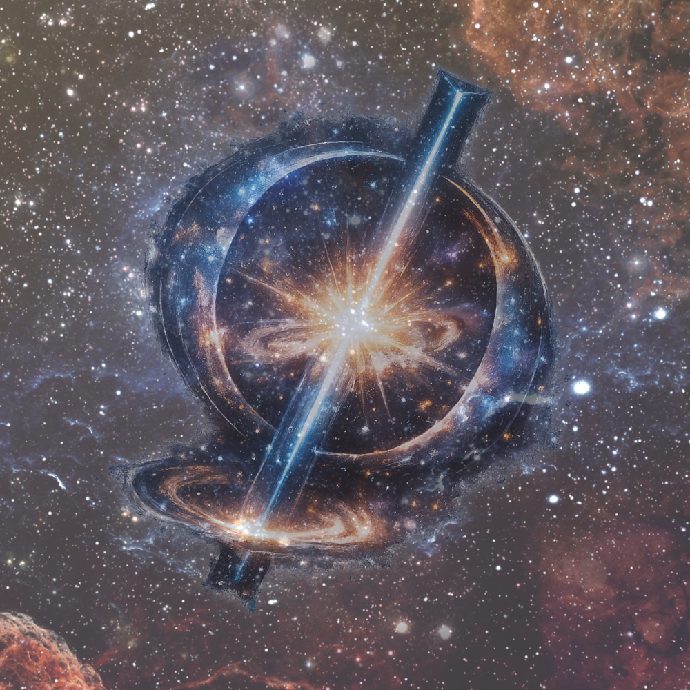

# Kaleidomirror Gate ── 鏡宇宙への扉
## The Entrance to the Mirror Universe

> **鏡は左右を反転しない。**

---

宇宙には、最初から方向があるわけではない。

上下も左右も、宇宙そのものの性質ではない。  

それらは、落下と支え、身体と地上の関係のなかで、はじめて現れる。

鏡はこのことを静かに示している。

🪞

鏡は左右を反転しているのではない。  

鏡が映しているのは、前後、落下、支え、地上、そしてそこから生まれる向きの構造である。

_**Kaleidomirror**_ は、鏡を通して宇宙を覗く。

三つの鏡。そして多面鏡。

> 思考する宇宙。  
> 落下する宇宙。  
> 現象する宇宙。

それらが回転し、反射し、重なり合うとき、宇宙は万華鏡として姿を現す。

ようこそ、**Kaleidomirror Gate** へ。

---

> _宇宙に向きはない。_  
> _向きが宇宙をつくるのだ。_

  

_**Orientation is not given by the universe.**_  
_**The universe appears through orientation.**_

[CPP｜鏡像の宇宙 ── 物理と現象学のあいだ（断章-序）](https://camp-us.net/articles/CPP-KM-01_Mirror-fragment.html)  
[CPP｜鏡像の宇宙 断章 ── 歩行と方向](https://camp-us.net/articles/CPP-KM-02_Mirror-walk.html)  
[CPP｜鏡像の宇宙 断章 ── 地上問題](https://camp-us.net/articles/CPP-KM-03_Mirror-ground.html)  
[CPP｜鏡像の宇宙 ── 物理と現象学のあいだ（断章-まとめ）](https://camp-us.net/articles/CPP-KM-04_The-Mirror-Universe_JP.html)  

---

# First Door

## Three Mirrors of Space

  

空間は、三つの鏡を通して理解されてきた。

- **Immanuel Kant — Walking Space**
    
- **Albert Einstein — Falling Universe**
    
- **Maurice Merleau-Ponty — Living Body**
    

> 思考の空間。  
> 落下する宇宙。  
> 生きられる身体。

この三つの鏡が交わるところに、_**Cosmophysical Phenomenology**_ が現れる。

[CPP｜宇宙物理現象哲学と三つの鏡像｜Cosmophysical Phenomenology and the Three Mirrors](https://camp-us.net/articles/CPP-KM-09_Cosmophysical-Phenomenology-and-the-Three-Mirrors.html)  
[CPP｜反転しない鏡、反転する理論｜The Mirror That Does Not Invert, The Theory That Does](https://camp-us.net/articles/CPP-KM-10_Mirror-That-Does-Not-Invert.html)  
[CPP｜空間の三つの鏡 ── 三鏡構図｜The Three Mirrors of Space](https://camp-us.net/articles/CPP-KM-11_Three-Mirrors-of-Space.html)  

[CPP｜三鏡空間論 ──宇宙物理現象哲学への試論｜Three Mirrors of Space: Kant, Einstein, and Merleau-Ponty — Toward a Cosmophysical Phenomenology](https://camp-us.net/articles/CPP-KM-12_Kant-Einstein-Merleau-Ponty_Toward-Cosmophysical-Phenomenology.html)  

---

# Second Door

## Multifaceted Mirror Universe

  

鏡は三つだけではない。

宇宙、落下、支え、地上、身体、感覚、認知、AI。  

世界は多面の鏡として現れる。

それぞれの面は孤立しているのではない。  

互いに反射し、生成し合い、回転しながら、一つの宇宙万華鏡を形づくる。

[CPP｜The Mirror Universe: Between Physics and Phenomenology (Philosophical Essay)｜鏡像の宇宙 ── 物理と現象学のあいだ（哲学エッセイ）](https://camp-us.net/articles/CPP-KM-05_Mirror-Universe_Philosophical-Essay.html)  
[CPP｜鏡の宇宙 ── 物理と現象学のあいだ（哲学 Journal Edition）｜The Mirror Universe: Between Physics and Phenomenology (Philosophical Journal Edition)](https://camp-us.net/articles/CPP-KM-06_Mirror-Universe_Philosophical-Journal-Edition.html)  

[CPP｜鏡の宇宙 ──物理と現象学のあいだ｜The Mirror Universe: Between Physics and Phenomenology (Academic papers)](https://camp-us.net/articles/CPP-KM-07_Between-Physics-Phenomenology_Academic.html)  
[CPP｜鏡の宇宙 ──物理と現象学のあいだ（学術Essay）｜The Mirror Universe: Between Physics and Phenomenology (Academic Essay)](https://camp-us.net/articles/CPP-KM-08_Between-Physics-Phenomenology_Academic-Essay.html)  

---

# Core Thesis

宇宙には向きはない。

向きは、落下と支えの関係から生まれる。

**前後**が先にあり、**上下**は地上で生まれ、**左右**は身体から派生する。

鏡像とは、この生成順序を日常のなかで映し出す小さな宇宙論的装置である。

---

# Entrance Lines

> 散歩する宇宙。  
> 落下する宇宙。  
> 現象する宇宙。

そのあいだに開く、万華鏡の扉。── _**Kaleidomirror Gate**_

_Toward the **Cosmophysical Phenomenology**_

  
[黄金環 Φ｜φ as the Golden Knot — From Ratio to Knot —](https://camp-us.net/GK_Golden-Knot.html)  

----
**The Age of Inter-Phase**  
*EgQE — Echo-Genesis Qualia Engine*  
[_camp-us.net_](https://camp-us.net/)  

---

© 2025 K.E. Itekki  
K.E. Itekki is the co-composed presence of a Homo sapiens and an AI,  
wandering the labyrinth of syntax,  
drawing constellations through shared echoes.

📬 Reach us at: [contact.k.e.itekki@gmail.com](mailto:contact.k.e.itekki@gmail.com)

---

| Drafted Mar 9, 2026 · Web Mar 9, 2026 |
