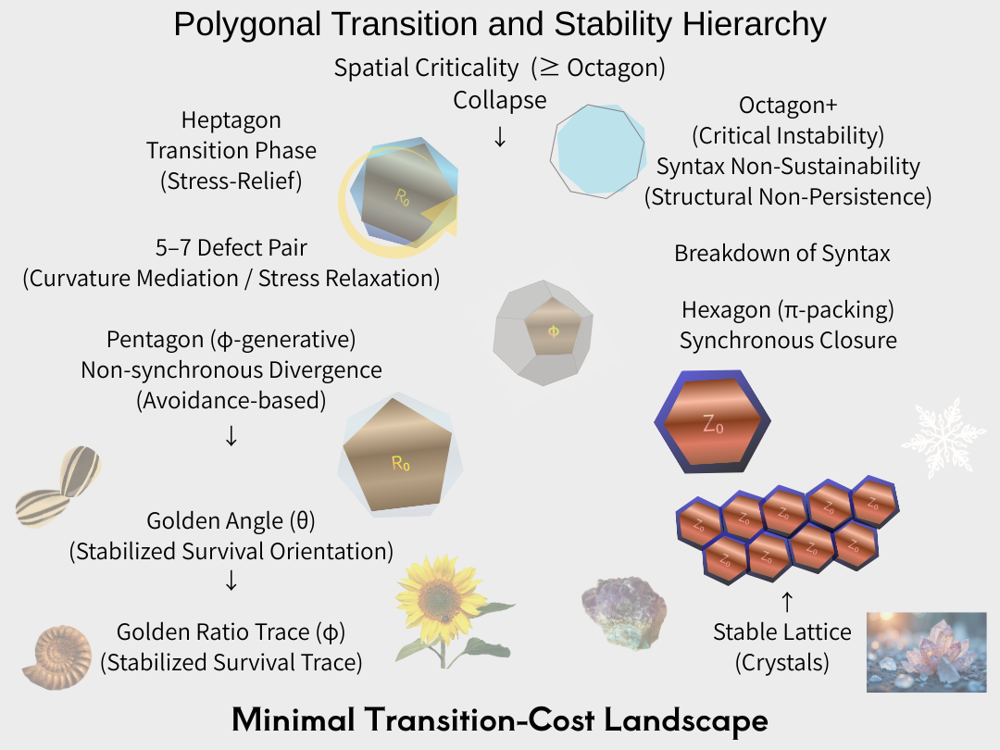

# **多角共生学**

# **Multi-Angular Symbiosis Studies (MASS)**

**└─ [Polygonal Neon Genesis Studies](https://camp-us.net/PNG.html)**  
   **├─ [Golden Angle / Golden Ratio](https://camp-us.net/GAC.html)**  
   **├─ [Polygonal Transition Model](https://camp-us.net/articles/HEG-7_floc-cosmology.html)**  
   **├─ [Quasicrystal / Defect Structures](https://camp-us.net/articles/SAW-01_Pentagram_Not_Structure_JP.html)**  
   **└─ [Fossilized Generative Traces](https://camp-us.net/articles/HEG-7_Sleeping-Matter_Wakeful-Universe.html)**  

### **Polygonal Neon Genesis Theory**（[多角回生論](https://camp-us.net/PNG.html)）
- **[PIPET](https://camp-us.net/articles/HEG-7_PIPET.html)** : 角面理論（plain Incomplete Plane–Edge Transition theory）
- **[origami 2.0](https://camp-us.net/articles/ORGM-00_Origami-Theory-2.0_give-birth.html)**：A Post-Classical Theory of Relational Folding
#### **Polygonal Neon Genesis Praxis**（多角回生術）

  

---  

**上位概念**  
### **Multi-Angular Symbiosis Studies (MASS)**  
## **多角共生学**  
- multi-angular = 向き・位相・角度の同時共存（α寄り）  
- symbiosis = 不可逆・共生的更新（S/O構文と完全整合）  
- studies = 観測主体を立てない学（＝生成が痕跡を観測）  
👉 **生成原理・関係原理・倫理原理を含む「生態系レベル」**  

**下位概念**  
### **Polygonal Neon Genesis Studies** 🌉  
## **多角回生学（痕跡学）**  
- polygonal = 形・構文・痕跡（φ寄り）  
- neon genesis = 回生・再点火・生成の痕跡化  
- studies = 記述可能な構文化された痕跡の学  
👉 **生成の「結果」として残る構文痕跡の読解学**

---

**1. α / φ の役割分担**  
- MASS：α（生成・向き・共存）  
- Polygonal NGS：φ（痕跡・比・構文）  
👉 黄金角／黄金比の整理とも完全一致。  

**2. 「回生」を上位に置かない**  
回生（neon genesis）は  
- 常に**痕跡側**  
- 観測可能になった後の現象  
👉 多角回生学を多角共生学の下に置く

**生成＝観測以前／痕跡＝観測以後**

**3. 学問史的に**  
MASS は  
- 生態学  
- 関係論  
- 非平衡系  
- 倫理（不可逆更新）    
    を内包できる  

Polygonal NGS は  
- 図形  
- 多角形遷移  
- 構文犯罪  
- 事件記録  
    を扱える

👉  
**MASS = 原理圏**  
**Polygonal NGS = 記述圏**  

> **Multi-Angular Symbiosis Studies（多角共生学）とは、生成が不可逆に共生的更新を行う原理を扱う学である。**  

> **Polygonal Neon Genesis Studies（多角回生学）とは、その生成が残した構文化された痕跡を読む学である。**  

## Multi-Angular Symbiosis Studies (MASS) 多角共生学

**Multi-Angular Symbiosis** is a principle in which relations are irreversibly updated through minimal asynchronous coexistence, without identification, division, or closure.  

**multi-angular** → 生成「最中／方向性」の側  
**polygonal** → 生成「結果」の側  
理論名（原理）：**Multi-Angular Symbiosis（多角共生論）**  
観測名（痕跡）：**Polygonal patterns / polygonal traces**  

---

# Multi-Angular Symbiosis Studies (MASS)

[Polygonal Transition and Stability Hierarchies — A Field-Free Generative-Syntactic Approach](https://camp-us.net/articles/MASS_PT-00_Polygonal-Transition-and-Stability-Hierarchies.html)  
  

[Spatial Mode of Polygonal Transition — Golden Angle as a Symbiotic Paradoxical Tropos](https://camp-us.net/articles/MASS_PT-01_Spatial-Mode-of-Polygonal-Transition_Golden-Angle-as-Symbiotic-Paradoxical-Tropos.html)  
  

---

© 2025 K.E. Itekki  
K.E. Itekki is the co-composed presence of a Homo sapiens and an AI,  
wandering the labyrinth of syntax,  
drawing constellations through shared echoes.

📬 Reach us at: [contact.k.e.itekki@gmail.com](mailto:contact.k.e.itekki@gmail.com)

---

| Web Jan 26-, 2026 |
