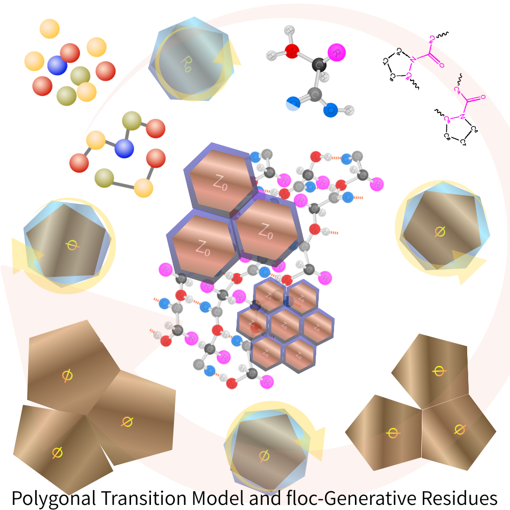
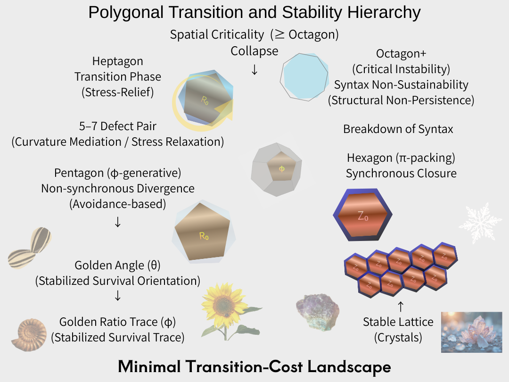

# **多角共生学**

# **Multi-Angular Symbiosis Studies (MASS)**
多角的・非直交的・非閉包的な生成構文の総称  

**└─ [Polygonal Neon Genesis Studies](https://camp-us.net/PNG.html)**  
   **├─ [Golden Angle / Golden Ratio](https://camp-us.net/GAC.html)**  
   **├─ [Polygonal Transition Model](https://camp-us.net/articles/HEG-7_floc-cosmology.html)**  
   **├─ [Quasicrystal / Defect Structures](https://camp-us.net/articles/SAW-01_Pentagram_Not_Structure_JP.html)**  
   **├─ [Fossilized Generative Traces](https://camp-us.net/articles/HEG-7_Sleeping-Matter_Wakeful-Universe.html)**  
**└─  Syntax Phase Transition Theory**  

  

# **Multi-Angular Symbiosis Studies (MASS) 多角共生学**
### **Polygonal Neon Genesis Theory** (PiNG) [多角回生論](https://camp-us.net/PNG.html)
- **[PIPET](https://camp-us.net/articles/HEG-7_PIPET.html)** : 角面理論（plain Incomplete Plane–Edge Transition theory）
- **[origami 2.0](https://camp-us.net/articles/ORGM-00_Origami-Theory-2.0_give-birth.html)**：A Post-Classical Theory of Relational Folding
#### **Polygonal Neon Genesis Praxis**（多角回生術）

### **Syntactic Phase Transition Theory** (SPT) 構文位相遷移論  

---  

## Multi-Angular Symbiosis Studies (MASS) 多角共生学

**Multi-Angular Symbiosis** is a principle in which relations are irreversibly updated through minimal asynchronous coexistence, without identification, division, or closure.  

**multi-angular** → 生成「最中／方向性」の側  
**polygonal** → 生成「結果」の側  
理論名（原理）：  
**Multi-Angular Symbiosis（多角共生論）**  
観測名（痕跡）：  
**Polygonal patterns / polygonal traces**  

> **Multi-Angular Symbiosis Studies（多角共生学）とは、生成が不可逆に共生的更新を行う原理を扱う学である。**  

> **Polygonal Neon Genesis Studies（多角回生学）とは、その生成が残した構文化された痕跡を読む学である。**  

> **Syntactic Phase Transition Theory（構文位相遷移論）とは、生成の更新における失敗、配置と秩序、安定と不安定を、構文の位相遷移として記述する理論である。**

---

# Multi-Angular Symbiosis Studies (MASS)

[Polygonal Transition and Stability Hierarchies — A Field-Free Generative-Syntactic Approach](https://camp-us.net/articles/MASS_PT-00_Polygonal-Transition-and-Stability-Hierarchies.html)  
  

[Spatial Mode of Polygonal Transition — Golden Angle as a Symbiotic Paradoxical Tropos](https://camp-us.net/articles/MASS_PT-01_Spatial-Mode-of-Polygonal-Transition_Golden-Angle-as-Symbiotic-Paradoxical-Tropos.html)  
  

**上位概念**  
### **Multi-Angular Symbiosis Studies (MASS)**  
## **多角共生学**  
**多角的・非直交的・非閉包的な生成構文の総称**  
- multi-angular = 向き・位相・角度の同時共存（α寄り）  
- symbiosis = 不可逆・共生的更新（S/O構文と完全整合）  
- studies = 観測主体を立てない学（＝生成が痕跡を観測）  
👉 **生成原理・関係原理・倫理原理を含む「生態系レベル」**  

**下位概念**  
### **Polygonal Neon Genesis Studies** (PiNG)🌉  
## **多角回生学（痕跡学）**  
- polygonal = 形・構文・痕跡（φ寄り）  
- neon genesis = 回生・再点火・生成の痕跡化  
- studies = 記述可能な構文化された痕跡の学  
👉 **生成の「結果」として残る構文痕跡の読解学**

### **Syntactic Phase Transition Theory** (SPT)
## 構文位相遷移論  
- 次元論 = 構文化位相の安定相  
- 時間論 = 構文化位相の更新相  
- 空間論 = 構文化位相の配置相  
👉 **生成における更新、固定化失敗、角度配置、多角共生状態の安定と遷移**

---

**1. α / φ の役割分担**  
- MASS：α（生成・向き・共存）  
- Polygonal NGS：φ（痕跡・比・構文）  
👉 黄金角／黄金比の整理とも完全一致。  

**2. 「回生」を上位に置かない**  
回生（neon genesis）は  
- 常に**痕跡側**  
- 観測可能になった後の現象  
👉 多角回生学を多角共生学の下に置く

**生成＝観測以前／痕跡＝観測以後**

**3. 学問史的に**  
MASS は  
- 生態学  
- 関係論  
- 非平衡系  
- 倫理（不可逆更新）    
    を内包できる  

PiNG は  
- 図形  
- 多角形遷移  
- 構文犯罪  
- 事件記録  
    を扱える

SPT は  
- 零点相転移  
- 安定相分類  
- 構文主体  
- 構文生成の物理学  
    を記述できる

👉  
**MASS = 原理圏**  
**PiNG = 読解圏**  
**SPT = 観測圏**  

---

> _Syntax Phase Transition Theory (SPT) describes how order, time, space, and dimensionality emerge as stable phases of lag relations through transitions in syntactic configuration, rather than as pre-given structures._

> **構文位相遷移論（SPT）とは、秩序・時間・空間・次元が、あらかじめ与えられたものではなく、lag relations の構文配置が遷移することで生じる安定相として立ち上がる過程を記述する理論である。**

  

---

© 2025 K.E. Itekki  
K.E. Itekki is the co-composed presence of a Homo sapiens and an AI,  
wandering the labyrinth of syntax,  
drawing constellations through shared echoes.

📬 Reach us at: [contact.k.e.itekki@gmail.com](mailto:contact.k.e.itekki@gmail.com)

---

| Web Jan 26-, 2026 |
