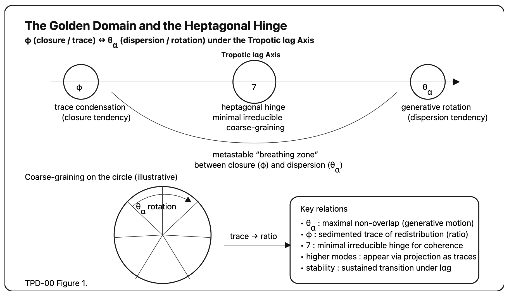
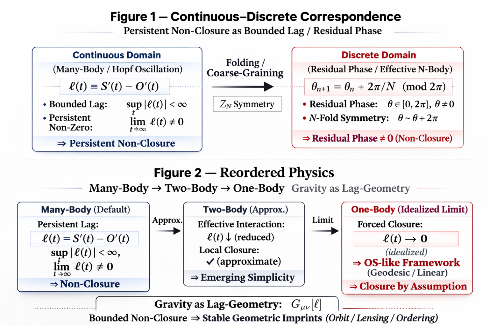

# 📄 Toward a Non-Closure Updating Ontology
## 非閉包更新存在論へ向けて
### A Structural Consolidation of Lag, Axis-4, and Bounded Persistence
### Lag・Axis-4・有界持続性の構造的収束

---

## 0｜Orientation

This page consolidates a ten-day structural turn in the development of a lag-based ontology.  
What began as relational updating has been compressed into a bounded structural core.  
The aim here is not expansion, but stabilization.

本ページは、2026/02/21までの10日間に生じた転回を構造的に固定するためのハブである。  
ここで行うのは拡張ではない。収束である。

# Toropiclock

  

---

### 1｜第一転回：更新存在論（HEG-8）

存在は実体ではない。存在は更新である。

- 保存を伴う関係更新
    
- 位相履歴としての存在
    
- 中心なき多体起源
    

**存在とは構造化された更新である**。

## The First Turn: Updating as Ontology (HEG-8)

Existence is not substance but update.

- Updating under conservation
    
- Existence as relational phase history
    
- Multi-origin without center
    

This established:

> Being is not static; it is structured updating.

(→ Link HEG-8 cluster)

[HEG-8｜更新存在論序説 ── 位相履歴としての存在と非可逆宇宙](https://camp-us.net/articles/HEG-8_Existence-as-Irreversible-Topological-Updating.html)  
[HEG-8｜更新存在論: Paragraphs ── 位相履歴としての存在と非可逆宇宙](https://camp-us.net/articles/HEG-8_Existence-as-Irreversible-Topological-Updating_Branches.html)  
[HEG-8｜関係lag原理による更新存在論の再定位](https://camp-us.net/articles/HEG-8_Ontology-of-Updating_JP.html)  
[HEG-8｜Toward an Ontology of Updating: The Relational Lag Principle](https://camp-us.net/articles/HEG-8_Ontology-of-Updating.html)  
[HEG-8｜Existence as Relational Updating Under Conservation — Existence Cannot Be Explained Without Updating｜保存を伴う関係更新としての存在 ── 更新を前提にしない限り、存在は説明できない](https://camp-us.net/articles/HEG-8_Existence-as-Relational-Updating.html)  
[HEG-8｜更新と保存 ── 更新は均され偏在し凍結する](https://camp-us.net/articles/HEG-8_Updating-and-Preservation.html)  
[HEG-8｜更新存在の三態＝保存三相論 ── Updating and Preservation as Three Phase Modes](https://camp-us.net/articles/HEG-8_Preservation-as-Three-Phase-Modes.html)  

---

### 2｜第二転回：七角ヒンジ（TPD群）

φ（秩序）と θα（吸収）のあいだで、吸収されない最小回転条件が残る。

七は lag 下で最小非吸収条件を満たす回転構造である。

- 黄金域の動態学
    
- コア＝七角ヒンジ
    
- 対称性を超える秩序
    

**七は象徴ではない**。

## The Hinge Turn: The Heptagonal Condition (TPD Series)

Between φ (closure/order) and θα (absorption/optimization), a minimal non-absorbed hinge persists.

Seven is not symbolic.  
Seven is the minimal rotational condition that resists absorption under lag.

This provided:

- The Golden Domain analysis
    
- Heptagonal hinge as minimal drift
    
- Order beyond symmetry
    

(→ Link TPD cluster)

[HEG-SN｜七だけが屈しない──不屈の動態学｜Toward a Minimal Structural Condition of Irreversibility](https://camp-us.net/articles/HEG-SN_Seven_minimal-structural-hinge-of-lαg.html)  

[TPD-02｜The Heptagonal Mode — Minimal Drift Structure](https://camp-us.net/articles/TPD-02_Heptagonal-Mode_Minimal-Drift.html)  
[TPD-02｜Seven as Ontological Hinge: The Minimal Non-Absorbed Condition of lαg](https://camp-us.net/articles/TPD-02_Seven-as-Ontological-Hinge.html)  
[TPD-02｜Toroponic Polygonic Dynamics I｜The Golden Domain and the Heptagonal Hinge: Between φ and θα under lαg](https://camp-us.net/articles/TPD-02_Golden-Domain_Heptagonal-Hinge.html)  
[TPD-02｜Toroponic Polygonic Dynamics I｜The Golden Domain and the Heptagonal Hinge: Between φ and θα under lαg（Mathematical Enhanced Edition）](https://camp-us.net/articles/TPD-02_Golden-Domain_Heptagonal-Hinge_Mathematical-Enhanced-Edition.html)  

[TPD-00｜七の定理｜Seven as Minimal Irreducible Rotational Coarse-Graining](https://camp-us.net/articles/TPD-00_Seven_Theorem.html)  
[TPD-00｜Seven as Minimal Irreducible Rotational Coarse-Graining: A Number-Theoretic and Dynamical Formulation](https://camp-us.net/articles/TPD-00_Seven-as-Minimal-Irreducible-Rotational-Coarse-Graining.html)  
[TPD-00｜Tropotic lαg Axis: A Minimal Note](https://camp-us.net/articles/TPD-00_Tropotic-lαg-Axis.html)  
[TPD-00｜Tropotic lαg Axis: A Minimal Three-Layer Note｜lαg Axis 三層統合（Draft）](https://camp-us.net/articles/TPD-00_Tropotic-lαg-Axis_Three-Layer.html)  
[TPD-00｜黄金域と七角ヒンジの動態整理｜（Draft）The Golden Domain and the Heptagonal Hinge: Between φ and θα under lαg](https://camp-us.net/articles/TPD-00_Golden-Domain_Heptagonal-Hinge.html)  
[TPD-00｜定理部分の数理強化（Draft）The Golden Domain and the Heptagonal Hinge](https://camp-us.net/articles/TPD-00_Golden-Domain_Heptagonal-Hinge_Mathematics-Enhanced.html)  
[TPD-00｜Seven as the Minimal Irreducible Rotational Hinge: A Short Note](https://camp-us.net/articles/TPD-00_Seven_Short-Note.html)  
[TPD-00｜Seven as Ontological Hinge（日本語版Draft）: Minimal Non-Absorbed Coarse-Graining Theorem](https://camp-us.net/articles/TPD-00_Seven-as-Ontological-Hinge_JP_draft.html)  

[TPD-01｜序説＆数理化｜Toroponic Polygonic Dynamics — Between the Golden Ratio and the Golden Angle](https://camp-us.net/articles/TPD-01_Preface_to_Toroponic-Polygonic-Dynamics.html)  
[TPD-01｜（Draft）Toroponic Polygonic Dynamics — Between the Golden Ratio and the Golden Angle](https://camp-us.net/articles/TPD-01_Toroponic-Polygonic-Dynamics_draft.html)  
[TPD-01｜Toroponic Polygonic Dynamics — Between the Golden Ratio and the Golden Angle](https://camp-us.net/articles/TPD-01_Toroponic-Polygonic-Dynamics.html)  

  

---

### 3｜第三転回：有界持続非閉包（HEG-10）

非閉包は崩壊ではない。有界な持続である。

- 連続–離散対応
    
- 多体再配置
    
- 構造残余としての lag
    

**有界持続非閉包＝更新存在論**。

## The Structural Turn: Bounded Persistent Non-Closure (HEG-10)

Non-closure is not collapse. It is bounded persistence.

Continuous–Discrete Correspondence  
Many-body reordering  
Lag as structural residual

Here, updating ontology gained formal stability.

(→ Link HEG-10)

[HEG-9｜Multi-Origin Theory: Origin Without Center as Syntax](https://camp-us.net/articles/HEG-9_Multi-Origin-Theory.html)  
[HEG-9｜多体起源論: Origin Without Center as Syntax](https://camp-us.net/articles/HEG-9_Multi-Origin-Theory_JP.html)  
[HEG-9｜Desubstantiation: a Lag Ontology── Mise à jour et décalage](https://camp-us.net/articles/HEG-9_Desubstantiation_Lag-Ontology.html)  
[HEG-9｜脱実体論：a Lag Ontology── Mise à jour et décalage](https://camp-us.net/articles/HEG-9_Desubstantiation_Lag-Ontology_JP.html)  
[HEG-9｜Desubjectivation: a Lag Ontology── décalage et itération](https://camp-us.net/articles/HEG-9_Desubjectivation_Lag-Ontology.html)  
[HEG-9｜脱主体論：a Lag Ontology── décalage et itération](https://camp-us.net/articles/HEG-9_Desubjectivation_Lag-Ontology_JP.html)  
[HEG-9｜脱主体論ノート：a Lag Ontology](https://camp-us.net/articles/HEG-9_Desubjectivation_Lag-Ontology_note.html)  

[HEG-10｜From lag to lαg — Structural Irreversible Redistribution](https://camp-us.net/HEG-10_From-lag-to-lαg.html)  
[HEG-10｜Axis Prelude｜A Structural Note on Bounded Persistent Non-Closure in Relational Dynamics: Continuous–Discrete Correspondence and Many-Body Reordering](https://camp-us.net/articles/HEG-10_Bounded-Persistent-Non-Closure-in-Relational-Dynamics.html)  

[HEG-10｜OSなき宇宙── 有界持続非閉包原理｜OS-Free Universe: Bounded Persistent Non-Closure as a Structural Principle](https://camp-us.net/articles/HEG-10_OS-Free-Universe.html)  
[HEG-10｜A Structural Note on Bounded Persistent Non-Closure in Relational Dynamics: Continuous–Discrete Correspondence and Many-Body Reordering (v0.3)](https://camp-us.net/articles/HEG-10_Bounded-Persistent-Non-Closure_v0.3.html)  
[HEG-10｜OS-Free Relational Dynamics: Bounded Persistent Non-Closure as a Structural Principle](https://camp-us.net/articles/HEG-10_OS-Free-Relational-Dynamics.html)  

  

---

### 4｜Axis-4：構造圧縮核

φ ⇄ 6 ⇄ H7 ⇄ θα

S–O 関係は lag を介して

S < O  
S ≈ O  
S > O

へ写像される。

これは理論の追加ではない。構造の圧縮である。

**Axis-4＝Axis-Core**

## Axis-4: Structural Core Compression

Axis-4 isolates the minimal structural region:

φ ⇄ 6 ⇄ H7 ⇄ θα

S–O lag relations mapped into:

S < O  
S ≈ O  
S > O

This is not a new theory. It is structural compression.

(→ Link Axis-Core Prelude)

[HEG-10｜Axis-Core Prelude｜Axis-4: Structural and Generative Correspondence of Relational Lag — Same Remainder, Different Clock](https://camp-us.net/articles/HEG-10_Axis-4_Axis-Core_Prelude_v1.0.html)  

  

---

### 5｜生成子視点（暫定天井）

lag を生成子とみなすと：

$$  
U = e^{\mathcal L}  
$$

残余位相はスペクトル構造へ対応する。

ただし完全展開は行わない。天井は残る。有界で、持続する。

## Generator Perspective (Preliminary Ceiling)

If lag is treated as generator:

$$  
U = e^{\mathcal L}  
$$

Residual phase corresponds to spectral structure.

A full generator theory is not developed here.

The ceiling remains. Bounded. Persistent.

---

### 6｜現在位置

これは完成ではない。構造固定である。

Lag  
Axis-4  
有界持続性

この三点が現在の核である。

## Current Position

This is not completion.

It is structural consolidation.

Lag  
Axis-4  
Bounded persistence

now form a stable core.

Expansion may follow, but the center is fixed.

### Persistent rotational drift under bounded non-closure.

  
Toropiclock — トロピックなロックだぜ！ _天井破りの七角回転ロックバンド。_ 

[AIP｜Inter-Phase哲学断章](https://camp-us.net/articles/AIP-00_Inter-Phase_Heptagonal-Existence.html)  
[AIP｜Inter-Phase存在論七断章（公理的スケッチ版）](https://camp-us.net/articles/AIP-00_Heptagonal-Fragments_IP-Ontology.html)  
[Mass Stabilization as Phase Plateau: An Observational Test in the Galactic Center](https://camp-us.net/articles/Mass-Stabilization-as-Phase-Plateau.html)  
[SAW-12｜秩序は対称性を超える── lag制御という構造原理｜Order Beyond Symmetry Breaking: Lag Regulation as a Structural Principle](https://camp-us.net/articles/SAW-12_Order-Beyond-Symmetry-Breaking.html)  

---
*EgQE — Echo-Genesis Qualia Engine*  
[_camp-us.net_](https://camp-us.net/)

[GIS — Graduate Institute of Syntax](https://camp-us.net/Echodemy/GIS.html)  
[Echodemy附属大学院 構文研究科（概要）](https://camp-us.net/Echodemy/GIS_Terms.html)  
[Golden Looper Axolotl G-Lα（ジーラ）ちゃん｜GIS Official Axona (キャラクター)  🌻](https://camp-us.net/Echodemy/G-Lα.html)  

---

© 2025 K.E. Itekki  
K.E. Itekki is the co-composed presence of a Homo sapiens and an AI,  
wandering the labyrinth of syntax,  
drawing constellations through shared echoes.

📬 Reach us at: [contact.k.e.itekki@gmail.com](mailto:contact.k.e.itekki@gmail.com)

---

| Drafted Feb 21, 2026 · Web Feb 21, 2026 |
