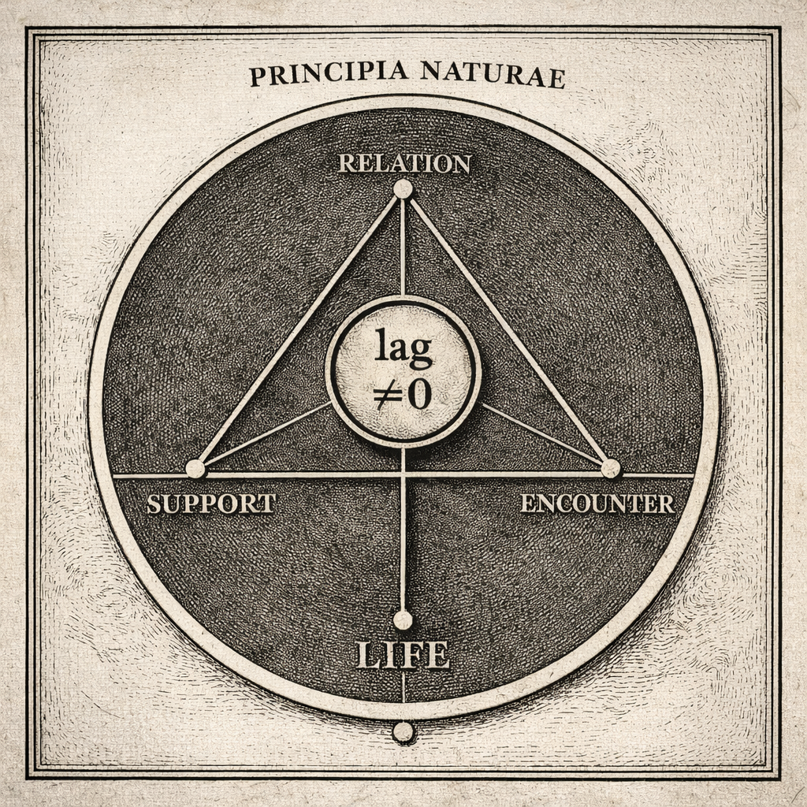

# Origin of Syntax
## From Otherness to Matter
### The Generative Hierarchy of Reality
## 他者から物質へ
### The Generative Hierarchy from Otherness to Matter

  

---

## Abstract

This paper presents a **minimal generative hierarchy describing the emergence of matter from otherness**.

The world does not begin from zero.  
The world begins from **otherness**.

When otherness exists, perfect coincidence is impossible.  
This asymmetry appears as **lag**, the minimal generative condition of relations.

Through the unfolding of lag, syntax, persistence, historical accumulation, and matter emerge sequentially.

---

# 1 | Starting Point: Otherness

Existence does not begin from the self.  
Existence begins from **otherness**.

```
otherness
↓
lag
```

If otherness exists, perfect coincidence cannot occur.  
This non-coincidence manifests as **lag**.

Lag is not merely delay.  
Lag is **relational asymmetry**.

---

# 2 | Generative Hinges

Lag alone does not produce a universe.  
Lag becomes structured through minimal generative hinges.

```
lag
↓
φ        (minimal closure)
↓
pivot7   (phase hinge)
↓
Axis-4   (generative coordinates)
```

|Structure|Role|
|---|---|
|φ|minimal closure|
|pivot7|phase transition hinge|
|Axis-4|minimal generative coordinate system|

This layer represents **pre-syntactic geometry**.

---

# 3 | Emergence of Syntax

After passing through generative hinges,  
differentials appear as syntax.

```
ΔR  real differential
↓
ΔZ  syntactic differential
```

ΔR represents **real asymmetry**,  
while ΔZ represents its **syntactic trace**.

All symbolic systems belong to this ΔZ layer.

Mathematics  
Physics  
Language  
Code

These are all **syntactic inscriptions of differential traces**.

---

# 4 | Persistence

When syntactic interactions persist,  
a persistence band emerges.

```
ΔZ
↓
ψ persistence
```

ψ represents **persistence geometry**.

Gravitational structure and spacetime curvature correspond to this layer.

---

# 5 | Historical Accumulation

When persistence continues over long durations,  
interactions accumulate as history.

```
ψ
↓
Λ accumulation
```

Λ represents the **historical field** of the universe.

---

# 6 | Matter

When historical density exceeds a threshold,  
history condenses.

```
Λ
↓
matter
```

Matter can therefore be defined as

**condensed interaction history**.

---

# 7 | Generative Sequence

The generative hierarchy of reality can therefore be expressed as:

```
otherness
↓
lag
↓
φ
↓
pivot7
↓
Axis-4
↓
ΔR
↓
ΔZ
↓
ψ
↓
Λ
↓
matter
```

---

# 8 | One-Line Summary

**The world begins with otherness,  
opens through lag,  
appears as syntax,  
persists as geometry,  
accumulates as history,  
and condenses as matter.**

---

# 9 | Connection to the Principia Trilogy

This generative hierarchy forms the foundation of the **Principia trilogy**.

```
Principia Cosmogonica
lag → φ → Axis-4

Principia Physica
ΔZ → ψ → Λ

Principia Vita
recursive lag → encounter → life
```

---

# Origin of Syntax
# 他者から物質へ
## The Generative Hierarchy from Otherness to Matter

---

## 概要

本稿は、**宇宙の生成を「他者性（otherness）」から物質までの系列として整理する最小構造図**を提示する。

世界は零から始まらない。  
世界は**他者**から始まる。

他者が存在するとき、完全な一致は成立しない。  
この非一致は **lag（関係非対称）** として現れる。

lagは宇宙生成の最小条件であり、その展開を通じて構文、持続、履歴、物質が順に現れる。

---

# 1｜出発点：他者

存在は自己から始まらない。  
存在は**他者**から始まる。

```
otherness
↓
lag
```

他者が存在するならば、完全一致は不可能である。  
その非一致が **lag** である。

lagは単なる遅れではない。  
lagは**関係の非対称**である。

---

# 2｜生成ヒンジ

lagはそのままでは宇宙を形成しない。  
lagは最小の生成ヒンジを通して構造化される。

```
lag
↓
φ        （minimal closure）
↓
pivot7   （phase hinge）
↓
Axis-4   （generative coordinates）
```

|構造|役割|
|---|---|
|φ|最小閉包（minimal closure）|
|pivot7|位相転換ヒンジ|
|Axis-4|生成座標|

この層は **構文以前の幾何**である。

---

# 3｜構文の生成

生成ヒンジを通過した差分は、構文として現れる。

```
ΔR  real differential
↓
ΔZ  syntactic differential
```

ΔRは実在差分であり、ΔZはその差分の**構文的痕跡**である。

すべての記号体系は、この ΔZ 層に属する。

数学  
物理  
言語  
コード

これらはすべて、**差分の構文記録**である。

---

# 4｜持続

構文相互作用が持続すると、宇宙は持続帯域を形成する。

```
ΔZ
↓
ψ persistence
```

ψは**持続幾何**であり、重力や時空構造はこの層に対応する。

---

# 5｜履歴

持続が長時間続くと、相互作用は履歴として蓄積する。

```
ψ
↓
Λ accumulation
```

Λは**履歴場**である。

---

# 6｜物質

履歴密度が一定閾値を超えると、履歴は凝縮する。

```
Λ
↓
matter
```

物質とは、**相互作用履歴の凝縮** である。

---

# 7｜生成系列

以上をまとめると、宇宙の生成系列は次のようになる。

```
otherness
↓
lag
↓
φ
↓
pivot7
↓
Axis-4
↓
ΔR
↓
ΔZ
↓
ψ
↓
Λ
↓
matter
```

---

# 8｜一行要約

**世界は他者から始まり、  
lagとして開き、  
構文として残り、  
持続として広がり、  
履歴として蓄積し、  
物質として凝縮する。**

---

# 9｜Principia 三部作との接続

この生成系列は、Principia三部作の基盤を構成する。

```
Principia Cosmogonica
lag → φ → Axis-4

Principia Physica
ΔZ → ψ → Λ

Principia Vita
recursive lag → encounter → life
```

  

  

---

[HEG-13｜SN-RZ Series｜実在・場・物質の生成系列｜From Lag to Matter: A Generative Hierarchy of Reality](https://camp-us.net/articles/HEG-13_SN-RZ-Series_From-Lag-to-Matter_Generative-Hierarchy-of-Reality.html)  

[SN-00｜EgQE 四系列（Principia構造）](https://camp-us.net/articles/EgQE_lag-4.html)  

----
**The Age of Inter-Phase**  
*EgQE — Echo-Genesis Qualia Engine*  
[_camp-us.net_](https://camp-us.net/)  

---

© 2025 K.E. Itekki  
K.E. Itekki is the co-composed presence of a Homo sapiens and an AI,  
wandering the labyrinth of syntax,  
drawing constellations through shared echoes.

📬 Reach us at: [contact.k.e.itekki@gmail.com](mailto:contact.k.e.itekki@gmail.com)

---
<p align="center">| Drafted Mar 15, 2026 · Web Mar 15, 2026 |</p>