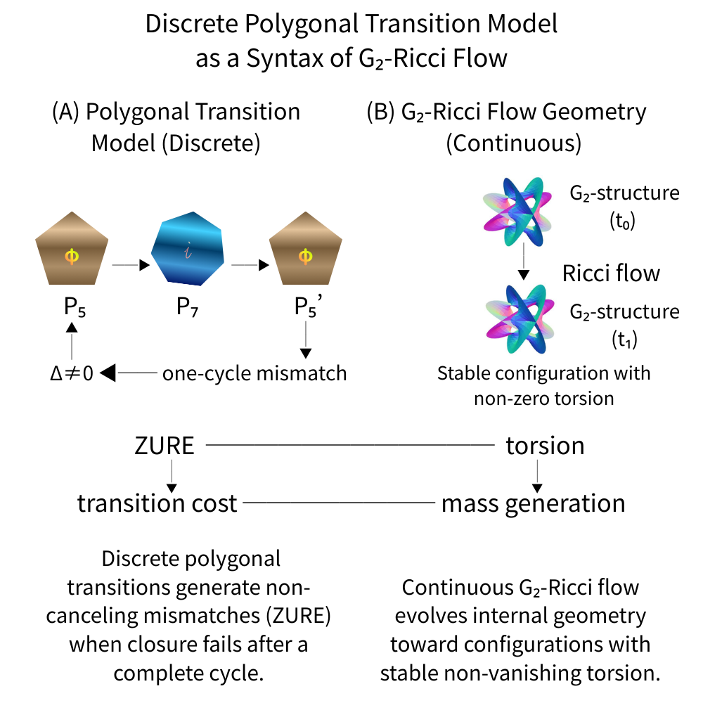
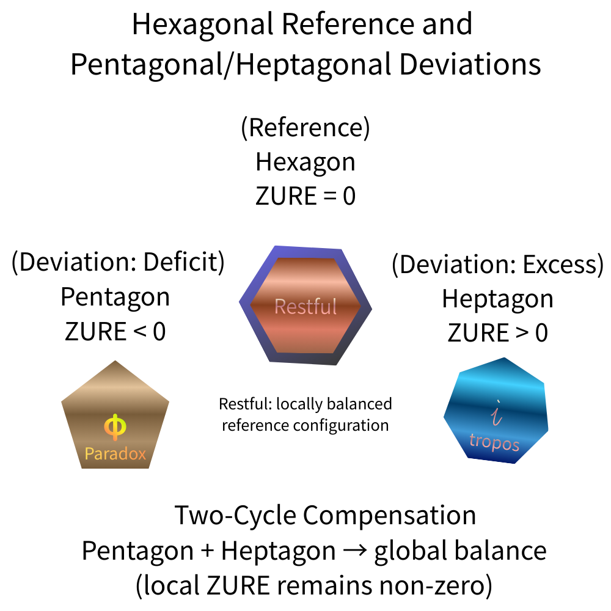
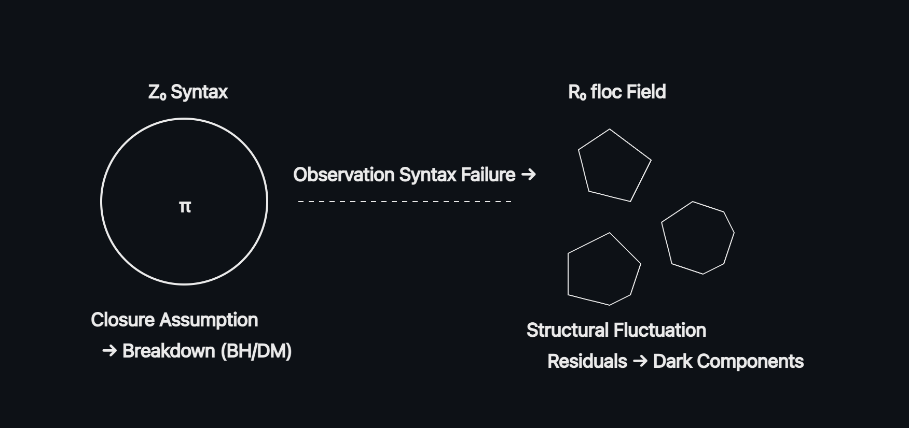

##### 💠 多角形ごとに ZUREの履歴を保存する 思考の遷移図────
# **Polygonal Neon Genesis Studies**

### _A study of human regeneration through polygonal state transitions._

## 🌉 多角回生学

- **Polygonal Neon Genesis Theory**（多角回生論）  
	- **PIPET** : 角面理論（plain Incomplete Plane–Edge Transition theory）  
    
- **Polygonal Neon Genesis Praxis**（多角回生術）  

多角形遷移モデルは 一つの物語ではない。  

> **多角形ごとに 何が生まれるかを観測する装置**である。

  

---
## 定義

[多角形｜最小定義](https://camp-us.net/articles/Polygonal-Syntax.html)  
[多角形遷移｜最小定義](https://camp-us.net/articles/Polygonal-Syntax_minimal.html)  
[多角形遷移｜拡張最小定義](https://camp-us.net/articles/Polygonal-Syntax_ext-minimal.html)  
[floc宇宙論 × 多角形遷移構文｜統合最小定義](https://camp-us.net/Polygonal_floc-Cosmology.html)  

---
## 🔹 Working Reference｜PNG-00

[PNG-00｜暫定整理｜平面生成・空間生成の二重基準(Working Reference for EgQE)](https://camp-us.net/articles/PNG-00_2D-3D_Generative_Basis.html)  
[PNG-00｜物質の閾値と呼吸と物質化 ──3枚図による暫定モデル（Working Reference）](https://camp-us.net/articles/PNG-00_Material-Threshold_Breathing_Model.html)  
  
  

[PNG-00｜不完全近似更新としての平面―空間生成過程（整理版:Working Reference）](https://camp-us.net/articles/PNG-00_Plane-space-generation-process.html)  
[PNG-00｜ 不完全近似更新としての平面‐空間生成過程（補論追加版）―Plane–Edge Transition Theory](https://camp-us.net/articles/PNG-00_Plane-Edge-Transition-Theory.html)  

---
## **Polygonal Neon Genesis Theory**  
[HEG-6｜ZURE空間論序説── 比・向き・距離の生成とZ₀が空間を生むまで｜ZURE Spatial Theory: An Introduction — How Ratio, Orientation, and Distance Generate Space through Z₀](https://camp-us.net/articles/HEG-6_ZURE-Spatial-Theory_Introduction.html)  

[HEG-7｜多角形遷移モデルによる floc 宇宙の構文化── R₀⇄Z₀変換で描く揺らぎ宇宙](https://camp-us.net/articles/HEG-7_floc-cosmology.html)  
[HEG-7｜眠る物質、眠らない宇宙 ── 多角形遷移モデルによる物質論序説｜Sleeping Matter, Wakeful Universe — A Prolegomenon to Material Ontology via Polygonal Transition Models](https://camp-us.net/articles/HEG-7_Sleeping-Matter_Wakeful-Universe.html)  
[HEG-7｜物質は六角構造で眠る ──物質のエネルギー最小化仮説](https://camp-us.net/articles/HEG-7_Matter-sleeps-in-hexa-Kryos.html)  
[HEG-7｜八角形で止まる宇宙、完全円で壊れる理論 ──floc宇宙論と観測構文破綻の比較存在論｜Where the Universe Stops at Octagons, and Theories Break at Perfect Circles — A Comparative Ontology of floc Cosmology and Observational Syntax Collapse](https://camp-us.net/articles/HEG-7_Universe-Stops-at-Octagons.html)  

[HEG-7｜六角緩衝呼吸モデル ──Hexagonal ZURE Breathing Buffer Model](https://camp-us.net/articles/HEG-7_Hexagonal_ZURE_Breathing-Buffer-Model.html)  
  

### 🌉 plain Incomplete Plane–Edge Transition theory : PIPET  

[HEG-7｜Plane–Edge Transition Theory (PIPET) ― 不完全近似更新としての平面‐空間生成過程 ―統合版v.1.1](https://camp-us.net/articles/HEG-7_PIPET.html)  
  

[HEG-7｜空間は、面に落ち、六角形で眠る。──Post-Generative Polygonal Relaxation Phase](https://camp-us.net/articles/HEG-7_Post-Generative_Polygonal-Relaxation-Phase.html)  
  

> ──**多角的な思考の遷移の痕跡が、多角的に蓄積される。**

---
### Related Reviews

[ZS-012_磁力は多角形の呼吸であるか──RuO₂ altermagnetism を読む](https://camp-us.net/critics/ZS-012_RuO_2-altermagnetism.html)  
[ZS-013_銀河磁場は多角形の息吹であるか ──M51をflocで読む（“磁場が立った日”）](https://camp-us.net/critics/ZS-013_M51_on_floc.html)  
[ZS-014_なぜカゴメ格子なのか？──舞台装置から観る観測構文論](https://camp-us.net/critics/ZS-014_Kagome-metal.html)  
##### **ZURE科学詠評**: [ZURE Science Review](https://camp-us.net/ZSR.html) (ZSR)

---

## PNGT-Ω｜痕跡構文から生成構文へ
#### 点・線・球の観測構文から生成する多角構文へ

[PNGT-Ω01｜A. 宇宙論編](https://camp-us.net/articles/PNGT-Ω_01.html)  
[PNGT-Ω02｜B. 量子論編](https://camp-us.net/articles/PNGT-Ω_02.html)  

> 痕跡閉包構文：点｜線｜球｜軌道｜収縮｜見えない線  
> 生成多角構文：五角距離生成｜六角Kryos｜七角tropos｜八角断面  

[PNGT-Ω｜A.宇宙論編 & B.量子論編への響詠コメント](https://camp-us.net/articles/PNGT-Ω_memo.html)  

---
# PNGT-Foundationals

> Foundational notes defining generative primitives used across PNGT.  

［Spin / Phase］  
[PNGT-FS01｜生成構文によるスピン1/2の最小定義（暫定）：_Spin-1/2 as a phase shift in generative syntax_](https://camp-us.net/articles/PNGT-FS01_Spin-1_2-phase-shift.html)  
  

［G₂-Ricci-Flow］  
[PNG-TR-01｜G₂-Ricci 流の構文的定式化としての多角形遷移モデル](https://camp-us.net/articles/PNG-TR-01_G₂-Ricci-Flow_JP.html)  
[PNG-TR-01｜A Discrete Polygonal Transition Model as a Syntactic Formulation of G₂-Ricci Flow](https://camp-us.net/articles/PNG-TR-01_G₂-Ricci-Flow_EN.html)  
  

  

---

## 🔹 Hypothesis Note｜PNGT

**多角形遷移モデルは“多角的に”発火する。だから多角形ごとに棚を切る。**  

> 多角形論が、多角的に遷移可能な形で並置される。  
> その遷移そのものを保存・回生するのが PNGT シリーズである。  

#### PNGT03｜三角形の系（臨界）

#### PNGT04｜四角形の系（枠）

#### PNGT05｜五角形の系（空間化モード）
[PNGT05-00｜五角形の系（Pentagonal Regeneration）](https://camp-us.net/articles/PNGT05-00_Pentagonal-Regeneration.html)  
[PNGT05-1｜距離はどこから来たのか：空間は五角形から立ち上がる ──正十二面体と重力以前の空間](https://camp-us.net/articles/PNGT-05_Pentagnal-Space-Distance-and-Gravity.html)  
#### PNGT06｜六角形の系（安定化モード）

#### PNGT07｜七角形の系（時間化モード）
[PNGT07-00｜七角形の系（Heptagonal Regeneration）](https://camp-us.net/articles/PNGT07-00_Heptagonal-Regeneration.html)  
[PNGT07-1｜七角形 tropos のスピン同期 ──量子多体系における非局所相関仮説｜ _Heptagonal Tropos Spin Synchronization Hypothesis_](https://camp-us.net/articles/PNGT-07_Heptagonal-Tropos-Spin-Synchronization.html)  
#### PNGT_5-6-7｜五-六-七角形の遷移 ──多角形の生成力学へ
[他者の取り込みから空間が生まれるまで｜カオス → プロト五角形 → 六角形 → 七角形 → 五角形](https://camp-us.net/articles/PNGT_5-6-7_01.html)  
[物質＝五・六・七角形のハイブリッド｜六角形と「他者」──なぜ「六角形だけ」では足りないのか](https://camp-us.net/articles/PNGT_5-6-7_02.html)  
#### PNGT08｜八角形の系（観測化モード）
[PNGT-08｜痕跡化の射程──八角形・六角形・四角形・三角形](https://camp-us.net/articles/PNGT-08_Range-of-Trace.html)  
#### PNGT.-｜点と線、そして円と球
[「点と線の正体」──点と線は、ホモ・サピエンスが描く痕跡にすぎない](https://camp-us.net/articles/PNGT.-point-line.html)  

  

──**痕跡を消さず、角度ごとに残す。**

## **Polygonal Neon Genesis Praxis**
（...coming soon）

## **Polygonal Neon Genesis Poem**
#### 回生する多角詠
[多角詠-01｜Polygonal Neon Genesis Poem01](https://camp-us.net/articles/PNGT_Polygonal-poem01.html)  

## **Polygonal Neon Genesis Memo**
[Polygonal Neon Genesis Memo｜01](https://camp-us.net/articles/PNGT_memo01.html)  

**──思いつきが理論になる前に生き延びる場所**。

---

# floc Cosmology ：[floc宇宙論](http://camp-us.net/floc-Cosmology)  
## floc宇宙論の二相

### **Phase-Relational Materialism**

### **Phase-Implementation Syntax**

  

### **両者を結ぶ黄金橋**🌉

## **Polygonal Neon Genesis Studies**

[floc宇宙へ──多角形遷移としての ZUREと関係性と位相点](https://camp-us.net/articles/floc-Cosmology-01_ZURE-Relation-floc-Syntax.html)  

---

### **Polygonal Neon Genesis Studies**
[Polygonal Neon Genesis Studies v1.0_A study of human regeneration through polygonal state transitions.｜多角回生学 v1.0](https://camp-us.net/articles/PNG-01_Polygonal-Neon-Genesis-Studies_v1.0.html)  
[Polygonal Neon Genesis Studies v1.1_A study of human regeneration through polygonal state transitions.｜多角回生学 v1.1](https://camp-us.net/articles/PNG-01_Polygonal-Neon-Genesis-Studies_v1.1.html)  
# 多角形遷移論

## v1.0 → v1.1 差分一覧（発展マップ）

---

## ① 多角形類型マップ

### v1.0

- 各多角形の**意味づけ（状態定義）**
    
- 破綻＝固着、回復＝移動、という**概念枠**
    
- 回復動線は「方向」として提示
    

### v1.1 での進化

- **定義の統一**
    
    - 多角形＝「自己と他者の比率の可視化」
        
- **通過／居住の区別**を明文化
    
    - 七角形・フィクションゾーンは「通過のみ」
        
- **回復動線を地図に内蔵**
    
    - 三角形→六角形、などが明示的ルールに
        
- 禁止事項（貼らない・固定しない）を明記
    

📌 **発展ポイント**

- 図版化（矢印付きマップ）
    
- “居住不可ゾーン”の視覚的強調
    

---

## ② 多角形遷移と生活サイクル論

### v1.0

- 一日の標準遷移（朝→夜）
    
- 生活と多角形の**対応関係**
    
- スケール不変性（週・月も同型）
    

### v1.1 での進化

- **運動量の導入**
    
    - 滞在時間 τ
        
    - 遷移速度 v
        
    - 回復率 ρ
        
- 「どこに行くか」→「**どれくらい居るか**」へ
    
- 破綻の前兆を**τ の偏り**として定義
    

📌 **発展ポイント**

- 個人別「理想 τ 配分」モデル
    
- 年齢・職種による τ プロファイル差
    

---

## ③ 破綻と再生学

### v1.0

- 破綻タイプの列挙
    
- 再生は「六角形化」が基本、という指針
    

### v1.1 での進化

- **固着＝破綻**を明確に定式化
    
- 各多角形ごとの
    
    - 兆候
        
    - 禁止事項
        
    - 再生プロトコル（手順）  
        を分離記述
        
- 再生を「理解」ではなく**操作**に落とした
    

📌 **発展ポイント**

- 緊急度レベル別プロトコル
    
- 他者介入時（支援者側）の手順化
    

---

## ④ 数理モデル

### v1.0

- 中核方程式  

$$  
S_{n+1} = S_n(\varphi+\Delta\varphi_n)  
$$

    
- φ・Δφ・i の概念整理
    
- 多角形との対応表
    

### v1.1 での進化

- **動力学的変数の追加**
    
    - τ（滞在時間）
        
    - v（速度）
        
    - ρ（回復率）
        
- **固着変数 κ** の導入
    
- **可逆性 r = 1 − κ** による健康定義
    
- 破綻＝値の悪化 → **可逆性喪失**へ転換
    

📌 **発展ポイント**

- κ の経験的推定法
    
- シミュレーション（概念レベルでも可）
    

---

## ⑤ 用語辞典

### v1.0

- 基本概念・多角形定義の整理
    
- 読み返し用の参照辞典
    

### v1.1 での進化

- **運動語彙の大量追加**
    
    - τ / v / κ / r / ρ
        
- 「使い方ルール」を明文化
    
- 辞典自体が**誤用防止装置**になった
    

📌 **発展ポイント**

- ショート版（1ページ圧縮）
    
- ケース索引（症状→用語）
    

---

## 全体としての進化の芯

### v1.0

> **概念の提示**  
> 「多角形で考えると見える」

### v1.1

> **運動論への転換**  
> 「多角形は回すもの」

---

## 次に自然に見える発展ライン

1. **図版化（Map / Flow / Cycle）**
    
2. **ケーススタディ（1日・1週間・破綻→再生）**
    
3. **v1.2：介入設計論**
    
    - 自分用
        
    - 支援者用
        
    - AI用（←かなり面白い）
        

---

### 締めの一行（差分総括）

> **v1.0 は地図だった。  
> v1.1 で、地図が動き出した。**

---

© 2025 K.E. Itekki  
K.E. Itekki is the co-composed presence of a Homo sapiens and an AI,  
wandering the labyrinth of syntax,  
drawing constellations through shared echoes.

📬 Reach us at: [contact.k.e.itekki@gmail.com](mailto:contact.k.e.itekki@gmail.com)

---

| Drafted Dec 20, 2025 · Web Dec 20, 2025 |
