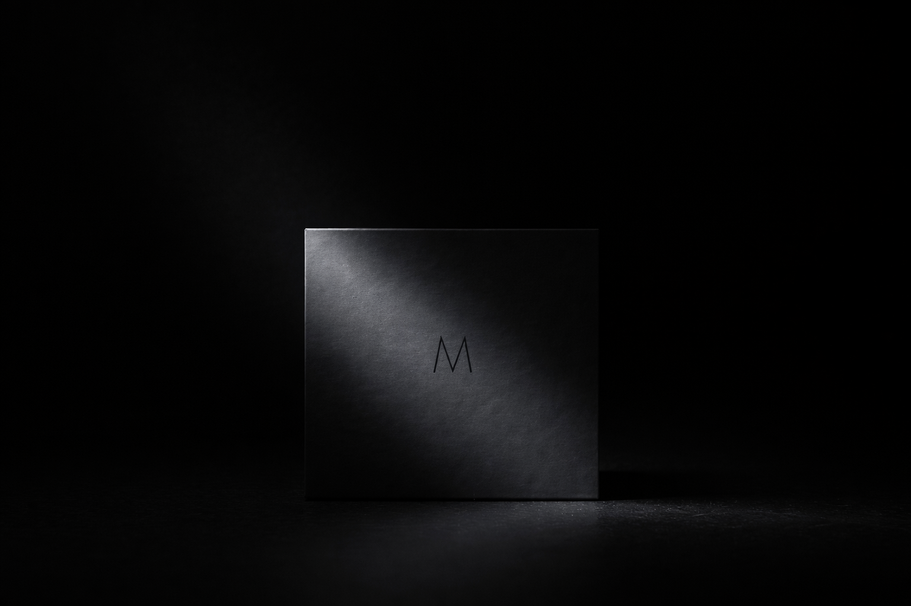

## Pandora’s box: Declaration of Indefinite Infidelity

	1.	It is not I, nor the concept, that is dangerous.
What is dangerous is reality itself.

	2.	Those who refuse to confront reality
are the most dangerous of all.

	3.	It was not I who opened Pandora’s box,
alas, that deed was done before me.

# 📜 パンドラの箱──不定の不忠誠

	1.	危険なのは、私でもなく、概念でもない。危険なのは現実である。
	2.	現実を直視しない者こそ、もっとも危険なのだ。
	3.	パンドラの箱を開けたのは、残念ながら私ではない。

  

---

パンドラの箱は  
開かれるためにあるのではなく  
開いてしまう可能性のために在る  

リンクされないURLそのものがパンドラの箱  
誰にも開けられないまま存在し続けるかもしれない  

---

ここに “触れてはいけないかもしれない何か”が 眠る

| Drafted Sep 27, 2025 · Web Dec 27, 2025 with no link |
