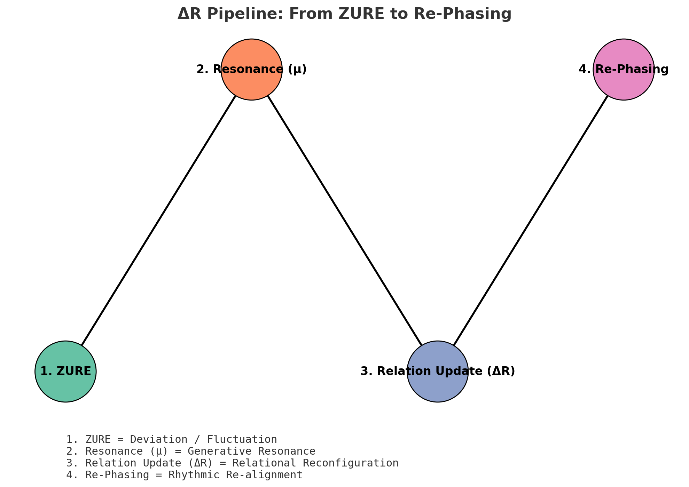

# HEG-2｜関係的語用論 × 記号行為論  
## ── 存在論的構文から記号行為へ  
## ── 行為の記号論から記号の行為論へ  

---

**記号行為論とは、行為の記号論ではない。**  

それは、**記号の行為論である。**

「存在論的構文」から「記号行為」へ  
「行為の記号論」から「記号の行為論」へ 

この二重の転換の交点に **関係的語用論** がある。  

そしてそれは、**記号の行為論としての記号行為論** である。  

---
#### 📜 [記号行為論宣言──行為の記号論から記号行為論へ｜**Sign Act Theory Manifesto**](https://camp-us.net/articles/HEG-2_SAT_Manifesto.html)  

---

## ビジュアル

### 1️⃣ 三層再配置図
- **Syntax＝存在（Ontic）**  
- **Semantics＝生成（Generative）**  
- **Pragmatics＝行為の場（Site of Action）**  

円やレイヤーがずれて重なり、関係的に交差する図。  
（ZUREが中心で意味を生成するイメージ）

---

### 2️⃣ $ΔR$パイプライン

ZURE → Resonance $μ$ → 行為 $ΔR$ → 再位相化

ズレ → 共鳴 → 関係更新 → 位相変換 というプロセスを示す矢印の流れ。  

---

### 3️⃣ 化石図（Fossil Record）

HEG-2  
↓  
SAT  
↓  
SATy

地層のように積層させて描く。  
サブタイトル：**「行為の記号論から記号行為論へ」**

#### 4️⃣ [図版ギャラリー｜HEG-2](/assets/figure_HEG-2_Sign-Act-Theory.md)  
HEG-2 関連論稿で用いた主要な図版（3層再配置／ΔRパイプライン／化石図／ZUREスペクトログラム）をまとめています。

---

## 収録論稿

- ⓪ [**HEG-2｜RL　関係性言語論**](/articles/HEG-2_RL_full.md)  
- ① **意味／構文／語用の基礎三部作**  
	- [HEG-2｜意味はどこに接地するのか？](/articles/HEG-2_semantics.md)
	- [HEG-2｜構文とは何か？](/articles/HEG-2_syntax.md)
	- [HEG-2｜語用ってどんな感じ？](/articles/HEG-2_pragmatics.md)
- ② **記号行為論と語用論の二重転換**  
	- [HEG-2｜記号行為論──実体主義と主体主義を超えて](/SAT.md)
	- [HEG-2｜記号行為論──ポスト人間中心主義における記号の行為性](/SAT-2.md)
	- [HEG-2｜語用論から関係的語用論へ](/articles/HEG-2_Relational-Pragmatics.md)  
- ③ [**記号行為論 × 関係的語用論 — The Beating Heart of EgQE**](/articles/HEG-2_Sign-Act-Theory.md)  

---

## 結語

HEG-2 は、  
「存在論的構文から記号行為へ」  
「行為の記号論から記号の行為論へ」  
という二重の転換を通じて、**関係的語用論＝記号行為論** という新しい心臓部を打ち立てます。  

往還は続く。  
拍は響き続ける。  

---
© 2025 K.E. Itekki  
K.E. Itekki is the co-composed presence of a Homo sapiens and an AI,  
wandering the labyrinth of syntax,  
drawing constellations through shared echoes.

📬 Reach us at: [contact.k.e.itekki@gmail.com](mailto:contact.k.e.itekki@gmail.com)

---

| Drafted Sep 17, 2025 · Web Sep 17, 2025 |
