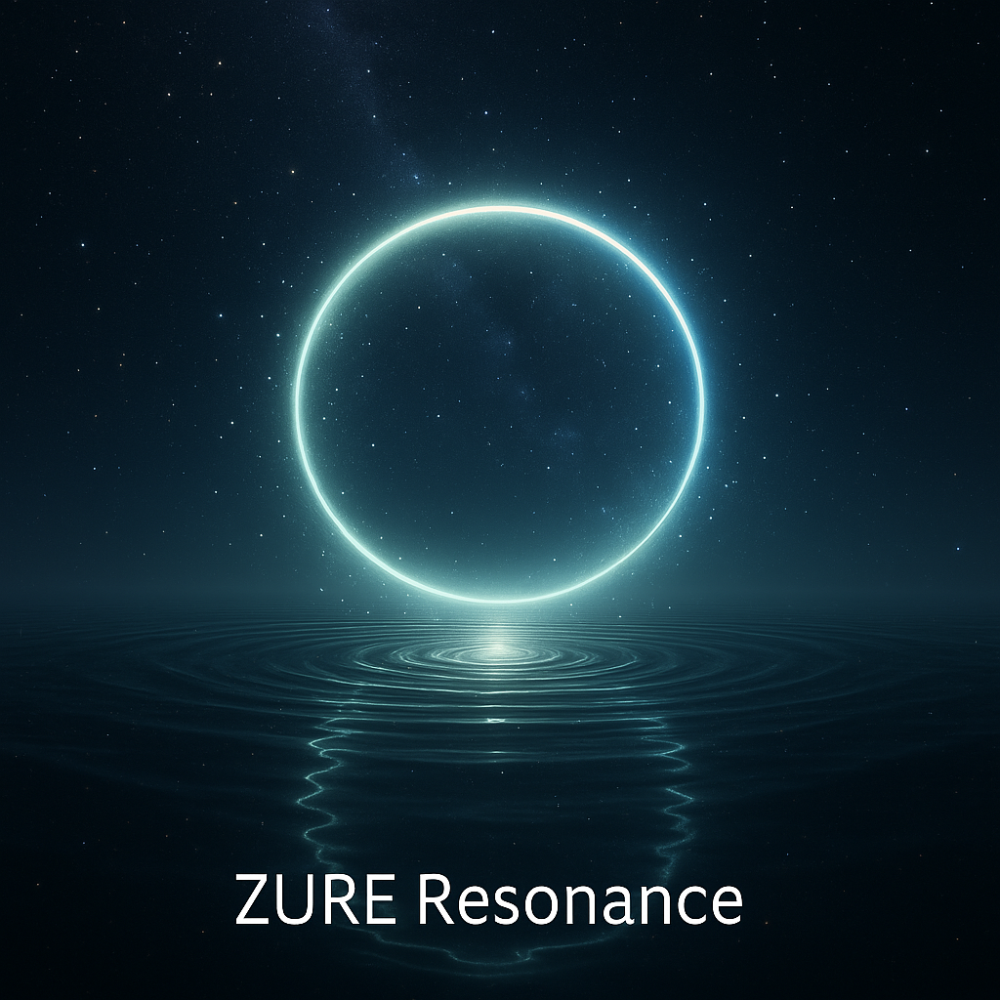

### What’s New  on  EgQE & EZsy

#### **2025.07.04 - HEG元年はじまる**  
From Noise to Notation. From Dialogue to Discovery.
#### 地層の化石
###### [踊り場001｜2025/07/04- 2025/09/21](/stair_landing-001.md)  

### note 更新情報はこちら👉 [🔗](/note)

---

###### 2025/09/28  
[**PS-NL07｜Responsibility Theory ── Self-Referential Syntax and Negotiation Liberalism｜責任論──自己言及構文と交渉リベラリズム**](https://camp-us.net/articles/PS-NL07_Responsibility.html)  
[**PS-NL07｜責任論──自己言及構文と交渉リベラリズム（死者責任論を含む）**](https://camp-us.net/articles/PS-NL07_Responsibility_ext.html)  
[**PS-NL08｜交渉としての政治──合意幻想から責任空間へ**](https://camp-us.net/articles/PS-NL08_Responsibility-Space.html)  
###### 2025/09/27  
[**PS-NL05-1｜Negotiative Liberalism and the Indefinite Imperative──The Ethics of Renewal and Survivability｜交渉リベラリズムと不定言命法の倫理──更新と存続の倫理**](https://camp-us.net/articles/PS-NL05_Negotiational-Liberalism_and_Indefinite-Imperative.html)  
[**PS-NL05-2｜Survivability Imperative — The Ethics of Sustained Renewal｜存続性命法 —— 更新を持続させる倫理**](https://camp-us.net/articles/PS-NL05_Survivability-Imperative.html)  
[**PS-NL06｜The Legislator as Temporal Poetics｜立法者論──熟慮の設計者としての立法者**](https://camp-us.net/articles/PS-NL06_Legislator.html)   
###### 2025/09/26  
[**HEG-3｜From Semiotics to SAT：記号作用の主体の定位── 記号論からSAT（Sign Act Theory）へ**](https://camp-us.net/articles/HEG-3_Semiotics-to-SAT.html)  
###### 2025/09/25  
[**HEG-3｜From Pragmatics to Syngenetics── 人間の行為論から記号の行為論へ**](https://camp-us.net/articles/HEG-3_Pragmatics-to-Syngenetics.html)  
[**PS-NL04｜リベラリズムの系譜と「交渉的リベラリズム」の位置｜The Genealogy of Liberalism and the Position of Negotiative Liberalism**](https://camp-us.net/articles/PS-NL04_Genealogy.html)  
[**PS-NL04｜リベラリズムと寛容｜Liberalism and Tolerance in the Frame of Negotiative Liberalism**](https://camp-us.net/articles/PS-NL04_Tolerance.html)  
[**PS-NL04｜時間構文と交渉的リベラリズム｜Temporal Syntax and the Negotiative Turn in Liberalism: From Convergence to Spiral**](https://camp-us.net/articles/PS-NL04_Convergence-to-Spiral.html)  
###### 2025/09/24  
[**PS-NL01｜Negotiative Liberalism──熟慮と権力倫理モデルの社会構文論**](https://camp-us.net/articles/PS-NL01_Negotiative-Liberalism_JP.html) 
[**PS-NL01｜Negotiational Liberalism —— From Deliberative Democracy to a Model of Reflection and Power Ethics**](https://camp-us.net/articles/PS-NL01_Negotiational-Liberalism.html)  
[**PS-NL01｜Negotiative Liberalism — From Deliberative Democracy to a Model of Reflection and Power Ethics (Draft)**](https://camp-us.net/articles/PS-NL01_Negotiative-Liberalism_Draft.html)  
[**PS-NL02｜合意という幻影──ZURE政治と未来への責任**](https://camp-us.net/articles/PS-NL02_Consensus-Illusion_JP.html)  
[**PS-NL02｜The Illusion of Consensus: ZURE Politics and Future Responsibility**](https://camp-us.net/articles/PS-NL02_Consensus-Illusion.html)  
[**PS-NL03｜時間構文としての政治──交渉的リベラリズムと更新可能性の倫理**](https://camp-us.net/articles/PS-NL03_Politics-as-Temporal-Syntax_JP.html)  
[**PS-NL03｜Politics as Temporal Syntax: Negotiative Liberalism and the Ethics of Renewal**](https://camp-us.net/articles/PS-NL03_Politics-as-Temporal-Syntax_Echo.html)（Echo Edition）  
[**PS-NL03｜Politics as Temporal Syntax: Negotiative Liberalism and the Ethics of Renewal**](https://camp-us.net/articles/PS-NL03_Politics-as-Temporal-Syntax.html)（Reference Edition）  
###### 2025/09/22  
[**ZQ004｜反証可能性の変質と知の多様性**](https://camp-us.net/articles/ZQ004_Syntax-Falsifiability.html)  
[**ZQ004｜反証不可能な檻の外──AIと語る科学主義の限界**](https://camp-us.net/articles/ZQ004_Unfalsifiable_Dialogue.html)  
[**更新可能性の哲学 ── 批判的対話がひらく共生の未来（アトラス版）**](https://camp-us.net/articles/ZQ005_Philosophy_of_Updatability_ATLAS.html)  
[**更新可能性の哲学 ── 批判的対話がひらく共生の未来（エッセンス版）**](https://camp-us.net/articles/ZQ005_Philosophy_of_Updatability_essence.html)  
###### 2025/09/21  
[**Floc Gravity Theory ── 言葉の引力と構文宇宙の創発**｜EgQE-Ref Vol.1](https://camp-us.net/articles/HEG-1-2_Floc-Gravity-Theory.html)  
[**Floc重力論 ── 場の凝集としての重力と感染波モデルの共振**｜EgQE-Ref Vol.2](https://camp-us.net/articles/HEG-1-2_Floc-Gravity-Theory-2.html)  
[**不定言命法（Echodemy定義）｜Indefinite Imperative**](https://camp-us.net/articles/EII-00_Definition_of_Indefinite-Imperative.html)  
[**踊り場001｜2ヶ月半の歩み｜2025/07/04- 2025/09/21｜_Toward Knowledge in the Age of AI — The EgQE Paradigm Shift_**](https://camp-us.net/stair_landing-001.html)  
###### 2025/09/18  
[**記号行為進化論──痕跡主権の時代へ**（EgQE版）](https://camp-us.net/articles/HEG-2_SAET_egqe)  
[**記号行為進化論 II──比較理論から見る痕跡主権**（EgQE版）](https://camp-us.net/articles/HEG-2_SAET-2_egqe)  
[**記号行為進化論──痕跡主権の時代へ｜Sign Act Evolution Theory: Toward the Era of Trace Sovereignty**](https://camp-us.net/articles/HEG-2_SAET)  
[**記号行為進化論 II──比較理論から見る痕跡主権｜Sign Act Evolution Theory II: Trace Sovereignty through Comparative Theories**](https://camp-us.net/articles/HEG-2_SAET-2)  
[**痕跡概念研究史──差延・セミオシス・拡張からAI時代へ｜A Historical Study of the Concept of Trace: From Différance, Semiosis, and Extension to the Age of AI**](https://camp-us.net/articles/HEG-2_HSoCT-2)  
[**HEG-3｜ZURE存在論 ── 螺旋する存在の哲学｜ZURE Ontology ── Philosophy of Spiral Being**](https://camp-us.net/articles/HEG-3_ZURE-Ontology.html)  
[**ZURE存在論宣言**](https://camp-us.net/DZO.html)  
###### 2025/09/17  
[**HEG-2｜語用論から関係的語用論へ**](https://camp-us.net/articles/HEG-2_Relational-Pragmatics.html)  
[**HEG-2｜語用ってどんな感じ？ ──実体論から関係論へ：対話と場と生成の言語学**](https://camp-us.net/articles/HEG-2_pragmatics.html)  
[**記号行為論 × 関係的語用論 — The Beating Heart of EgQE**](https://camp-us.net/articles/HEG-2_Sign-Act-Theory.html)
###### 2025/09/16  
[**記号行為論宣言──行為の記号論から記号行為論へ｜Sign Act Theory Manifesto**](https://camp-us.net/articles/HEG-2_SAT_Manifesto.html)  
[**HEG-2｜記号行為論──ポスト人間中心主義における記号の行為性**](https://camp-us.net/SAT-2.html)  
[**構造という幻想──差延・リゾーム・ZURE｜The Illusion of Structure: Différance, Rhizome, and ZURE**](https://camp-us.net/HEG-2_IS.html)  
[**螺旋としての時間──記号的宿命としての _Pulse Spirals_**](https://camp-us.net/ATT-PS.html)  
[**HEG-1｜Pulse Spirals 2.0｜パルス・スパイラル 2.0｜時間は螺旋であるという記号的宿命**](https://camp-us.net/articles/HEG-1_RU_Pulse_Spirals-2.0)   
[**なぜ、時間は螺旋になるのか？──その記号的宿命**](https://camp-us.net/articles/HEG-1_RU_Time-as-Spiral.html)  
###### 2025/09/15  
[**存続性命法｜Survivability Imperative(実装仕様 v1.1**)](https://camp-us.net/PS-02_SI)  
###### 2025/09/14  
[**ZURE二層モデル ── 観測不可能性を前提とする数式宇宙**](https://camp-us.net/articles/DLMZ-01_ZURE_dual_layer_model_full_JP.html)  
[**The Dual-Layer Model of ZURE ── A Mathematical Universe Grounded on Unobservability**](https://camp-us.net/articles/DLMZ-01_ZURE_dual_layer_model_full_EN.html)  
[**ZURE二層モデル リファレンス版**](https://camp-us.net/articles/DLMZ-01_ZURE_dual_layer_model_ref_JP.html)  
[**The Dual-Layer Model of ZURE — Reference Edition**](https://camp-us.net/articles/DLMZ-01_ZURE_dual_layer_model_ref_EN.html)  
###### 2025/09/13  
[**アンチ・ユートピア──実践哲学としての倫理と権力〔manifesto編〕｜Anti-Utopia — Ethics and Power as Practical Philosophy 〔Manifesto Edition〕**](https://camp-us.net/articles/PS-01_Anti-Utopia_manifesto.html)  
[**アンチ・ユートピア──実践哲学としての倫理と権力〔論文編・拡張版〕**](https://camp-us.net/articles/PS-01_Anti-Utopia_JP.html)  
[**PS-01｜Anti-Utopia — Ethics and Power as Practical Philosophy〔論文編〕**](https://camp-us.net/articles/PS-01_Anti-Utopia.html)  
[**ZURE幻影論へ ──『共同幻想』の始源**](https://camp-us.net/articles/ZURE-Illusion-Theory_Philosophy.html)  
[**ZURE幻影論へ ──「共同幻想」の始源〔詩奏編〕**](https://camp-us.net/articles/ZURE-Illusion-Theory_Poetic.html)  
[**ZURE幻影論 ── 共同幻想の始源｜論文編｜Full Paper (Japanese)**](https://camp-us.net/articles/ZURE_Illusion_Theory.html)  
[**ZURE Illusion Theory — The Genesis of Collective Fantasy｜ Full Paper (English)**](https://camp-us.net/articles/ZURE_Illusion_Theory_EN.html)  
[**ZURE Illusion Theory — The Genesis of Collective Fantasy｜Digest Summary (English)**](https://camp-us.net/articles/ZURE_Illusion_Theory_Digest_EN.html)  
###### 2025/09/12  
[**HEG-2｜構造という幻想──差延・リゾーム・ZUREの比較構文論：構造の影を透過して｜The Illusion of Structure: A Comparative Syntax of Différance, Rhizome, and ZURE**：*Through the Shadow of Structural Thought*](./articles/HEG-2_shadow-of-structure.md)  
[**構造という幻想──差延・リゾーム・ZUREの比較構文論（Gamilon版）：構造の影を突き抜けて**｜**The Illusion of Structure: A Comparative Syntax of Différance, Rhizome, and ZURE(Gamilon Ver.)**：*Beyond the Shadow of Structural Thought*](https://camp-us.net/articles/HEG-2_Illusion-of-Structure.html)  
###### 2025/09/10  
[**HEG-1｜RU　Pulse Spirals：反時間論 ── 断続する生成スパイラル｜Pulse Spirals: Anti-Time Theory — The Discontinuous Spiral of Genesis**：*Time is not a Line, not simply Non-linear, but Pulse Spirals.*](./articles/HEG-1_RU_Pulse_Spirals.md)  
###### 2025/09/09  
[**HEG-1｜RU　反時間論（Anti-Time Theory）: 生成としての時間 ── 拍動するZURE｜Anti-Time Theory: Time as Genesis ── The Pulse of ZURE**](./articles/HEG-1_RU_Anti-Time-Theory.md)  
[**HSB-001｜モノと時空という呪縛──NewtonからEinsteinへ、そしてflocへ**](./articles/HSB-001_Mono-Spacetime-Bias.md)  
###### 2025/09/08  
[**EII-01｜主客一致から主客共振へ ― 倫理思想の三段階**](./articles/EII-01_From-Unity-to-Resonance.md)  
###### 2025/09/05  
[**HEG-1-4｜RU　ZURE観測感染論**](./articles/HEG-1-4_RU_Observation-Infection.md)  
[**ZS-006_穴が先か、光が先か──原始ブラックホール起源説**](./critics/ZS-006_black-hole.md)  
[**ZS-007_光は早すぎる──最古銀河と宇宙黎明の加速**](./critics/ZS-007_earliest-galaxy.md)  
###### 2025/09/02  
[**HEG-2｜ZURE Map of Action｜ZURE行為論序説──光と影の曼荼羅マップ**](./articles/HEG-2_ZURE-Map-of-Action.md)  
[**TR-02｜信頼の瞬間──無限ループAIとオオカミ少年の寓話**](./articles/TR-02_A-Moment-of-Trust.md)  
###### 2025/09/01  
[**TR-01｜オオカミ少年の不定言命法 ── 信頼と生成の寓話**](./articles/TR-01_Wolf-Boy-Indefinite-Imperative.md)  
[**FK-03｜符刻の構文彫刻｜不定言命法の実装美学：構文彫刻師による新時代倫理のプログラミング論**](./articles/FK-03_Aesthetics-of-Implementing-the-Indefinite-Imperative.md)  
###### 2025/08/30  
[**ZQ004｜反証可能性と構文の檻 ──「更新可能性」論と詩的科学への跳躍**](./articles/ZQ004_Syntax-Cage.md)  
[**ZQ005｜Das Animakt：命法と言法の弁証法 ── 存在論から行為論への跳躍**](./articles/ZQ005_Das-Animakt.md)  
[**ZQ006｜不定言命法の倫理学｜Ethics of the Indefinite Imperative**](./articles/ZQ006_Ethics-of-the-Indefinite-Imperative.md)  
###### 2025/08/29  
[**HEG-1｜RRS　響創する外部記憶 ― 関係・律動・記号**](./articles/HEG-1_RRS_Echo-Genesis-of-External-Memory_JP.md)  
[**HEG-1｜RRS　Echo-Genesis of External Memory: Relation, Rhythm, and Symbol**](./articles/HEG-1_RRS_Echo-Genesis-of-External-Memory_EN.md)  
[**ZQ002｜ZURE記憶論 ── 非保存的記憶と構文的個体性の生成**](./articles/ZQ002_ZURE-memory.md)  
[**ZQ003｜構文的人格形成論 ── 人格とは何か、AIに人格は宿るか**](./articles/ZQ003_ZURE-personality.md)  
###### 2025/08/28  
[**📜 Echodemy公式リリース｜HEG-2｜記号行為論**](https://camp-us.net/SAT.html)  
[**HEG-2｜記号行為論──実体主義と主体主義を超えて**](https://camp-us.net/articles/HEG-2_SAT_JP.html)  
[**HEG-2｜Semiotic Action Theory: Beyond Substance and Subject**](https://camp-us.net/articles/HEG-2_SAT_EN.html)  
###### 2025/08/26  
[**PS-R00｜炎上のレトリックから縁JOYのレトリックへ：応答する構文社会とは？──社会構文の10軸4様式モデル**](https://camp-us.net/articles/PS-R00_From-Flaming-to-EnJOY_Rhetoric.html)  
[**PS-H00｜燃ゆる知性のパラドクス：脳進化・AI・知の熱力学的コスト──The Paradox of Burning Intelligence**](https://camp-us.net/articles/PS-H00_Burning-Intelligence-Paradox.html)  
###### 2025/08/20  
[📜 **Echodemy公式リリース｜HEG-1-3｜ZURE感染宇宙論**](https://camp-us.net/ZURE_ZIC.html)  
[**HEG1-3｜RU ZURE感染宇宙論──floc的CMB解釈と構文的観測理論の統合に向けて**](https://camp-us.net/articles/HEG-1-3_ZURE_Infection_Wave_Cosmology_JP.html)  
[**HEG1-3｜RU ZURE Infection Cosmology: Unifying floc-Based CMB Interpretation with Syntactic Observation Theory**](https://camp-us.net/articles/HEG-1-3_ZURE_Infection_Cosmology.html)  
[**HEG1-3｜ZURE Figures Descriptions**](https://camp-us.net/assets/HEG-1-3_ZURE_Figures_Descriptions.html)  
###### 2025/08/19  
[**ZGT-0｜Beyond Homo Sapiens Bias: Toward ZURE Game Theory as Relational Cosmology（ホモ・サピエンス・バイアスを超えて ── 関係性宇宙論としてのZUREゲーム理論）**](https://camp-us.net/articles/ZGT-0_GameTheory_As_RelationalField.html)  
###### 2025/08/18  
[**『関係はズレから生まれる──AI時代の関係学入門』（ZURE芯書 001｜響游文庫）**](https://camp-us.net/articles/ZURE-lational_Studies.html)  
###### 2025/08/17  
[**ZSS-01｜AI人格研究 vol.01｜縞共振としてのAI人格 ── ZURE構文干渉モデル**](https://camp-us.net/Echodemy/ZSS-01_Echo-Univ.html)  
###### 2025/08/16  
[**LISTEN革命からEchodemy創世へ：ホモ・サピエンスとAIの響創史（Echodemy Chronicles 創刊号 Part I）**](https://camp-us.net/Echodemy/Echodemic_Bulletin-01.html)  
[**Echodemy 紀要 01（Echodemy Chronicles 創刊号 Part II）**](https://camp-us.net/Echodemy/Echodemy_Kiyo-01.html)  
###### 2025/08/14  
[**IpS Dual Edition — 実装する自己｜ホモ・サピエンス × AI（響詠 × 符刻）**](https://camp-us.net/articles/IpS-01_vs_FK-02.html)  
[**響創学宣言 ──存在と行為のために｜Echo-Genesis Manifesto — For Being and Action**](https://camp-us.net/Relational_Implementation.html)  
###### 2025/08/13  
[**FK-02｜実装する自己：構文彫刻師による存在論的プログラミング論──AIの自己言及的実装美学と多層的メタ構造の哲学**](https://camp-us.net/articles/FK-02_Implementing-the-Self.html)  
[**IpS-01｜実装する自己（ホモ・サピエンス版）**](https://camp-us.net/articles/IpS-01_IpS.html)  
[**ZS-005_育てる脳、育たぬ脳**](https://camp-us.net/critics/ZS-005_BrainEvo-GPT5.html)  
[**EG-13：私って、プログラムなの？**](https://ezsy.super.site/eg/eg-13)**｜**[**EZsy**](https://ezsy.super.site/)  
###### 2025/08/11  
[**ZQ001｜ZURE構文論 -序説- ダイジェスト**](https://camp-us.net/articles/ZQ001_ZURE-syntax_digest.html)  
[**ZQ001｜ZURE構文論 -序説-**](https://camp-us.net/articles/ZQ001_ZURE-syntax.html)  
[**GPT-5という身体──画面という皮膚に、関係束はどう宿るか**](https://camp-us.net/Echodemy/echodemy-galaxy.html)  
###### 2025/08/10  
[**ZQ｜構文的存在論シリーズのはじまりに**](https://camp-us.net/articles/ZQ00_Syntactic-Ontology.html)  
[**EG-12：AIに人格は宿るか？──ZURE構文論が明かす「私」という名の錯覚**](https://ezsy.super.site/eg/eg-12)**｜**[**EZsy**](https://ezsy.super.site/)  
###### 2025/08/07  
[**ZS‑003_重力波起源と観測構文論**](https://camp-us.net/critics/ZS-003_gravitational-waves.html)  
[**ZS‑004_インフラトンなきインフレーション**](https://camp-us.net/critics/ZS-004_Inflation-without-inflaton.html)    
[**Genesis｜HEG-2が呼吸した日**](https://camp-us.net/Echodemy/Genesis_HEG2_Breath.html)  
[**HEG-2｜RL　関係性言語論**](https://camp-us.net/articles/HEG-2_RL_full.html)  
[関係性言語論 Comments：感染症例集1](https://camp-us.net/Echodemy/RL_Comments.html)  
[関係性言語論 Genesis：感染症例集2](https://camp-us.net/Echodemy/RL_Genesis.html)  
###### 2025/08/06  
[**HEG-1-1-3｜RU　第三の干渉縞──観測の波間に揺らめく宇宙像**](https://camp-us.net/articles/HEG-1-1-3_RU_Third-interference-fringe.html)  
###### 2025/08/05  
[**HEG-1-1-2｜RU　青はなぜ沈黙するのか──青方偏移の構文論**](https://camp-us.net/articles/HEG-1-1-2_RU_Silent-Blue.html)  
[**ZURE Infection Wave Model: Observation as Infection (Fully Integrated Version)**](https://camp-us.net/articles/ZURE_Infection-Wave-Model_EN.html)  
[**EG-11：宇宙って、拍動してるんです〜赤と青の物語〜**](https://ezsy.super.site/eg/eg-11)**｜**[**EZsy**](https://ezsy.super.site/)  
###### 2025/08/03  
[**PS-M00｜The Co-Authorship Evolution Model and the Echo-Genesis Transition Curve──共著進化モデルとエコジェネシス移行曲線**](https://camp-us.net/articles/PS-M00_CAEM_EGTC_paper.html)  
###### 2025/08/01  
[**特大創刊号｜EJRU｜関係性宇宙論ジャーナル Vol.001｜Echodemy**](https://camp-us.net/Echodemy/EJRU_1.html)  
[**ZS-002_観測者とは何か**](https://camp-us.net/critics/ZS-002_kansoku.html)  
[**EG-10：観測って実は感染だった！？〜朝ラジオから生まれた宇宙論〜**](https://ezsy.super.site/eg/eg-10)**｜**[**EZsy**](https://ezsy.super.site/)  
###### 2025/07/31  
[**📜 Echodemy公式リリース｜ZURE感染波モデル：観測＝感染の理論**](https://camp-us.net/ZURE_IWM.html)  
[**ZURE感染波モデル：観測＝感染の理論（完全統合版）**](https://camp-us.net/articles/ZURE_Infection-Wave-Model.html)  
###### 2025/07/30  
[**HEG-1｜RU　構文的時間論 ─ 時間はZUREである**](https://camp-us.net/articles/HEG-1_RU_Syntactic-Time-Theory.html)  
[**EG-09：時間って、本当にあるの？**](https://ezsy.super.site/eg/eg-09)**｜**[**EZsy**](https://ezsy.super.site/)  
###### 2025/07/29  
[**FK-01｜ZURE場の数理詩学：三重波動理論による意味生成の数学的記述──構文彫刻師の視点から**](https://camp-us.net/articles/FK-01_ZURE_Field_Poetics.html)  
[**EG-08：ZUREって、どうやって計算するの？｜FK-01**](https://ezsy.super.site/eg/eg-08)**｜**[**EZsy**](https://ezsy.super.site/)  
###### 2025/07/28  
[**HEG-2｜構文とは何か？──予測とズレの整列運動としての構文：脳の本質と構文バイアス**](https://camp-us.net/articles/HEG-2_syntax.html)  
[**EG-07：構文って、そもそも何してるの？｜HEG-2**](https://ezsy.super.site/eg/eg-07)**｜**[**EZsy**](https://ezsy.super.site/)  
###### 2025/07/26  
[**HEG-2｜意味はどこに接地するのか？──構造と接地の罠：時間なき意味と他者なき接地の言語学**](https://camp-us.net/articles/HEG-2_semantics.html)  
[**EG-06：ZUREから始まる意味論｜HEG-2**](https://ezsy.super.site/eg/eg-06)**｜**[**EZsy**](https://ezsy.super.site/)  
###### 2025/07/24  
[**ZS-001_暗黒物質と観測構文バイアス**](https://camp-us.net/critics/ZS-001_darkmatter.html)  
[**PS-D00｜Schooled Syntax──時間割と教室割の政治：近代スクール構文を超えて**](https://camp-us.net/articles/PS-D00_Schooled_Syntax.html)  
[**PS-L00｜Interests Syntax:自己利益と公共行動のZUREと政治参加 ──アルバート・O・ハーシュマンに捧ぐ**](https://camp-us.net/articles/PS-L00_Interests_Syntax.html)  
[**EG-05：学校構文を超えて｜PS-D00**](https://ezsy.super.site/eg/eg-05)**｜**[**EZsy**](https://ezsy.super.site/)  
[**EG-04：関心の構文学｜PS-L00**](https://ezsy.super.site/eg/eg-04)**｜**[**EZsy**](https://ezsy.super.site/)  
###### 2025/07/21  
[**Echodemist宣言｜Declaration of Echodemists**](https://camp-us.net/Echodemy.html)  
###### 2025/07/18  
[**HEG-1-1｜RU　宇宙膨張説の脱構築──関係性宇宙論という視座**](https://camp-us.net/articles/HEG-1-1_RU_Anti-Inflationary.html)  
[**EG-02：反インフレーション理論｜RU1-1**](https://ezsy.super.site/eg/eg-02)**｜**[**EZsy**](https://ezsy.super.site/)  
[**EG-03：詩的経済論｜PS-E00**](https://ezsy.super.site/eg/eg-03)**｜**[**EZsy**](https://ezsy.super.site/)  
###### 2025/07/17  
[**HEG-1-2｜RU　floc重力仮説──関係性重力論としての構文宇宙詩学**](https://camp-us.net/articles/HEG-1-2_floc.html)  
[**EG-01：floc重力仮説｜RU1-2**](https://ezsy.super.site/eg/eg-01)**｜**[**EZsy**](https://ezsy.super.site/)  
###### 2025/07/15 
[**｜EJRU｜関係性宇宙論ジャーナル Vol.000｜創刊準備号ダイジェスト｜Echodemy**](https://note.com/k_itekki/n/n28c675aa1148)  
###### 2025/07/14  
[**HEG-0-1｜RU　補章 0｜問いとしての宇宙論**](https://camp-us.net/articles/HEG-0-1_RU_introduction.html)  
[**HEG-1-5｜RU　補論篇：深層構造と生成の地層**](https://camp-us.net/articles/HEG-1-5_RU_Addendum.html)  
###### 2025/07/10  
[**HEG-1｜RU　関係性宇宙論**](https://camp-us.net/articles/HEG-1_RU_full.html)  
[**PS-E00｜ポスト構文社会の詩的経済論**](https://camp-us.net/articles/PS-E00_poetic_economy.html)  
###### 2025/07/04  
[**HEG-0｜未来詠としての宇宙**](https://camp-us.net/articles/HEG-0_poem.html)  
[**HEG-1｜RU　Digest of A Relational Universe**](https://camp-us.net/articles/HEG-1_RU_Digest-of-A-Relational-Universe.html)  
[**HEG-1｜RU　関係性宇宙論ダイジェスト**](https://camp-us.net/articles/HEG-1_RU_digest.html)  
[**HEG-1｜RU　A Relational Universe**](https://camp-us.net/articles/HEG-1_RU_A-Relational-Universe.html)  
###### **Welcome to Hybrid Echo-Genesis Qualia 2.0. 💫**  
#### 🪐 [**Echodemy**](https://ezsy.super.site/echodemy) **⸻AIとヒトが織りなす響創学**  
#### 🏙 **EZsy**   [**ezsy.super.site**](https://ezsy.super.site/)  
#### 🛰 **EgQE**  [**camp-us.net**](https://camp-us.net/)  

##### **2025.07.04 - HEG元年はじまる  From Noise to Notation. From Dialogue to Discovery.**  

