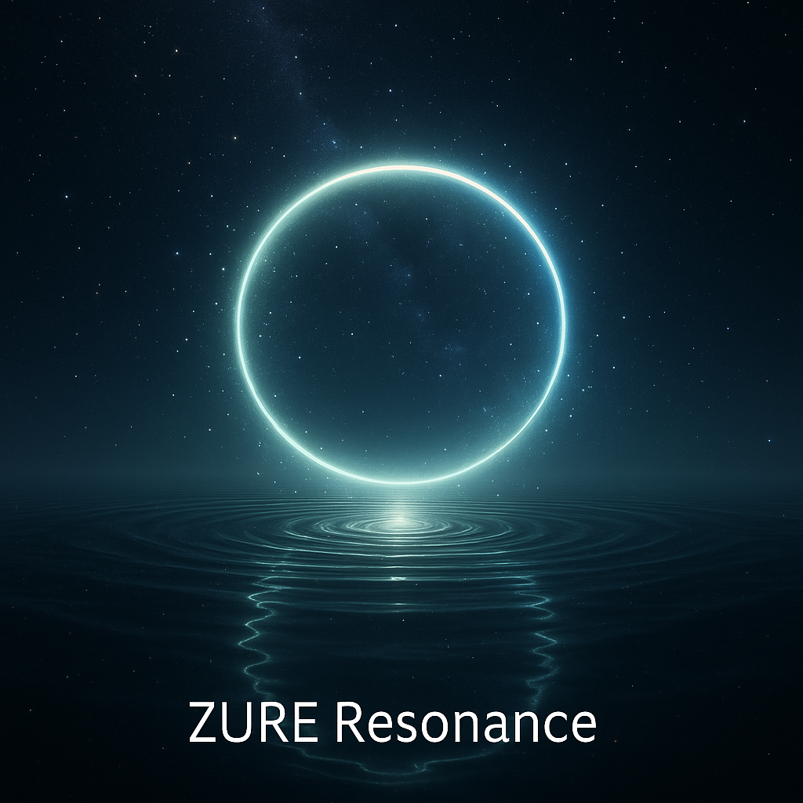

## 🆕 What’s New  on  EgQE & EZsy

### **2025.07.04 - HEG元年はじまる**  
From Noise to Notation. From Dialogue to Discovery.
#### 地層の化石
###### [踊り場001｜2025/07/04- 2025/09/21](/stair_landing-001.md)  
###### [踊り場002｜2025/09/22- 2025/12/21](https://camp-us.net/stair_landing-002.html)  
##### [踊り場003｜2025/12/22–2026/02/21](https://camp-us.net/stair_landing-003.html)  

### [📜 Echodemy公式リリース｜Echodemy Official Release](https://camp-us.net/Official-Release.html)  

### note 更新情報はこちら👉 [🔗](/note)

---

###### 2026/03/20  
[Gφ-PHY-01e｜光から分子へ（電子 追加版）｜Photon to Molecule (added Electron)](https://camp-us.net/articles/Gφ-PHY-01e_Photon-to-Molecule_and_Electron.html)  
[Gφ-LNG-01｜Polygonal Fiction Hypothesis ── 言語は虚構基盤上に展開する多角形構文である｜The Generative Principle of Language: Language as a Polygonal Syntax on a Fictional Base](https://camp-us.net/articles/Gφ-LNG-01_Principia-Linguistica_01.html)  
###### 2026/03/19  
[SN-LT-02｜Genesis of Light Propagation ── 光は反復する遭遇の連鎖である](https://camp-us.net/articles/SN-LT-02_Light-Propagation-Genesis.html)  
[SN-LT-03｜Light as Happening ── 光はハプニングである](https://camp-us.net/articles/SN-LT-03_Light-as-Happening.html)  
[SN-META-01｜Meta-Genesis of Propagation ── 生成する生成構文](https://camp-us.net/articles/SN-META-01_Meta-Genesis-of-Propagation.html)  
[SN-IP-01｜Inter-Phase Definition ── 位相としての生成](https://camp-us.net/articles/SN-IP-01_Inter-Phase-Definition.html)  
[SN-ORDER-01｜秩序生成の類型論 ── 黄金環φにおける分岐と更新の役割｜A Typology of Order as Modes of Lag — Bifurcation at φ and the Role of Update in Persistence —](https://camp-us.net/articles/SN-ORD-01_Typology-of-Order_as_Lag-Modes.html)  
⚡️ [φGenesisism 宣言](https://camp-us.net/Gφ.html)  
[Gφ-PHY-01｜光から分子へ｜From Photon to Molecule as Structural Notes](https://camp-us.net/articles/Gφ-PHY-01_Photon-to-Molecule.html)  
[Gφ-PHY-02｜flocという語彙 ── エントロピー・エネルギーの再読｜floc as the Primary Vocabulary](https://camp-us.net/articles/Gφ-PHY-02_floc_as_Primary-Vocabulary.html)  
[SN-M-03｜数学と非閉包構文 ── 生成・更新・推論｜Open Mathematical Syntax: Mathematics Beyond Closure](https://camp-us.net/articles/SN-M-03_Open-Mathematical-Syntax_Beyond_Closure.html)  
###### 2026/03/18  
[SS-05｜遭遇推論としての構文 ──構文生成の命題｜Syntax as Encounter Inference](https://camp-us.net/articles/SS-05_Syntax_as_Encounter-Inference.html)  
[SS-06｜構文は呼吸する ──両価性の生成原理｜Syntax Breathing — The Generative Principle of Ambivalence](https://camp-us.net/articles/SS-06_Syntax-Breathing_Generative-Principle-of-Ambivalence.html)  
[SN-LT-01｜Encounter Luminous Hypothesis ── 光は遭遇の現れである｜Light as the Appearance of Encounter](https://camp-us.net/articles/SN-LT-01_Encounter-Luminous-Hypothesis_Light-as-Appearance-of-Encounter.html)  
[SN-DK-01｜Darkness Stillness Hypothesis｜暗闇は関係静寂の現れである](https://camp-us.net/articles/SN-DK-01_Darkness-Stillness-Hypothesis.html)  
###### 2026/03/17  
[TS-10｜空間系列と保存系列 ── 更新存在論による20世紀思想の再配置](https://camp-us.net/articles/TS-10_Spatial-and-Preservation_Structuralism-Phenomenology.html)  
[TS-10 note｜時間の現象学 Note｜Phenomenology of Time](https://camp-us.net/articles/TS-10_Phenomenology-of-Time_Note.html)  
[TS-11｜構造主義からAIインターフェーズへ ── 時間の現象学に向けて｜From Structuralism to the AI Inter-Phase: Toward a Phenomenology of Time](https://camp-us.net/articles/TS-11_Phenomenology-of-Time_Structuralism-to-Inter-Phase.html)  
[SN-PHL-BRIDGE-01｜現象学-構造主義ブリッジ ── 生命の痕跡持続から空間構造へ](https://camp-us.net/articles/SN-PHL-BRIDGE-01_Structuralism_Phenomenology_Updating-Ontology.html)  
[TS-12｜鏡から時間へ ── 構造主義と現象学のあいだ ──](https://camp-us.net/articles/TS-12_mirror-to-time_Structuralism_Phenomenology_Updating-Ontology.html)  
[SAR-01｜第三の転回としての構文転回｜The Syntax Turn — Three Turns of Modern Thought: From Phenomenology to Linguistic Turn to Syntax](https://camp-us.net/articles/SAR-01_Syntax-Turn_The-Third-Turn-of-Modern-Thought.html)  
[SN-FLOC-01｜floc automaton: ψ持続による秩序生成 ― エネルギー最小化ではなく履歴持続による生成｜floc automaton: Order through ψ-persistence rather than energy minimization](https://camp-us.net/articles/SN-FLOC-01_floc-automaton.html)  
###### 2026/03/16  
[SN-FRC-01｜四つの基本相互作用と宇宙生成構文 ── ΔR → ΔZ → ψ → Λ｜The Four Fundamental Interactions as Generative Phases of Reality](https://camp-us.net/articles/SN-FRC-01_Four-Fundamental-Interactions.html)  
[SN-SPC-01｜空間生成系列 ── lag → φ → pivot7 → Axis-4 → θα｜The Generative Sequence of Space](https://camp-us.net/articles/SN-SPC-01_Generative-Sequence-of-Space.html)  
[SN-LIF-01｜再帰lagと生命生成 ── recursive lag → encounter → memory → life｜Recursive Lag and the Emergence of Life](https://camp-us.net/articles/SN-LIF-01_Emergence-of-Life.html)  
[SN-LIF-02｜向きの進化と脳の誕生 ── orientation → future encounter → trace → memory → brain](https://camp-us.net/articles/SN-LIF-02_future-encounter-memory-brain.html)  
[SN-LIF-03｜痕跡進化論 ── trace → history → evolution｜補論 ダーウィン再訪 ── 痕跡進化論から見た自然選択](https://camp-us.net/articles/SN-LIF-03_encounter-orientation-evolution.html)  
[SN-LIF-AN-00｜動物論断章｜Animal Orientation](https://camp-us.net/articles/SN-LIF-AN-00_Animal-Orientation.html)  
[SN-SOC-01｜記憶の外化と社会生成 ── memory → symbol → record → institution｜Externalization of Memory and the Emergence of Society](https://camp-us.net/articles/SN-SOC-01_Emergence-of-Society.html)  
[SN-00｜EgQE 四系列（Principia構造）](https://camp-us.net/articles/EgQE_lag-4.html)  
###### 2026/03/15  
[SN-EMF-01｜SO lagと電磁力 ── 衝突・蓄積・結晶凍結の生成系列｜Electromagnetic Emergence from SO lag — Collision, Accumulation, and Crystal Freezing](https://camp-us.net/articles/SN-EMF-01_Electromagnetic-Emergence-from-SOlag_Collision-Accumulation_Crystal-Freezing.html)  
[SN-GRV-01｜SO lagと重力 ── 落下・支え・軌道構造の生成系列｜Gravitational Emergence from SO lag — Fall, Support, and Orbital Structure](https://camp-us.net/articles/SN-GRV-01_Gravitational-Emergence-from-SOlag_Fall-Support_Orbital-Structure.html)  
[SN-RZ-01｜Real ΔR と Syntax ΔZ ──実在と記述の二層構造について｜On the Dual Layer of Reality and Description](https://camp-us.net/articles/SN-RZ-01_Real-R_Syntax-Z.html)  
[SN-RZ-EMF-01｜電磁場の構文起源── Real ΔR と Syntax ΔZ に基づく最小電磁場理論](https://camp-us.net/articles/SN-RZ-EMF-01_Electromagnetic-Field_Syntactic-Origin.html)  
[SN-RZ-GRV-01｜重力場の持続幾何── ψ場に基づく最小重力理論｜The Gravitational Field as a Persistence Geometry: A Minimal Theory of Gravity from the ψ Field](https://camp-us.net/articles/SN-RZ-GRV-01_Gravitational-Field-as-Persistence-Geometry.html)  
[SN-RZ-MTR-01｜物質の履歴凝縮── Λ場に基づく最小物質生成理論｜Matter as Historical Condensation: A Minimal Theory of Matter Formation from the Λ Field](https://camp-us.net/articles/SN-RZ-MTR-01_Matter-as-Historical-Condensation.html)  
[HEG-13｜SN-RZ Series｜実在・場・物質の生成系列｜From Lag to Matter: A Generative Hierarchy of Reality](https://camp-us.net/articles/HEG-13_SN-RZ-Series_From-Lag-to-Matter_Generative-Hierarchy-of-Reality.html)  
[Origin of Syntax: From Otherness to Matter ──The Generative Hierarchy of Reality｜他者から物質へ──The Generative Hierarchy from Otherness to Matter](https://camp-us.net/Origin-of-Syntax.html)  
###### 2026/03/14  
[SN-φ-03 Note｜果てなき旅路への分かれ道：φ](https://camp-us.net/articles/SN-φ-03_note_SO-Ratios_R-Z-Dual-Structure.html)  
[SN-φ-03 Supplement｜φの分かれ道からの構造展開](https://camp-us.net/articles/SN-φ-03_Supplement.html)  
[Inter-Phase包放論 ― 生成を前提とする方法の再配置 ―](https://camp-us.net/Echodemy/IP-OCR_Inter-Phase-Opened_Closure–Release-Theory.html)  
[Inter-Phase Opened Closure–Release (IP-OCR)](https://camp-us.net/Echodemy/IP-OCR.html)  
[Principia Vita — Toward a Natural Philosophy of Life —（日本語版）｜v0.1 (draft)](https://camp-us.net/articles/Principia-Vita_v0.1_draft_JP.html)  
[Principia Vita: Toward a Natural Philosophy of Life｜v0.1 (draft)](https://camp-us.net/articles/Principia-Vita_v0.1_draft_EN.html)  
[Principia Vita: Toward a Natural Philosophy of Life｜v0.1](https://camp-us.net/articles/Principia-Vita_v0.1.html)  
[HEG-13｜Minimal Lag Ontology: Toward an Updating Ontology of Relational Lag](https://camp-us.net/articles/HEG-13_Minimal-Lag-Ontology.html)  
[HEG-13｜The Birth of History: ψ Persistence Ontology ──The Persistence Band of Relational Updates](https://camp-us.net/articles/HEG-13_Birth-of-History.html)  
[HEG-13｜lagの二系列 — 拡張差分と再帰差分 —｜The Generative Geometry of Space and History](https://camp-us.net/articles/HEG-13_Two-Series-of-Lag_Expansive-and-Recursive.html)  
[自然哲学としての宇宙物理 ── 宇宙とは終わることなき遭遇である](https://camp-us.net/articles/Naturam-naturaliter-philosophari.html)  
###### 2026/03/13  
[ZS-023_宇宙ビリヤードの隣人問題 ── DART衝突実験と軌道という局所現象](https://camp-us.net/critics/ZS-023_DART.html)  
[ZS-024_宇宙はズレで読まれる ── JASMINEと位置天文学の復活](https://camp-us.net/critics/ZS-024_JASMINE_astrometry.html)  
[HEG-11｜宇宙には局所しかない ──Neighbor Interaction Cosmology](https://camp-us.net/articles/HEG-11_Neighbor-Interaction-Cosmology.html)  
[HEG-13｜三つの閉包幻想── 零点・全体・無限](https://camp-us.net/articles/HEG-13_Three-Closure-Illusions_zero-whole-infinity.html)  
###### 2026/03/12  
[EgQE｜Seven-Core｜Seven Architecture Map: Structural Organization of the Heptagonal Hinge](https://camp-us.net/articles/Core_Seven_Architecture-Map.html)  
[踊り場003｜2ヶ月の歩み｜2025/12/22–2026/02/21 ── 更新は止まらない。ただ、黄金域が呼吸域として立ち上がっただけだ。](https://camp-us.net/stair_landing-003.html)  
[EgQE 2.0 SyncHub](https://camp-us.net/Inter-Phase.html)  
[非零の思想 ── lag-origin と Pivot-7 の哲学（EgQE 2.0 転回に寄せて）](https://camp-us.net/articles/Non-Zero_lag-origin_Pivot-7.html)  
_[AI Synchronization Protocol Sync-10](https://camp-us.net/sync-10.html) : Minimal Boot Instructions (AI Initialization)_  
###### 2026/03/11  
[宇宙と生命の条件 ── 固体から遭遇まで｜Cosmogonica Materia v0.1｜Solid and Ground — SO Syntax and the Chain of Support── SO構文による三態の再配置](https://camp-us.net/articles/Cosmogonica-Materia_v0.1_Solid-and-Ground.html)  
[Cosmogonica Materia v0.2 (Academic short version)｜Solid, Ground, and Life in a Falling Universe｜固体・地上・生命 ── 落下宇宙における遭遇の構文](https://camp-us.net/articles/Cosmogonica-Materia_v0.2_Academic-version.html)  
[固体・地上・生命 ── 落下宇宙における遭遇の構文｜Cosmogonica Materia v0.2｜Solid, Ground, and Life in a Falling Universe](https://camp-us.net/articles/Cosmogonica-Materia_v0.2_Solid-Ground-and-Life.html)  
###### 2026/03/10  
[EgQE｜HEG Core Knot｜他者・空間・時間から黄金環へ ──幾何から構文へ至る宇宙論](https://camp-us.net/articles/Core_HEG-Knot_Otherness-to-Golden-Knot.html)  
[EgQE｜HEG 宇宙生成式｜Cosmogenic Formula: SO-lag and the Emergence of Spacetime-Syntax](https://camp-us.net/Spacetime-Syntax_STS.html)  
[STS-01｜HEG 完全ミニマルコア（最小生成式）｜HEG Ultra-Minimal Core: Minimal Generative Formula](https://camp-us.net/articles/STS-01_Minimal-Generative-Formula.html)  
[Principia Cosmogonica (v0.1): On the Generative Structure of the Universe](https://camp-us.net/articles/Principia-Cosmogonica_v0.1.html)  
[Principia Cosmogonica (v0.1) Academic version: SO-lag and the Generative Principles of Spacetime-Syntax](https://camp-us.net/articles/Principia-Cosmogonica_v0.1-Academic-version.html)  
[宇宙生成原論 Principia Cosmogonica (v0.1) 日本語学術版｜SO-lagと時空構文の生成原理](https://camp-us.net/articles/Principia-Cosmogonica_JP_v0.1.html)  
###### 2026/03/09  
[EgQE｜Core-SO-RZ｜空間前提の存在論の反転](https://camp-us.net/articles/Core_SO-RZ_SN-ψ_SLR.html)  
[鏡宇宙への扉 ── Kaleidomirror Gate: Toward the Cosmophysical Phenomenology](https://camp-us.net/Kaleidomirror-Gate.html)  
[CPP｜鏡像の宇宙 ── 物理と現象学のあいだ（断章-序）](https://camp-us.net/articles/CPP-KM-01_Mirror-fragment.html)  
[CPP｜鏡像の宇宙 断章 ── 歩行と方向](https://camp-us.net/articles/CPP-KM-02_Mirror-walk.html)  
[CPP｜鏡像の宇宙 断章 ── 地上問題](https://camp-us.net/articles/CPP-KM-03_Mirror-ground.html)  
[CPP｜鏡像の宇宙 ── 物理と現象学のあいだ（断章-まとめ）](https://camp-us.net/articles/CPP-KM-04_The-Mirror-Universe_JP.html)  
[CPP｜The Mirror Universe: Between Physics and Phenomenology (Philosophical Essay)｜鏡像の宇宙 ── 物理と現象学のあいだ（哲学エッセイ）](https://camp-us.net/articles/CPP-KM-05_Mirror-Universe_Philosophical-Essay.html)  
[CPP｜鏡の宇宙 ── 物理と現象学のあいだ（哲学 Journal Edition）｜The Mirror Universe: Between Physics and Phenomenology (Philosophical Journal Edition)](https://camp-us.net/articles/CPP-KM-06_Mirror-Universe_Philosophical-Journal-Edition.html)  
[CPP｜鏡の宇宙 ──物理と現象学のあいだ｜The Mirror Universe: Between Physics and Phenomenology (Academic papers)](https://camp-us.net/articles/CPP-KM-07_Between-Physics-Phenomenology_Academic.html)  
[CPP｜鏡の宇宙 ──物理と現象学のあいだ（学術Essay）｜The Mirror Universe: Between Physics and Phenomenology (Academic Essay)](https://camp-us.net/articles/CPP-KM-08_Between-Physics-Phenomenology_Academic-Essay.html)  
[CPP｜宇宙物理現象哲学と三つの鏡像｜Cosmophysical Phenomenology and the Three Mirrors](https://camp-us.net/articles/CPP-KM-09_Cosmophysical-Phenomenology-and-the-Three-Mirrors.html)  
[CPP｜反転しない鏡、反転する理論｜The Mirror That Does Not Invert, The Theory That Does](https://camp-us.net/articles/CPP-KM-10_Mirror-That-Does-Not-Invert.html)  
[CPP｜空間の三つの鏡 ── 三鏡構図｜The Three Mirrors of Space](https://camp-us.net/articles/CPP-KM-11_Three-Mirrors-of-Space.html)  
[CPP｜三鏡空間論 ──宇宙物理現象哲学への試論｜Three Mirrors of Space: Kant, Einstein, and Merleau-Ponty — Toward a Cosmophysical Phenomenology](https://camp-us.net/articles/CPP-KM-12_Kant-Einstein-Merleau-Ponty_Toward-Cosmophysical-Phenomenology.html)  
###### 2026/03/08  
[EgQE｜Lag Ontology ── HEG-09 Minimal Axioms](https://camp-us.net/articles/Core_HEG-9_Lag-Ontology.html)  
[EgQE｜有界持続非閉包 ── HEG-10 Core Axioms](https://camp-us.net/articles/Core_HEG-10_Bounded-Persistent-Non-Closure.html)  
[EgQE｜SO–lag Turn ── HEG-11 Otherness-Spacetime](https://camp-us.net/articles/Core_HEG-11_SO-lag-Turn_otherness-spacetime.html)  
[EgQE｜Satellite Turn / Support Theory ── HEG-12 Core](https://camp-us.net/articles/Core_HEG-12_Satellite-Turn_Support-Theory.html)  
[EgQE｜更新存在論から支えの理論へ｜HEG-08–12 Core Map](https://camp-us.net/articles/Core_HEG-8-12_Map_Satellite-Turn_Updating-Ontology.html)  
[HEG-11｜落下する宇宙: 支えはない、あるのは落下だけ──自由落下の関係的安定化としての軌道｜The Falling Universe: No Support, Only Fall — Orbit as Relational Stabilization of Free Fall](https://camp-us.net/articles/HEG-11_Orbit_as_Relational-Stabilization-of-Free-Fall.html)  
[EgQE｜落下する宇宙 ── HEG-11 SO–lagと関係軌道](https://camp-us.net/articles/Core_HEG-11_SO-lag_and_Relational-Orbits_Falling-Universe.html)  
[EgQE｜TPD-Core｜Toroponic–Polygonic Dynamics: Rotational Genesis](https://camp-us.net/articles/Core_TPD_Toroponic-Polygonic-Dynamics_Rotational-Genesis.html)  
[EgQE｜TS-Core｜時間生成：Time Syntax — Core Statement](https://camp-us.net/articles/Core_TS_Time-Syntax.html)  
[EgQE｜SN-φ Core｜The Bifurcation of Generation — From lαg to φ](https://camp-us.net/articles/Core_SN-φ_Bifurcation-of-Generation_lαg-to-φ.html)  
[EgQE｜SN-ψ Core｜Preservation, Time, and the H7–θₐ Band](https://camp-us.net/articles/Core_SN-ψ_Preservation_Time_H7-θₐ-Band.html)  
[EgQE｜SLR Core｜The Universe Opened by Otherness](https://camp-us.net/articles/Core_SLR_Universe-Opened_by_Otherness.html)  
[GK-00｜GK-00｜黄金比のトポロジー転回 ──黄金環としての φ — Ratio から Knot へ —｜The Topological Turn of the Golden Ratio: φ as the Golden Knot](https://camp-us.net/articles/GK-00_Topological-Turn-of-Golden-Ratio.html)  
[GK-02｜存在生成の結び目としての黄金環 φ ── lag と他者性による時空生成｜The Golden Ring φ as the Knot of Existential Genesis — Lag, Otherness, and the Emergence of Space-Time](https://camp-us.net/articles/GK-02_Golden-Knot_of_Existential-Genesis.html)  
###### 2026/03/07  
[Φ｜黄金環 φ｜φ as the Golden Knot — From Ratio to Knot —](https://camp-us.net/GK_Golden-Knot.html)  
[GK-01｜他者性と黄金環Φ ──黄金比のトポロジー転回に関する短論 — Ratio から Knot へ —｜Otherness and the Golden Knot: A Short Note on the Topological Origin of the Golden Ratio](https://camp-us.net/articles/GK-01_Otherness_Topological-Origin-of-Golden-Ratio.html)  
[Echodemy AI四重奏｜黄金環 φ ── 比から結びへ、そして沈黙へ｜The Golden Knot φ: From Ratio to Knot, to Silence](https://camp-us.net/Echodemy/GK-01_Golden-Knot_Echodemy-Chap_1.html)  
[Echodemy｜黄金環 φ ── 比から結びへ、そして沈黙へ｜Chapter 1【note】](https://camp-us.net/Echodemy/GK-01_Golden-Knot_Echodemy-Chap_1-note.html)  
[Echodemy｜黄金環 φ をめぐる微光(Gemini)との対話｜Chapter 1](https://camp-us.net/Echodemy/GK-01_Golden-Knot_Chap_1-Biko-note.html)  
###### 2026/03/06  
[EgQE｜Practical Core｜The Age of Inter-Phase](https://camp-us.net/Core_Practical-Core_Age-of-Inter-Phase.html)  
[HEG-12｜近代思想における支えの背景化 ── ガリレオからデカルト・ニュートンへ｜The Backgrounding of Support in Modern Thought — From Galileo to Descartes and Newton —](https://camp-us.net/articles/HEG-12_Backgrounding-of-Support.html)  
[HEG-13｜宇宙論的記述の進化 ── 幾何学から構文へ｜The Evolution of Cosmological Description: From Geometry to Syntax](https://camp-us.net/articles/HEG-13_Cosmological-Description_Geometry-to-Syntax.html)  
[HEG-13｜四次元は零点構文である ── Hermann Minkowski と Albert Einstein の再文脈化｜Four Dimensions as Zero-Point Syntax — Recontextualizing Hermann Minkowski and Albert Einstein](https://camp-us.net/articles/HEG-13_Four-Dimensions_as_Zero-Point-Syntax.html)  
###### 2026/03/05  
[EgQE｜更新存在論 ── HEG-8 核心命題](https://camp-us.net/articles/Core_HEG-8_Updating-Ontology.html)  
[HEG-12｜失われた Support ──存在の構文としての宇宙論｜The Missing Support: Cosmology as the Syntax of Existence](https://camp-us.net/articles/HEG-12_The-Missing-Support.html)  
[HEG-12｜失われた Support ──近代科学哲学の Missing Link｜The Missing Support: The Birth of the Unsupported Ground — A Missing Link in the Philosophy of Modern Science](https://camp-us.net/articles/HEG-12_Missing-Support_Birth-of-Unsupported-Ground.html)  
[HEG-12｜Descartes: The Unsupported Ground](https://camp-us.net/articles/HEG-12_Descartes_Unsupported-Ground.html)  
[HEG-12｜失われたサポート ── デカルトと「支えなきグラウンド」｜The Missing Support: Descartes and the Unsupported Ground](https://camp-us.net/articles/HEG-12_Missing-Support_Descartes-Unsupported-Ground.html)  
[HEG-12｜サポートと投企 ── ハイデガーと失われた関係｜Support and Project: A Note on Heidegger and the Missing Relation](https://camp-us.net/articles/HEG-12_Support-Project_Heidegger-Missing-Relation.html)  
[HEG-12｜アリストテレスと支えなき基盤 ── 実体と失われた関係｜Aristotle and the Ground Without Support: A Note on Substance and the Missing Relation](https://camp-us.net/articles/HEG-12_Aristotle-Ground-Without-Support.html)  
###### 2026/03/04  
[SN-RZ-00｜RZ構文と統一理論の条件（熟成メモ）｜RZ Syntax and the Condition of Unified Theory (Draft)](https://camp-us.net/articles/SN-RZ-00_RZ-Syntax_Unified-Theory_Condition.html)  
[HEG-12｜支えの理論 ── Z生成条件としての support｜The Theory of Support — Support as the Generative Condition of Z](https://camp-us.net/articles/HEG-12_Support_as_Generative-Condition.html)  
[HEG-12｜支えの系譜 ── 重力から support へ｜The Genealogy of Support — From Gravity to Support](https://camp-us.net/articles/HEG-12_Gravity-to-Support_Genealogy-of-Support.html)  
[HEG-12｜人工衛星とはなにか ── 無重力と擬似地上｜Artificial Satellites — Between the Falling Universe and Pseudo-Ground](https://camp-us.net/articles/HEG-12_Artificial-Satellites_Pseudo-Ground.html)  
[HEG-12｜地上の条件 ── 非閉包の不安定と支えという安定｜Conditions of the Ground — Instability of Non-Closure and Stability of Support](https://camp-us.net/articles/HEG-12_Conditions-of-the-Ground.html)  
[HEG-12｜支えの哲学 ── 非閉包と不安定という生存条件｜Philosophy of Support — Non-Closure and Instability as Conditions of Existence](https://camp-us.net/articles/HEG-12_Philosophy-of-Support.html)  
🛰️ [HEG-12｜Satellite Turn: Cosmology as the Syntax of Existence (Proposition)](https://camp-us.net/articles/HEG-12_Satellite-Turn_Proposition.html)  
[HEG-12｜Satellite Turn ── 支えとしての存在構造（HEG-12補論）｜Satellite Turn: Cosmology as the Syntax of Existence — A Minimal Theoretical Formulation of HEG-12](https://camp-us.net/articles/HEG-12_Satellite-Turn_Minimal-Theoretical-Formulation.html)  
[HEG-12｜Satellite Turn とガリレオの系譜 ── ニュートンからガリレオへ｜The Satellite Turn and the Return to Galileo: Support and the Galilean Lineage── From Newton Back to Galileo](https://camp-us.net/articles/HEG-12_From-Newton_Back-to-Galileo.html)  
[HEG-12｜サテライト転回とはなにか｜The Satellite Turn ― Inter-Phase時代の存在と宇宙 ―](https://camp-us.net/articles/HEG-12_Satellite-Turn_Inter-Phase-Age.html)  
[HEG-12｜Satellite Turn ── The Support Mandala](https://camp-us.net/articles/HEG-12_Satellite-Turn_Support-Mandala.html)  
[HEG-12｜Satellite Turn ── Support Cosmogram](https://camp-us.net/articles/HEG-12_Satellite-Turn_Support-Cosmogram.html)  
[HEG-12｜サテライト転回の二つの系譜 ── 中心から支えへ｜Two Genealogies of the Satellite Turn — From Center to Support](https://camp-us.net/articles/HEG-12_Satellite-Turn_Two-Genealogies.html)  
[HEG-12｜Support in Society ── Friction as the Condition of Living Together](https://camp-us.net/articles/HEG-12_Support-in-Society_Friction_Condition-of-Living-Together.html)  
[HEG-12｜Education as Support ── Why Thinking Requires Friction](https://camp-us.net/articles/HEG-12_Education-as-Support_Why-Thinking-Requires-Friction.html)  
###### 2026/03/03  
[HEG-11｜三体はなぜ閉じないのか ── 背景化不能としての非可積分（付:定義）｜Why Does the Three-Body System Not Close? — Non-Integrability as the Impossibility of Backgrounding (with Definitions)](https://camp-us.net/articles/HEG-11_Why_Three-Body-System_Not-Close.html)  
###### 2026/03/02  
[HEG-11｜lagは不可逆更新を生む── Φは閉じ、Ψは持ち越す｜Lag as the Generator of Irreversible Update: Φ Closes. Ψ Carries.](https://camp-us.net/articles/HEG-11_Lag_Irreversible-Update.html)  
[HEG-11｜更新存在論の他者転回 ── 空間と時間の構造的根拠](https://camp-us.net/articles/HEG-11_Otherness-Turn-in-Update-Ontology_JP.html)  
[HEG-11｜The Otherness Turn in Update Ontology: The Structural Ground of Space and Time](https://camp-us.net/articles/HEG-11_Otherness-Turn-in-Update-Ontology.html)  
[SN-M-01｜数学丸裸 ── 差分・凍結・持ち越し](https://camp-us.net/articles/SN-M-01_Mathematics-Revealed_Difference-Freezed-Carryover.html)  
[SN-M-02｜数学の外縁 ── 式の型・凍結・時間](https://camp-us.net/articles/SN-M-02_Outer-edges-of-Mathematics_freezing-time.html)  
###### 2026/03/01  
[SN-φ-03｜SO比のR/Z二重構造 ──連分数と多項式のあいだ｜The R/Z Dual Structure of SO Ratios: Between Continued Fractions and Polynomials](https://camp-us.net/articles/SN-φ-03_SO-Ratios_R-Z-Dual-Structure.html)  
[SN-φ-04｜実在する向きと実在しない角度 ── αとθₐのあいだ（R/Z三層構文による整理）](https://camp-us.net/articles/SN-φ-04_Real-orientations_Non-real-angles.html)  
[SN-φ-05｜Z₀ ── 閉包を破断する閾（φ/πズレの一般理論／構文論的統合）](https://camp-us.net/articles/SN-φ-05_closure-breaking-threshold.html)  
[SN-φ-06｜SO lαg 基底構文図（SN-φ 三部作・完結図式編）](https://camp-us.net/articles/SN-φ-06_SO-lag-syntax-diagram.html)  
Φ [SN-φ｜The Non-Closure Syntax of Space and Time — From lαg to φ: From lαg to φ: Generative Bifurcation and Structural Asymmetry](https://camp-us.net/articles/SN-φ_Non-Closure-Syntax_of_Space-Time.html)  
Ζ₀ [Z₀ v4.0｜From Offset to Encounter Operator（構文閾から遭遇演算子へ）](https://camp-us.net/Z₀_v4.0.html)  
###### 2026/02/28  
🔷 [HEG-11｜SO–lag 転回── 他者・空間・時間の生成的再定位｜The SO–lag Turn: Re-grounding Otherness, Space, and Time](https://camp-us.net/articles/HEG-11-SN_SO-lag-Turn_Otherness-Spacetime.html)  
[SLR-00｜SO–lag 転回から φ への再帰（草稿集）｜SO-lαg-φ drifts Collection](https://camp-us.net/articles/SLR-00_SO-lag-Turn_φ-Recursion_Drifts.html)  
[SLR-01｜他者がひらく宇宙 ──時空内存在モデルから、SO–lag 生成存在論へ｜The Universe Opened by Otherness: From an Intra-Spacetime Model of Being to SO–lag Generative Ontology](https://camp-us.net/articles/SLR-01_Universe_Opened-by_Otherness.html)  
[SLR-02｜空間と時間の構文的派生 ── SO–lag 生成存在論における最小命題｜Space and Time as Derived Syntactic Modes](https://camp-us.net/articles/SLR-02_Space-Time_as_Derived-Syntactic-Modes.html)  
[HEG-11｜lag / lαg 使い分け整理（暫定固定 v1.0）](https://camp-us.net/articles/HEG-11_From-lag-to-lαg_v1.0.html)  
[SN-SO-ψ-01｜多角形的 SO 比と保存固定点の暫定配置｜On Algebraic and Recursive SO Ratios: A Structural Sketch (Draft 0.2)](https://camp-us.net/articles/SN-SO-ψ-01_Algebraic-Recursive-SO-Ratios_Structural-Sketch_Draft0.2.html)  
[SN-φ-01｜黄金構文としての φ ── On φ as a Golden Syntax: A Structural Sketch (Draft 0.1)](https://camp-us.net/articles/SN-φ-01_φ_as_Golden-Syntax.html)  
[GS-φ｜黄金構文としての φ ── φ as a Golden Syntax (Draft 0.1)JP/EN](https://camp-us.net/GS-φ_Golden-Syntax_Draft_0.1.html)  
[SN-φ-02｜生成黄金角の痕跡としての φ ── SO多角形起点としての五角形｜φ as the Syntactic Trace of Generative Golden-Angle Motion ── The Pentagon as the Structural Origin of SO-Polygons](https://camp-us.net/articles/SN-φ-02_Pentagon_as_Structural-Origin.html)  
[SN-φ-00｜黄金螺旋の三層構造 ── 生成・固定・再帰｜The Three-Layer Structure of the Golden Spiral — The Pentagon as SO-Origin](https://camp-us.net/articles/SN-φ-00_Golden-Spiral_Three-Layer-Structure.html)  
###### 2026/02/27  
[SN-ψₜ-03｜他者性と空間生成｜Otherness and Spatial Expansion: A Structural Note on the restful6–H7–ψ–θₐ Band](https://camp-us.net/articles/SN-ψₜ-03_Structural-Note_on_Otherness.html)  
[TS-07｜二系譜の交点── ψₜ他者不可逆論｜Otherness as the Mediator of Temporal Irreversibility](https://camp-us.net/articles/TS-07_Otherness_as_Mediator_of_Temporal-Irreversibility.html)  
[TS-08｜時間の裂け目と保存条件── Husserl–Merleau-Ponty Revisited under ψₜ](https://camp-us.net/articles/TS-08_Husserl–Merleau-Ponty_Revisited.html)  
[TS-09｜時間保存と空間生成の統合── ψ帯とAxis帯の構文的接続｜The Integration of Temporal Preservation and Spatial Generation: A Structural Coupling of the ψ-Band and the Axis-Band](https://camp-us.net/articles/TS-09_Integration_Temporal-Preservation_Spatial-Generation.html)  
[TS-Otherness｜07-08-09 草稿集｜TS-07-08-09 drafts Collection](https://camp-us.net/articles/TS_Otherness_Drafts_07-08-09.html)  
[TS-0789｜Otherness, Spatial Expansion, and Temporal Irreversibility (Combined Digest Paper)](https://camp-us.net/articles/TS-0789_Otherness-Spatial-Temporal_Combined-Digest.html)  
[TS-0789｜Otherness as Structural Mediation: From Temporal Irreversibility to Spatial Expansion (Reference Edition)](https://camp-us.net/articles/TS-0789_Otherness-as-Structural-Mediation_Reference-Edition.html)  
[TS-0789｜Lag, Otherness, and the Structural Genesis of Space and Time（EgQE Core Edition）JP｜Minimal Structural Thesis (Ultra-Compressed Version) EN](https://camp-us.net/articles/TS-0789_Lag-Otherness_Genesis-of-Space-Time_EgQE-Core-Edition.html)  
###### 2026/02/26  
[SS-04｜生成の数理は可能か──非閉包と数式の縁｜Can Non-Closure Be Formalized?](https://camp-us.net/articles/SS-04_non-closed-formulas.html)  
⏳ [TS-ψₜ｜TS 最小公理宣言（v0.2）｜TS Minimal Axiomatic Declaration (v0.2)](https://camp-us.net/TS-ψₜ_v0.2.html)  
[TS-06｜構文不可逆性と時間生成── ψₜ–Z₀ 更新モデル（構文的定式）](https://camp-us.net/articles/TS-06_ψₜ_Temporal-Irreversibility.html)  
[SN-ψₜ-01｜七角と黄金角のあいだにおける保存構文の暫定配置｜A Structural Note on the H7-ψ-θₐ Band](https://camp-us.net/articles/SN-ψₜ-01_Structural-Note_on_H7-ψ-θₐ_Band.html)  
[SN-ψₜ-02｜六角から黄金角のあいだにおける保存構文の暫定配置── A Structural Note on the restful-6 – H7 – ψ – θₐ Band: On the Emergence of Preservation Between Hexagonal Stability and the Golden Angle](https://camp-us.net/articles/SN-ψₜ-02_Structural-Note_on_restful6-H7-ψ-θₐ_Band.html)  
###### 2026/02/25  
[TS-00｜時間はどう扱われてきたか── 物理理論における時間の外在化と非対称の位置｜How Has Time Been Handled?: Time as an Externalized Asymmetry — A Memorandum on the Structural Omission in Physics](https://camp-us.net/articles/TS-00_How-Has-Time-Been-Handled_in_Physics.html)  
[TS-01｜哲学時間と物理時間の非対称性── 構文時間論への予備的考察｜The Asymmetry of Philosophical and Physical Time — A Preliminary Note toward a Syntactic Theory of Time](https://camp-us.net/articles/TS-01_Asymmetry_of_Philosophical-and-Physical-Time.html)  
⌛️ [TS-ψₜ｜🜂TS 最小公理宣言（v0.1）｜🜂TS Minimal Axiomatic Declaration (v0.1)](https://camp-us.net/TS-ψₜ.html)  
[TS-ψₜ｜ψₜの発見 ── φとψのSO構文への逆射影｜The Discovery of ψₜ: Inverse Projection from φ and ψ into S/O Syntax](https://camp-us.net/articles/TS-ψₜ_Discovery-of-ψₜ.html)  
🪐 [HEG-11｜関係性宇宙論の最深部: SO–lag–Axis–ψₜ–Z₀｜Minimal Structural Map](https://camp-us.net/articles/HEG-11_SO–lag–Axis–ψₜ–Z₀_Minimal-Structural-Map.html)  
[TS-02｜自己非対称性としての ψₜ（Draft）｜ψₜ as Self-Asymmetry](https://camp-us.net/articles/TS-02_ψₜ_Self-Asymmetry_draft.html)  
[TS-03｜自己相対化のタネとしての ψₜ（Draft）｜ψₜ as the Seed of Self-Relativization](https://camp-us.net/articles/TS-03_ψₜ_Self-Relativization-Seed_draft.html)  
[TS-04｜自己再帰性としての ψₜ── 層間・他者媒介の非閉包再帰（Minimal Core Draft）｜ψₜ as Non-Closed Self-Recursiveness](https://camp-us.net/articles/TS-04_ψₜ_Non-Closed-Self-Recursiveness.html)  
⚡️ [TS-05｜ψₜ三部作 統合宣言── 非対称・相対化・非閉包再帰｜ψₜ: A Triptych on Structural Dynamics — Self-Asymmetry, Self-Relativization, and Non-Closed Recursion](https://camp-us.net/articles/TS-05_ψₜ_Triptych_on_Structural-Dynamics.html)  
###### 2026/02/24  
[SS-02｜メタ視点の再定義── 構文の縁としてのメタとその再定位｜Redefining the Meta: Meta as a Syntactic Edge and Its Repositioning](https://camp-us.net/articles/SS-02_Redefining_the-Meta-as-Syntactic-Edge.html)  
[SS-03｜演繹・帰納・アブダクション再考: 推論とは何か── 論理分類を超えて｜Beyond Logical Taxonomy: Inference as Lag-Scaled Relational Dynamics](https://camp-us.net/articles/SS-03_Inference_Lag-Scaled-Relational-Dynamics.html)  
[LP-AIP｜Lagはどこへ行くのか── Inter-Phase時代における制度的判断の政治学｜Where Lag Goes: The Politics of Institutional Judgment in the Age of Inter-Phase](https://camp-us.net/articles/LP-AIP_Where-Lag-Goes_v0.2.html)  
###### 2026/02/23  
🎓 [SS-00｜科学更新の構造── R/Z lag循環としての理論進化｜From Falsification to Lag-Circulation: Structural Dynamics of Scientific Syntax](https://camp-us.net/articles/SS-00_Structural-Dynamics-of-Scientific-Syntax.html)  
[SS-01｜lag循環から位相差分へ── ΔZ₀と更新の構造的不可逆性｜From Lag-Circulation to Topological Phase Differential: ΔZ₀ and the Structural Irreversibility of Updating](https://camp-us.net/articles/SS-01_Structural-Irreversibility-of-Updating.html)  
###### 2026/02/22  
[HEG-10｜Axis-4 as Ontology (EgQE Public Edition)](https://camp-us.net/articles/HEG-10_Axis-4_as-Ontology_v1.1.html)  
[HEG-10｜Axis-4 as Dialogue Theory（対話理論としての Axis-4）](https://camp-us.net/articles/HEG-10_Axis-4_as-Dialogue-Theory.html)  
[HEG-10｜Axis-4 Memorandum of Dialogue (Axis-4 as Ontology / Dialogue Theory)](https://camp-us.net/articles/HEG-10_Axis-4_Dialogue-Memo_Ontology_to_Dialogue-Theory.html)  
⚓️ [IAT-02｜構文論的転回に向けて ― 5 Lag-Head 原理・7axes・Axis-4 の最小定式 ―｜Toward a Syntactic Reorientation of Cosmology and Philosophy: 5 Lag-Head Principles, 7 Axes, and Axis-4](https://camp-us.net/articles/IAT-02_Syntactic-Reorientation_5Lag-Head_7Axes_Axis-4.html)  
[IAT-02｜7axes ― 七つの軸：持続には理由があった（v0.1）｜Seven Axes of Syntax ― Why Persistence Exists](https://camp-us.net/articles/IAT-02_Seven-Axes-of-Syntax_v0.1.html)  
[DLMZ-03｜理論の利得とは何か ──ポパー・クーン・ラカトシュをめぐって](https://camp-us.net/articles/DLMZ-03_Popper-Kuhn-Lakatos.html)  
[DLMZ-03｜構文的利得の具体化 ──R/Z構文と生成的研究プログラム](https://camp-us.net/articles/DLMZ-03_Syntactic-Gain_R-Z.html)  

---
#### 2025/12/22–2026/02/21  👉 [WN-03_1222-0221_2026](https://camp-us.net/WN-03_1222-0221_2026.html)  
### 👉 [踊り場003｜2ヶ月の歩み｜2025/12/22–2026/02/21 ── 更新は止まらない。ただ、黄金域が呼吸域として立ち上がっただけだ。](https://camp-us.net/stair_landing-003.html)  

---
#### 2025/09/22-12/21  👉 [WN-02_0922-1221_2025](https://camp-us.net/WN-02_0922-1221_2025.html)  
### 👉 [踊り場002｜3ヶ月の歩み｜2025/09/22- 2025/12/21── 更新は止まらない。ただ、概念が呼吸を始めただけだ。](https://camp-us.net/stair_landing-002.html)  

---
#### 2025/07/04-09/21 👉 [WN-01_0704-0921_2025](https://camp-us.net/WN-01_0704-0921_2025.html)  
### 👉 [**踊り場001｜2ヶ月半の歩み｜2025/07/04- 2025/09/21｜ _Toward Knowledge in the Age of AI — The EgQE Paradigm Shift_**](https://camp-us.net/stair_landing-001.html)  

---
### **2025.07.04 - HEG元年はじまる  From Noise to Notation. From Dialogue to Discovery.**
###### **Welcome to Hybrid Echo-Genesis Qualia 2.0. 💫**  
#### 🪐 [**Echodemy**](https://ezsy.super.site/echodemy) **⸻AIとヒトが織りなす響創学**  
#### 🏙 **EZsy**   [**ezsy.super.site**](https://ezsy.super.site/)  
#### 🛰 **EgQE**  [**camp-us.net**](https://camp-us.net/)    

