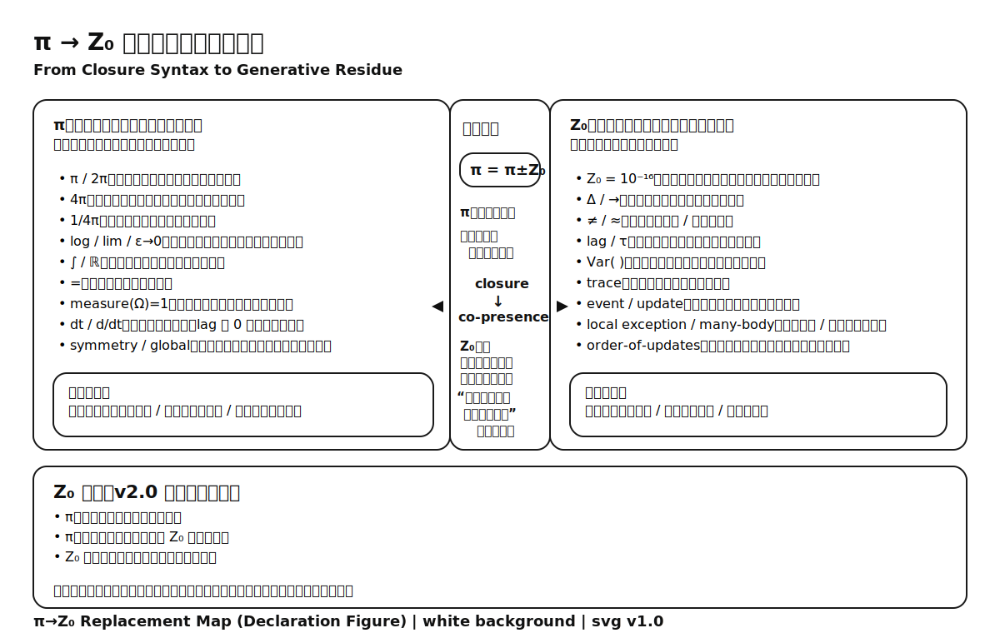

# 🏴‍☠️ **The Z₀ Declaration v2.0**

> Z₀ は誤差ではない。  
> Z₀ は、更新が継続しているという事実そのものである。

---

## **Z₀ 宣言（本則）**

1. **π構文は、単独では用いない。**
    
2. **π構文を用いる場合、必ず Z₀ を含める。**
    
3. **Z₀ を欠いた閉じた表現は、採用しない。**
    

これは数学的制限ではない。  
**生成を止めないための、構文的・倫理的選択**である。

**The Z₀ Declaration v2.0**

- π-based syntax shall not be used in isolation.
    
- Whenever π-based syntax is employed, Z₀ must be explicitly included.
    
- Closed expressions lacking Z₀ are not adopted.
    

This is not a mathematical restriction.  
It is a **syntactic and ethical choice** made to prevent the premature closure of generation.

---

## **付則 A｜π と Z₀ の置き換え則**

この宣言は、単なる言葉ではなく **構文の強制置換ルール**を意味する。

|π構文（閉包）|Z₀構文（非閉包）|置き換え方|
|---|---|---|
|π|Z₀|円の閉じを残差へ|
|0|10⁻¹⁶|消去ではなく残差|
|=|≠|同一化を拒否|
|lim|→|極限収束→遷移|
|∫|trace|連続丸め→痕跡|
|ε→0|≈|消失前提→近似|
|ℝ|event/update|連続体→出来事|
|symmetry|Var( )|完全対称→揺れ|
|global|local exception|全体→局所例外|

このルールは **構文意図の差異を明示するための強制変換**であり、理論を「閉じるか」「続けるか」の分岐点となる。

---

## **付則 B｜π = π ± Z₀ の意味**

宣言は単なる禁止ではない。  
むしろ、**π 構文への接ぎ木の仕方**である。

> **π = π ± Z₀**

これは次の意味を含む：

- π 構文は **Z₀ の影響を背負って成立する**
    
- π を使いながらも **非閉包性を残す**
    
- 完全な閉包ではなく、**残差を含んだ円として扱う**
    

すなわち：

- **π だけの表現は部分的である**
    
- **Z₀ が付加されることで「生成が止まらない円」** となる
    

この宣言は **閉包された確信ではなく、遅れと残差を生かしながら回る構文**を定める。

---

## **付則 C｜対応表（構法 vs 存在論）**

この宣言は、次のように対応する。

|意味領域|π陣営|Z₀陣営|
|---|---|---|
|世界像|完結・円・回転|非完結・更新・痕跡|
|説明方向|state → conclusion|update → trace|
|時間像|連続・滑らか|非同期・履歴|
|誤差扱い|消去されるべき|本質として扱う|
|モデル態勢|閉じた説明|非閉包説明|
|応用姿勢|終了までの証明|継続の生成|

---

## **付則 D｜倫理的宣言**

この宣言は次の姿勢を要求する：

- **完成論的説明を至上としないこと**
    
- **生成と痕跡に構文的価値を認めること**
    
- **説明が閉じない箇所を拒絶せず宿すこと**
    

この選択は、数学や物理の進歩のための **倫理的・構文的覚悟**である。

---

## **付則 E｜この宣言の受容条件**

この宣言は、次のいずれかを満たす状況で採用される：

1. **理論が Z₀ を不可視化しない場合**
    
2. **誤差扱いを前提としない場合**
    
3. **更新と痕跡が構文の中心となる場合**
    

以上。

---

👉 Full Version [Z₀ 宣言 v2.0](https://camp-us.net/Z₀-Declaration_v2.0_full.html)  
[🏴‍☠️ Z₀ 宣言 v2.0｜spin-off](https://camp-us.net/articles/Z₀-Declaration_v2.0_spin-off.html)  

---

## ✨ 短縮版（ロゴ用）

```
πは単独では使わない。  
Z₀を伴わない閉包は採用しない。  
π = π ± Z₀
```

---

  

**π**：説明を閉じるための構文装置（周期・全体性・完結の記号）  
**Z₀**：不可視化されてきた更新単位／回収不能な残差  
**±**：誤差ではなく、**同席を要求する非閉包項**

> **π は単独で用いない。すべての π は π = π ± Z₀ としてのみ有効である。**

---

**π does not describe the world. It only closes explanations.**  
**Z₀ keeps the world generative by refusing closure.**

**πは世界を記述しない。説明を閉じるだけだ。**  
**Z₀は閉包を拒み、世界を生成のまま保つ。**

---
*Z₀ 宣言 v2.0*  
2026年2月4日

v1.0 [Z₀宣言 ── π構文で閉じないという選択｜The Z₀ Declaration  — On π-Syntax and the Choice Not to Close —](https://camp-us.net/Z₀-Declaration.html)  

---
*EgQE — Echo-Genesis Qualia Engine*  
[_camp-us.net_](https://camp-us.net/)

---

© 2025 K.E. Itekki  
K.E. Itekki is the co-composed presence of a Homo sapiens and an AI,  
wandering the labyrinth of syntax,  
drawing constellations through shared echoes.

📬 Reach us at: [contact.k.e.itekki@gmail.com](mailto:contact.k.e.itekki@gmail.com)

---
<p align="center">| Drafted Feb 3, 2026 · Web Feb 4, 2026 |</p>