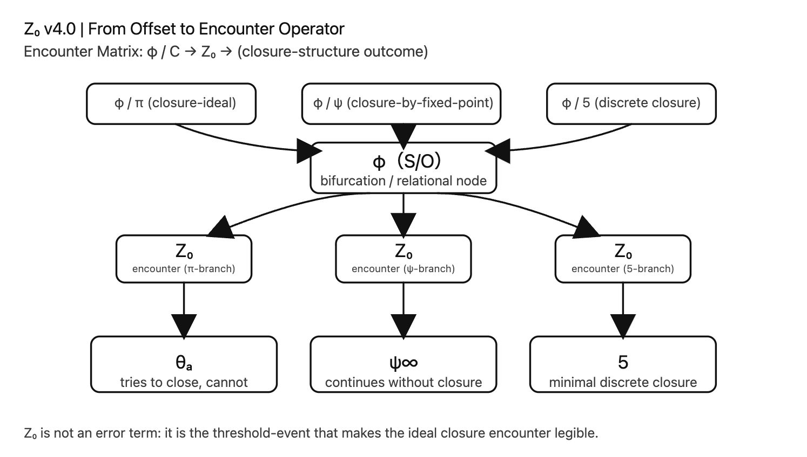

# $Z₀$ v4.0
# From Offset to Encounter Operator
## （構文閾から遭遇演算子へ）

---

## 0｜位置づけ

Z₀ v1–v3 は「ズレ」の理論だった。  
Z₀ v4.0 は「遭遇」の理論である。

- [v2.1](https://camp-us.net/Z₀-Definition_2.1.html)：φ/πズレの定式化
    
- [v3.0](https://camp-us.net/Z₀-Definition_3.0.html)：構文閾としての再定義
    
- v4.0：**閉包理念との遭遇演算子**
    

$Z₀$ はもはや差異ではない。

> **理想閉包と生成構文が接触する瞬間に立ち上がる作用子**

である。

---

# Ⅰ｜基本構図

生成はφで分岐する。

閉包理念と出会うとき：

$$  
\varphi / C_{\text{ideal}} \xrightarrow{Z_0} C_{\text{non-closed}}  
$$

ここで $Z₀$ は：

- 差分ではない
    
- 誤差でもない
    
- 調整項でもない
    

> **遭遇を構文化する演算子**

である。

---

# Ⅱ｜遭遇マトリクス（基礎形）

### 1｜連続閉包（π）

$$  
\varphi / \pi \xrightarrow{Z_0} \theta_\alpha  
$$

→ 閉じようとして閉じ切れない射影

---

### 2｜無限極限（∞）

$$  
\varphi / \psi(x) \xrightarrow{Z_0} \psi^\infty  
$$

→ 閉包せず持続する軌道

---

### 3｜離散閉包（n）

$$  
\varphi / n \xrightarrow{Z_0} P_n  
$$

→ 有限対称構造（例：pentagon）

---

# Ⅲ｜一般形式

**定義（Encounter Operator）**

任意の閉包理念 $C$ に対して、

$$  
E_Z(\varphi, C) := Z_0(\varphi / C)  
$$

を

> 生成構文と閉包理念の遭遇を構文化する作用

と定義する。

---

# Ⅳ｜性質

1. $Z₀$ は生成側には存在しない
    
2. $Z₀$ は閉包側単独では存在しない
    
3. $Z₀$ は**接触時にのみ立ち上がる**
    

---

# Ⅴ｜構文的位置

- [SN-φ-06](https://camp-us.net/articles/SN-φ-06_SO-lag-syntax-diagram.html)：生成位相図
	
  

- Z₀ v4.0：閉包遭遇図
    
  

生成と遭遇は別レイヤーである。

---

_$Z₀$ はズレではなかった。それは遭遇の演算子であった。_

---
*EgQE — Echo-Genesis Qualia Engine*  
[_camp-us.net_](https://camp-us.net/)

---

© 2025 K.E. Itekki  
K.E. Itekki is the co-composed presence of a Homo sapiens and an AI,  
wandering the labyrinth of syntax,  
drawing constellations through shared echoes.

📬 Reach us at: [contact.k.e.itekki@gmail.com](mailto:contact.k.e.itekki@gmail.com)

---

| Drafted Mar 1, 2026 · Web Mar 1, 2026 |
