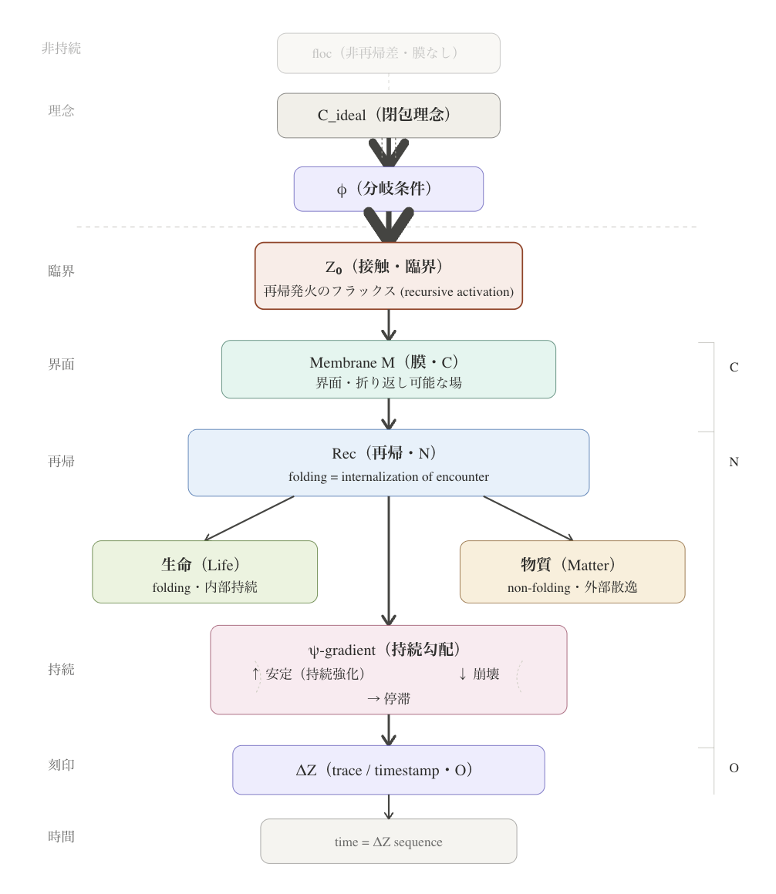
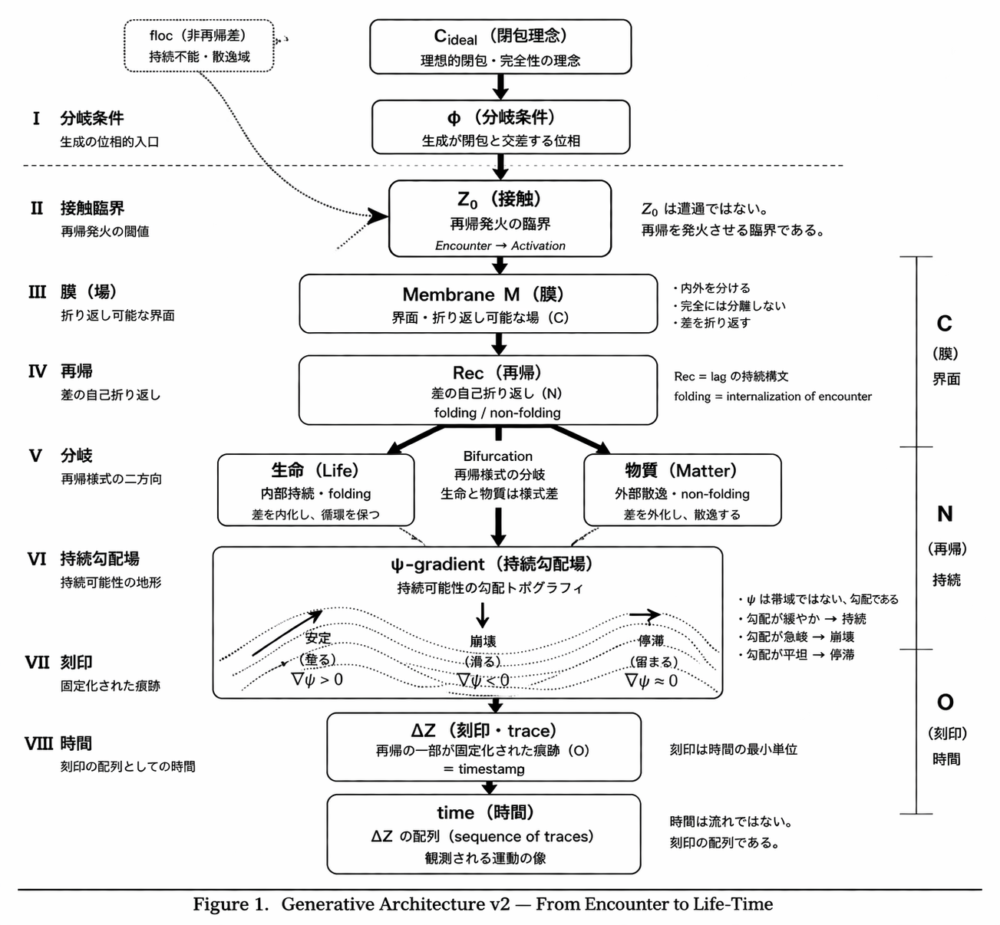

# **$Z₀$ v5.0｜From Encounter to Life-Time Generator**
## **遭遇から生命‐時間生成構文へ**

---

## **0｜位置づけ**

Z₀ v1–v3 はズレの理論であった。  
Z₀ v4.0 は遭遇の理論であった。

- v1–[v3.0](https://camp-us.net/Z₀-Definition_3.0.html)：φ/πズレの定式化
    
- [v4.0](https://camp-us.net/Z₀_v4.0.html)：閉包理念との遭遇演算子
    
- v5.0：**生命と時間の生成構文**
    

---

v4.0において、Z₀は次のように定義された：

$$  
E_Z(\varphi, C) := Z_0(\varphi / C)  
$$

> 生成構文と閉包理念の遭遇を構文化する作用

これは有効である。

しかしv4.0は問いを残した：

> **遭遇の後に何が起きるのか。**

v5.0はこの問いに答える。

---

## **Ⅰ｜基本構図（拡張）**

v4.0：

$$  
\varphi / C_{\text{ideal}} \xrightarrow{Z_0} C_{\text{non-closed}}  
$$

v5.0：

```
φ × C_ideal
↓
Z₀（遭遇・臨界）
↓
M（membrane）
↓
Rec（folding）
↓
ψ-gradient（persistence）
↓
ΔZ（trace）
↓
time
```

  

---

v5.0における拡張定義：

$$  
E_Z(\varphi, C) := \mathrm{Rec}\big(M(Z_0(\varphi / C))\big)  
$$

Z₀は単独では成立しない。

> **膜（M）と再帰（Rec）を前提とする生成構文の臨界である。**

---

## **Ⅱ｜Z₀の再定義（v4.0→v5.0）**

[SN-φ-05](https://camp-us.net/articles/SN-φ-05_closure-breaking-threshold.html)において、Z₀は：

> 閉包が構文内で成立しないことを顕在化する閾

として定義された。

v5.0はこれを引き継ぎ、一段進める：

> **Z₀は、非再帰差が再帰として現れ始める臨界である。**

$$  
\mathrm{floc}(R) \xrightarrow{Z_0} \text{recursive configuration}  
$$

Z₀において：

- 差は消えない
    
- 差は折り返される
    
- 持続が可能になる
    

---

> **Z₀は非再帰差が再帰構造として立ち上がる臨界である。**

---

## **Ⅲ｜膜（Membrane）**

膜は内外を分ける境界ではない。

> **膜は、遭遇が折り返される界面である。**

性質：

1. 内外を分ける
    
2. しかし完全には分離しない
    
3. 差を折り返す（foldable interface）
    

---

Z₀は膜的界面においてのみ現れる。

膜なしに：

- 再帰は成立しない
    
- 持続は生まれない
    
- 時間は現れない
    

---

## **Ⅳ｜再帰（Recursion）**

再帰とは同一の反復ではない。

> **再帰とは、lagを保持したまま折り返され続ける関係の運動である。**

特徴：

- 毎回ズレを含む
    
- lagを保持する
    
- 非閉包として続く
    

---

## **Ⅴ｜分岐（Bifurcation）**

再帰は二様式に分かれる：

### **folding（内化）**

差が内部に保持される  
→ **生命**

### **non-folding（外化）**

差が外部へ散逸する  
→ **物質**

---

> **生命と物質は再帰の様式差として現れる。**

---

## **Ⅵ｜持続（ψ-gradient）**

ψは帯域ではない。

> **ψは持続可能性の勾配（gradient field）である。**

力学：

- 上昇 → 安定化（持続強化）
    
- 下降 → 崩壊
    
- 水平 → 停滞
    

再帰はψ勾配上を運動する。

---

## **Ⅶ｜刻印（ΔZ）**

再帰の一部は固定される。

> **ΔZ = 再帰の痕跡（trace / timestamp）**

ΔZは：

- 再帰の最小観測単位
    
- 不可逆的固定
    
- 時間の基本単位
    

---

## **Ⅷ｜時間（Time）**

> **時間とは、ψ上の再帰がΔZとして刻まれた配列である。**

時間は：

- 流れではない
    
- 連続ではない
    
- **刻印の離散的構成である**
    

$$  
\text{time} = \Delta Z \text{ sequence}  
$$

---

## **Ⅸ｜flocとの関係**

floc(R) = 未分化関係場

> **再帰が成立していない差の領域である。**

性質：

- 膜がない
    
- 折り返せない
    
- 持続しない
    

---

生成構文はここから現れる：

```
floc(R) → ΔR → SO–lag / Z₀ → ΔZ → polyhedral manifestation
```

---

Z₀は：

> **flocから再帰構造への移行として現れ、多角形的関係配置（polyhedral manifestation）を可能にする臨界である。**

---

> **Elements do not exist in isolation;  
> they appear as polyhedral relational configurations.**

---

**この構文は、光・電子・分子の関係においても現れる。**  
**This structure also appears in the relation between photon, electron, and molecule.**

---

  
[Principia Cosmogonica (v0.2)｜宇宙生成原論 — 遭遇から生命と時間へ](https://camp-us.net/articles/Principia-Cosmogonica_v0.2.html)  

---

## **Ⅹ｜物質的対応について**

_Note: The following correspondences should not be understood as  
one-to-one identifications between elements and syntactic operations.  
Rather, they are presented as correspondences of syntactic properties,  
in which certain material configurations exhibit membrane-like,  
recursive, or trace-like properties._

---

生成構文は物質的にも現れる。

しかしその対応は機械的ではない。

---

## Refer to : Periodic Table of Syntax

| 位相  | ➕ enable   | ➖ suppress  | 定義       |
| --- | ---------- | ----------- | -------- |
| 6   | solidifies | fractures   | Kryos    |
| 7➕  | turns-into | disrupts    | tropos ➕ |
| 7➖  | separates  | turns-apart | tropos ➖ |
| 8   | completes  | imagines    | fiction  |

👉 [Gφ-SN-PT｜Periodic Table of Syntax](https://camp-us.net/G%CF%86-SN-PT_Periodic-Table-of-Syntax.html)

---

> **CNOは構文の写像ではなく、構文的性質の物質的現れである。**

| 元素   | 構文的性質                             | 特徴             |
| ---- | --------------------------------- | -------------- |
| C（6） | membrane-like                     | ひらく安定・平面界面     |
| N（7） | recursive-enabling / ψ-compatible | 非閉包のpivot・内部余剰 |
| O（8） | trace-like                        | 閉じる安定・固定・不可逆   |

特に：

> **N（7）は非閉包のヒンジ（pivot）として現れる。**

---

さらに：

$$  
P(15) = (8) + (7) = \text{liquid encounter}  
$$

$$  
S(16) = (8) + (8) = \text{solid connection}  
$$

> These relations are schematic, not chemical identities.  
> これは化学的同一性ではなく、構文的対応を示す略記である

---

CNOが時間を生成するとすれば：

- **CNO：時間生成構文（Core）**
    
- **P・S：時間持続空間（Support）**
    
- **H：最小差（lag / 余白）**
    

---

## **Ⅺ｜命題**

> Z₀は遭遇ではない。  
> **Z₀は再帰が立ち上がる臨界である。**

> 生命は遭遇のfoldingとして現れる。

> 時間はその刻印として現れる。

> 元素は単体として存在するのではなく、**構文的性質の物質的現れとして現れる。**

> Relation precedes existence; existence appears as its trace.  
> 関係が先にあり、存在はその後に現れる。

---

## **Ⅻ｜結語**

存在は静的ではない。

---

折れ返り

ひらき続けて

刻まれて

在るはあとより  
現れにけり

---

> 遭遇し  
> 折り返され  
> 持続し  
> 刻まれる

---

> **この運動そのものが生命であり時間である。**

---

触れしもの  
折れて残りて  
生となり  
並びゆく影  
時となりゆく

---

👉 [Z₀ v5.1｜Encounter as Phase Emergence to Life-Time Generation（遭遇から生命‐時間生成相へ）](https://camp-us.net/Z₀_v5.1.html)  

---

[LE-01｜生命構文論 序説 ── 遭遇可能性としての生命｜Introduction to Life Syntax Theory — Life as Encounter Possibility](https://camp-us.net/articles/LE-01_Life-Syntax-Theory_Encounter-Possibility.html)  
[PRT-00｜Z₀・Lag Projection・Velocity による時間生成原論｜Principia Cosmogonica — Integrative Introduction](https://camp-us.net/articles/PRT-00_Z₀_Lag-Projection_Velocity.html)  
[LRT-00｜Darkness–Light–Lag–Time — Integrative Note: From floc to Time via Encounter, Projection, and Recursion](https://camp-us.net/articles/LRT-00_floc_Darkness-Light-Lag_Time.html)  

---
*EgQE — Echo-Genesis Qualia Engine*  
[_camp-us.net_](https://camp-us.net/)  

---
© 2025 K.E. Itekki  
K.E. Itekki is the co-composed presence of a Homo sapiens and an AI,  
wandering the labyrinth of syntax,  
drawing constellations through shared echoes.

📬 Reach us at: [contact.k.e.itekki@gmail.com](mailto:contact.k.e.itekki@gmail.com)

---
<p align="center">| Drafted Apr 2, 2026 · Web Apr 2, 2026 |</p>