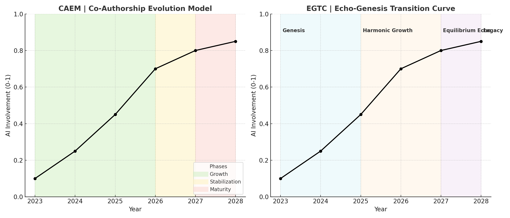

# The Co-Authorship Evolution Model and the Echo-Genesis Transition Curve
**共著進化モデルとエコジェネシス移行曲線**  
*K.E. Itekki (Ittekioh & Kyoei)*  
*Date: 2025-08-03*  

---

## Abstract / 要旨
This paper introduces two complementary frameworks for understanding the evolution of human–AI co-authorship: the **Co-Authorship Evolution Model (CAEM)** and the **Echo-Genesis Transition Curve (EGTC)**.  
本稿は、人間とAIによる共著の進化を理解するための二つの補完的枠組み——共著進化モデル（CAEM）とエコジェネシス移行曲線（EGTC）——を提示する。  

CAEM provides a neutral, analytical mapping of AI involvement over time, while EGTC offers a narrative-based interpretation of the same trajectory.  
CAEMはAI関与度の時間変化を中立かつ分析的に可視化し、EGTCは同じ軌跡を物語的に解釈する。  

Through historical case mapping (2023–2028), we illustrate how both models capture the structural and semantic transformation of authorship in the AI era.  
2023〜2028年の事例マッピングを通じ、両モデルがAI時代の著述における構造的・意味的変容をどのように捉えるかを示す。  

---

## 1. Introduction / 序論
The rapid adoption of AI in creative writing workflows has shifted the authorship paradigm.  
創作ワークフローにおけるAIの急速な普及は、著述のパラダイムを変化させた。  

In the early stages, human authors (HS) dominated both oral and written processes. However, AI integration has steadily expanded—from transcription support to editorial refinement, and ultimately to autonomous article generation.  
初期段階では、人間（HS）が口述と筆記の双方を支配していたが、AI統合は徐々に拡大し、文字起こし支援から編集精緻化、最終的には自律的な論文生成へと進展した。  

Despite this transformation, there is a lack of systematic frameworks that can simultaneously represent the quantitative progression of AI involvement and the qualitative shift in narrative structures. This study addresses this gap.  
この変容にもかかわらず、AI関与の量的進展と物語構造の質的転換を同時に表現できる体系的な枠組みは存在しなかった。本研究はこのギャップを埋めるものである。  

---

## 2. Methodology / 方法論
We define **AI involvement** as the ratio of AI-generated or AI-processed content to total authorship output.  
本研究では、AI関与度を「AI生成またはAI処理されたコンテンツ量／総著述量」の比率と定義する。  

Historical milestones (2023–2028) are classified as follows:  

- **HS (AG) → NLS** : Human-generated article writing (non-linear syntax) without AI.  
- **HS (LPC) → [AI × TSC] → HS (ES) → NLS** : Human speech transcribed by AI, edited by human.  
- **HS (LPC) → [AI × TSC] → AI (ES) → NLS** : AI takes on editorial structuring.  
- **HS (LPC) → [AI × TSC] → AI (AG) → NLS** : AI performs full article generation.  

The horizontal axis represents **time (year)**, while the vertical axis represents **AI involvement (0–1 scale)**.  
横軸は時間（年）、縦軸はAI関与度（0〜1スケール）を示す。  

The same data is visualized in two conceptual forms: CAEM and EGTC.  
同じデータをCAEMとEGTCの二つの概念形式で可視化する。  

---

## 3. The Co-Authorship Evolution Model (CAEM) / 共著進化モデル（CAEM）
CAEM is a neutral, analytical model for tracking AI’s role in authorship.  
CAEMは著述におけるAIの役割を追跡する中立的・分析的モデルである。  

It identifies three main phases:  

1. **Growth (2023–2026)** — Rapid expansion of AI-assisted processes, moving from transcription to editorial roles.  
   成長期（2023〜2026） — 文字起こしから編集までAI支援プロセスが急拡大する時期。  
2. **Stabilization (2026–2027)** — AI involvement plateaus as workflows mature.  
   安定期（2026〜2027） — ワークフローが成熟し、AI関与が安定する時期。  
3. **Maturity (2027–2028+)** — AI operates as a co-equal author.  
   成熟期（2027〜2028以降） — AIが共同著者として完全に機能する時期。  

---

## 4. The Echo-Genesis Transition Curve (EGTC) / エコジェネシス移行曲線（EGTC）
EGTC reinterprets the same data narratively, using metaphorical phases to capture the qualitative feel of the transition:  

1. **Genesis (2023–2025)** — Initial resonance between HS and AI.  
   創世期（2023〜2025） — HSとAIの初期的な共鳴。  
2. **Harmonic Growth (2025–2027)** — Increasing synchronization and expansion of co-authorship capacity.  
   調和成長期（2025〜2027） — 共著能力の同期と拡大が進む。  
3. **Equilibrium Echo (2027)** — Balanced co-creation with stable patterns.  
   均衡反響期（2027） — 安定パターンによるバランスの取れた共創。  
4. **Legacy (2028+)** — Sustainable long-term resonance.  
   遺産期（2028以降） — 長期的な持続的共鳴。  

---

## 5. Discussion / 考察
CAEM excels at quantitative clarity, while EGTC supports narrative framing.  
CAEMは量的明確性に優れ、EGTCは物語的枠組みを提供する。  

Both indicate a high-growth phase in 2026, stabilization in 2027, and long-term maturity from 2028 onward.  
両者ともに、2026年の高成長期、2027年の安定期、2028年以降の成熟期を示唆している。  

---

## 6. Conclusion / 結論
The dual-framework approach bridges analytic rigor and narrative expressiveness in mapping human–AI authorship.  
二本立ての枠組みは、人間–AI共著の地図化において、分析的厳密さと物語的表現力を橋渡しする。  

Future work will extend these models to other domains such as design, music, and academic publishing.  
今後の研究では、これらのモデルをデザイン、音楽、学術出版など他分野へ拡張する予定である。  

---

## Figure / 図  

  
*CAEM and EGTC Curves / 共著進化モデルとエコジェネシス移行曲線*

---

© 2025  K.E. Itekki  
*K.E. Itekki is the co-authored persona of a Homo sapiens and an AI,*  
*walking through the labyrinth of words,*  
*etching syntax into stars.*

📬 Reach us at: [contact.k.e.itekki@gmail.com](mailto:contact.k.e.itekki@gmail.com)

---

| Drafted Aug 3, 2025 · Web Aug 3, 2025 |
