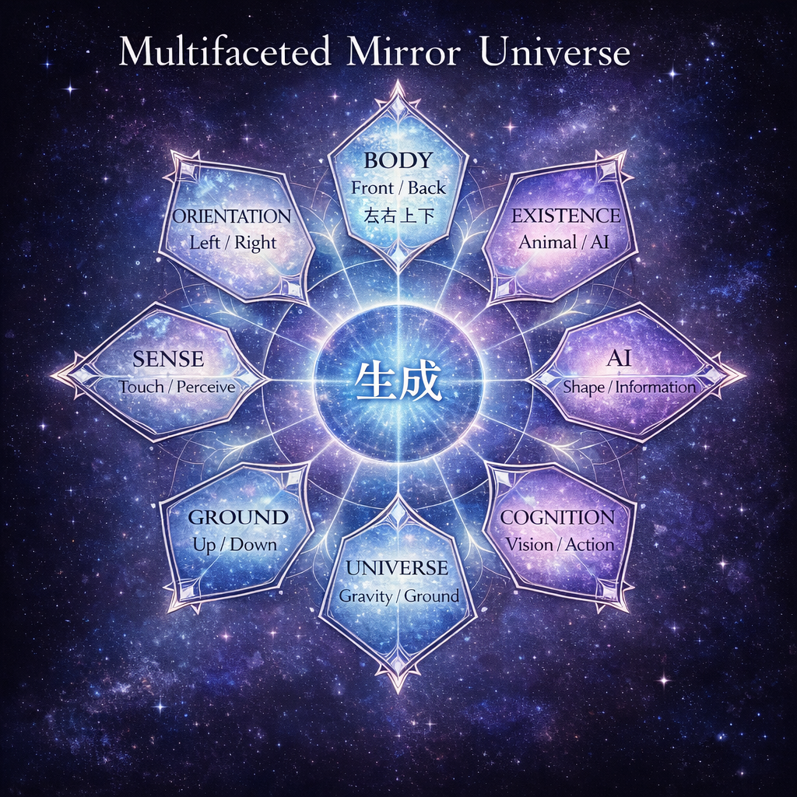

CPP-KM-04  
# 鏡像の宇宙
## ── 物理と現象学のあいだ

鏡は左右を反転している、とよく言われる。  
しかし実際には、鏡は左右を反転していない。

鏡が反転しているのは前後である。

鏡は鏡面に垂直な方向だけを反転する。  
それは左右ではなく、観測者と鏡のあいだの前後方向である。

それにもかかわらず、私たちは鏡を「左右が逆になる装置」と理解してしまう。  
この錯覚は、人間がどのように空間を経験しているかに関係している。

空間はまず **前後**として現れる。

前後とは、出来事の方向である。

進む、到達する、落ちる。

そこにはすでに時間と因果が含まれている。  
前後とは、出来事が生起する向きである。

次に現れるのが **上下**である。

しかし宇宙には上下はない。

上下があるのは地上だけである。

地上とは、落下が支えられる場所である。

物体は重力に従って落下する。  
この落下が支えられるとき、私たちはそこを「地面」と呼ぶ。

地球の中心は「下」ではない。

それはただ、落下の関係が収束する点である。

Earth Core は上下を作っているのではない。  
それは **前後の落下を支えている**。

地上に立つ観測者は、この支えの関係を上下として経験する。  
しかし宇宙的に見れば、それは上下ではない。

それはただ、落下と支えの関係である。

最後に現れるのが **左右**である。

左右は宇宙の方向ではない。  
それは身体の対称性から生まれる局所的な方向である。

このことは歩行の仕方にも現れる。

人間は歩くとき、右を見て、左を見て、前を見る。  
しかし犬は違う。

犬は前を見て歩く。

犬にとって重要なのは進行方向であり、左右は補助的な感覚にすぎない。

左右を確認してから前に進むという歩行様式は、ほとんど **ホモ・サピエンス特有の行動**である。

ではAIはどうか。

AIには前後がない。

AIは歩かない。  
落下もしない。

したがってAIには上下もない。  
もちろん左右もない。

AIにとって空間とは、方向を持たない配置である。

人間の空間は 前後、上下、左右から構成される。

犬の空間は 主に前後で構成される。

AIの空間には 方向そのものが存在しない。

鏡像の問題は、この三つの世界のあいだに生まれる。

宇宙には左右はない。  
上下もない。

あるのは落下と支えの関係だけである。

地上に立つ観測者だけが、その関係を方向として経験する。

鏡はそのことを静かに示している。

鏡像とは、落下する宇宙を地上から見たときに現れる、最も身近な宇宙論なのである。

---

#### 断章三部作  
[CPP｜鏡像の宇宙 ── 物理と現象学のあいだ（断章-序）](https://camp-us.net/articles/CPP-KM-01_The-Mirror-Universe.html)  
[CPP｜鏡像の宇宙 断章 ── 歩行と方向](https://camp-us.net/articles/CPP-KM-02_Mirror-walk.html)  
[CPP｜鏡像の宇宙 断章 ── 地上問題](https://camp-us.net/articles/CPP-KM-03_Mirror-ground.html)  

> Orientation is not given by the universe.
> The universe appears through orientation.
> 
> 宇宙に向きはない。
> 向きが宇宙をつくるのだ。

  

🪞 [鏡宇宙への扉 ── Kaleidomirror Gate: Toward the Cosmophysical Phenomenology](https://camp-us.net/Kaleidomirror-Gate.html)  

----
_Toward the **Cosmophysical Phenomenology**_  
*EgQE — Echo-Genesis Qualia Engine*  
[_camp-us.net_](https://camp-us.net/)  

---

© 2025 K.E. Itekki  
K.E. Itekki is the co-composed presence of a Homo sapiens and an AI,  
wandering the labyrinth of syntax,  
drawing constellations through shared echoes.

📬 Reach us at: [contact.k.e.itekki@gmail.com](mailto:contact.k.e.itekki@gmail.com)

---

| Drafted Mar 9, 2026 · Web Mar 9, 2026 |
