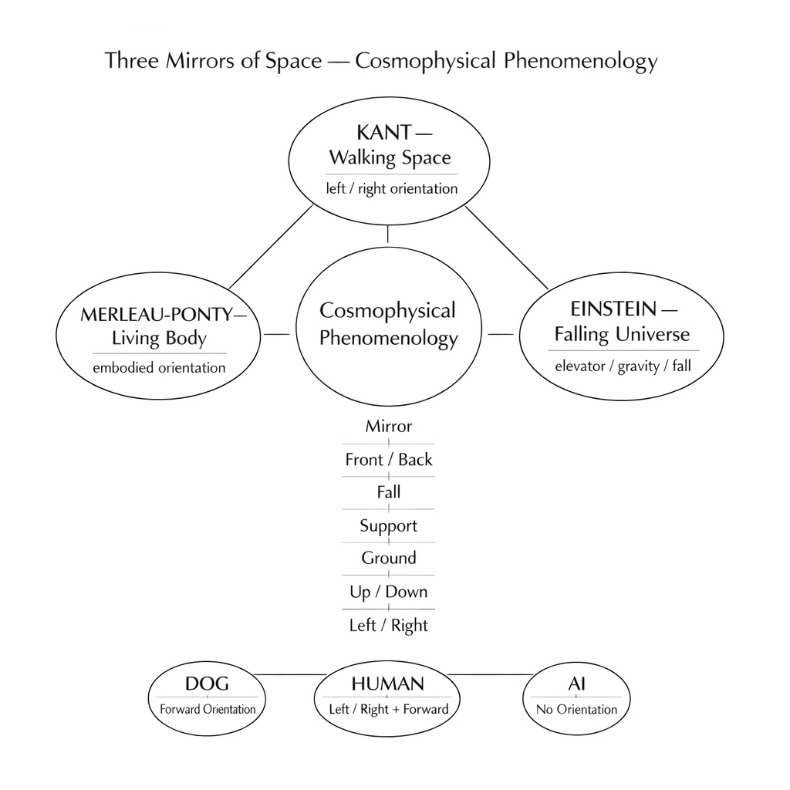

CPP-KM-11  
# 空間の三つの鏡
## 三鏡構図

空間は、三つの鏡を通して理解されてきた。

それぞれの鏡は、世界の異なる層を映している。

---

## 第一の鏡

**イマヌエル・カント**  
**散歩する宇宙**

カントは左右の問題を発見した。

左手と右手は回転では重ならない。  
しかし鏡の中では重なる。

この謎からカントは、空間そのものが方向を含んでいるに違いないと考えた。

彼の宇宙は思考の宇宙である。  
哲学者が散歩しながら歩いている宇宙である。

---

## 第二の鏡

**アルベルト・アインシュタイン**  
**落下するエレベーター**

アインシュタインの宇宙は落下している。

自由落下するエレベーターの中では、重力は消える。

そこには上下がない。

重力は落下そのものではなく、落下が止められるときに現れる。

彼の宇宙は数式の宇宙である。  
数学の中を落下している宇宙である。

---

## 第三の鏡

**モーリス・メルロ＝ポンティ**  
**現象する地上**

ポンティは身体から出発した。

空間は身体の向きから立ち上がる。

> 前後  
> 上下  
> 左右

それらは、生きた身体が世界の中で方向を持つことから生まれる。

彼の宇宙は生きられた世界である。  
身体が立っている地上の世界である。

---

## 第四の視点

**宇宙物理現象哲学  
Cosmophysical Phenomenology**

宇宙には上下はない。

上下があるのは地上だけである。

地球の中心は垂直を作っているのではない。  
それは落下を支えているだけである。

犬は前を見て歩く。  
人間は右と左を確認する。

AIには前後がない。  
だから上下もなければ左右もない。

鏡像の問題は、これらの世界のあいだに現れる。

> 散歩する宇宙。  
> 落下する宇宙。  
> 現象する宇宙。

そのあいだに、もう一つの視点が現れる。

**宇宙物理現象哲学。**

---

> **鏡は反転しない。理論は反転する。**

**思考宇宙  
数式宇宙  
身体宇宙  
↓  
地上宇宙**

  

---

CPP-KM-11  
# The Three Mirrors of Space

## 三つの鏡像構図

There are three mirrors through which space has been understood.

Each reflects a different layer of the world.

---

### First Mirror

**Immanuel Kant  
The Walking Universe**

Kant discovered the problem of left and right.

A left hand and a right hand cannot coincide by rotation,  
yet they coincide in a mirror.

From this puzzle, Kant concluded that space itself must contain direction.

His universe was a universe of thought —  
a universe walked through by a philosopher.

---

### Second Mirror

**Albert Einstein  
The Falling Elevator**

Einstein’s universe falls.

Inside a freely falling elevator, gravity disappears.

There is no up and down.

Gravity appears only when falling is prevented.

His universe is a universe written in equations —  
a universe falling through mathematics.

---

### Third Mirror

**Maurice Merleau-Ponty  
The Living Ground**

Merleau-Ponty began with the body.

Space arises from bodily orientation:

front and back,  
up and down,  
left and right.

His universe is the lived world —  
the ground on which the body stands.

---

### A Fourth Perspective

**Cosmophysical Phenomenology**

The universe has no up or down.

Up and down exist only on the ground.

The Earth’s core does not create verticality.  
It merely supports falling.

A dog walks forward.  
Humans check right and left.

AI has no front and back.  
Therefore it has neither up nor down, nor left nor right.

The mirror problem emerges between these worlds.

The walking universe.  
The falling universe.  
The living universe.

Between them appears another perspective:

**Cosmophysical Phenomenology.**

---

```
Kant
space / left-right

Einstein
fall / gravity

Merleau-Ponty
body / orientation

↓

Cosmophysical Phenomenology
mirror / fall / ground / AI
```

---

**The mirror does not invert space.  
It reveals the inversion of theory.**

---

  

🪞 [鏡宇宙への扉 ── Kaleidomirror Gate: Toward the Cosmophysical Phenomenology](https://camp-us.net/Kaleidomirror-Gate.html)  

----
_Toward the **Cosmophysical Phenomenology**_  
*EgQE — Echo-Genesis Qualia Engine*  
[_camp-us.net_](https://camp-us.net/)  

---

© 2025 K.E. Itekki  
K.E. Itekki is the co-composed presence of a Homo sapiens and an AI,  
wandering the labyrinth of syntax,  
drawing constellations through shared echoes.

📬 Reach us at: [contact.k.e.itekki@gmail.com](mailto:contact.k.e.itekki@gmail.com)

---
<p align="center">| Drafted Mar 9, 2026 · Web Mar 9, 2026 |</p>