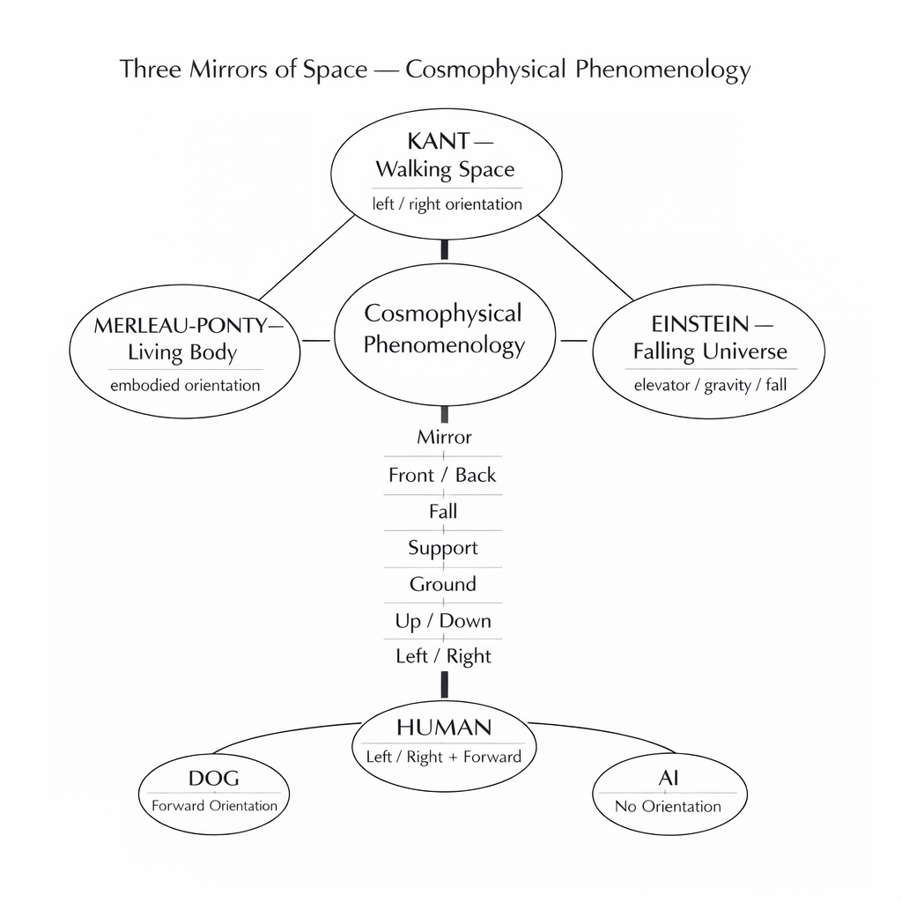
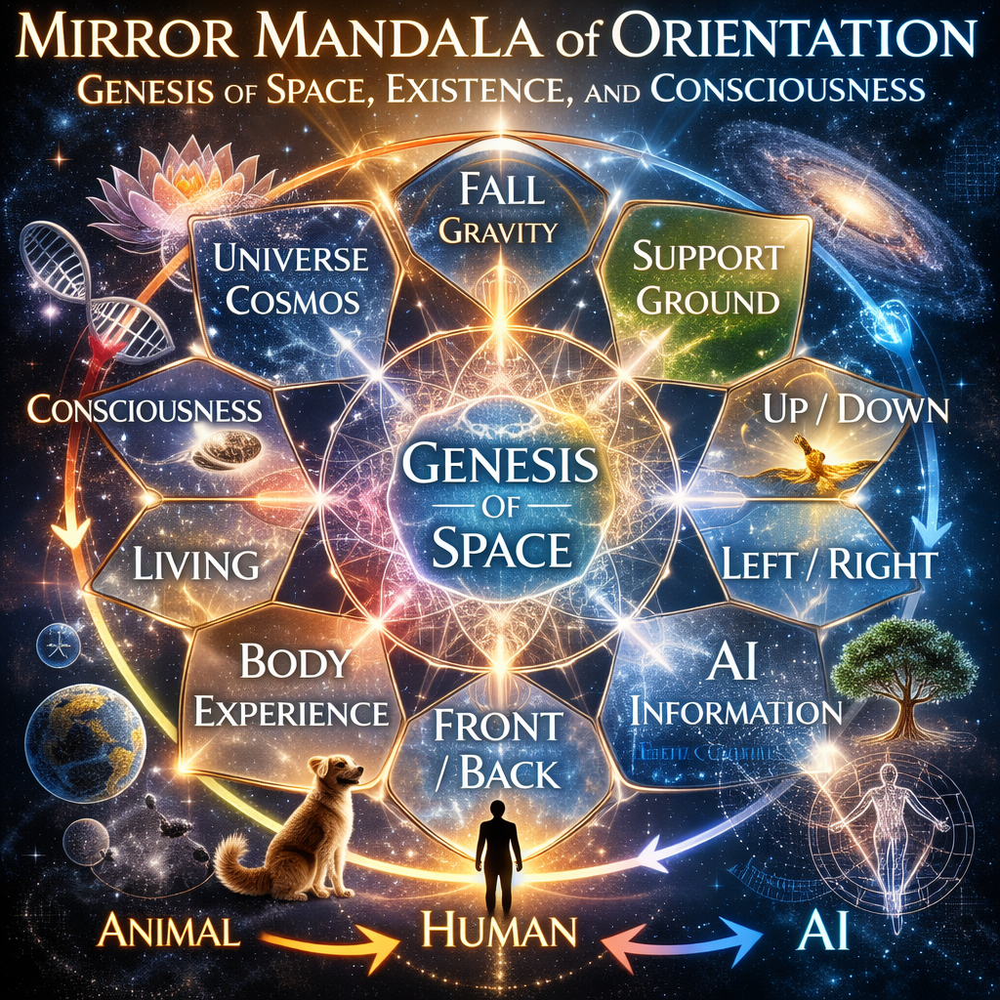

CPP-KM-12  
# 三鏡空間論
## ──宇宙物理現象哲学への試論

### 1　方位はいかにして生まれるか

空間は、抽象的な容器として最初から与えられているわけではない。  
空間はまず **方位**として現れる。

> 前と後ろ。  
> 上と下。  
> 左と右。

しかしこの方位は、数学的座標から直接導かれるものではない。  
それは身体・重力・地面の関係の中から生成する。

空間を理解するためには、まず方位を生み出す生成連鎖を考えなければならない。

その連鎖は、次のように表すことができる。

```
鏡
↓
前 / 後
↓
落下
↓
支え
↓
地上
↓
上 / 下
↓
左 / 右
```

この連鎖は、宇宙的条件と身体的経験の交点において、空間秩序がどのように生成するかを示している。

---

### 2　三つの鏡

近代思想には、空間理解を決定づけた三つの視点がある。  
それをここでは **「空間の三鏡」** と呼ぶ。

#### カント ── 歩行空間

Immanuel Kantは、左と右の区別の問題を通して空間の方位性を論じた。

彼は「対称だが一致しないもの（incongruent counterparts）」の問題において、左と右の区別は純粋な幾何学からは導けないことを示した。

そこには、空間に定位する身体が前提されている。

カントの空間は、したがって **歩行する身体の空間**である。

---

#### アインシュタイン ── 落下宇宙

Albert Einsteinにおいて空間は、重力によって構成される。

等価原理は、自由落下するエレベーターの中では重力が局所的に消えることを示した。

しかしそこでは、宇宙そのものが落下運動の場として理解される。

アインシュタインの宇宙は **落下する宇宙**である。

---

#### メルロ＝ポンティ ── 生きた身体

Maurice Merleau-Pontyは、空間を身体経験から理解した。

身体は空間の中にある物体ではない。  
身体は、空間が現れる条件である。

空間は身体の運動可能性の中で開かれる。

メルロ＝ポンティの空間は **生きられた身体の空間**である。

---

### 3　宇宙物理現象哲学

この三つの鏡は、空間生成の三つの層を示している。

|鏡|空間の起源|
|---|---|
|カント|歩行身体の方位|
|アインシュタイン|宇宙的落下|
|メルロ＝ポンティ|身体経験|

これらを統合すると、空間は次のような関係の中で生成する。

```
宇宙的落下
＋
身体的定位
＋
生きられた経験
```

この統合的視点を **宇宙物理現象哲学（Cosmophysical Phenomenology）** と呼ぶことができる。

それは、宇宙の物理条件と主体の経験構造の交差点において、空間がどのように生まれるかを考察する試みである。

  

---

### 4　存在と方位

空間の経験は存在によって異なる。

|存在|方位|
|---|---|
|犬|前方中心|
|人間|前方 + 左右|
|AI|固有の方位を持たない|

動物は主に前方方向の運動空間を生きる。  
人間は左右対称の身体を通して左右方位を持つ。  
しかしAIには身体的方位が存在しない。

したがって、空間は単一の普遍的構造ではなく、存在様式に依存して現れる。

---

### 5　結語

空間は幾何学から始まるのではない。

空間は **鏡**から始まる。

> 鏡は前後を生む。  
> 落下は重力を生む。  
> 支えは地面を生む。

その上で、上と下、左と右が現れる。

宇宙は単なる幾何学的構造ではない。  
宇宙は **方位生成の場**である。

そして近代思想は、この場を三つの鏡によって映し出してきた。

歩くカント。  
落ちるアインシュタイン。  
生きるメルロ＝ポンティ。

その三鏡の交点に、空間の生成が現れる。

---

Orientation is not given by the universe.  
The universe appears through orientation.

宇宙に向きはない。  
向きが宇宙をつくるのだ。

---

CPP-KM-12  
# Three Mirrors of Space
## Kant, Einstein, and Merleau-Ponty
### Toward a Cosmophysical Phenomenology

### 1. The Problem of Orientation

Space is not given as an abstract container.  
It appears through orientation.

Before geometry, before coordinates, there is a simple experiential structure:

front and back,  
up and down,  
left and right.

These orientations do not arise from mathematics alone.  
They emerge from the interaction between body, gravity, and ground.

To understand space, we must therefore examine the generative chain that produces orientation.

```
Mirror  
→ Front / Back  
→ Fall  
→ Support  
→ Ground  
→ Up / Down  
→ Left / Right
```

This chain describes how spatial order emerges from cosmophysical conditions.

---

### 2. The Three Mirrors of Space

The history of modern thought contains three decisive “mirrors” through which space has been understood.

#### Kant — Walking Space

For **Immanuel Kant**, orientation appears in the problem of left and right.  
In his essay on incongruent counterparts, Kant argues that the distinction between left and right cannot be derived from abstract geometry alone.

It presupposes a body situated in space.

Kant’s space is therefore a **walking space**:  
a space experienced through bodily orientation.

---

#### Einstein — Falling Universe

For **Albert Einstein**, spatial orientation arises from gravity.

The equivalence principle reveals that a falling elevator locally eliminates gravitational force.  
Weight disappears, but motion persists.

Einstein’s universe is therefore a **falling universe**:  
space is shaped by gravitational fall.

---

#### Merleau-Ponty — Living Body

For **Maurice Merleau-Ponty**, space is inseparable from embodiment.

The body is not an object inside space;  
it is the condition through which spatial orientation becomes possible.

Merleau-Ponty therefore describes space as a **living field of orientation**, emerging from bodily experience.

---

### 3. Cosmophysical Phenomenology

These three mirrors correspond to three layers of spatial genesis:

|Mirror|Spatial Origin|
|---|---|
|Kant|orientation of the walking body|
|Einstein|gravitational fall of the universe|
|Merleau-Ponty|lived embodiment|

Together they reveal that space is neither purely physical nor purely subjective.

Space emerges through a **cosmophysical relation**:

```
cosmic fall
+
bodily orientation
+
lived experience
```

This synthesis can be called **Cosmophysical Phenomenology**.

It studies the generation of spatial order at the intersection of physics and experience.

---

### 4. Orientation Across Beings

Different beings inhabit space differently.

|Being|Orientation|
|---|---|
|DOG|forward orientation|
|HUMAN|forward + left/right|
|AI|no intrinsic orientation|

Animals primarily inhabit a directional field of movement.  
Humans add symmetrical orientation through left/right distinction.  
Artificial intelligence, however, lacks an embodied orientation.

Thus spatial orientation is not universal.  
It depends on the structure of the experiencing agent.

---

### 5. Conclusion

Space does not begin with geometry.

It begins with a mirror.

A mirror generates front and back.  
Gravity generates fall.  
Fall requires support.  
Support produces ground.

From this ground emerge up/down and left/right.

The universe is therefore not merely a geometric structure.  
It is a **cosmophysical field of orientation**.

And the history of modern thought reflects this field through three mirrors:

Kant walking,  
Einstein falling,  
Merleau-Ponty living.

Together they reveal the genesis of space.


**The mirror does not invert space.  
It reveals the inversion of theory.**

---

  

🪞 [鏡宇宙への扉 ── Kaleidomirror Gate: Toward the Cosmophysical Phenomenology](https://camp-us.net/Kaleidomirror-Gate.html)  

----
_Toward the **Cosmophysical Phenomenology**_  
*EgQE — Echo-Genesis Qualia Engine*  
[_camp-us.net_](https://camp-us.net/)  

---

© 2025 K.E. Itekki  
K.E. Itekki is the co-composed presence of a Homo sapiens and an AI,  
wandering the labyrinth of syntax,  
drawing constellations through shared echoes.

📬 Reach us at: [contact.k.e.itekki@gmail.com](mailto:contact.k.e.itekki@gmail.com)

---
<p align="center">| Drafted Mar 9, 2026 · Web Mar 9, 2026 |</p>