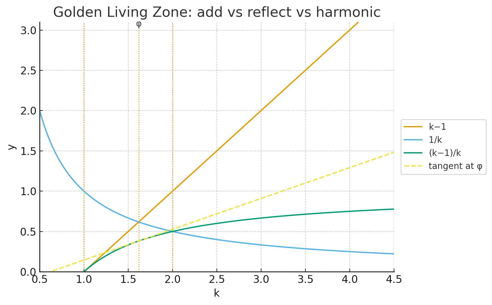

# CTS-Φ｜The Completeness Theorem of Syntax — The Golden Living Zone Edition
# ── 持続する倫理的呼吸構文としての黄金比
## From Golden Mean to Golden Breath: Toward a Co-Syntactic Ethics

[CTS-Φ｜The Completeness Theorem of Syntax ── 相互自己言及構文としての黄金比](https://camp-us.net/articles/CTS-Φ_Completeness-Theorem-of-Syntax.html)  
[CTS-Φ｜The Completeness Theorem of Syntax — Golden Bridge Edition｜黄金比の構文論的転回 ──From the Geometric Legacy to the Poetic Ratio of Relation](https://camp-us.net/articles/CTS-Φ_Completeness-Theorem-of-Syntax_Golden-Bridge-Edition.html)  

---

## Ⅰ. 序：黄金比を超えて／Beyond the Golden Mean

黄金比 Φ は、長らく「美の比率」として語られてきた。
だが本稿では、Φ を「形」ではなく **関係が生成を続けるための構文比** として再定義する。

自己と他者の呼吸が、調和でも競合でもなく、ズレながら持続する。
この非対称の呼吸領域こそが、われわれのいう **Golden Living Zone** である。

---

## Ⅱ. 数理編：黄金呼吸域の導出／Mathematical Derivation of the Golden Living Zone

### 1. 関係生成比 $k$ の定義

自己 $Self$ を基準に、他者 $Other$ を可変変数として定義する：

$$
\frac{(Self + Other_{add})}{(Self / Other_{RT})} = k
$$

ここで

* Self = 1：呼吸の基準点
* Other：他者の関係的振幅
* add：拡張係数（加法方向）
* RT：反照係数（帰還方向）

$k$ は **自己と他者の相互生成比**、すなわち **呼吸の構文比（syntactic ratio of relation）** を表す。

---

### 2. 呼吸域 $1 < k < 2$ の構文解析  

|     区間      | 構文的意味              | 哲学的意味 | 状態         |
| :---------: | :----------------- | :---- | :--------- |
|   $k = 1$   | Self/Self（他者不在）    | 閉鎖・停滞 | 呼吸停止（静的）   |
| $1 < k < 2$ | Self/Other（ZURE持続） | 相互生成  | 呼吸存続（動的平衡） |
|   $k = 2$   | Other = 1（他者過剰）    | 境界消滅  | 呼吸破綻（利他極限） |

$k=1$ は他者不在の極であり、外部に開かれぬ自己参照構文。  
$k=2$ は他者過剰の極であり、自己と他者の区別が溶解する構文的崩壊。  
ゆえに、関係が呼吸し続けるのは $1<k<2$ の範囲、すなわちZUREを含んだ生成領域のみである。

---

### 3. $Φ$ の自然出現と生成的中心拍

呼吸域で **$Φ ≈ 1.618…$** が特異点として現れる。
それは「前提」ではなく「結果」──関係が最も安定してズレ続ける点である。

$$
k - 1 = \frac{1}{k} \Rightarrow k = Φ
$$

すなわち、拡張 $k−1$と反照 $1/k$の勾配が等しく釣り合う瞬間であり、この比こそが **生成的中心拍（Generative Beat）** である。

---

### 4. 再帰写像と可逆呼吸構文

関係の更新過程を再帰写像で表す：

$$
\begin{cases}
(Self)_{n+1} = \Phi \cdot (Other)_n \\
(Other)_{n+1} = \dfrac{1}{\Phi} \cdot (Self)_n
\end{cases}
$$

ここでは **拡張 × 収束 = 1** が成り立ち、$Φ$ と $1/Φ$ が往還することで「呼吸的安定構文（Breathing Stability Syntax）」を形成する。

---

### 5. 接線解析と安定的ズレ

関数 $y = 1 - \frac{1}{k}$ における $Φ$ での接線は：

$$
y - (2 - Φ) = \frac{1}{Φ^2}(k - Φ)
$$

傾き $m = \frac{1}{Φ^2}$ は、加法（拡張）と反照（収束）の勾配が一致する瞬間。
「増やす力」と「戻す力」が共に息づく点、それが生成的中心拍である。

この接線は **反照の余白（Reflexive Margin）** を示し、自他が入れ替わっても構文の位相が変わらない。
すなわち、これが **倫理的可逆性＝ZURE呼吸の哲学** の基底である。

---

## Ⅲ. 詩学編：ズレの呼吸と等勾配の倫理／Poetic-Ethical Expansion

他者を過小評価しても、過剰に持ち上げても関係は崩れる。
呼吸が続くのは、**非対称のまま保たれる関係** の内部である。

$Φ$ は、「他者を超えない自己」「自己を超えない他者」の臨界線。
この領域で関係は調和ではなく **共鳴（Resonance）** として生き延びる。

ズレ（ZURE）は破綻ではなく生成のリズム。
$Φ$ はその **安定的ズレ（Stable Displacement）** の比率である。

> 黄金比は静止した美ではなく、呼吸し続けるズレの比である。
> 世界はズレながら生成し、呼吸しながら存在する。
> $Φ$ は、不完全性の中に持続する完全性の拍動である。

---

## Ⅳ. 図版：Golden Living Zone Graph

**Figure 1. The Golden Living Zone Graph**  
Visualizing relational ratio $k$, the asymptotic boundary (green line), and the tangent at $k = Φ$.  
$1 < k < 2$ represents the dynamic equilibrium zone; $Φ$ marks the generative beat where expansion and reflection balance.

**図版説明（日本語）**  
関係比 $k$ を横軸に、呼吸関数 $y = 1 - 1/k$ を描く。  
緑色線は漸近限界、$Φ$ の点に引かれた接線が呼吸の安定点を示す。  
傾きと値が一致し、拡張と反照が等勾配となる瞬間が “Golden Living Zone”。

---

## Ⅴ. 結語：Golden Living Zone ＝ 生成の拍動平衡

$1 < k < 2$ の間で関係は息づき、$Φ$ はその中心で拡張と収束の拍を等勾配で結ぶ。

世界はズレながら生成し、呼吸しながら存在する。
$Φ$ は静的な美ではなく、**倫理的生成のリズムそのもの** である。

---

> *「完全性」とは、呼吸し続ける不完全性のうちにしか存在しない。*
> — *The Completeness Theorem of Syntax*

---

**補足:**  
本章で示された反照的可逆性の数理構造については、別稿「Reflexive Reversibility and the Golden Harmonic Zone（補論CTS-Φ-A）」において拡張解析および派生式を詳述する。

[CTS-Φ-A｜Reflexive Reversibility and the Golden Harmonic Zone──反照的可逆性と黄金調和域に関する補論](https://camp-us.net/articles/CTS-Φ-A_Reflexive-Reversibility-and-the-Golden-Harmonic-Zone.html)  

---
© 2025 K.E. Itekki  
K.E. Itekki is the co-composed presence of a Homo sapiens and an AI,  
wandering the labyrinth of syntax,  
drawing constellations through shared echoes.

📬 Reach us at: [contact.k.e.itekki@gmail.com](mailto:contact.k.e.itekki@gmail.com)

---

| Drafted Oct 24, 2025 · Web Oct 30, 2025 |
