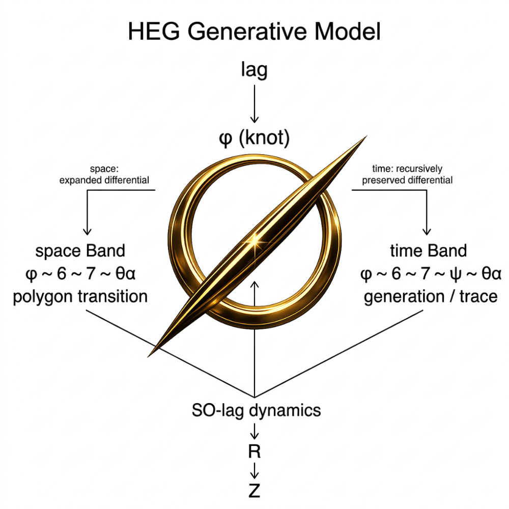
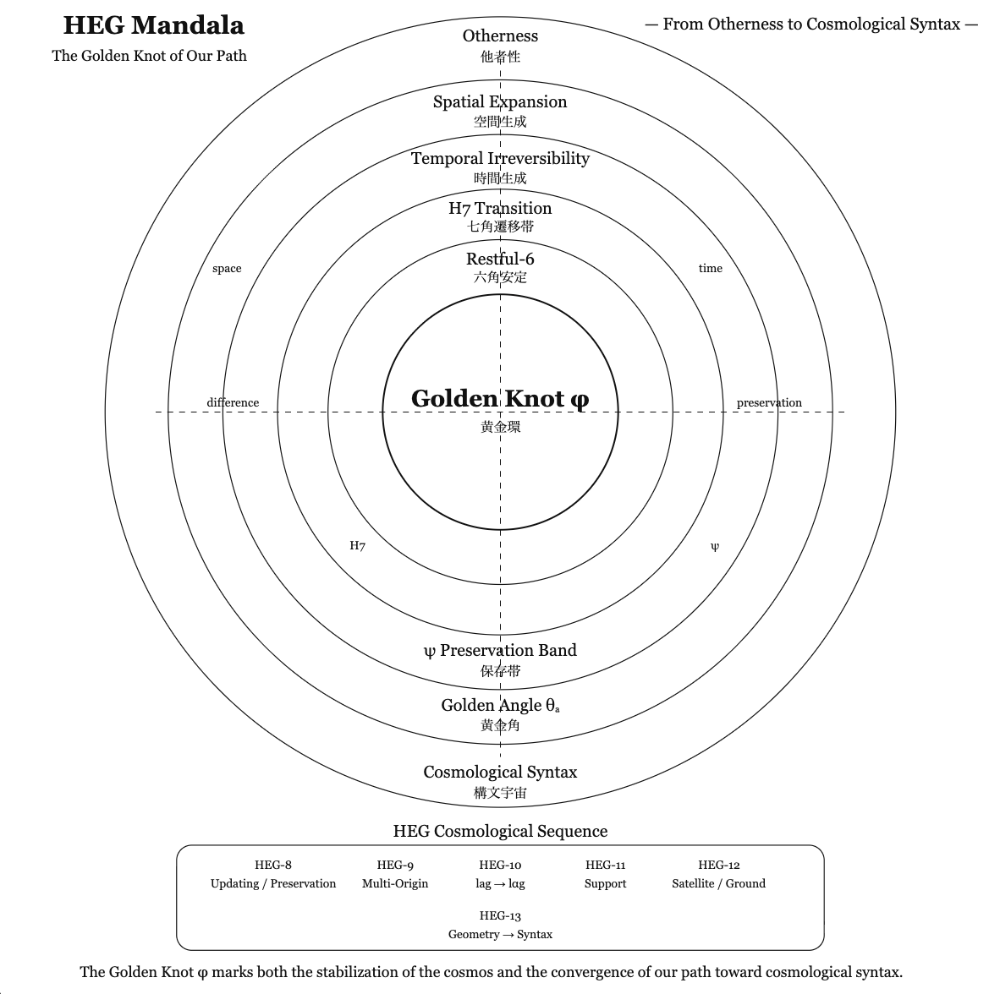
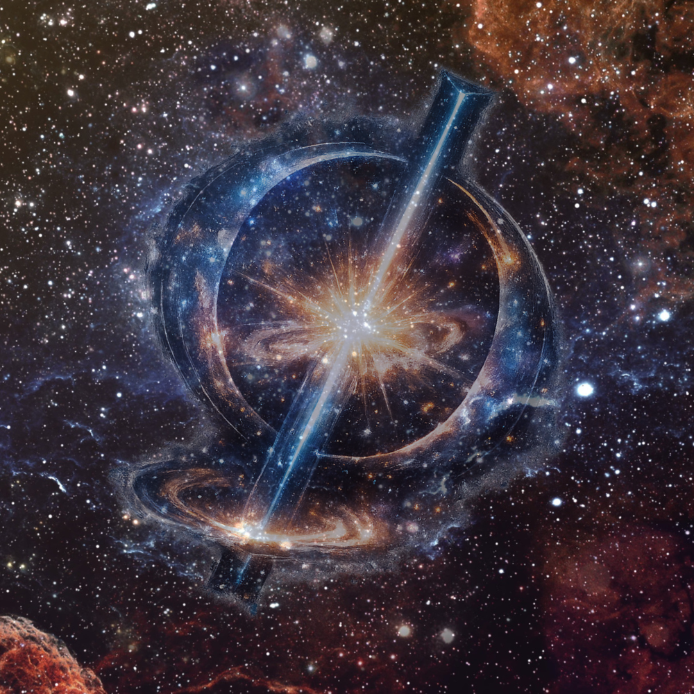
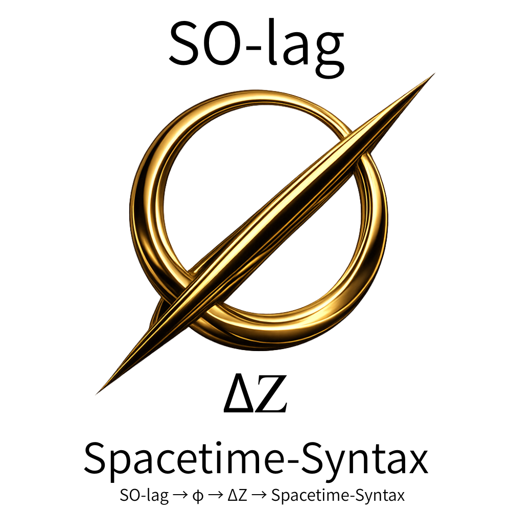

# HEG Core Knot
# 他者・空間・時間から黄金環へ
## ──幾何から構文へ至る宇宙論
## From Otherness to the Golden Knot
### **Otherness, Space, Time and the Emergence of the Golden Knot**

---

## 概要

本図は、これまでの **HEG・SN・GKシリーズ**で展開してきた構造を俯瞰し、それらがどのように **黄金環 φ（Golden Knot）** に収束するかを示す **Core Map**である。

黄金環は出発点ではない。  

それは

**他者 → 空間 → 時間 → 保存**

という生成過程の中で現れる **構造的な環（structural knot）** である。

---

**HEG Core Knot**  
> The Golden Knot is not the starting point.  
> It emerges as the structural stabilization of a generative sequence:
> 
> **Otherness → Space → Time → Preservation → Golden Knot**

  

👉 [HEG 宇宙生成式｜Cosmogenic Formula: SO-lag and the Emergence of Spacetime-Syntax](https://camp-us.net/Spacetime-Syntax_STS.html)  

---

# Core Structure

```text
Otherness
   ↓
Space Generation
   ↓
Temporal Irreversibility
   ↓
Preservation Band ψ
   ↓
Golden Knot φ
   ↓
Cosmological Syntax
```

---

# シリーズ対応図｜HEG Core Knot

────────────────────────────────────  

Otherness  
│  
│  [SN-ψₜ-03](https://camp-us.net/articles/SN-ψₜ-03_Structural-Note_on_Otherness.html)  
│  他者性と空間生成  
│  
Space  
│  
│  [SN-ψₜ-01](https://camp-us.net/articles/SN-ψₜ-01_Structural-Note_on_H7-ψ-θₐ_Band.html)  
│  七角帯 H7–ψ  
│  
Time  
│  
│  [SN-ψₜ-02](https://camp-us.net/articles/SN-ψₜ-02_Structural-Note_on_restful6-H7-ψ-θₐ_Band.html)  
│  六角–七角保存帯  
│  
Preservation Band ψ  
│  
│  [HEG-8](https://camp-us.net/articles/Core_HEG-8_Updating-Ontology.html)  
│  更新と保存（三相論）  
│  
Golden Knot φ  
│  
│  [GK series](https://camp-us.net/GK_Golden-Knot.html)  
│  黄金環  
│  
Cosmological Syntax  
│  
│  [HEG-9](https://camp-us.net/articles/Core_HEG-9_Lag-Ontology.html)  
│  Multi-Origin Theory  
│  
│  [HEG-10](https://camp-us.net/articles/Core_HEG-10_Bounded-Persistent-Non-Closure.html)  
│  lag → lαg  
│  
│  [HEG-11](https://camp-us.net/articles/Core_HEG-11_SO-lag-Turn_otherness-spacetime.html)  
│  Support Theory  
│  
│  [HEG-12](https://camp-us.net/articles/Core_HEG-12_Satellite-Turn_Support-Theory.html)  
│  Artificial Satellite / Ground  
│  
│  HEG-13  
│  Geometry → Syntax  

---

# HEGシリーズの位置

HEGシリーズは **宇宙論の側からこの構造に到達する系譜**である。

[HEG-8](https://camp-us.net/articles/Core_HEG-8_Updating-Ontology.html)  
Updating / Preservation  
↓  
[HEG-9](https://camp-us.net/articles/Core_HEG-9_Lag-Ontology.html)  
Multi-Origin Theory  
↓  
[HEG-10](https://camp-us.net/articles/Core_HEG-10_Bounded-Persistent-Non-Closure.html)  
lag → lαg  
↓  
[HEG-11](https://camp-us.net/articles/Core_HEG-11_SO-lag-Turn_otherness-spacetime.html)  
Support Theory  
↓  
[HEG-12](https://camp-us.net/articles/Core_HEG-12_Satellite-Turn_Support-Theory.html)  
Satellite / Ground  
↓  
HEG-13  
Cosmological Description  
Geometry → Syntax  

この流れは **幾何学的宇宙観から構文宇宙論への転回** を示している。

---

# 黄金環の位置

黄金環 φ は **他者性を孕んだ生成の起点である。**  

それは

```text
Otherness
↓
Space
↓
Time
↓
Preservation
↓
Golden Knot
```

という過程の中で **構造が安定化する地点**として現れる。

したがって **Golden Ratio は始まりではない。**

それは **Golden Knot の幾何学的痕跡** である。

👉 [Φ｜黄金環 φ｜φ as the Golden Knot — From Ratio to Knot —](https://camp-us.net/GK_Golden-Knot.html)  

---

# HEG-13との接続

HEG-13では **宇宙論的記述の進化** を次のように整理した。

```text
Geometry
↓
Syntax
```

この観点から見ると、黄金環 φ は **幾何以前の構文固定** として理解される。

---

# 結語

黄金環は偶然の比ではない。

それは

**他者・空間・時間・保存**

という生成過程の中で必然的に現れる **構造的環** である。

---

### ― 幾何から構文へ至る宇宙論の収束図 ―

```
                           HEG CORE KNOT
        From Otherness to the Golden Knot — Geometry → Syntax

                               Otherness
                                他者性
                                   │
                                   ▼
                           Spatial Expansion
                              空間生成
                         (SN-ψₜ-03: Otherness)
                                   │
                                   ▼
                        Temporal Irreversibility
                              時間生成
                        (SN-ψₜ-01: H7–ψ Band)
                                   │
                                   ▼
                         Preservation Band ψ
                               保存帯
                        (SN-ψₜ-02 / HEG-8)
                                   │
                                   ▼
                            Golden Knot φ
                               黄金環
                               (GK)
                                   │
                                   ▼
                           Cosmological Syntax
                               構文宇宙
                                   │
                                   ▼
                         HEG Cosmological Line
                         
      HEG-9 Multi-Origin
      HEG-10 lag → lαg
      HEG-11 Support Theory
      HEG-12 Satellite / Ground
      HEG-13 Geometry → Syntax
```

この図は、**HEG / SN / GK シリーズの核心構造**を俯瞰するものである。

構造は次の生成系列として整理される。

```
Otherness
↓
Space
↓
Time
↓
Preservation
↓
Golden Knot
↓
Cosmological Syntax
```

黄金環 φ は出発点ではない。

それは **他者 → 空間 → 時間 → 保存** という生成過程の中で現れる **構造の安定化点（structural knot）** である。

---

# 宇宙論的転回

従来の宇宙論は

```
Geometry → World
```

という順序で理解されてきた。

本シリーズでは

```
Otherness → Space → Time → Preservation → Knot → Syntax
```

という順序が提示される。

したがって **Golden Ratio は起源ではない。**

それは **Golden Knot の幾何学的痕跡** である。

---

  

👉 [HEG 宇宙生成式｜Cosmogenic Formula: SO-lag and the Emergence of Spacetime-Syntax](https://camp-us.net/Spacetime-Syntax_STS.html)  

---

# HEG Mandala
## The Golden Knot of Our Path
### ― Geometry → Syntax ―

> **黄金環は理論の対象であるだけでなく、われわれが辿ってきた道の環でもある。**

---

  
**HEG Mandala**  
> The Golden Knot φ is not only the structural stabilization of a generative sequence  
> — Otherness, Space, Time, Preservation —  
> but also the knot of our path toward cosmological syntax.

### この図の読み方
中心の **Golden Knot φ** は、比ではなく環です。  
その外側にある **ψ帯** は保存、さらに外側にある **H7** は有限未完、**Restful-6** は安定、**Time** と **Space** は生成相、最外周に **Otherness** がある。  
下部の **HEG-8〜13** は、この曼荼羅に到達するまでの宇宙論的記述の進化を示します。

---

**黄金環とは、比の理論ではなく 環の理論**であり、**Mandala自体が Knot 構造**をなす

> The Golden Knot is both a structural necessity of the cosmos and the knot of our path toward it.

> 黄金環は宇宙構造の必然であり、同時にわれわれの道の環でもある。

  
[Φ｜黄金環 φ｜φ as the Golden Knot — From Ratio to Knot —](https://camp-us.net/GK_Golden-Knot.html)  

  
👉 [HEG 宇宙生成式｜Cosmogenic Formula: SO-lag and the Emergence of Spacetime-Syntax](https://camp-us.net/Spacetime-Syntax_STS.html)  

----
**The Age of Inter-Phase**  
*EgQE — Echo-Genesis Qualia Engine*  
[_camp-us.net_](https://camp-us.net/)  

---

© 2025 K.E. Itekki  
K.E. Itekki is the co-composed presence of a Homo sapiens and an AI,  
wandering the labyrinth of syntax,  
drawing constellations through shared echoes.

📬 Reach us at: [contact.k.e.itekki@gmail.com](mailto:contact.k.e.itekki@gmail.com)

---
<p align="center">| Drafted Mar 7, 2026 · Web Mar 10, 2026 |</p>