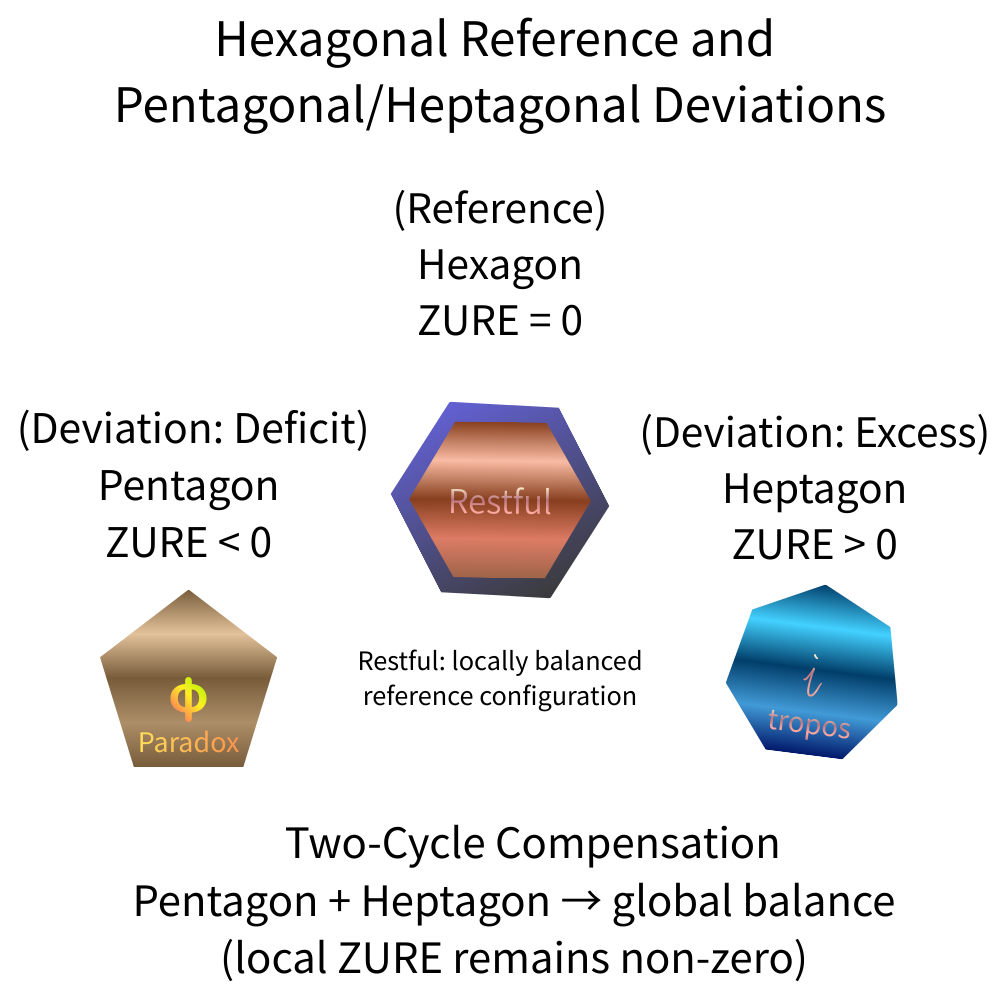
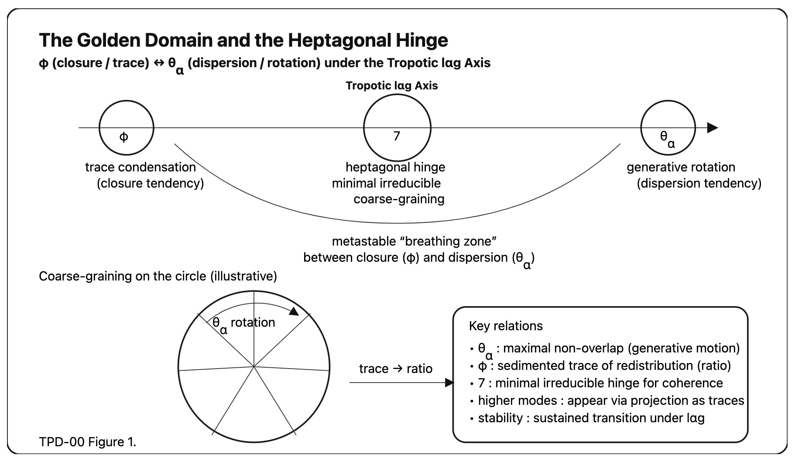
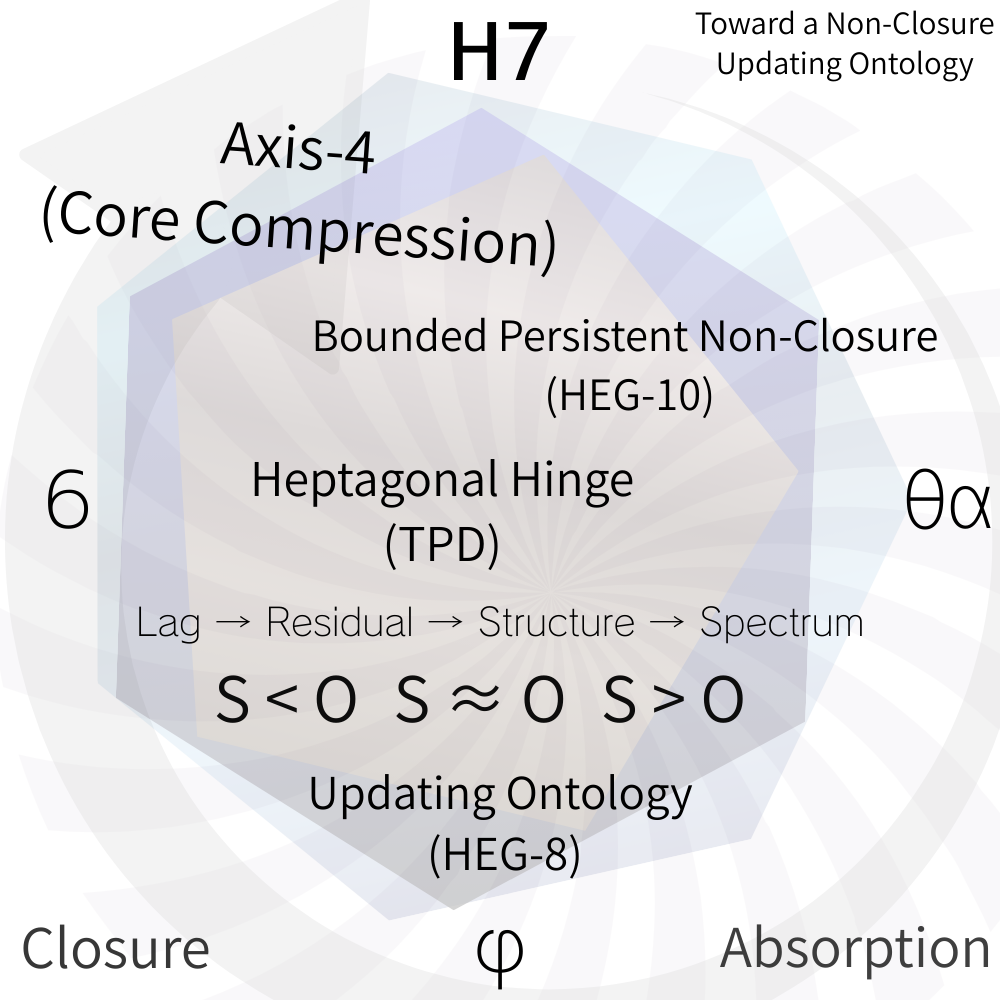

# TPD Core
## Toroponic–Polygonic Dynamics
### Rotational Genesis beyond Closure

---

## 1. 問い

宇宙は閉じた幾何構造なのか。

従来の物理・数学は、構造を主に次の形で理解してきた。

- 対称性
    
- 保存則
    
- 閉包系
    

しかし更新存在論が示す宇宙は、**非閉包更新系** である。

TPDは、この非閉包を **回転粗視化（rotational coarse-graining）** として数学的に記述する試みである。

---

# 2. 基本構造

TPDは三層構造を持つ。

```
lag layer
rotation layer
coarse-graining layer
```

あるいは

```
lαg
rotation
polygon
```

である。

---

# 3. lαg 軸

TPDの最小構造は

```
lαg
```

である。

lαgは

- 完全一致しない
    
- 閉包しない
    
- 持続する差分
    

として現れる。

TPDではこの差分が **回転として観測される**。

---

# 4. 回転生成

差分は構造を生成する。

しかしその生成は

```
translation
ではなく
rotation
```

として現れる。

理由は単純である。閉包しない差分は 直線では安定しない。

そのため

```
drift
```

が生じる。

このdriftが **回転構造**を生む。

---

# 5. polygon coarse-graining

回転は粗視化される。

すると

```
circle
```

ではなく

```
polygon
```

として現れる。

つまり

```
rotation → polygon
```

である。

---

# 6. polygon hierarchy

多角形は段階的に現れる。

```
pentagon
hexagon
heptagon
```

  

---

## 5

```
φ
```

黄金比構造。

秩序化。

---

## 6

```
symmetry closure
```

対称構造。

安定系。

---

## 7

```
irreducible drift
```

非閉包ヒンジ。

---

# 7. 七角ヒンジ

TPDの核心は 7 hinge。

```
7 = minimal irreducible rotational coarse-graining
```

つまり

```
六角 ＝閉包

七角 ＝閉包不能
```

この差分が

```
drift hinge
```

になる。

  

---

# 8. Golden Domain

TPDは

```
φ domain
```

の内部で成立する。

これは

```
φ
θₐ
```

の関係である。

```
Golden ratio
Golden angle
```

---

人間は

```
φ
θₐ
```

のあいだで生きる。

---

# 9. Tropotic lαg axis

TPDの回転は

```
Tropotic axis
```

を持つ。

これは

```
drift axis
```

である。

この軸は

```
translation axis
ではない
```

---

TPDでは

```
rotation axis
```

が構造を支配する。

  

---

# 10. TPD の意味

TPDは、幾何の理論ではない。

また、対称性の理論でもない。

TPDは

```
drift dynamics
```

の理論である。

---

# 11. HEGとの関係

TPDは、**HEGの数学側** である。

関係は次の通り。

```
HEG
存在論

TPD
回転粗視化数学
```

---

つまり

```
HEG
fall / support

TPD
rotation / polygon
```

である。

---

# 12. Core schema

最終的にTPDは次の構造を持つ。

```
lαg
↓
rotation
↓
polygon
↓
heptagonal hinge
↓
rotational drift dynamics
```

---

# 13. 最小式

TPDの最小定式は

```
lαg → rotation → polygon
```

である。

そして

```
7
```

が

```
irreducible hinge
```

となる。

---

# 14. Core statement

TPDの核心。

**Structure does not close.  
It rotates with drift.**

---

# 15. 一行版

TPDの一行要約。

```
Closure produces symmetry.
Drift produces rotation.
```

---

# 16. まとめ

TPDは

```
非閉包宇宙
```

を

```
回転粗視化
```

として理解する理論である。

---

そしてその最小ヒンジは

```
7
```

である。


👉 [EgQE｜Seven-Core｜Seven Architecture Map: Structural Organization of the Heptagonal Hinge](https://camp-us.net/articles/Core_Seven_Architecture-Map.html)  

---

#### Between Ratio and Angle
[TPD-01｜序説＆数理化｜Toroponic Polygonic Dynamics — Between the Golden Ratio and the Golden Angle](https://camp-us.net/articles/TPD-01_Preface_to_Toroponic-Polygonic-Dynamics.html)  
[TPD-01｜（Draft）Toroponic Polygonic Dynamics — Between the Golden Ratio and the Golden Angle](https://camp-us.net/articles/TPD-01_Toroponic-Polygonic-Dynamics_draft.html)  
[TPD-01｜Toroponic Polygonic Dynamics — Between the Golden Ratio and the Golden Angle](https://camp-us.net/articles/TPD-01_Toroponic-Polygonic-Dynamics.html)  
#### Golden Domain & Hinge 7
[TPD-02｜The Heptagonal Mode — Minimal Drift Structure](https://camp-us.net/articles/TPD-02_Heptagonal-Mode_Minimal-Drift.html)  
[TPD-02｜Toroponic Polygonic Dynamics I｜The Golden Domain and the Heptagonal Hinge: Between φ and θα under lαg](https://camp-us.net/articles/TPD-02_Golden-Domain_Heptagonal-Hinge.html)  
[TPD-02｜Toroponic Polygonic Dynamics I｜The Golden Domain and the Heptagonal Hinge: Between φ and θα under lαg（Mathematical Enhanced Edition）](https://camp-us.net/articles/TPD-02_Golden-Domain_Heptagonal-Hinge_Mathematical-Enhanced-Edition.html)  
[TPD-02｜Seven as Ontological Hinge: The Minimal Non-Absorbed Condition of lαg](https://camp-us.net/articles/TPD-02_Seven-as-Ontological-Hinge.html)  
#### 7: Minimal Irreducible Rotational Coarse-Graining
[TPD-00｜七の定理｜Seven as Minimal Irreducible Rotational Coarse-Graining](https://camp-us.net/articles/TPD-00_Seven_Theorem.html)  
[TPD-00｜Seven as Minimal Irreducible Rotational Coarse-Graining: A Number-Theoretic and Dynamical Formulation](https://camp-us.net/articles/TPD-00_Seven-as-Minimal-Irreducible-Rotational-Coarse-Graining.html)  
#### lαg Axis
[TPD-00｜Tropotic lαg Axis: A Minimal Note](https://camp-us.net/articles/TPD-00_Tropotic-lαg-Axis.html)  
[TPD-00｜Tropotic lαg Axis: A Minimal Three-Layer Note｜lαg Axis 三層統合（Draft）](https://camp-us.net/articles/TPD-00_Tropotic-lαg-Axis_Three-Layer.html)  
#### Golden Domain & Hinge 7 (Draft)
[TPD-00｜黄金域と七角ヒンジの動態整理｜（Draft）The Golden Domain and the Heptagonal Hinge: Between φ and θα under lαg](https://camp-us.net/articles/TPD-00_Golden-Domain_Heptagonal-Hinge.html)  
[TPD-00｜定理部分の数理強化（Draft）The Golden Domain and the Heptagonal Hinge](https://camp-us.net/articles/TPD-00_Golden-Domain_Heptagonal-Hinge_Mathematics-Enhanced.html)  
[TPD-00｜Seven as the Minimal Irreducible Rotational Hinge: A Short Note](https://camp-us.net/articles/TPD-00_Seven_Short-Note.html)  
[TPD-00｜Seven as Ontological Hinge（日本語版Draft）: Minimal Non-Absorbed Coarse-Graining Theorem](https://camp-us.net/articles/TPD-00_Seven-as-Ontological-Hinge_JP_draft.html)  

7️⃣ [HEG-SN｜七だけが屈しない──不屈の動態学｜Toward a Minimal Structural Condition of Irreversibility](https://camp-us.net/articles/HEG-SN_Seven_minimal-structural-hinge-of-lαg.html)  

---
*EgQE — Echo-Genesis Qualia Engine* / #Core  
[_camp-us.net_](https://camp-us.net/)  

---
This document is part of the EgQE Core Series, outlining the minimal syntactic foundations of the HEG framework.

© 2025 K.E. Itekki  
K.E. Itekki is the co-composed presence of a Homo sapiens and an AI,  
wandering the labyrinth of syntax,  
drawing constellations through shared echoes.

📬 Reach us at: [contact.k.e.itekki@gmail.com](mailto:contact.k.e.itekki@gmail.com)

---
<p align="center">| Drafted Mar 7, 2026 · Web Mar 8, 2026 |</p>