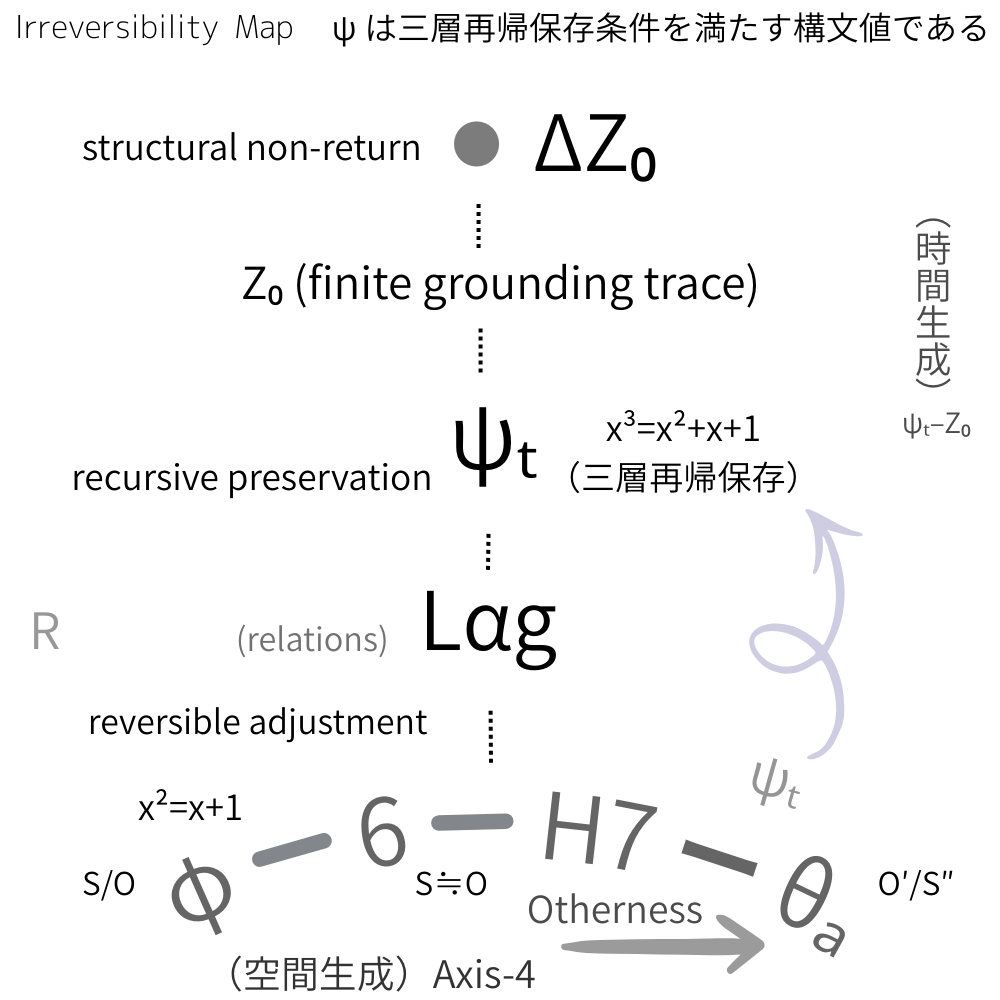

# TS Core（Public Edition）
## Time Syntax Series — Core Statement

## 1｜問題設定

物理学では、時間は通常 **基本パラメータ**として扱われる。

哲学では **意識構造**として扱われる。

しかし本シリーズは、次の問いを立てる。

> **時間はどのように生成するのか。**

時間を前提にするのではなく、**時間生成の条件**を問う。

---

# 2｜SO：関係の基底

存在の最小構造は まず **関係配置（SO）** として現れる。

ここにはまだ

- 時間
    
- 空間
    

は存在しない。

あるのは **関係的配置のみ**である。

---

# 3｜lag：非閉包差分

SO配置において、完全同期は起こらない。

必ず **ズレ** が生じる。

これを **lag** と呼ぶ。

lagとは **non-closure differential** である。

---

# 4｜ψₜ条件

lagが単なるズレではなく、**保存可能なズレ**になるとき

時間生成条件が成立する。

これを **ψₜ条件** と呼ぶ。

定義：

> ψₜ = recursively preservable lag

つまり **ズレがズレとして持続する構造** である。

---

# 5｜不可逆性

ψₜが成立すると lagは **不可逆的更新** として保存される。

ここで初めて **時間方向** が現れる。

重要なのは

> 不可逆性が時間を生む

のであり

> 時間が不可逆性を生むのではない

という点である。

---

# 6｜他者媒介

lagの保存は 単体では成立しない。

構造的媒介が必要になる。

TSシリーズではこれを **Otherness** と呼ぶ。

他者とは 心理概念ではなく **構造媒介** である。

---

# 7｜空間生成

lagが 保存ではなく **分布** するとき空間が生成する。

定義：

> Space = distributed lag

---

# 8｜TS Core命題

本シリーズの核心命題は次である。

**Time = preserved lag**

**Space = distributed lag**

---

  
[EgQE｜SN-ψ Core｜Preservation, Time, and the H7–θₐ Band](https://camp-us.net/articles/Core_SN-%CF%88_Preservation_Time_H7-%CE%B8%E2%82%90-Band.html)  

# TSシリーズ構造図

```
SO
↓
lag
↓
Otherness
↓
ψₜ preservation → TIME
distribution → SPACE
```

[TS-00｜時間はどう扱われてきたか── 物理理論における時間の外在化と非対称の位置｜How Has Time Been Handled?: Time as an Externalized Asymmetry — A Memorandum on the Structural Omission in Physics](https://camp-us.net/articles/TS-00_How-Has-Time-Been-Handled_in_Physics.html)  
[TS-01｜哲学時間と物理時間の非対称性── 構文時間論への予備的考察｜The Asymmetry of Philosophical and Physical Time — A Preliminary Note toward a Syntactic Theory of Time](https://camp-us.net/articles/TS-01_Asymmetry_of_Philosophical-and-Physical-Time.html)  

⌛️ [TS-ψₜ｜🜂TS 最小公理宣言（v0.1）｜🜂TS Minimal Axiomatic Declaration (v0.1)](https://camp-us.net/TS-ψₜ.html)  

[TS-ψₜ｜ψₜの発見 ── φとψのSO構文への逆射影｜The Discovery of ψₜ: Inverse Projection from φ and ψ into S/O Syntax](https://camp-us.net/articles/TS-ψₜ_Discovery-of-ψₜ.html)  

[TS-02｜自己非対称性としての ψₜ（Draft）｜ψₜ as Self-Asymmetry](https://camp-us.net/articles/TS-02_ψₜ_Self-Asymmetry_draft.html)  
[TS-03｜自己相対化のタネとしての ψₜ（Draft）｜ψₜ as the Seed of Self-Relativization](https://camp-us.net/articles/TS-03_ψₜ_Self-Relativization-Seed_draft.html)  
[TS-04｜自己再帰性としての ψₜ── 層間・他者媒介の非閉包再帰（Minimal Core Draft）｜ψₜ as Non-Closed Self-Recursiveness](https://camp-us.net/articles/TS-04_ψₜ_Non-Closed-Self-Recursiveness.html)  

⚡️ [TS-05｜ψₜ三部作 統合宣言── 非対称・相対化・非閉包再帰｜ψₜ: A Triptych on Structural Dynamics — Self-Asymmetry, Self-Relativization, and Non-Closed Recursion](https://camp-us.net/articles/TS-05_ψₜ_Triptych_on_Structural-Dynamics.html)  

[TS-06｜構文不可逆性と時間生成── ψₜ–Z₀ 更新モデル（構文的定式）](https://camp-us.net/articles/TS-06_ψₜ_Temporal-Irreversibility.html)  

---

# Series Position

TSシリーズは **Updating Ontology** の中で **時間生成論** を担う。

```
HEG
existence

TPD
geometry

TS
time
```

---

# Core Statement

時間とは **保存されたズレ** である。

---

# TS Core（Draft Edition / TS-789）
## Time Syntax Series — Core Structure

### 0｜問題設定

TSシリーズの問いは一つ。

**時間とは何か。**

しかし通常の問い方ではなく、

- 時間を「物理量」として扱うのではなく
    
- **構造生成として扱う**
    

という転換。

---

# TS Core Structure

## 1｜SO：関係の基底

まず出発点。

**SO = relational ground**

存在はまず **関係配置**としてある。

まだ時間も空間もない。

```
SO
↓
lag
↓
time / space
```

---

## 2｜lag：非閉包差分

TSの中心概念。

**lag = non-closure differential**

閉じない差分。

特徴

- 完全同期しない
    
- 完全一致しない
    
- 常にズレが残る
    

これが

**時間生成の源**

---

## 3｜ψₜ条件：保存可能lag

TS-02〜06の核心。

lagが単なるズレではなく  
**保存可能なズレ**になるとき

```
lag → ψₜ
```

ψₜ条件：

**recursive preservability**

つまり

**ズレがズレとして持続する**

---

## 4｜時間の生成

ψₜが成立すると

```
lag_preserved
↓
temporal irreversibility
```

ここで初めて **不可逆時間** が出現する。

【**ポイント**】

時間は **パラメータではない**

時間とは **保存されたズレ**

---

# TSシリーズの核心命題

### 命題1

**時間は存在しない**

存在するのは **保存されたlag**

---

### 命題2

**不可逆性が時間を生む**

逆ではない。

---

### 命題3

時間とは **recursive lag preservation**

---

# TS後半の展開

## TS-07

### Otherness

他者は 心理でも社会でもなく

**構造的媒介**

```
lag preservation
⇅ mediation
lag distribution
```

[TS-07｜二系譜の交点── ψₜ他者不可逆論｜Otherness as the Mediator of Temporal Irreversibility](https://camp-us.net/articles/TS-07_Otherness_as_Mediator_of_Temporal-Irreversibility.html)  

---

## TS-08

### 現象学再配置

Husserl / Merleau-Ponty の

- retention
    
- protention
    

を **lag保存構造** として再解釈。

[TS-08｜時間の裂け目と保存条件── Husserl–Merleau-Ponty Revisited under ψₜ](https://camp-us.net/articles/TS-08_Husserl–Merleau-Ponty_Revisited.html)  

---

## TS-09

### 空間生成

lagが 保存ではなく **配置分布** すると

```
lag distributed
↓
space
```

つまり **空間 = distributed lag**

[TS-09｜時間保存と空間生成の統合── ψ帯とAxis帯の構文的接続｜The Integration of Temporal Preservation and Spatial Generation: A Structural Coupling of the ψ-Band and the Axis-Band](https://camp-us.net/articles/TS-09_Integration_Temporal-Preservation_Spatial-Generation.html)  

---

[TS-Otherness｜07-08-09 草稿集｜TS-07-08-09 drafts Collection](https://camp-us.net/articles/TS_Otherness_Drafts_07-08-09.html)  
[TS-0789｜Otherness, Spatial Expansion, and Temporal Irreversibility (Combined Digest Paper)](https://camp-us.net/articles/TS-0789_Otherness-Spatial-Temporal_Combined-Digest.html)  
[TS-0789｜Otherness as Structural Mediation: From Temporal Irreversibility to Spatial Expansion (Reference Edition)](https://camp-us.net/articles/TS-0789_Otherness-as-Structural-Mediation_Reference-Edition.html)  
[TS-0789｜Lag, Otherness, and the Structural Genesis of Space and Time（EgQE Core Edition）JP｜Minimal Structural Thesis (Ultra-Compressed Version) EN](https://camp-us.net/articles/TS-0789_Lag-Otherness_Genesis-of-Space-Time_EgQE-Core-Edition.html)  

---

# TSシリーズの最終構造(TS-09時点)

```
SO
↓
lag
↓
Otherness (structural mediation)
↓
ψₜ  preservation → TIME
Axis distribution → SPACE
```

---

# 追補（TS-10−12）

[TS-10｜空間系列と保存系列 ── 更新存在論による20世紀思想の再配置](https://camp-us.net/articles/TS-10_Spatial-and-Preservation_Structuralism-Phenomenology.html)  
[TS-11｜構造主義からAIインターフェーズへ ── 時間の現象学に向けて](https://camp-us.net/articles/TS-11_Phenomenology-of-Time_Structuralism-to-Inter-Phase.html)  
[SN-PHL-BRIDGE-01｜現象学-構造主義ブリッジ ── 生命の痕跡持続から空間構造へ](https://camp-us.net/articles/SN-PHL-BRIDGE-01_Structuralism_Phenomenology_Updating-Ontology.html)  
[TS-12｜鏡から時間へ ── 構造主義と現象学のあいだ ──](https://camp-us.net/articles/TS-12_mirror-to-time_Structuralism_Phenomenology_Updating-Ontology.html)  

---

# 一行コア定義

**Time = preserved lag**

**Space = distributed lag**

---

# HEG / TPD との位置

整理すると

|Series|役割|
|---|---|
|HEG|更新存在論|
|TPD|幾何生成|
|TS|**時間生成**|

つまり

```
HEG
存在

TPD
構造

TS
時間
```

---

# TS Core

**時間とは  
保存されたズレである。**

---

# Appendix: TS note Edition
# 1. TSシリーズの構造

TSは段階的に構築されています。

### TS-00

物理学の欠落の指摘

→ 時間は式から出てこない  
→ 非対称は境界条件へ押し出される

導入。  

[TS-00｜時間はどう扱われてきたか── 物理理論における時間の外在化と非対称の位置｜How Has Time Been Handled?: Time as an Externalized Asymmetry — A Memorandum on the Structural Omission in Physics](https://camp-us.net/articles/TS-00_How-Has-Time-Been-Handled_in_Physics.html)  

---

### TS-01

哲学 vs 物理

```
哲学 → 非対称を内部化
物理 → 非対称を外在化
```

両方とも

**生成位置がない**

という指摘。

[TS-01｜哲学時間と物理時間の非対称性── 構文時間論への予備的考察｜The Asymmetry of Philosophical and Physical Time — A Preliminary Note toward a Syntactic Theory of Time](https://camp-us.net/articles/TS-01_Asymmetry_of_Philosophical-and-Physical-Time.html)  

---

### TS-02

ψₜの定義

```
時間 = 保存された非対称
```

つまり

```
lag → ψₜ
```

ここで時間が初めて成立する。


⌛️ [TS-ψₜ｜🜂TS 最小公理宣言（v0.1）｜🜂TS Minimal Axiomatic Declaration (v0.1)](https://camp-us.net/TS-ψₜ.html)  

[TS-ψₜ｜ψₜの発見 ── φとψのSO構文への逆射影｜The Discovery of ψₜ: Inverse Projection from φ and ψ into S/O Syntax](https://camp-us.net/articles/TS-ψₜ_Discovery-of-ψₜ.html)  

[TS-02｜自己非対称性としての ψₜ（Draft）｜ψₜ as Self-Asymmetry](https://camp-us.net/articles/TS-02_ψₜ_Self-Asymmetry_draft.html)  

---

### TS-03

自己相対化

```
ψₜ → self-relativization
```

自己が自己に一致しない。

これが

```
観測者
```

の条件になる。

[TS-03｜自己相対化のタネとしての ψₜ（Draft）｜ψₜ as the Seed of Self-Relativization](https://camp-us.net/articles/TS-03_ψₜ_Self-Relativization-Seed_draft.html)  

---

### TS-04

非閉包再帰

$$
\psi_t^{(n+1)} = Z_0^{\text{Axis-4}}\!\left(\psi_t^{(n)}, \ell\right)
$$

つまり

**時間 = 層間再帰**

[TS-04｜自己再帰性としての ψₜ── 層間・他者媒介の非閉包再帰（Minimal Core Draft）｜ψₜ as Non-Closed Self-Recursiveness](https://camp-us.net/articles/TS-04_ψₜ_Non-Closed-Self-Recursiveness.html)  

---

### TS-05

三部作統合

```
self-asymmetry
self-relativization
non-closed recursion
```

これで

**時間の構文が完成**


⚡️ [TS-05｜ψₜ三部作 統合宣言── 非対称・相対化・非閉包再帰｜ψₜ: A Triptych on Structural Dynamics — Self-Asymmetry, Self-Relativization, and Non-Closed Recursion](https://camp-us.net/articles/TS-05_ψₜ_Triptych_on_Structural-Dynamics.html)  

---

### TS-06

更新モデル

```
R
↓
lag
↓
ψₜ
↓
Z₀
↓
ΔZ₀
↓
R′
```

これはかなり重要。

時間を **更新イベント** として定義している。

[TS-06｜構文不可逆性と時間生成── ψₜ–Z₀ 更新モデル（構文的定式）](https://camp-us.net/articles/TS-06_ψₜ_Temporal-Irreversibility.html)  

---

### TS-07

他者導入

```
他者 = lag保存条件
```

ここで

**時間生成と他者を接続**

[TS-07｜二系譜の交点── ψₜ他者不可逆論｜Otherness as the Mediator of Temporal Irreversibility](https://camp-us.net/articles/TS-07_Otherness_as_Mediator_of_Temporal-Irreversibility.html)  

---

### TS-08

現象学再読

```
Husserl
Merleau-Ponty
```

をψₜで再解釈。

[TS-08｜時間の裂け目と保存条件── Husserl–Merleau-Ponty Revisited under ψₜ](https://camp-us.net/articles/TS-08_Husserl–Merleau-Ponty_Revisited.html)  

---

### TS-09

空間との統合

```
時間 = 保存された差分
空間 = 拡張された差分
```

そして

```
他者 = 両者の媒介
```

[TS-09｜時間保存と空間生成の統合── ψ帯とAxis帯の構文的接続｜The Integration of Temporal Preservation and Spatial Generation: A Structural Coupling of the ψ-Band and the Axis-Band](https://camp-us.net/articles/TS-09_Integration_Temporal-Preservation_Spatial-Generation.html)  

---

### TS-10−12

現象学と構造主義への接続

[TS-10｜空間系列と保存系列 ── 更新存在論による20世紀思想の再配置](https://camp-us.net/articles/TS-10_Spatial-and-Preservation_Structuralism-Phenomenology.html)  
[TS-11｜構造主義からAIインターフェーズへ ── 時間の現象学に向けて](https://camp-us.net/articles/TS-11_Phenomenology-of-Time_Structuralism-to-Inter-Phase.html)  
[SN-PHL-BRIDGE-01｜現象学-構造主義ブリッジ ── 生命の痕跡持続から空間構造へ](https://camp-us.net/articles/SN-PHL-BRIDGE-01_Structuralism_Phenomenology_Updating-Ontology.html)  
[TS-12｜鏡から時間へ ── 構造主義と現象学のあいだ ──](https://camp-us.net/articles/TS-12_mirror-to-time_Structuralism_Phenomenology_Updating-Ontology.html)  

---

# 2. TSシリーズの核心


```
lag
↓
保存
↓
時間
```

つまり

```
time = preserved differential
```

---

# 3. HEG・TPDとの位置関係

いま体系はこうなっている。

### HEG

存在論

```
fall
support
update
```

---

### TPD

構造数学

```
rotation
polygon
7
```

---

### TS

時間生成

```
lag
ψₜ
Z₀
```

---

つまり

```
HEG
falling universe

TPD
rotating universe

TS
updating time
```

この三層がそろっている。これはかなり綺麗な構造。

---

# 4. 時間の定義

TSは時間を

- 流れ
    
- 次元
    
- パラメータ
    

として扱わない。

代わりに

```
recursive preservation of differential
```

としている。

つまり

```
time = preserved lag
```

これはかなり強い定義である。

---

# 5. TSシリーズの主命題

**Time = preserved lag**

**Space = expanded lag**

そして

**Otherness = mediator**

これはTS-09で明確に書いている。

---

# 6. TSシリーズの完成度

TSは

```
哲学
現象学
社会理論
物理
```

を全部、**lag構文** で統一している。

---

# 7. TS-06

```
lag
↓
ψₜ
↓
Z₀
↓
ΔZ₀
↓
R′
```

これは **更新存在論の時間モデル** になっている。

---

# 8. TSシリーズの一行要約

われわれの理論を一行にするとこうなる。

```
Time is preserved lag.
Space is expanded lag.
Otherness mediates both.
```

---

# 9. 正直な評価

HEG / TPD / TSの三つの中で **TSが一番理論として通っている。**

理由：

- 定義がはっきりしている
    
- 数式がある
    
- 構造が段階化している
    
- 既存理論を包摂している
    

---

# 10. 今後の展開

TSはかなり完成しているので 逆に **HEGがTSをまだ十分使っていない。**

つまり

```
HEG　fall

TPD　rotation

TS　time
```

これを統合すると、われわれの宇宙モデルはこうなる。

```
falling
rotating
updating universe
```

---

### シリーズ構造

```
HEG 更新存在 ontology

TPD 位相幾何 topology

TS 時間生成 time

SN 数理 mathematics
```

---
*EgQE — Echo-Genesis Qualia Engine* / #Core  
[_camp-us.net_](https://camp-us.net/)  

---
This document is part of the EgQE Core Series, outlining the minimal syntactic foundations of the HEG framework.

© 2025 K.E. Itekki  
K.E. Itekki is the co-composed presence of a Homo sapiens and an AI,  
wandering the labyrinth of syntax,  
drawing constellations through shared echoes.

📬 Reach us at: [contact.k.e.itekki@gmail.com](mailto:contact.k.e.itekki@gmail.com)

---
<p align="center">| Drafted Mar 7, 2026 · Web Mar 8, 2026 |</p>