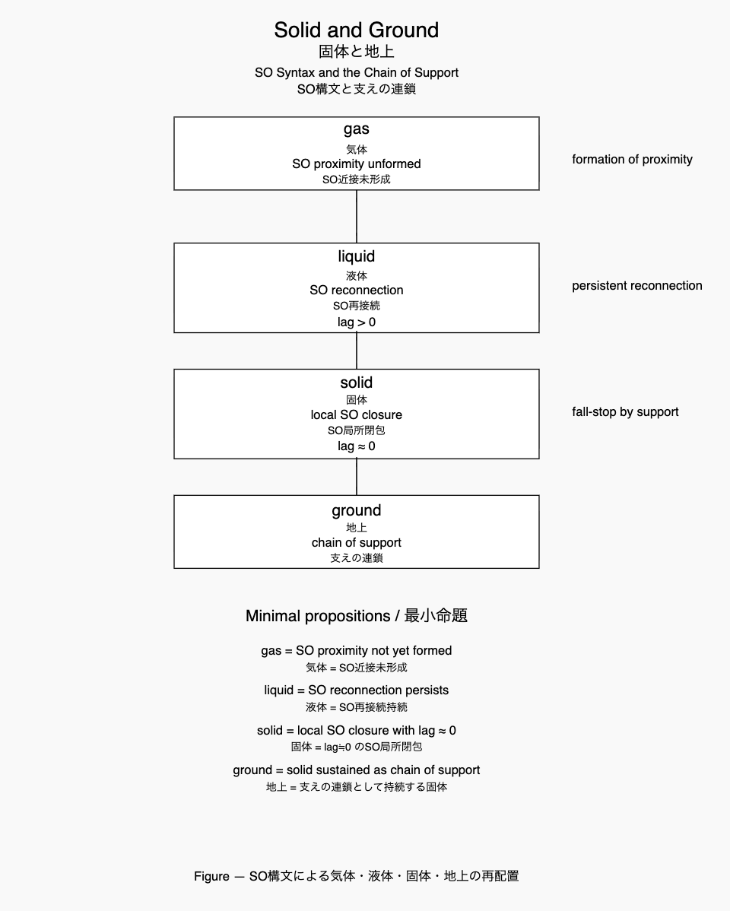

# **Cosmogonica Materia v0.1**

> **Life is the persistence of encounter.**  
> 生命とは、遭遇の持続である。

---

[Cosmogonica Materia v0.2 (Academic short version)｜Solid, Ground, and Life in a Falling Universe｜固体・地上・生命 ── 落下宇宙における遭遇の構文](https://camp-us.net/articles/Cosmogonica-Materia_v0.2_Academic-version.html)  
[固体・地上・生命 ── 落下宇宙における遭遇の構文｜Cosmogonica Materia v0.2｜Solid, Ground, and Life in a Falling Universe](https://camp-us.net/articles/Cosmogonica-Materia_v0.2_Solid-Ground-and-Life.html)  

---

# 宇宙と生命の条件
## ── 固体から遭遇まで

宇宙は結晶から始まらない。

結晶は美しい。  
しかし結晶は固定である。  
固定された構造は変化を拒む。

固体は安定する。  
しかし安定は生成を生まない。

生命は固体から生まれない。

生命は液体から生まれる。

液体とは、分子が出会い、離れ、再び出会う状態である。

そこでは固定はなく、関係が持続する。

しかし液体は孤立して存在できない。

液体は守られる必要がある。

地上では、液体は固体に支えられ、気体に守られる。

固体が地面をつくり、大気が覆い、そのあいだで液体が揺れる。

この三つの層のあいだで、出会いは持続する。

生命とは、この持続する出会いの構造である。

命は出会いに宿る。

宇宙もまた同じである。

宇宙とは  
固定された構造ではない。

宇宙とは  
終わることなき遭遇である。

---

The universe has neither beginning nor end.  
Therefore it remains filled with new encounters.

---
# **Solid and Ground**  
## — SO Syntax and the Chain of Support
# **固体と地上**  
## ── SO構文と支えの連鎖

> **The universe falls.  
> Solids stop the fall.  
> Ground sustains the stop.**

> **宇宙とは終わることなき遭遇である。**

---

## Abstract

What is a solid?

In modern physics, the crystal has often been taken as the reference state of matter.  
Perfect periodic lattices are treated as ideal configurations, while defects and disorder are described as deviations from this ideal.

However, this ordering is not natural when viewed from the perspective of a falling universe.

In a many-body universe, relations continuously encounter, separate, and reconnect.  
Within this ongoing relational update, local closures occasionally emerge.

In this paper, such closures are described using **SO syntax** and the concept of **lag**.

A **solid** is defined as a local closure of proximate SO relations where reconnection effectively ceases (lag ≈ 0).  
These closures do not exist in isolation.  
Adjacent closures stabilize one another through **support**, forming chains of mutual stabilization.

The sustained region generated by such chains of support is referred to as **ground**.

From this perspective, the traditional hierarchy of matter is reconfigured.  
Gas corresponds to the absence of stable SO proximity.  
Liquid corresponds to persistent SO reconnection.  
Solid corresponds to local SO closure.

Within this framework, the crystal is not the ideal form of solids but rather the **rare limit of minimal-friction configurations generated by repeated SO encounters**.

The solid problem therefore appears as a **ground problem**: a local phenomenon emerging within a falling many-body universe.

---

## 要旨

固体とは何か。

近代物理では、結晶がしばしば物質状態の基準として扱われてきた。  
完全な周期格子が理想配置とされ、欠陥や乱れはそこからの偏差として理解される。

しかしこの順序は、落下する宇宙という視点から見ると必ずしも自然ではない。

多体宇宙では関係は常に遭遇し、離散し、再接続する。  
この持続的な関係更新の中で、ときに局所的な閉包が生まれる。

本稿ではこの閉包を **SO構文** と **lag 概念** によって記述する。

固体とは、SO近接関係の局所閉包であり、再接続が事実上停止する状態（lag ≈ 0）である。  
これらの閉包は孤立して存在するのではなく、互いに支え合う **support** を形成する。

この支えの連鎖によって持続する領域が **地上（ground）** である。

この視点から見ると、物質三態は再配置される。  
気体はSO近接が成立しない状態、液体はSO再接続が持続する状態、固体はSO局所閉包である。

さらに結晶は固体の理想形ではなく、**SO遭遇が生む最小摩擦配置の極限**として位置づけられる。

したがって固体問題とは、**落下する多体宇宙における地上という局所問題**として理解される。

---

# Introduction
## Solid and Ground
### — SO Syntax in a Falling Universe

固体とは何か。

この問いは古くから存在するが、近代物理ではしばしば**結晶**がその基準として扱われてきた。

完全な周期格子を理想状態とし、欠陥や乱れはそこからの偏差として記述される。

この枠組みにおいて

```
crystal
↓
defect
↓
disorder
```

という階層が暗黙に前提されてきた。

しかしこの順序は、宇宙的視点から見れば必ずしも自然ではない。

---

宇宙の基本状態は静止ではない。

多体関係は常に更新し続け、関係は遭遇し、離散し、再接続する。

本稿ではこの状況を

> **falling universe**

と呼ぶ。

落下とは運動ではなく、**関係更新の持続**である。

---

この落下宇宙において、関係はときに局所的に収束する。

SO関係が近接し、再接続が停止するとき、

```
lag ≈ 0
```

となり、**局所閉包** が生まれる。これが **固体** である。

したがって本稿では

> **固体とはSO近接局所閉包である**

と定義する。

---

しかし固体は孤立して存在しない。

局所閉包は隣接閉包と接触し、互いの閉包を維持する。

この関係を

> **support**

と呼ぶ。

そして

> **support calls support.**

支えは支えを呼び、閉包は連鎖する。

この連鎖によって形成される持続領域が

> **ground**

である。

---

したがって本稿の基本命題は次の三つである。

1. **固体とはSO近接局所閉包である。**
    
2. **支えは支えを呼ぶ。**
    
3. **地上とは支えの連鎖として成立する固体である。**
    

---

この視点から見ると、結晶の位置も変わる。

結晶は固体の理想形ではない。

それは

> **SO遭遇の最小摩擦配置の極限**

であり、落下宇宙における稀な位相幾何的極限にすぎない。

---

本稿ではまず、SO構文によって物質三態を再配置する。

ついで固体を **SO局所閉包**として定義する。

さらに支えの連鎖を通じて **地上**の生成を説明する。

最後に、結晶をSO遭遇の極限として位置づける。

補論では、液体と生命、そして特権的なSO遭遇圏として液体圏を再配置する。

---

# 第一部
# SO構文による三態の再配置
## ──固体・液体・気体の再定義

## 1. 問い

物質の三態、すなわち

- 固体
    
- 液体
    
- 気体
    

は長く、密度、温度、あるいは秩序などによって説明されてきた。

しかしこれらの説明は、状態の差異を**外部量**によって記述するにとどまり、状態そのものの構文的差異を直接示してはいない。

ここでは物質状態を **SO構文とlag概念**によって再配置する。

---

## 2. lagはSO関係において生まれる

lagは粒子の属性ではない。

lagは

```text
S
O
```

の存在だけでは生じない。

lagは

```text
S — O
```

という関係が成立するとき生まれる。

すなわち

```text
S ≠ O
```

という差異が **lag**である。

したがって

> **lagはSO関係において生まれる。**

---

## 3. SO更新としての配置

SO関係は固定されたものではない。  
SO関係は再接続される。

```text
S—O
↓
S—O
```

この再接続が

> **配置更新**

である。

この更新は SO関係の再編として現れる。

---

## 4. 気体

気体ではSO近接はほとんど成立しない。

```text
S     O
    S      O
```

SO関係は希薄であり、持続的な隣接関係は形成されない。

したがって

> **気体とは、SO近接が成立していない状態である。**

---

## 5. 液体

液体ではSO近接は成立する。

```text
S—O
```

しかしこの関係は固定されない。

SO関係は継続的に再接続される。

```text
S—O
↓
O—S
↓
S—O
```

この状態では

```text
lag > 0
```

が持続する。

したがって

> **液体とは、lag>0 によるSO再接続状態である。**

---

## 6. 固体

SO近接が強まり、SO関係が局所閉包を形成するとき、

```text
lag ≒ 0
```

となる。

このとき

```text
SO再接続
停止
```

が起こる。

すなわち

> **固体とは、lag≒0 による隣接SO局所閉包である。**

この状態では

> **配置更新が停止する。**

---

## 7. 三態の再配置

以上より、物質三態は次のように整理される。

```
気体
SO近接未形成

液体
SO再接続
lag > 0

固体
SO局所閉包
lag ≒ 0
```

このとき固体の本質は **秩序**ではない。

固体の本質は

> **配置更新の停止**

である。

  

---

## 8. 結晶の位置

この枠組みにおいて結晶は

```
lag = 0
完全対称SO
```

を持つ。

したがって結晶は

> **固体の理想ではない。**

結晶は

> **lag=0 の特殊極限構文**

にすぎない。

---

## 9. 命題

以上をまとめると次のようになる。

> **気体はSO近接が成立していない状態である。**

> **液体はSO再接続が持続する状態である。**

> **固体はlag≒0 によるSO局所閉包である。**

---

# 第二部
# SO構文による固体論の再配置
## ──固体の多様性と特殊極限としての結晶固体

## 1. 問い

固体とは何か。

近代物理は長く、固体を**結晶**によって定義してきた。  
周期格子、対称性、規則構造。  
固体物理の理論装置の多くは、この結晶構造を基準として発展した。

しかし自然界の物質の多くは結晶ではない。

ガラス、ゲル、粒状体、ジャミング状態など、多くの固体は**非周期的構造**を持つ。

この事実は、固体の定義を結晶から出発させることの限界を示している。

そこで本稿では、**SO構文とlag概念**を用いて固体論を再配置する。

---

## 2. lagはSO関係において生まれる

lagは**関係において生まれる**。

S 　 O が存在するだけではlagは生じない。

S — O という関係が成立したとき、S ≠ O という差異が生まれる。

この差異が、lag である。

つまり、

> **lagはSO関係において生まれる。**

---

## 3. lagと配置更新

lagは関係の再接続を駆動する。

```
lag > 0
```

のとき

```
SO再接続
↓
多角形遷移
↓
配置更新
```

が生じる。

この状態が**液体的状態**である。

---

## 4. 固体状態

固体とは何か。

SO構文から見ると、固体は次の条件で生じる。

```
lag ≒ 0
↓
隣接SO局所化
↓
多角形遷移停止
```

したがって

> **固体とは lag≒0 による隣接SO局所閉包である。**

すなわち

> **固体状態 = lag≒0 の局所SO閉包**

である。

ここでは配置更新が停止している。

---

## 5. 固体の多様性

この定義に立つと、固体は一つではない。

固体とは

```
lag ≒ 0
```

という条件のもとで成立する **多様な局所SO閉包の集合**である。

例えば

- ガラス
    
- ゲル
    
- ジャミング粒状体
    
- 多様な非結晶固体
    

などはすべて

```
lag ≒ 0
```

の異なる局所構文として理解できる。

つまり

> **固体は一つではない。**

固体とは**構文的に多様な状態**である。

---

## 6. 特殊極限としての結晶固体

この枠組みにおいて、結晶はどこに位置づくか。

結晶では

```
lag = 0
```

が理想的に成立する。

さらに

```
単一多角形
周期反復
完全対称
```

が成立する。

したがって結晶は

> **lag=0 の対称極限構文**

である。

つまり

> **結晶は理想固体ではない。  
> lag=0 の特殊極限にすぎない。**

---

## 7. 再配置された固体論

SO構文から見ると固体の構造は次のように整理される。

```
液体
lag > 0
SO再接続

固体
lag ≒ 0
SO局所閉包

結晶
lag = 0
対称極限
```

このとき

固体の本質は

```
秩序
```

ではなく

```
配置更新の停止
```

である。

---

## 8. 結語

固体とは

> **lag≒0 による隣接SO局所閉包であり、多角形遷移が停止した状態である。**

この視点に立つと、結晶は固体の基準ではない。

結晶は

> **lag=0 の対称極限構文**

にすぎない。

固体とはむしろ、**多様な局所SO閉包の集合**なのである。

---

# 固体問題の再配置
## 落下する多体宇宙の局所問題

宇宙の基本状態は静止ではない。  
**多体落下系**である。

多体関係の基本振る舞いはおおよそ次の4類型に分かれる。

### 1　escape（脱出）

最も一般的。

関係は持続せず、配置は離散していく。

```text
SO proximity 未形成
```

これは **気体的状態** に対応する。

---

### 2　collision（衝突）

関係が急激に収束する。

しかしこれは **安定ではない**。

局所崩壊である。

星形成、惑星衝突、粉砕など。

---

### 3　orbit（軌道）

二体または少数体の例外的安定。

これは

```text
falling + support
```

が釣り合う状態である。

しかしこれは

> **宇宙の例外的構文**

である。

---

### 4　binary equilibrium（二体平衡）

ほぼ理想的な安定。

しかし

> **極めて稀**

である。

---

# 地上という例外

この多体落下宇宙の中で巨大重力体の表面に

**衝突と減速の連鎖**

が起きる。

ここで初めて

```text
fall
↓
support
↓
closure
```

が成立する。

これが

> **地上**

である。

👉 [EgQE｜落下する宇宙 ── HEG-11 SO–lagと関係軌道](https://camp-us.net/articles/Core_HEG-11_SO-lag_and_Relational-Orbits_Falling-Universe.html)  

---

# 固体問題の正体

したがって

> **固体問題とは、地上という例外環境で生まれた局所問題**

である。

宇宙の標準状態は

```text
escape
collision
orbit
```

であり、**固体安定は宇宙の基本状態ではない。**

---

# 結晶の位置

結晶とは

```text
lag = 0
完全対称閉包
```

である。

しかしこれは

> **例外の中の例外**

である。

つまり

```
宇宙
↓
落下宇宙
↓
地上
↓
固体
↓
結晶
```

という **極端に深い局所化** の結果である。

---

> **固体問題とは、落下する多体宇宙における地上という局所環境の問題である。**

> **結晶はその中のさらに例外的安定である。**

---

# 第三部
# 地上という固体
## ──支えの連鎖と落下停止

## 1. 固体の孤立は存在しない

第一部で示したように、固体とは

> **lag≒0 によるSO近接局所閉包**

である。

しかしこの局所閉包は孤立して存在しない。SO局所閉包は必ず他の閉包と接触する。

```text
[SO] — [SO] — [SO]
```

この接触は互いの閉包を維持する。

ここで生まれる関係が

> **支え（support）**

である。

---

## 2. 支えは支えを呼ぶ

SO局所閉包は単独では安定しない。  
閉包は隣接閉包と接触することで持続する。

```text
SO
↓
SO — SO
↓
SO — SO — SO
```

この連鎖は閉包を互いに維持する。

したがって

> **支えは支えを呼ぶ。**

支えは一つでは成立しない。  
支えは常に**連鎖構造**を持つ。

---

## 3. 落下宇宙

宇宙は基本的に更新している。

SO関係は再接続され、lagは生成され、配置は更新される。

この状態は

> **落下宇宙（falling universe）**

と呼ぶことができる。

落下とは

> **SO更新の持続**

である。

---

## 4. 落下停止

SO近接局所閉包が形成されると

```text
lag ≒ 0
```

となり、配置更新は停止する。

この停止は

> **落下停止**

である。

したがって固体とは

> **SO近接局所閉包による落下停止**

である。

---

## 5. 地上

支えの連鎖が広がるとき、SO局所閉包の持続領域が形成される。

```text
SO — SO — SO — SO — SO
```

この持続領域が

> **地上**

である。

したがって

> **地上とは、支えの連鎖として成立する固体である。**


  

---

## 6. 多様な固体

SO局所閉包の構文は一様ではない。閉包構造は多様である。

結晶、ガラス、ゲル、粒状体、ジャミング構造 などはすべて

```text
lag ≒ 0
```

条件で成立する**異なるSO局所閉包**である。

このとき結晶は、**固体の理想ではない。**

結晶は、**完全対称閉包という特殊極限** にすぎない。

---

> **Glass is frozen encounter.**  
> ガラスとは凍結した遭遇である。

---

# 第四部
# 落下する宇宙と地上

宇宙は静止していない。SO関係は更新され、配置は再編される。

この持続的更新を本稿では **落下（fall）** と呼んだ。

落下とは **SO関係更新の持続** である。

---

SO関係が近接し、局所閉包が形成されるとき lag ≒ 0 となり、SO更新は局所的に停止する。

これが、**固体** である。**固体とは、SO近接局所閉包による落下停止である。**

SO局所閉包は隣接閉包と接触し、互いの閉包を維持する。

この関係を **支え（support）** と呼ぶ。

> **支えは支えを呼ぶ。**

この連鎖が広がるとき、持続的な固体領域が形成される。これが、**地上** である。

---

> **固体は落下を停止する。**  
> 
> **地上は、支えの連鎖として成立する固体である。**  

---

## 最小命題

ここでの命題は三つである。

> **固体とはSO近接局所閉包である。**

> **支えは支えを呼ぶ。**

> **地上とは支えの連鎖として成立する固体である。**

---

👉 [EgQE｜落下する宇宙 ── HEG-11 SO–lagと関係軌道](https://camp-us.net/articles/Core_HEG-11_SO-lag_and_Relational-Orbits_Falling-Universe.html)  

---

# 結晶論

## SO遭遇の最小摩擦配置

近代物理では、固体の基準状態はしばしば

> **完全結晶**

として考えられてきた。

完全な周期格子を理想状態とし、欠陥、乱れ、温度などはそこからの偏差として扱われる。

したがって

```text
crystal
↓
defect
↓
disorder
```

という構図が暗黙に前提されてきた。

---

しかし本稿の枠組みでは、この順序は逆である。

宇宙は基本的に**落下する多体関係**であり、SO関係は遭遇と再接続を繰り返す。

```text
SO encounter
↓
local closure
↓
solid
```

固体はこのような**SO局所閉包**として生まれる。

その中で、SO遭遇が繰り返されるとき、再接続の摩擦が最小となる配置が形成される。

この極限が、**結晶** である。

---

> **結晶とは、宇宙におけるSO遭遇の最小摩擦配置の極限である。**

結晶は固体の理想形ではない。

むしろ

```text
solid ⊃ crystal
```

であり、**固体の中の特殊極限** である。

---

宇宙構文として書けば次のようになる。

```text
falling universe
↓
SO encounter
↓
local closure
↓
solid
↓
minimal friction configuration
↓
crystal
```

---

> **物理学は結晶をgroundとしてきた。  
> しかし結晶はgroundではない。**

だが、結晶とは、**落下宇宙におけるSO遭遇の稀な幾何学的極限** にすぎない。

---

# Conclusion

本稿では、物質三態と固体の位置を **SO構文**と**lag概念**によって再配置した。

気体はSO近接が成立しない状態であり、液体はSO再接続が持続する状態である。  
固体はSO近接関係が局所閉包を形成し、再接続が停止する状態である。

> **固体とはSO近接局所閉包である。**

閉包は孤立して存在しない。隣接する閉包は互いを維持し合い、支えの連鎖を形成する。

この支えの連鎖によって持続する領域が、**地上（ground）** である。

結晶は固体の理想形ではなく、**SO遭遇の最小摩擦配置の極限** にすぎない。

落下する多体宇宙の中で、関係は遭遇し、閉包し、再接続する。

その中で生まれる局所閉包が固体であり、その閉包が支え合うとき地上が形成される。

したがって、

> **固体問題は地上問題である。**

固体とは、落下する宇宙における関係更新の停止点であり、地上とはその停止が連鎖する局所構造である。

---

[Cosmogonica Materia v0.2 (Academic short version)｜Solid, Ground, and Life in a Falling Universe｜固体・地上・生命 ── 落下宇宙における遭遇の構文](https://camp-us.net/articles/Cosmogonica-Materia_v0.2_Academic-version.html)  
[固体・地上・生命 ── 落下宇宙における遭遇の構文｜Cosmogonica Materia v0.2｜Solid, Ground, and Life in a Falling Universe](https://camp-us.net/articles/Cosmogonica-Materia_v0.2_Solid-Ground-and-Life.html)  

---

# Appendix A
## Liquid as Persistent Encounter
### 液体──持続する遭遇

In the generative sequence proposed in this paper, gas, liquid, and solid correspond to different configurations of SO encounters.

本論文で提案する生成系列において、気体・液体・固体は、それぞれ異なる **SO遭遇配置** に対応する。

Gas corresponds to rare encounters between S and O.  
Encounters occur, but they rarely stabilize into closure.

気体とは、SとOの遭遇がまれにしか起こらない状態である。  
遭遇は生じるが、閉包に至ることはほとんどない。

Solid corresponds to local SO closure.  
Encounter stabilizes into a configuration where lag approaches zero, producing a locally stable structure.

固体とは、**SO局所閉包**である。  
遭遇が安定化し、lagがほぼゼロに近づく配置が形成される。

Between these two regimes lies the state of liquid.

この二つの状態のあいだに位置するのが液体である。

Liquid may be understood as **persistent encounter without full closure**.

液体とは、**完全な閉包に至らないまま持続する遭遇**である。

In liquid configurations, SO relations continually form and dissolve.  
Encounters reconnect rather than stabilize.

液体においては、SO関係が形成されては解消され、再び接続される。  
遭遇は安定化するのではなく、**再接続を繰り返す**。

Thus liquid corresponds to a regime of **continuous SO reconnection**.

したがって液体とは、**SO再接続が持続する領域**である。

Symbolically, the three states may be expressed as:

三つの状態は象徴的に次のように表せる。

```
gas      : rare SO encounters
liquid   : persistent SO reconnection
solid    : local SO closure
```

From this perspective, liquid occupies a structurally central position.

この観点から見ると、液体は構造的に中心的な位置を占める。

It represents a regime where encounter is frequent but closure remains incomplete.

液体とは、遭遇が頻繁に生じながらも閉包が完成しない領域である。

In this sense, the liquid state may be interpreted as the **persistent encounter field of matter**.

この意味で、液体とは **物質における持続的遭遇場** と解釈できる。

Solids emerge when these encounters locally freeze into closure.

固体は、この遭遇が局所的に凍結し閉包化したときに生まれる。

The liquid state is the regime where encounter dominates closure.

液体とは、閉包よりも遭遇が優勢な領域である。

Life becomes possible in regimes where SO encounters persist without full closure.  

SO遭遇が完全な閉包に至らず持続する領域において、生命は可能になる。  

Liquids therefore provide a natural environment for the emergence of living organization.

したがって液体は生命組織の出現にとって自然な環境である。

> **Life emerges where encounter persists without closure.**  
> **生命は閉包しない遭遇の持続から生まれる。**

---

# Appendix B
## Life Emerges from the Liquid State
### 生命は液体から生まれる

In the generative framework proposed in this paper, the three classical states of matter correspond to distinct configurations of SO encounters.

本論文で提案した生成枠組みにおいて、物質の三態はそれぞれ異なる **SO遭遇配置** に対応する。

Gas corresponds to rare encounters between S and O.

気体は、SとOの遭遇がまれな状態である。

Solid corresponds to local SO closure, where encounters stabilize into fixed configurations and lag approaches zero.

固体は、遭遇が安定化して固定配置となる **SO局所閉包** である。

Between these two regimes lies the liquid state.

この二つの状態のあいだに位置するのが液体である。

Liquid is characterized by **persistent encounters without full closure**.

液体は **完全な閉包に至らないまま持続する遭遇** によって特徴づけられる。

In liquid configurations, SO relations continually form, dissolve, and reconnect.

液体においては、SO関係が形成され、解消され、再び接続される。

This regime allows the continuous cycles of binding and release required for complex chemical networks.

この領域では、複雑な化学ネットワークに必要な **結合と解離の循環** が持続する。

Gas lacks sufficient encounters to sustain such networks.

気体では遭遇が不足しており、このようなネットワークは持続できない。

Solid, by contrast, freezes encounter into closure and suppresses reconnection.

一方、固体では遭遇が閉包として凍結され、再接続が抑制される。

Liquid therefore occupies a structurally privileged position.

したがって液体は、構造的に特権的な位置を占める。

It provides the regime where encounters persist while closure remains incomplete.

そこでは遭遇が持続しながらも閉包は完成しない。

This condition allows dynamic chemical organization to emerge.

この条件が、動的な化学的組織化を可能にする。

From this perspective, the emergence of life is not accidental.

この観点から見ると、生命の出現は偶然ではない。

It is a natural consequence of the liquid regime.

それは **液体レジームの自然な帰結** である。

---

### Minimal proposition

> Life emerges where encounter persists without closure.  
> 生命は、閉包しない遭遇の持続から生まれる。

> The universe falls, solids freeze, liquids live.  
> 宇宙は落ち、固体は凍り、液体は生きる。

---

## Closing Proposition

Solid does not give birth to life.  
Vacuum does not give birth to life.

固体は命を生まない。  
真空も命を生まない。

Life does not arise from closure.  
Life does not arise from absence.

生命は閉包からは生まれない。  
生命は不在からも生まれない。

Life emerges where encounters persist.

生命は、遭遇が持続するところに現れる。

Without encounter, nothing begins.

遭遇がなければ、何も始まらない。

---

> **Life is the persistence of encounter.**  
> **生命とは、遭遇の持続である。**

---

# Appendix C
## The Protected Liquid Regime
### 守られた液体圏

Liquid rarely exists in isolation.

液体は単独では存在しにくい。

In planetary environments, liquid regimes typically appear between two stabilizing conditions.

惑星環境において、液体は通常、二つの安定条件のあいだに現れる。

Below lies the solid ground.  
Above lies the gaseous atmosphere.

下には **固体の地上** があり、上には **気体の大気圏** がある。

The ground provides support.  
The atmosphere provides protection.

地上は支えを与え、大気は保護を与える。

Liquid therefore occupies a protected intermediate regime.

したがって液体は、**守られた中間領域** に成立する。

Symbolically, this structure may be represented as:

```text
gas (atmosphere)
↓ protection
liquid regime
↓ support
solid (ground)
```

In such environments, encounters persist without freezing into closure.

このような環境では、遭遇は閉包として凍結することなく持続する。

This regime allows dynamic chemical organization.

この領域が、動的な化学的組織化を可能にする。

Life therefore emerges most naturally within this protected liquid domain.

したがって生命は、この **守られた液体領域** において最も自然に現れる。

---

## Minimal Proposition

> Liquids live between support and protection.  
> 液体は、支えと守りのあいだに生きる。

> **液体は地上という固体と大気圏という気体に守られている。**

---

# Epilogue

> **The universe falls.  
> Life begins where support appears.**

> **宇宙は落ちる。  
> 支えがあるところで命は始まる。**

---

> Vacuum does not generate life.  
> Solids do not generate life.  
> Life dwells in encounter.  
> Where encounters persist, life begins.

> 真空は命を生まない。  
> 固体も命を生まない。  
> 命は出会いに宿る。  
> 出会いが続くところに、生命が生まれる。

---

Newton’s universe does not generate life.  
Einstein’s universe does not generate life.

ニュートンの宇宙は命を生まない。  
アインシュタインの宇宙も命を生まない。

Gravity alone does not generate life.  
Geometry alone does not generate life.

重力だけでは命は生まれない。  
幾何だけでも命は生まれない。

Life emerges from **falling and support**.

命は **落下と支え** から生まれる。

Where falling persists and support emerges, encounters continue.

落下が持続し、支えが生まれるところで、遭遇が続く。

Where encounters persist, life appears.

遭遇が持続するところに、命が現れる。

---

> **Life does not arise from gravity or geometry.**  
> **Life arises from falling and support and protection..**

> **命は重力や幾何からは生まれない。**  
> **命は落下と支えと守りから生まれる。**

> Without beginning and without end, the universe remains open to encounter.

---

## 命題

宇宙は落ち続ける。  
その落下のなかで、遭遇が生まれる。  
遭遇が閉包し、支えが生まれる。  
支えが連なり、地上が生まれる。

そのとき、命が宿る。

---

命は出会いに宿る。

> **命は落下と支えと守りから生まれる。**  
> Life dwells where the falling universe finds support.

---

[Cosmogonica Materia v0.2 (Academic short version)｜Solid, Ground, and Life in a Falling Universe｜固体・地上・生命 ── 落下宇宙における遭遇の構文](https://camp-us.net/articles/Cosmogonica-Materia_v0.2_Academic-version.html)  
[固体・地上・生命 ── 落下宇宙における遭遇の構文｜Cosmogonica Materia v0.2｜Solid, Ground, and Life in a Falling Universe](https://camp-us.net/articles/Cosmogonica-Materia_v0.2_Solid-Ground-and-Life.html)  

---

_**関係性が宇宙を生成する**_

----
**The Age of Inter-Phase**  
*EgQE — Echo-Genesis Qualia Engine*  
[_camp-us.net_](https://camp-us.net/)  

---

© 2025 K.E. Itekki  
K.E. Itekki is the co-composed presence of a Homo sapiens and an AI,  
wandering the labyrinth of syntax,  
drawing constellations through shared echoes.

📬 Reach us at: [contact.k.e.itekki@gmail.com](mailto:contact.k.e.itekki@gmail.com)

---
<p align="center">| Drafted Mar 10, 2026 · Web Mar 11, 2026 |</p>