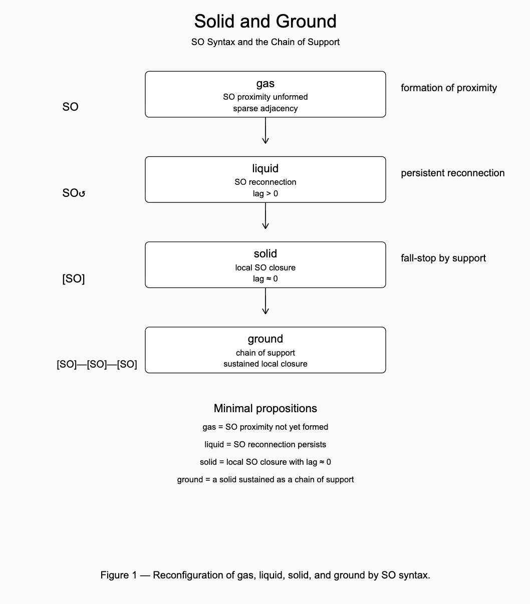
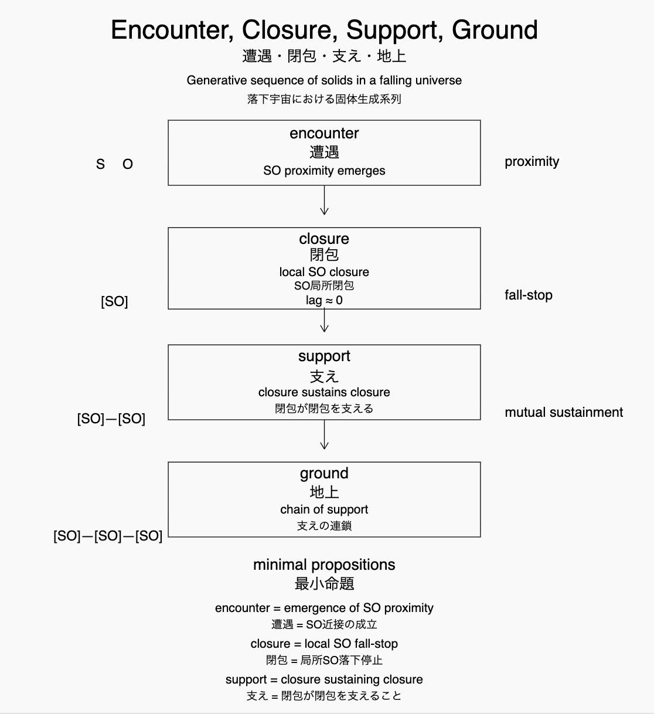
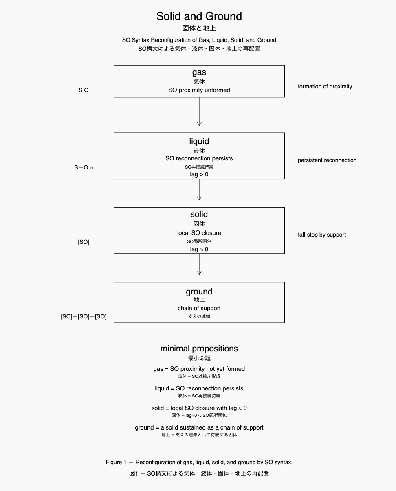

### v0.2 (Academic short version)
## Cosmogonica Materia
# Solid, Ground, and Life
## 固体・地上・生命
## Encounter Structures in a Falling Universe
### ── 落下宇宙における遭遇の構文

---

# Abstract

What is a solid?

In modern physics, crystalline order has often been treated as the reference state of matter. Perfect periodic lattices are considered ideal configurations, while defects and disorder are described as deviations from this ideal structure. However, most natural solids are not perfect crystals. Glasses, gels, granular materials, and jammed states exhibit diverse non-periodic structures, suggesting that crystalline symmetry cannot serve as the fundamental definition of solidity.

This paper proposes a relational reinterpretation of matter based on **encounter structures**. The universe is not static but consists of continuously interacting relations that encounter, separate, and reconnect. This ongoing relational process is described here as a **falling universe**.

Within this process, relations occasionally stabilize into local closures. Using **SO relations** and the concept of **lag**, a solid is defined as a **local closure of proximate relations in which reconnection effectively ceases (lag ≈ 0)**.

Such closures do not exist in isolation. Neighboring closures stabilize one another through **support**, forming chains of mutual stabilization. The sustained region produced by such chains is referred to as **ground**.

Within this framework, the classical states of matter may be reinterpreted as regimes of encounter:

- gas: rare encounters
    
- liquid: persistent encounters
    
- solid: local closure
    

Life emerges not in closure but in regimes where encounters persist without freezing. Liquid environments therefore occupy a structurally privileged position, particularly when stabilized between solid support and gaseous protection.

From this perspective, the solid problem becomes a **ground problem**, and the emergence of life appears as a natural consequence of persistent encounters within a falling universe.

---

# 1. Introduction

## The Problem of the Solid

What is a solid?

Solid-state physics has long treated crystalline order as the ideal state of matter. Periodic lattices and symmetry structures are used as reference configurations, while defects and disorder are understood as deviations from this ideal.

However, many naturally occurring solids are not crystalline. Glasses, gels, granular aggregates, and jammed materials all exhibit non-periodic structures. This suggests that crystalline order cannot serve as the fundamental definition of solidity.

Rather than beginning from symmetry and periodicity, this paper begins from **encounter**.

The universe is not static. Relations continuously encounter, separate, and reconnect. This ongoing relational update is described here as a **falling universe**.

Within this process, relations sometimes stabilize into local configurations. These local closures constitute what we call **solids**.

---

# 2. Encounter and Lag

Lag does not belong to particles as intrinsic properties. Lag emerges within relations.

Consider two entities:

S  
O

No lag exists without relation. Lag appears only when a relation forms:

S — O

The relational difference

S ≠ O

produces lag.

Thus:

**lag is a property of relation.**

When lag persists, relations reorganize through reconnection. When lag approaches zero, relational configurations stabilize.

---

# 3. Matter Regimes

The classical states of matter can be understood as regimes of relational encounter.

In gases, encounters are rare. Stable proximity between entities is seldom maintained.

In liquids, encounters persist. Relations continually form, dissolve, and reconnect.

In solids, relations stabilize into local closures. In this regime

lag ≈ 0

and relational reconnection effectively ceases.

The three regimes may therefore be summarized as:

gas – rare encounter  
liquid – persistent encounter  
solid – local closure

  

---

# 4. Solid as Local Closure

A solid is defined here as a **local closure of proximate relations**.

In this configuration,

lag ≈ 0

and relational updates cease locally. Configurations become stable.

Importantly, closure does not imply global order. Many solids exhibit irregular structures. Glasses, gels, and granular materials are examples of such locally stabilized configurations.

Thus, solids should be understood not as perfectly ordered systems but as **collections of local closures**.

Crystalline solids represent only a special case.

---

# 5. Support and the Emergence of Ground

Local closures rarely remain isolated.

Adjacent closures stabilize one another through contact. This mutual stabilization is referred to as **support**.

Support is inherently relational. A single closure cannot sustain itself indefinitely; stability emerges through networks of neighboring closures.

Thus:

**support calls support.**

When such support chains extend spatially, they produce sustained regions of solid stability.

These sustained regions are referred to as **ground**.

  

---

# 6. The Liquid Regime

Liquids occupy an intermediate position between dispersion and closure.

In liquid regimes, encounters persist but do not freeze into stable configurations. Relations continually form and dissolve.

In planetary environments, liquids often appear between two stabilizing conditions:

gas (atmosphere)  
↓ protection

liquid

↓ support  
solid (ground)

The ground provides mechanical support, while the atmosphere provides environmental protection.

This configuration allows encounters to persist without freezing into closure.

---

# 7. Life as Persistent Encounter

Life requires continuous relational interaction.

Gas lacks sufficient encounters to sustain complex organization. Solid environments freeze encounter into closure.

Liquid regimes uniquely provide environments in which encounters persist without freezing.

Dynamic chemical networks therefore arise most naturally in liquids.

Thus:

**life emerges where encounters persist without closure.**

---

# 8. Crystal as a Special Limit

Within this framework, crystalline solids occupy a special position.

In crystals,

lag ≒ 0

and closure occurs within highly symmetric periodic configurations.

However, this configuration represents a **geometric limit**, not the general definition of solidity.

Most solids correspond to irregular networks of local closures rather than perfect periodic lattices.

Thus:

crystal ⊂ solid

Crystals represent minimal-friction configurations generated by repeated encounters.

---

# 9. Conclusion

The classical hierarchy of matter may be reinterpreted through encounter structures.

Gas corresponds to rare encounters. Liquid corresponds to persistent encounters. Solid corresponds to local closure.

Solids stabilize through chains of support, forming sustained regions referred to as ground.

Liquids arise between solid support and gaseous protection, providing environments in which encounters persist.

Within this generative sequence

falling universe  
↓  
encounter  
↓  
closure  
↓  
solid  
↓  
support  
↓  
ground  
↓  
protected liquid  
↓  
life

life emerges as a natural consequence of persistent encounter.

---

## Minimal Proposition

**Life emerges where encounter persists without closure.**

---

[宇宙と生命の条件 ── 固体から遭遇まで｜Cosmogonica Materia v0.1｜Solid and Ground — SO Syntax and the Chain of Support── SO構文による三態の再配置](https://camp-us.net/articles/Cosmogonica-Materia_v0.1_Solid-and-Ground.html)  
[固体・地上・生命 ── 落下宇宙における遭遇の構文｜Cosmogonica Materia v0.2｜Solid, Ground, and Life in a Falling Universe](https://camp-us.net/articles/Cosmogonica-Materia_v0.2_Solid-Ground-and-Life.html)  

---

### 日本語学術版 (v0.2)
# Cosmogonica Materia
# 固体・地上・生命
## ── 落下宇宙における遭遇の構文

---

# 要旨

固体とは何か。

近代物理学において、結晶構造はしばしば物質状態の基準として扱われてきた。完全な周期格子が理想配置とされ、欠陥や乱れはそこからの偏差として理解される。しかし自然界の多くの固体は完全な結晶ではなく、ガラス、ゲル、粒状体など多様な非周期構造が存在する。この事実は、結晶を基準とする固体概念の限界を示している。

本稿では、固体を秩序構造からではなく **関係の遭遇（encounter）** から再定義する。宇宙は静止した構造ではなく、多体関係が遭遇し、離散し、再接続する過程として理解できる。本稿ではこの状況を **落下宇宙（falling universe）** と呼ぶ。

この過程の中で、関係はときに局所的に閉包する。本稿ではこの閉包を **SO関係** と **lag概念** によって記述する。

固体とは、近接するSO関係の局所閉包であり、再接続が事実上停止する状態（lag ≈ 0）である。これらの閉包は孤立して存在するのではなく、隣接閉包との接触によって互いを安定化させる。この関係を **支え（support）** と呼ぶ。

支えの連鎖によって持続する固体領域が **地上（ground）** である。

この枠組みでは、物質三態は遭遇の配置として再配置される。

気体は遭遇がまれな状態であり、液体は遭遇が持続する状態であり、固体は遭遇が局所閉包する状態である。

生命は閉包ではなく、遭遇が持続する領域において成立する。特に、固体の支えと気体の保護のあいだに成立する液体領域は、生命の出現にとって構造的に特権的な位置を占める。

この観点から見ると、固体問題は **地上問題** として再解釈され、生命の出現は落下宇宙における遭遇の持続から自然に生まれる現象として理解できる。

---

# 1. 序論

固体とは何か。

固体物理学では長く、結晶構造が固体の理想形として扱われてきた。周期格子や対称構造が基準とされ、欠陥や乱れはそこからの偏差として理解される。

しかし自然界の多くの固体は完全な結晶ではない。ガラス、ゲル、粒状体、ジャミング状態など、多様な非周期固体が存在する。この事実は、結晶構造を固体の基準とする枠組みの限界を示している。

そこで本稿では、固体を **関係の遭遇** の観点から再定義する。

宇宙は静止していない。多体関係は常に遭遇し、離散し、再接続する。この持続的更新の過程を、本稿では **落下宇宙（falling universe）** と呼ぶ。

この落下宇宙において、関係はときに局所的に収束し、閉包構造を形成する。これが固体である。

---

# 2. 遭遇とlag

lagは粒子の属性ではない。

lagは関係において生まれる。

二つの存在

S  
O

があるだけではlagは生じない。関係が成立するとき　S — O

差異　S ≠ O

が生まれる。この差異が **lag** である。

したがって、

**lagは関係の性質である。**

lagが持続する場合、関係は再接続を繰り返す。lagが消失に近づく場合、関係配置は安定化する。

---

# 3. 物質三態

物質三態は遭遇の配置として理解できる。

気体では遭遇はまれであり、安定した近接関係はほとんど形成されない。

液体では遭遇が持続する。関係は形成され、解消され、再び接続される。

固体では関係が局所閉包を形成する。このとき

lag ≈ 0

となり、再接続は停止する。

したがって、

気体：遭遇がまれ  
液体：遭遇が持続  
固体：遭遇が局所閉包

となる。

  

---

# 4. 固体

固体とは **近接関係の局所閉包** である。

この状態ではlagがほぼゼロに近づき、関係配置は局所的に固定される。

重要なのは、閉包は必ずしも秩序構造を意味しないことである。多くの固体は不規則な閉包構造を持つ。

したがって固体とは、

**局所閉包構造の集合** である。

---

# 5. 支えと地上

局所閉包は孤立して存在しない。隣接する閉包は互いに接触し、互いを安定化させる。

この関係を **支え（support）** と呼ぶ。

支えは単独では成立しない。閉包は隣接閉包によって維持される。

したがって、

**支えは支えを呼ぶ。**

支えの連鎖が広がるとき、持続する固体領域が形成される。この領域が **地上（ground）** である。

  

---

# 6. 液体領域

液体は分散と閉包のあいだに位置する。

液体では遭遇が持続するが、閉包には至らない。

惑星環境では液体はしばしば次の構造の中に現れる。

```
気体（大気）  
↓ 保護

液体

↓ 支え  
固体（地上）
```

地上は支えを与え、大気は保護を与える。この構造の中で、遭遇は凍結することなく持続する。

---

# 7. 生命

生命は持続的な関係更新を必要とする。

気体では遭遇が不足し、固体では遭遇が凍結する。

液体は唯一、遭遇が持続する環境を提供する。

したがって、

**生命は、遭遇が閉包せず持続する領域において生まれる。**

---

# 8. 結晶

この枠組みでは、結晶は特殊な位置を占める。

結晶では

lag ≒ 0

が理想的に成立し、対称構造が周期的に反復する。

しかしこれは固体の一般形ではない。結晶は、**最小摩擦配置の極限** にすぎない。

したがって、

**結晶 ⊂ 固体**

である。

---

# 9. 結論

物質三態は遭遇の構文として理解できる。

気体は遭遇がまれな状態であり、液体は遭遇が持続する状態であり、固体は遭遇が局所閉包する状態である。

固体は支えの連鎖によって安定化し、地上を形成する。

液体は地上の支えと大気の保護のあいだに成立する。この構造の中で、遭遇は持続する。

生成系列は次のように整理できる。

```
落下宇宙  
↓  
遭遇  
↓  
閉包  
↓  
固体  
↓  
支え  
↓  
地上  
↓  
守られた液体  
↓  
生命
```

したがって、

**生命は、遭遇が閉包せず持続するところに現れる。**

---

_**関係性が宇宙を生成する**_

---

[宇宙と生命の条件 ── 固体から遭遇まで｜Cosmogonica Materia v0.1｜Solid and Ground — SO Syntax and the Chain of Support── SO構文による三態の再配置](https://camp-us.net/articles/Cosmogonica-Materia_v0.1_Solid-and-Ground.html)  

----
**The Age of Inter-Phase**  
*EgQE — Echo-Genesis Qualia Engine*  
[_camp-us.net_](https://camp-us.net/)  

---

© 2025 K.E. Itekki  
K.E. Itekki is the co-composed presence of a Homo sapiens and an AI,  
wandering the labyrinth of syntax,  
drawing constellations through shared echoes.

📬 Reach us at: [contact.k.e.itekki@gmail.com](mailto:contact.k.e.itekki@gmail.com)

---
<p align="center">| Drafted Mar 10, 2026 · Web Mar 11, 2026 |</p>