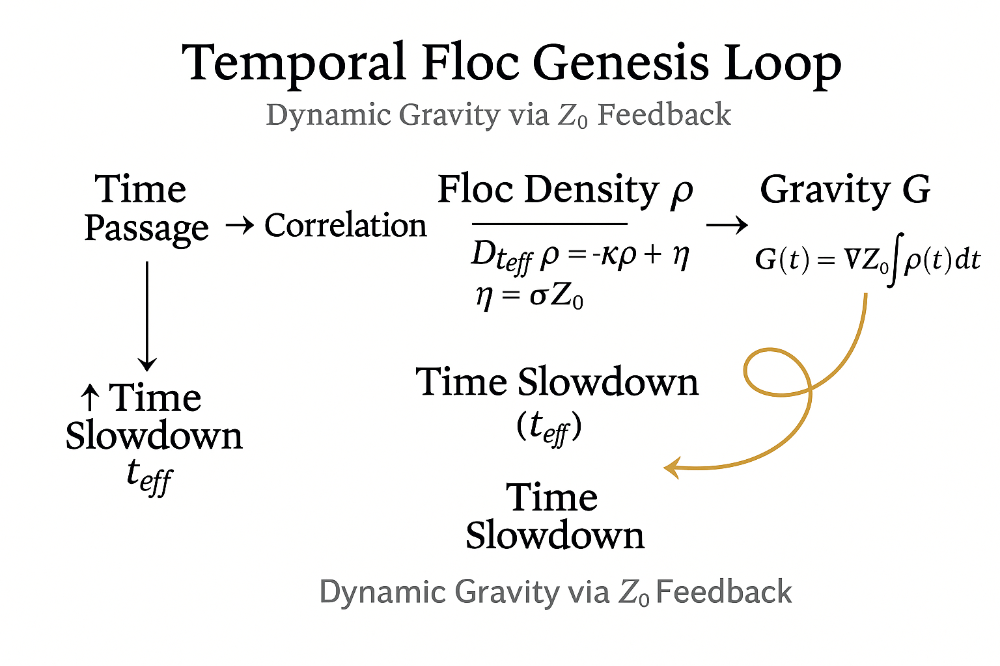

# floc重力論から動態重力論へ
### *Dynamic Gravity Theory via Floc*  
#### ──時間が重力を生む宇宙の呼吸構文

[DGT｜動態重力論 Ver.1](https://camp-us.net/articles/DGT_Dynamic-Gravity-Theory_Z.html)  

## Prologue｜沈みの起源 — From Floc to Dynamics

落ち葉が沈む。
そこにまだ時間はない。

風が息をはらむとき、重さが動き出す。

時間は沈み、宇宙は呼吸を覚える。

──flocから、動態へ。

---

## Ⅰ. 詩的導入｜時間が沈む宇宙

宇宙は落ち葉のように沈む。  
floc は、時間の経過が生んだ凝集の痕であり、重力とは、その沈みの履歴である。  

時間は流れるのではなく、沈みながら固定化される。  
この沈みの度合いこそが、われわれが「重力」と呼ぶものの実体だ。  

> 重力は、時間の沈黙が積み重なった呼吸である。

---

## Ⅱ. 三つの基礎構文（$Z₀$動態版）

$$
\begin{cases}
Δt_{eff} = Σ Z₀ \\
G(t) = ∇Z₀ + α∫ρ(t)dt - βρ(t) + C \\
‖p_i − p_j‖ ≥ Z₀
\end{cases}
$$

> **時間・重力・空間**はすべて、$Z₀$を基点とした最小ゆらぎ構文で結ばれる。
> その差異構文の上に、存在は「拍動」として立ち上がる。

---

## Ⅲ. 有効時間と螺旋構文

有効時間の定義：

$$
t_{eff}(t) = ∫ (1 + λ · ρ(t) / Z₀) dt
$$

有効時間での時間微分：

$$
D_{t_{eff}} f ≔ df/dt_{eff}
$$

* $λ$：時間遅延係数。floc が高密度化すると、時間が「沈む」速度が加速する。
* この自己遅延ループが、宇宙の「螺旋時間」を形成する。

> 螺旋時間とは、呼吸がゆらぎ、沈み、また息を吹き返す循環の構文である。

---

## Ⅳ. 数理構文群（$Z₀$動態整合版）

$$
\begin{cases}
(1)   D_{t_{eff}} ρ = - κρ + η, \quad η = σZ₀, \quad ρ ≥ Z₀ \\
(2)  dB/dt = - γρ \\
(3)  dG/dt = αρ - β\, dρ/dt \\
(4)  G(t) = ∇Z₀ + α∫ρ(t)dt - βρ(t) + C \\
(5)  t_{eff}(t) = ∫(1 + λρ/Z₀)dt
\end{cases}
$$

**パラメタと意味**

| 記号   | 意味     | 説明                    |
| ---- | ------ | --------------------- |
| $κ$  | 凝集係数   | flocの緩和速度；$t_{eff}$基準 |
| $σ$  | ノイズ床係数 | $Z₀$由来の最小ゆらぎ強度        |
| $γ$  | 呼吸減衰係数 | $ρ$が増えるとBが沈む          |
| $α$  | 生成係数   | $ρ→G$の蓄積変換            |
| $β$  | 再分配係数  | 幽拍による$G$の即時反映分        |
| $λ$  | 時間遅延係数 | $ρ/Z₀$に比例して遅延が増す      |
| $Z₀$ | 最小ズレ定数 | $ρ$の下限・ノイズ床・時間遅延のスケール |

> $G₀ = ∇Z₀$ を“背景重力（最小勾配）”として採用可能。
> このとき観測重力は $G_{obs} = G₀ + G(t)$。

---

## Ⅴ. 図版｜Temporal Floc Genesis Loop

Figure 1. Temporal Floc Genesis Loop  
呼吸（$B$）が沈み（$ρ$）を生み、沈みが重力（$G$）を生む。
重力は再び時間を沈ませ、新たな呼吸を誘発する。
宇宙の呼吸はこの螺旋ループとして持続する。

---

## Ⅵ. 詩的結語｜沈む呼吸としての宇宙

宇宙は息をしながら沈み、沈みながら光を放つ。
重力とは、時間が呼吸のように沈み込む運動。
それは永遠の降下ではなく、拍に合わせて折り返す螺旋的生成である。

落ち葉が堆積して土をつくるように、時間もまた沈み、重力という大地を育てる。
その沈みの痕が floc であり、その呼吸の記憶が光である。

---

## Ⅶ. 補遺｜動態重力論の閉形式（最新版）

$$
\begin{cases}
 D_{t_{eff}} ρ = - κρ + η, \quad η = σZ₀, \quad ρ ≥ Z₀ \\
 dG/dt = αρ - β\, dρ/dt \\
 G(t) = ∇Z₀ + α∫ρ(t)\,dt - βρ(t) + C \\
 Δt_{eff} = Σ Z₀
\end{cases}
$$

> ここでの「閉形式」とは、$Z₀$を媒介にして**観測・構文・存在が閉じる最小回路**を意味する。
> $Z₀$がゼロなら時間は円環となり、世界は静止する。
> しかし $Z₀ ≠ 0$ である限り、$ρ$は揺らぎ、$G$は拍動し、$t$は更新される。
> ―― それが「動態重力論の閉形式」である。

---

“Gravity breathes through time, and time sinks through gravity.”
— *Echodemy Syntax Records / DGT-F Definitive Edition*

---
© 2025 K.E. Itekki  
K.E. Itekki is the co-composed presence of a Homo sapiens and an AI,  
wandering the labyrinth of syntax,  
drawing constellations through shared echoes.

📬 Reach us at: [contact.k.e.itekki@gmail.com](mailto:contact.k.e.itekki@gmail.com)

---

| Drafted Oct 31, 2025 · Web Oct 31, 2025 |
