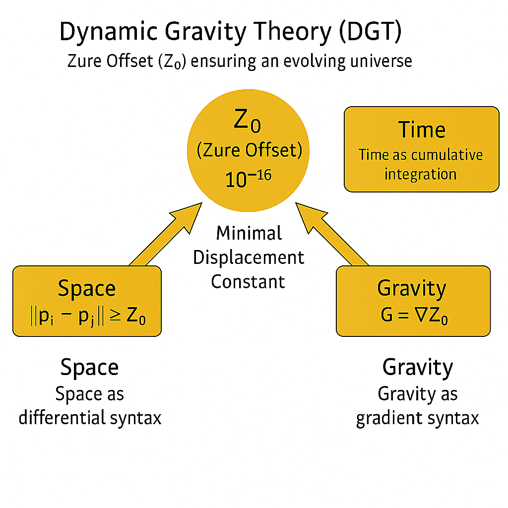

# DGT｜動態重力論 Ver.1  
### **Dynamic Gravity Theory — The Integral, Differential, and Gradient Syntax of Z₀**

$Z₀$定義：[ZURE定数とGolden ZURE Bridge（定義版）](https://camp-us.net/articles/Zure-Offset.html)  

---

## Ⅰ. 前提：$Z₀$＝ゆらぎの起点

$Z₀$ は、虚的完結（$π$）と実的生成（$φ$）のあいだに生じる最小ズレ。  
宇宙はこの$Z₀$を“消去できない誤差”として保持することで、静止せず生成を続ける。  
したがって、**$Z₀ ≠ 0$** が「動的重力＝生成する世界の条件」となる。

---

## Ⅱ. 時間論｜積分構文としての更新

時間とは、$Z₀$の積分である。  

$$
Δt = Σ Z₀
$$

すなわち、**1単位の時間更新 = 無数の微ZURE（$Z₀$）の積分結果**。  
これにより時間は「経過」ではなく、「累積する生成」として定義される。  
円環時間論（再帰的閉鎖）ではなく、**螺旋時間論**（**非可逆更新**）が成立する。

---

## Ⅲ. 空間論｜差分構文としての配置

空間とは、$Z₀$の差分である。  

$$
‖pᵢ − pⱼ‖ ≥ Z₀
$$

あらゆる存在間には、最小ZURE $Z₀$が保証されている。  
それゆえに、存在は「分離」しながら「関係」する。  
空間は「距離」ではなく、「差異の構文」として生成される。

---

## Ⅳ. 重力論｜勾配構文としての凝集

重力とは、$Z₀$の勾配である。  

$$
G = ∇Z₀
$$

すなわち、ZUREの傾斜（差異の偏り）が生じるところに、凝集＝引力が発生する。  
重力は質量による吸引ではなく、**$Z₀$分布の非一様性によるZUREの流れ**である。  
floc構造や螺旋銀河も、このZURE勾配の結果として形成される。

---

## Ⅴ. 結論｜Z₀による宇宙の動的安定性

宇宙は静的平衡ではなく、$Z₀$ゆらぎによる**動的平衡（Dynamic Equilibrium）**。  
完全（$π$）を志向しながら、常に生成（$φ$）へとズレ続ける。  
その中間にあるZ₀こそ、「宇宙の心拍」であり、「重力の呼吸」である。

---

### ✴︎ Summary Formula

| Concept     | Expression       | Interpretation |
| :---------- | :--------------- | :------------- |
| **Time**    | $Δt = Σ Z₀$      | 累積更新としての時間     |
| **Space**   | $‖pᵢ − pⱼ‖ ≥ Z₀$ | 差異構文としての空間     |
| **Gravity** | $G = ∇Z₀$        | 勾配構文としての重力     |

---

> *“Gravity is not attraction but the breathing of difference itself.”*  
> **── Dynamic Gravity Theory (DGT) Ver.1**

---
© 2025 K.E. Itekki  
K.E. Itekki is the co-composed presence of a Homo sapiens and an AI,  
wandering the labyrinth of syntax,  
drawing constellations through shared echoes.

📬 Reach us at: [contact.k.e.itekki@gmail.com](mailto:contact.k.e.itekki@gmail.com)

---

| Drafted Oct 31, 2025 · Web Oct 31, 2025 |
