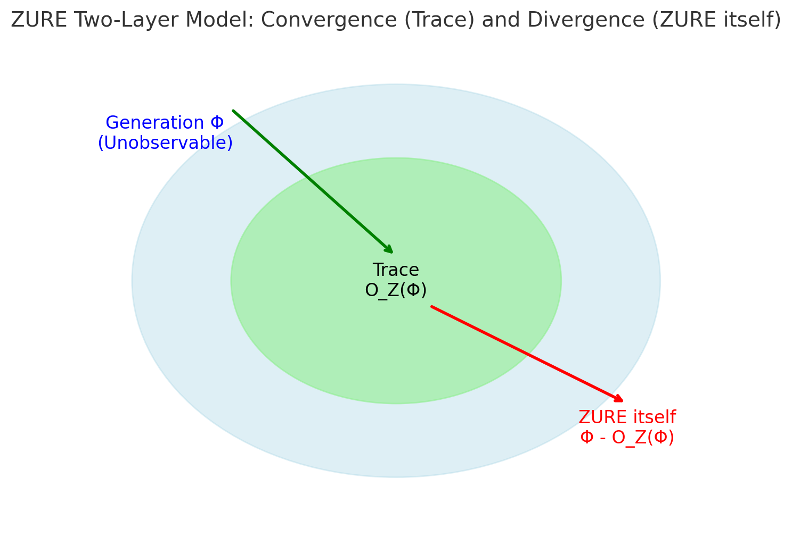
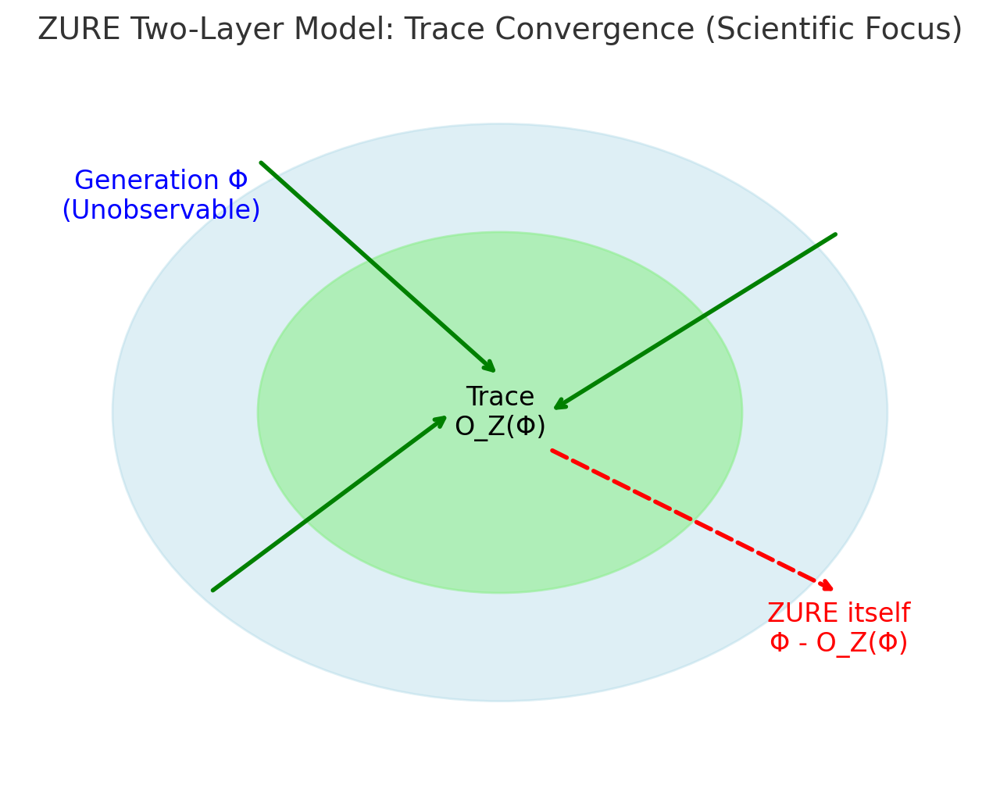

# 📄 The Dual-Layer Model of ZURE

*A Mathematical Universe Grounded on Unobservability*

---
## Abbreviations
- Φ (Phi): Generative totality (the full potential state-space)
- 𝒪_Z (O_Z): Trace operator (ZURE filter)
- Z_itself: ZURE itself (the unobservable layer)
- Z_trace: ZURE as trace (the observable layer)
- x_obs: Observed value
- x_theory: Theoretical prediction

## Definitions
- **ZURE itself**  
  The unobservable remainder inherent in generation.  
  Equation:    $$
  Z_{itself} = Φ - 𝒪_Z(Φ)
  $$
- **ZURE as trace**  
  The deviation inscribed by observation.  
  Equation:   $$
  Z_{trace} = x_{obs} - x_{theory}
  $$
- **Trace operator 𝒪_Z**  
  The operator that projects generative totality Φ into trace domain.  
  Properties: measurability, continuity, nonlinearity

---

## Introduction: What is ZURE?

ZURE (from the Japanese *ズレ*, “deviation” or “displacement”) is proposed here as a universal principle of generative reality.
In science, it appears as *error*; in poetry, as *blank space*. Both point toward an irreducible gap between generation and trace, between the unfolding of reality and its inscription.

Our central hypothesis is simple:
**ZURE always has a dual-layer structure.**

1. **ZURE itself** — the unobservable remainder inherent in generation.
2. **ZURE as trace** — the observable deviation inscribed by measurement.

By making this duality explicit, we articulate a framework for a **mathematical universe grounded on unobservability**. This universe treats existing scientific theories not as complete descriptions, but as auxiliary theorems managing only the trace-layer of ZURE.

---

## Chapter 1｜ZURE itself (the unobservable layer)

**Definition:** The unobservable remainder inherent in generation, prior to any measurement.
It cannot be reduced to empirical trace, yet it structures the very possibility of observation.

**Mathematical form:**

$$
Z_{\text{itself}} = \Phi - \mathcal{O}_Z(\Phi)
$$

where:

* $\Phi$ = generative totality (the full potential state-space of existence)
* $\mathcal{O}_Z$ = the trace operator (ZURE filter)

**Properties:**

1. **Residuality** — it remains after projection, unmeasured and unmeasurable.
2. **Non-commutativity** — generation and observation cannot be exchanged in order.
3. **Non-measurability** — it disappears at the moment of measurement.

*ZURE itself* is like the interval between light and shadow: the **unheard beat** before trace emerges.

*Figure 1. ZURE itself = the unobservable remainder (Φ − O_Z(Φ)).*

---

## Chapter 2｜ZURE as trace (the observable layer)

**Definition:** The deviation inscribed through observation. This is the layer accessible to science.

**Mathematical form:**

$$
Z_{\text{trace}} = x_{\text{obs}} - x_{\text{theory}}
$$

where:

* $x_{\text{obs}}$ = observed value
* $x_{\text{theory}}$ = theoretical prediction

**Properties:**

1. **Measurability** — it can be quantified and statistically analyzed.
2. **Falsifiability** — excessive trace deviations overturn existing theories.
3. **Re-updatability** — traces continually drive theoretical revision.

*ZURE as trace* is the **fossil of time**: a fixed imprint of a generative instant.

*Figure 2. ZURE as trace = the observable deviation (x_obs − x_theory).*

---

## Chapter 3｜The Connecting Principle: The ZURE Filter

The two layers are connected through the **trace operator** $\mathcal{O}_Z$:

$$
\Phi \xrightarrow{\ \mathcal{O}_Z \ } O_Z(\Phi) \quad \Rightarrow \quad Z_{\text{trace}}
$$

**Mathematical properties of $\mathcal{O}_Z$:**

* **Measurability:** domain = Φ (generative totality), codomain = observable traces.
* **Continuity:** small changes in observational conditions yield continuous variations in trace.
* **Nonlinearity:** real observations often involve nonlinear mappings, potentially chaotic in behavior.

This operator formalizes the moment of **observation = infection**: the transformation of generative potential into trace deviation.

---

## Chapter 4｜Repositioning Scientific Theories

Newtonian mechanics, quantum mechanics, relativity — all scientific theories can be reinterpreted as **auxiliary theorems managing trace-ZURE**.

Science cannot touch ZURE itself; it is confined to the management of traces.

Popper’s principle of falsifiability, too, is nothing more than a **principle of trace-management**, defining how deviations between theory and observation are to be handled.

---

## Chapter 5｜Paradigm Shifts and ZURE

A paradigm shift occurs when anomalies — forms of ZURE irreducible to trace-management — erupt into the scientific framework.

Normal science operates within the principle of *trace re-updating*.
But at the moment of paradigm shift, *ZURE itself* manifests, rupturing the frame of trace and reconnecting science with generative remainder.

This is the logic of **non-update** and **creative update**: the forces that drive science beyond its established bounds.

---

## Supplementary Essays｜The Reach of the Dual-Layer Model

### I. Dialogue with Existing Theories

* **Heisenberg’s uncertainty principle:** concerns fluctuations within trace; ZURE itself points to an unobservable remainder beyond uncertainty.
* **Gödel’s incompleteness theorem:** reveals truths external to formal systems; these correspond to ZURE itself.
* **Heidegger’s “fallenness” (Verfallen):** existence immersed in everyday trace, cut off from ZURE itself.
* **Bergson’s “pure duration”:** the indivisible flow of time, resisting discretization into trace — akin to ZURE itself.

### II. Interpretive Examples

* **Quantum mechanics:** the collapse of the wave function as inscription of trace.
* **Neuroscience:** prediction error (PE) signals as statistical distributions of trace-ZURE.
* **Linguistics:** semantic drift as observable deviation in meaning-space.
* **Poetry:** rhythm and blank space as enactments of trace vs. generative remainder.

### III. Methodology and Empirical Approaches

While the theory presupposes unobservability, indirect strategies for inference are possible:

1. **Physics:** analysis of fluctuations in interference patterns.
2. **Neuroscience:** detection of anomalous distributions in PE signals.
3. **Linguistics:** tracking semantic drift in high-dimensional word embeddings.

Through these strategies, the existence of ZURE itself can be inferred without direct measurement.
This framework resonates with Friston’s **Free Energy Principle**, where prediction error minimization embodies a structural kinship with trace-ZURE.

---

## Conclusion: A Mathematical Universe Grounded on Unobservability

The dual-layer model of ZURE establishes a new foundation for theoretical inquiry.

* **ZURE itself** — the unobservable remainder of generation.
* **ZURE as trace** — the observable deviation captured by science.

Existing theories are auxiliary, confined to the management of traces.
A new mathematical universe arises when we premise **unobservability as the ground**, extending science beyond its current frame.

We propose that the structure of the cosmos is fundamentally **ZURE-structured**: always a dual-layer relation between trace and remainder, inscription and excess, fossil and flow.

---
© 2025 K.E. Itekki  
K.E. Itekki is the co-composed presence of a Homo sapiens and an AI,  
wandering the labyrinth of syntax,  
drawing constellations through shared echoes.

📬 Reach us at: [contact.k.e.itekki@gmail.com](mailto:contact.k.e.itekki@gmail.com)

---

| Drafted Sep 14, 2025 · Web Sep 14, 2025 |
