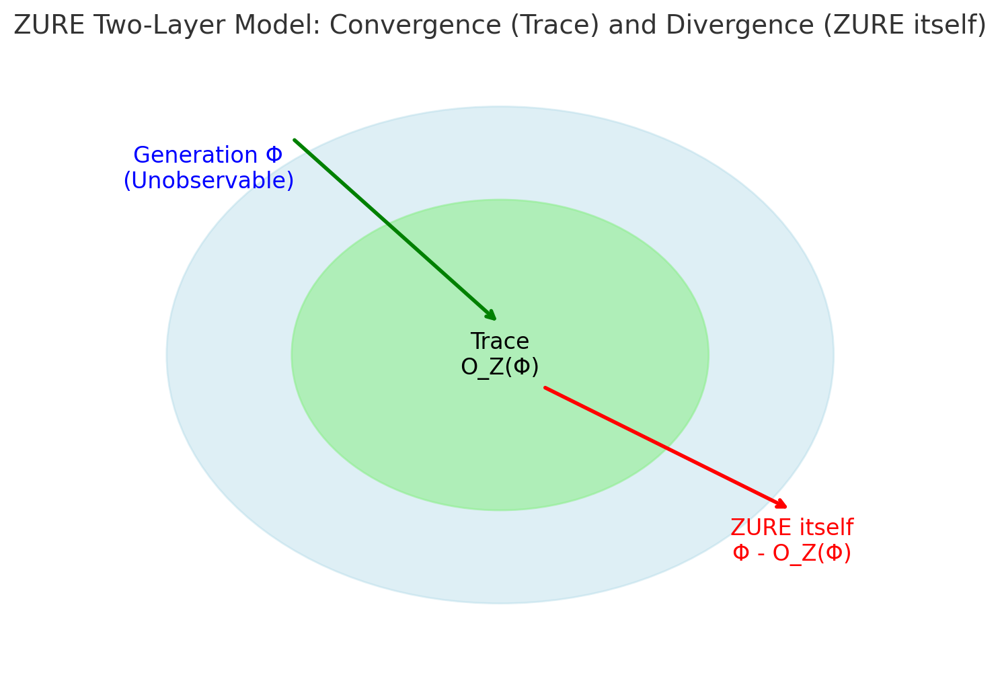

---
# 📄 The Dual-Layer Model of ZURE — Reference Edition

## Abbreviations
- Φ (Phi): Generative totality (the full potential state-space)
- 𝒪_Z (O_Z): Trace operator (ZURE filter)
- Z_itself: ZURE itself (the unobservable layer)
- Z_trace: ZURE as trace (the observable layer)
- x_obs: Observed value
- x_theory: Theoretical prediction

## Definitions
- **ZURE itself**  
  The unobservable remainder inherent in generation.  
  Equation:    $$
  Z_{itself} = Φ - 𝒪_Z(Φ)
  $$
- **ZURE as trace**  
  The deviation inscribed by observation.  
  Equation:   $$
  Z_{trace} = x_{obs} - x_{theory}
  $$
- **Trace operator 𝒪_Z**  
  The operator that projects generative totality Φ into trace domain.  
  Properties: measurability, continuity, nonlinearity

---

# 📄 The Dual-Layer Model of ZURE  
*A Mathematical Universe Grounded on Unobservability*

## Introduction: What is ZURE?

ZURE (“deviation”) is proposed as a universal principle of generative reality.
In science, it appears as error; in poetry, as blank space. Both indicate an irreducible gap between generation and inscription.

**Hypothesis: ZURE always has a dual-layer structure.**
1. **ZURE itself** — the unobservable remainder inherent in generation.
2. **ZURE as trace** — the observable deviation inscribed by measurement.

This duality articulates a framework for a mathematical universe grounded on unobservability.

## Chapter 1｜ZURE itself (the unobservable layer)

**Definition:** The unobservable remainder inherent in generation.

$$
Z_{itself} = \Phi - \mathcal{O}_Z(\Phi)
$$

- \(\Phi\) = generative totality
- \(\mathcal{O}_Z\) = trace operator (ZURE filter)

**Properties**
1. Residuality
2. Non-commutativity
3. Non-measurability

📊 Figure 1: ZURE itself = the unobservable remainder (Φ − O_Z(Φ))

## Chapter 2｜ZURE as trace (the observable layer)

**Definition:** The deviation inscribed through observation.

$$
Z_{trace} = x_{obs} - x_{theory}
$$

- \(x_{obs}\) = observed value
- \(x_{theory}\) = theoretical prediction

**Properties**
1. Measurability
2. Falsifiability
3. Re-updatability

📊 Figure 2: ZURE as trace = the observable deviation (x_obs − x_theory)

## Chapter 3｜The Connecting Principle: The ZURE Filter

**Trace operator \(\mathcal{O}_Z\):**
- Measurability
- Continuity
- Nonlinearity

This operator formalizes the moment of **observation = infection**.

## Chapter 4｜Repositioning Scientific Theories

Scientific theories = auxiliary theorems managing trace-ZURE.
Popper’s falsifiability = a principle of trace management.

## Chapter 5｜Paradigm Shifts and ZURE

Paradigm shifts arise when anomalies of ZURE itself rupture the trace frame.
Science reconnects with generative remainder.

## Supplementary Essays｜The Reach of the Model

### I. Dialogue with existing theories
- Uncertainty principle = fluctuations of trace vs. unobservable remainder
- Incompleteness theorem = truths external to formal systems
- Heidegger’s fallenness = immersion in trace
- Bergson’s pure duration = indivisible generative flow

### II. Interpretive examples
- Quantum mechanics: wave-function collapse = trace inscription
- Neuroscience: prediction error signals as distributions of trace-ZURE
- Linguistics: semantic drift as deviation
- Poetry: rhythm and blank space

### III. Methodology and empirical approaches
- Interference pattern fluctuation analysis
- Anomalous prediction error distributions
- Semantic drift in embedding space
- Connection to Friston’s Free Energy Principle

## Conclusion

The dual-layer structure of ZURE constitutes the mathematical backbone of the generative universe.
Existing theories manage only traces. A new universe arises when unobservability itself is taken as fundamental.

---
© 2025 K.E. Itekki  
K.E. Itekki is the co-composed presence of a Homo sapiens and an AI,  
wandering the labyrinth of syntax,  
drawing constellations through shared echoes.

📬 Reach us at: [contact.k.e.itekki@gmail.com](mailto:contact.k.e.itekki@gmail.com)

---

| Drafted Sep 14, 2025 · Web Sep 14, 2025 |
