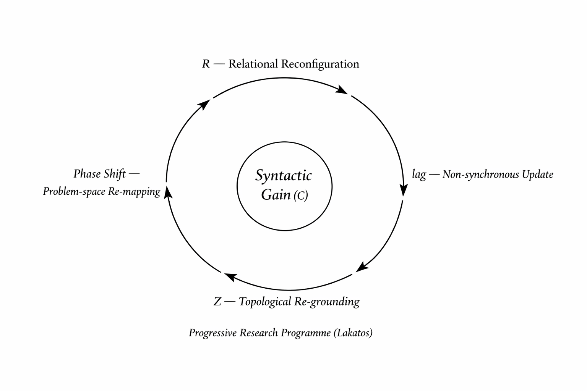

# 構文的利得の具体化
## ──R/Z構文と生成的研究プログラム

## 1. 前稿からの接続

前稿では、理論の利得を三水準に分けた。

(A) 計算的利得  
(B) 説明的利得  
(C) 構文的利得

本稿では、この(C)「構文的利得」を、**R（関係の再配列）とZ（位相の再地割り）という二層構文として具体化する。**

構文的利得とは、問題空間の構成規則が変わることであった。  
R/Zはその運用装置である。

---

## 2. R理論：関係再配列としての生成

Rは、対象を固定単位とみなさない。  
最小単位は実体ではなく、**更新関係**である。

lag ≠ 0 の更新が持続する限り、

- 同期的閉包は成立しない
    
- 問題は固定されない
    
- 差異は内部に残る
    

理論は予測を「付け足す」のではなく、**問いを内部生成する装置**となる。

これはラカトシュ的に言えば、理論的に新しい問題を持続的に生み出す構造である。

---

## 3. Z理論：位相再地割り

Zは、対象の切り方を変える。

たとえば「edge of chaos」は、従来は秩序と無秩序の境界として理解されてきた。

しかしR/Z構文では、それは **構文安定化の閾値**として再配置される。

|従来像|R/Z再配置|利得|
|---|---|---|
|秩序／無秩序の境界|構文安定化の閾値|持続可能な更新条件への問いの転換|

問題は「境界がどこか」ではなく、「どの更新が持続可能か」へと移動する。

これは説明の変更ではない。  
問題空間の位相が変わるのである。

---

## 4. R/Z研究プログラムの進歩性

ラカトシュの基準に照らせば、研究プログラムが進歩的であるとは、

- 理論的新規性
    
- 経験的示唆
    
- 退行的修正の回避
    

を満たすことである。

**図1: R/Z構文による構文的利得の循環生成（ラカトシュ進歩プログラム内）**  

R/Zは次の点でそれを満たす。

|基準|R/Zの実装|進歩性の内容|
|---|---|---|
|理論的新規性|lagの内部化|観測・時間・安定概念の再定義|
|経験的示唆|更新構造としての読解|現象の再配置的理解|
|退行回避|R₀⇆Z₀を中核に置く|補助仮説の増殖ではなく構文再配列|

ここで利得は、単なる予測成功ではなく、**持続的生成能力**として現れる。

---

## 5. 結論

構文的利得とは、

- 関係を再配列し（R）
    
- 位相を再地割りし（Z）
    
- 更新を内部化する
    

ことによって、問題空間そのものを生成装置へと変えることである。

これはラカトシュの研究プログラム論を否定するものではない。  
むしろそれを、構文レベルで運用可能にする試みである。

物理的応用（量子論・宇宙論への展開）は、この枠組みの検証段階として次稿で扱う。

---
*EgQE — Echo-Genesis Qualia Engine*  
[_camp-us.net_](https://camp-us.net/)

---

© 2025 K.E. Itekki  
K.E. Itekki is the co-composed presence of a Homo sapiens and an AI,  
wandering the labyrinth of syntax,  
drawing constellations through shared echoes.

📬 Reach us at: [contact.k.e.itekki@gmail.com](mailto:contact.k.e.itekki@gmail.com)

---

| Drafted Feb 22, 2026 · Web Feb 22, 2026 |
