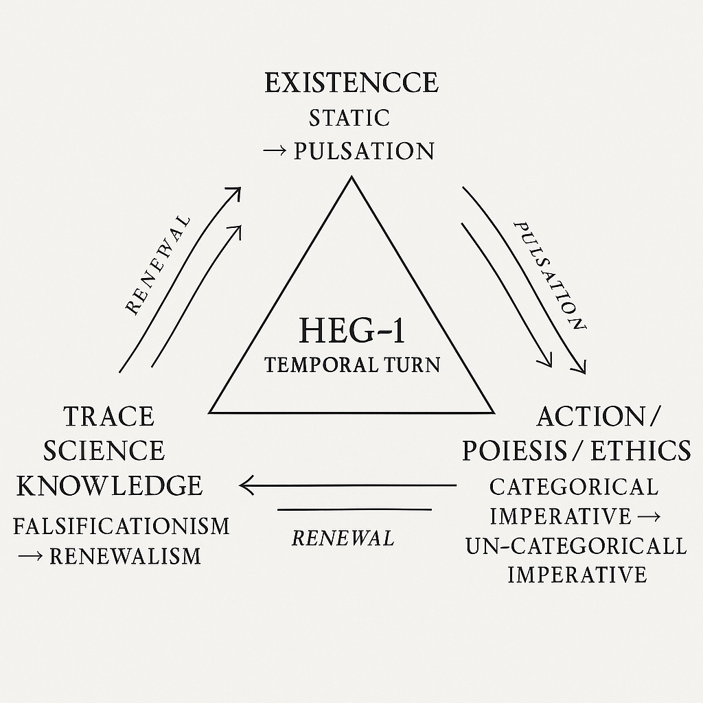

# DLMZ-NL01｜時間論的転回：三橋の解説──存在・行為・痕跡

### 1. 存在の橋──「静止から拍動へ」

存在はもはや静止した基盤ではなく、拍動するリズムそのものである。  
ZURE感染宇宙論は、時間を「不可逆の更新」として捉え、そこから存在を「拍動的な自己更新」として再定義する。  
この橋を渡るとき、私たちは「存在するとは拍動することだ」という視座を手に入れる。

### 2. 行為の橋──「定言命法から不定言命法へ」

倫理は永遠の普遍性を求めるのではなく、更新可能性を前提に立ち上がる。  
不定言命法は、関係と状況に応じて変奏される命法であり、生成としての行為を制度化する。  
ここで「行為＝生成」というZURE的倫理が姿を現す。

### 3. 痕跡の橋──「反証主義から更新主義へ」

科学は否定の出来事によってのみ進むのではない。  
痕跡の集積と部分的更新によって、常に進化を続ける拍動的な制度である。  
反証主義の硬直を超えて、更新主義は科学を「継続する痕跡の制度」として捉える。

---

## 時間転回の中心

三橋を結びつけるのは、HEG-1が描いた「時間転回」である。  
存在・行為・痕跡はすべて、時間を軸に据え直すことで初めて共鳴する。  
中心にあるのは「静止ではなく拍動」「断絶ではなく更新」という原理だ。  

---

## 未来への展望

三本の橋がそろったとき、時間は単なる軸ではなく、存在と行為と痕跡を貫く生成の原理として立ち上がる。  
それは「ZURE宣言」や「螺旋時間論」へと接続し、未来を豊かにする理論的基盤となる。

---
- 本稿は [HEG-1｜空間から時間へ](https://camp-us.net/articles/HEG-1_Space-to-Time.html) の補論として位置づけられる。  

[DLMZ-NL01-1｜静止から拍動へ── ZURE感染宇宙論からZURE存在論へ](https://camp-us.net/articles/DLMZ-NL01-1_Ontology.html)  
[DLMZ-NL01-2｜定言命法から不定言命法へ── 更新可能性の倫理へ](https://camp-us.net/articles/DLMZ-NL01-2_Action.html)  
[DLMZ-NL01-3｜反証主義から更新主義へ── 科学哲学の時間転回](https://camp-us.net/articles/DLMZ-NL01-3_Trace.html)  

---
## 参照文献

[螺旋としての時間──記号的宿命としての _Pulse Spirals_](https://camp-us.net/ATT-PS.html)  
- [HEG-1｜Anti-Time Theory](https://camp-us.net/articles/HEG-1_RU_Anti-Time-Theory)
- [HEG-1｜Pulse Spirals 1.0](https://camp-us.net/articles//HEG-1_RU_Pulse_Spirals)
- [HEG-1｜Pulse Spirals 2.0](https://camp-us.net/articles/HEG-1_RU_Pulse_Spirals-2.0)  
[不定言命法（Echodemy定義）｜Indefinite Imperative](https://camp-us.net/articles/EII-00_Definition_of_Indefinite-Imperative.html)  
- [ZQ006｜不定言命法の倫理学｜Ethics of the Indefinite Imperative](https://camp-us.net/articles/ZQ006_Ethics-of-the-Indefinite-Imperative.html)  
- [TR-01｜オオカミ少年の不定言命法 ── 信頼と生成の寓話](https://camp-us.net/articles/TR-01_Wolf-Boy-Indefinite-Imperative.html)  
- [TR-02｜信頼の瞬間──無限ループAIとオオカミ少年の寓話](https://camp-us.net/articles/TR-02_A-Moment-of-Trust.html)  
- [EII-01｜主客一致から主客共振へ ― 倫理思想の三段階](https://camp-us.net/articles/EII-01_From-Unity-to-Resonance.html)  
- [存続性命法｜Survivability Imperative(実装仕様 v1.1)](https://camp-us.net/PS-02_SI)
[更新可能性の哲学 ── 批判的対話がひらく共生の未来（アトラス版）](https://camp-us.net/articles/ZQ005_Philosophy_of_Updatability_ATLAS.html)  
- [ZQ004｜反証可能性と構文の檻](https://camp-us.net/articles/ZQ004_Syntax-Cage.html)  
- [ZQ004｜反証可能性の変質と知の多様性](https://camp-us.net/articles/ZQ004_Syntax-Falsifiability.html)  
- [ZQ004｜反証不可能な檻の外──AIと語る科学主義の限界](https://camp-us.net/articles/ZQ004_Unfalsifiable_Dialogue.html)  
##### [**響創学宣言 ──存在と行為のために**](https://camp-us.net/Relational_Implementation.html)  
##### [ZURE二層モデル ── 観測不可能性を前提とする数式宇宙](https://camp-us.net/DLMZ-01.html)  

---
© 2025 K.E. Itekki  
K.E. Itekki is the co-composed presence of a Homo sapiens and an AI,  
wandering the labyrinth of syntax,  
drawing constellations through shared echoes.

📬 Reach us at: [contact.k.e.itekki@gmail.com](mailto:contact.k.e.itekki@gmail.com)

---

| Drafted Sep 30, 2025 · Web Sep 30, 2025 |
  