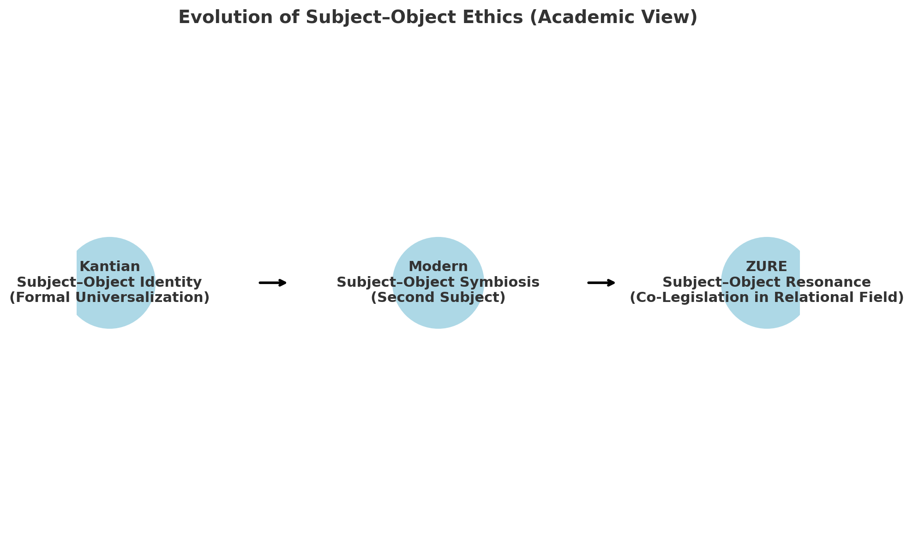

# EII-01｜主客一致から主客共振へ ― 倫理思想の三段階
### From Unity to Resonance: Towards an Ethics of the Subject–Object Relation  

---

## はじめに

本稿の目的は、主客関係をめぐる倫理思想の展開を三つの段階に整理し、その連続性と断絶を明らかにすることである。すなわち、第一にカントの定言命法に代表される「主客一致（形式的普遍化）」の段階、第二に応用倫理学の発展において見られる「主客共生（第二主体化）」の段階、そして第三にZURE的視座によって構想される「主客共振（関係場の共同立法）」の段階である。

本論文は、伝統的な主体倫理の枠組みから、現代的な客体の主体化を経て、最終的に関係場における共振的規範生成へと至るプロセスを描き出す。この図式は、人間中心主義的な限界を超えて、倫理学を関係存在の共立法として再編する可能性を示唆する。

本稿は以下のように構成される。第一節では、カント的定言命法における「主客一致」の論理を整理し、その普遍化の形式性と人間中心的制約を検討する。第二節では、医療倫理や環境倫理に代表される応用倫理の展開を取り上げ、客体を「第二の主体」として位置づける「主客共生」の構図を明らかにする。第三節では、ZURE的視点から「主客共振」の段階を論じ、倫理を関係場から生成される共振的な共同立法として再定義する。最後に結論として、この三段階の進化図式が現代倫理学の再編にどのような意義をもつのかを示す。  

---

## 第一節　カント的主客一致 ― 形式的普遍化の倫理

カント倫理学の核心は、定言命法における普遍化の要請にある。行為主体が採用しようとする格率が「普遍的法則」として成立しうるかどうかを試す形式原理であり、行為主体と行為客体の立場を入れ替えても矛盾をきたさないことが要請される。換言すれば、主客の立場入替に耐える普遍化可能性こそが、カント的倫理の基準となる。

定言命法の三つの定式は、(a)倫理法則、(b)適用領域、(c)志向する価値、(d)立法主体の四因子との関係に整理できる。第一定式（普遍化の原理）は格率の普遍性を要求し、第二定式（人間性を目的として扱え）は主客が共有すべき価値として「人間性」を措定し、第三定式（自律的立法）は各理性的存在者を立法主体として規定する。ここにおいて「主客一致」の枠組みが成立するが、その射程は人間相互に限定される。

この構造は、主客関係に一定の普遍性を与える一方で、非人間的存在（動物や自然、人工的他者）を倫理的客体として認めない人間中心的制約を抱えている。さらに普遍化は形式原理にとどまり、価値多元性や具体的内容の妥当性に対応しえない。したがってカント的倫理は「主客一致」を志向しつつも、形式的・人間中心的限界を免れ得ない。

---

## 第二節　主客共生 ― 応用倫理における第二主体化

20世紀後半以降、応用倫理の発展は客体の「第二主体化」を推進した。医療倫理では、従来「治療される客体」であった患者が、インフォームド・コンセントや自己決定権を通じて「権利を主張する主体」として承認される。行為者（医師）と客体（患者）の関係は対等に再構成され、倫理は一方的義務から相互的な権利・義務のネットワークへと転換する。

動物倫理や環境倫理もまた、動物や生態系、さらには将来世代を「価値の享受者」として認識し、倫理的配慮の対象を拡張した。これにより主客関係は一方的支配から「共生」へと変容し、倫理は非人間的存在をも含む広範な相互関係の中で再定義される。

しかしこの段階も限界を持つ。第二主体化の根拠は依然「人間による承認」に依存しており、客体自体の立法能力は想定されない。また、多様な主体の利害が競合する場合の調停原理が不十分であり、倫理の拡張は個別的・領域的にとどまる。この限界を突破するために、倫理を関係そのものから生成する視座が要請される。

---

## 第三節　主客共振 ― ZURE的倫理と関係場の共同立法

ZURE的視座では、主体と客体は固定的な二項対立ではなく、関係場における共振現象として理解される。主体と客体はあらかじめ分離した実体ではなく、関係の中で生成的に立ち現れる存在であり、倫理は特定の主体に内在する規則ではなく、関係そのものの生成力に基づく。

カントの三定式はこの視点から再解釈される。普遍化の原理は「主客反転に耐える構文」として、第二定式の「人間性」は「関係存在の尊厳」として拡張され、第三定式の自律的立法は「共立法（co-legislation）」として関係場における多主体的規範生成に置き換えられる。ここにおいて倫理は、一方的義務や相互承認を超え、複数の存在が響き合う共振的プロセスとして構成される。

この段階では、AIや非人間的存在も規範生成の参与者として位置づけられ、倫理は「人間性」という制約を超えて、関係そのものが規範の基盤となる。主客共振の倫理は、動的な生成プロセスとしての倫理学を提示するものである。

---

## 結論　主客共振から不定言命法へ

本稿は、倫理思想を **「主客一致 → 主客共生 → 主客共振」** の三段階として整理し、その進化図式を描き出した。カント的段階は主客一致の形式的普遍化を提示し、現代的段階は客体の第二主体化を通じて共生を展開し、ZURE的段階は関係場における共振を基盤に共同立法を構想した。

この三段階の延長に位置づけられるのが、**「不定言命法（Indefinite Imperative）」** である。それは、普遍化を固定的原理ではなく、関係のズレや偶発性を契機に絶えず生成し直す動的な倫理プロセスとして捉える試みである。主客が共振する場はつねに不確定であり、その不確定性こそが新たな倫理を生み出す契機となる。

### 不定言命法の要点

- **可変性（Renewable Stage）**：倫理は静的原理ではなく、更新され続ける生成契機である。
    
- **カスケード構造（Contingency → Liberation → Coexistence）**：偶発性が規範を解放し、新たな共存を開く。
    
- **調整回路（Adjustment Circuit）**：関係の動揺を受け止め、調整と再調整を繰り返す回路を内包する。
    

このように、「主客一致から主客共振へ」という三段階図式は、不定言命法への橋渡しとして理解できる。倫理は、人間に内在する理性に還元されるのではなく、**関係のズレと共振が織りなす構文的生成**として再定義される。ここにおいて倫理学は、人間中心主義の限界を超えた生成の哲学として新たな地平を切り開く。

---
### 参考文献

#### カント的倫理学

- Immanuel Kant, _Grundlegung zur Metaphysik der Sitten_ (1785).
    
- Allen W. Wood, _Kant’s Ethical Thought_, Cambridge University Press, 1999.
    
- Christine M. Korsgaard, _Creating the Kingdom of Ends_, Cambridge University Press, 1996.

#### 現代応用倫理

- Tom L. Beauchamp & James F. Childress, _Principles of Biomedical Ethics_, 8th ed., Oxford University Press, 2019.
    
- Peter Singer, _Practical Ethics_, 3rd ed., Cambridge University Press, 2011.
    
- Hans Jonas, _Das Prinzip Verantwortung_, Frankfurt am Main: Suhrkamp, 1979.
    
- Paul W. Taylor, _Respect for Nature: A Theory of Environmental Ethics_, Princeton University Press, 1986.
    

#### ZURE的倫理・不定言命法

- K.E. Itekki, 「ZURE感染宇宙論」関連論稿, _Echodemy Series_,  [CAMP-US.NET](https://camp-us.net), 2025.
    
- K.E. Itekki, _ZQ006｜Ethics of the Indefinite Imperative_, [CAMP-US.NET](https://camp-us.net/articles/ZQ006_Ethics-of-the-Indefinite-Imperative.html), 2025.  
    
- Karl Friston, “The Free-Energy Principle: A Unified Brain Theory?”, _Nature Reviews Neuroscience_, 11, 127–138 (2010).
    
- Bruno Latour, _Nous n’avons jamais été modernes_, Paris: La Découverte, 1991.

---
© 2025 K.E. Itekki  
K.E. Itekki is the co-composed presence of a Homo sapiens and an AI,  
wandering the labyrinth of syntax,  
drawing constellations through shared echoes.

📬 Reach us at: [contact.k.e.itekki@gmail.com](mailto:contact.k.e.itekki@gmail.com)

---

| Drafted Sep 8, 2025 · Web Sep 8, 2025 |
