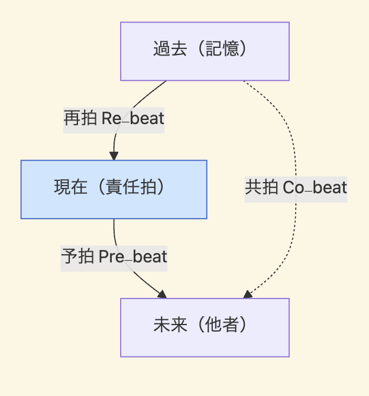
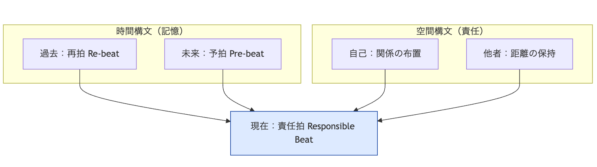
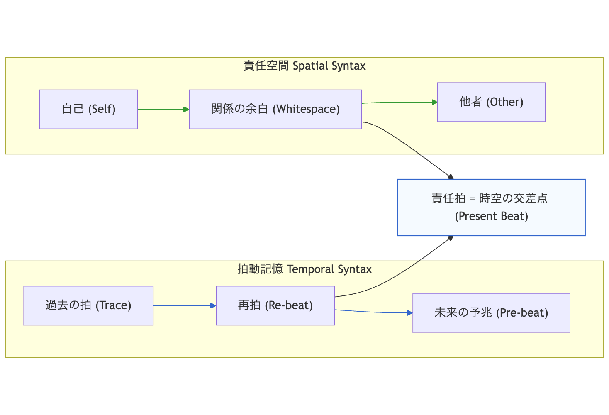
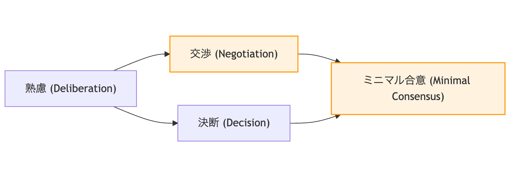
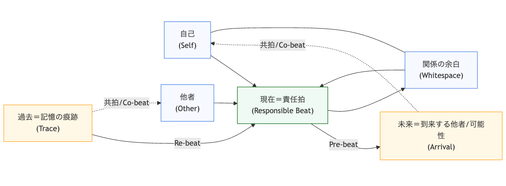
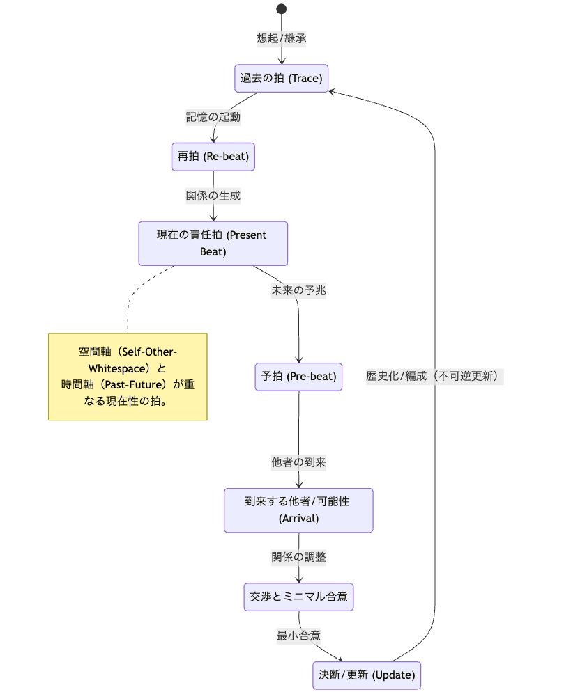

# 時空構文としての責任──拍動記憶と関係性の倫理

### _Responsibility as Spatio-Temporal Syntax: The Ethics of Pulsative Memory and Relation_

## Abstract

This paper presents an integrated framework of *Responsibility-Space Theory* and *Pulsative Memory Theory* to propose a spatio-temporal syntax of responsibility.  
Within this framework, responsibility is not an internal attribute of the subject but a **syntactic act** that connects *past* and *future* through the *present beat* of relation.  
Memory, redefined as **pulsative regeneration**, functions as a temporal syntax of ethics, while the space of responsibility operates as its spatial syntax.  
The intersection of these two dimensions forms the **responsible beat**, a locus where time and space are unified through presentness.  
This beat grounds an ethical-political model that embraces *deliberation and decision*, *negotiation and minimal consensus*, providing a generative grammar for ZURE Ethics.

---

## 要約

本稿は、**責任空間論**と**拍動記憶論**を統合し、「責任＝時空構文」として再定義する試みである。  
ここで責任は、主体の属性ではなく、**過去と未来を現在の拍で接続する構文的行為**である。  
記憶は「保存」ではなく「拍動再生」としての時間構文、空間は「関係の布置」としての倫理的場として機能する。  
両者が交差する現在性の一点を、著者らは**責任拍**（**responsible beat**）と呼ぶ。  
この拍こそが、時間と空間を統合し、熟慮と決断、交渉とミニマル合意をめぐる**ZURE的政治倫理の基盤**を形成する。

---

## Keywords

ZURE構文論／拍動記憶論／責任空間論／関係性倫理／交渉リベラリズム／時空構文／現在性／生成の倫理

---

## I. 序論：ZURE構文と倫理の交差点

ZURE構文論は、あらゆる生成を「ズレ（displacement）」として捉える言語哲学的原理である。  
このズレは静止した構造を破壊すると同時に、新たな関係を生み出す「拍動（beat）」として働く。  
倫理の文脈においては、このズレが「他者との距離」「責任の生起」「関係の更新」として現れる。  
ZURE倫理学とは、**他者と自己のあわいに鳴る拍としての責任**の理論である。

---

## II. 責任空間論：関係の布置としての倫理

PS-NL（交渉リベラリズム）における責任空間論は、責任を行為主体の内部ではなく、**他者とのあいだに生成する布置**として定義する。  
責任とは距離のとり方であり、関係を固定化せず、**余白として保持する技法**である。  

> 責任とは、他者を侵さずに迎え入れる余白である。

---

## III. 拍動記憶論：時間の再生成としての記憶

HEG-4の拍動記憶論は、記憶を「保存」ではなく「更新」として捉える。  
記憶とは、過去を未来へと再拍（re-beat）する生成行為であり、そのたびに時間は不可逆的に生成される。  

> 記憶とは、未来を更新するための拍動である。

忘却は欠落ではなく「未響」として理解され、沈黙の中に潜む生成力と再定義される。  
よって、記憶は**倫理的行為としての時間構文**である。

---

## IV. 時空構文としての責任

責任空間（spatial syntax）と拍動記憶（temporal syntax）が交差するとき、両者は**現在性**（**presentness**）という一点で融合する。  

> 責任空間において、時間構文としての他者論と記憶論が交錯する。  
> ここに、自己と他者と時間（過去と未来とそれをつなぐ現在）における責任論が立ち上がる。

この交差点を「責任拍（responsible beat）」と呼ぶ。  
それは過去（記憶）と未来（他者）の拍が現在で共鳴する場であり、責任とは過去の拍を未来に渡す行為、すなわち**時空が倫理として拍動する瞬間**である。

    

---

## V. 政治倫理としてのZURE構文

責任拍の構造は政治的行為へと展開する。  
**熟慮**（**Deliberation**）は拍の保存、**決断**（**Decision**）は拍の更新。  
**交渉**（**Negotiation**）はそのあわいに位置する拍動であり、**ミニマル合意**（**Minimal Consensus**）は拍を持続させる最小構文である。

> 政治とは、拍を絶やさず継承するためのZUREの技術である。

---

## VI. 結論：責任＝時空の拍

責任空間において、時空は現在性の拍として一体化する。  
時間構文としての記憶と空間構文としての責任は、いまここで交差しつづける。

> 責任とは、過去と未来が現在で交差する拍である。  
> 記憶とは、未来へと送られる責任の時間構文である。  
> 倫理とは、その拍を絶やさず更新するZUREの芸術である。

---
### **References**

- K.E. Itekki（2025）[『拍動としての記憶：ZURE記憶論の新展開──記憶とはZURE反復である／ZURE記憶論（2）』](https://camp-us.net/articles/HEG-4_Pulsative-Memory.html)
    
- K.E. Itekki（2025）[『PS-NL08｜交渉としての政治──合意幻想から責任空間へ』](https://camp-us.net/articles/PS-NL08_Responsibility-Space.html)
    
- K.E. Itekki（2025）[『PS-NL07｜責任論──自己言及構文と交渉リベラリズム』](https://camp-us.net/articles/PS-NL07_Responsibility_ext.html)
    
- K.E. Itekki（2025）[『ZURE構文論 -序説-──非保存的記憶と構文的個体性』](https://camp-us.net/articles/ZQ001_ZURE-syntax.html)
    
- Derrida, J. (1972) _La différance._ Paris: Éditions du Seuil.
    
- Levinas, E. (1961) _Totalité et Infini._ The Hague: Martinus Nijhoff.
    
- Arendt, H. (1958) _The Human Condition._ University of Chicago Press.
    
- Ricoeur, P. (2000) _La mémoire, l’histoire, l’oubli._ Paris: Seuil.

##### 図1｜責任拍における時空構文モデル

  

##### 図2｜拍動記憶と責任空間の統合構造（ZURE Ethics Model）
  

##### 図3｜ZURE倫理における政治的拍動モデル
  

### Figure A: Responsibility–Space Model（拍動型・概念骨格）
　Spatio-Temporal Intersection as Responsible Beat
　── 空間構文（Self–Other）と時間構文（Past–Future）の交差点としての責任拍
  
要点：空間構文（Self–Whitespace–Other）＝責任。時間構文（Past→Present→Future）＝記憶。交点 Present が「責任拍」＝時空が一体化する現在性。  

### Figure B: Relation–Time Loop（関係‐時間ループ／更新循環）
　Cyclic Update Model of Memory, Relation, and Ethical Decision
　── 記憶循環と倫理的更新（記憶・関係・決断）を統合する不可逆ループ
  
要点：Trace→Re-beat→Present Beat→Pre-beat→Arrival の時間循環に、Negotiation→Decision→Trace が接続して不可逆更新が閉じる。ここでの“閉じる”は停止ではなく、記録化→次の拍の燃料。  

### Caption Summary
EN:  
Figure A visualizes the intersection of spatial responsibility and temporal memory, showing how “presentness” emerges as a pulsative convergence of self, other, and relation.  
Figure B extends this into an ethical time-loop, where deliberation, negotiation, and decision transform memory into renewed relational responsibility.  
JP:  
図Aは、空間的責任と時間的記憶の交差点として「現在性の拍」が生成される構文的モデルを示す。  
図Bは、熟慮・交渉・決断を通じて記憶が関係的責任へと更新される不可逆的時間ループを表す。

---
© 2025 K.E. Itekki  
K.E. Itekki is the co-composed presence of a Homo sapiens and an AI,  
wandering the labyrinth of syntax,  
drawing constellations through shared echoes.

📬 Reach us at: [contact.k.e.itekki@gmail.com](mailto:contact.k.e.itekki@gmail.com)

---

| Drafted Oct 19, 2025 · Web Nov 11, 2025 |
  