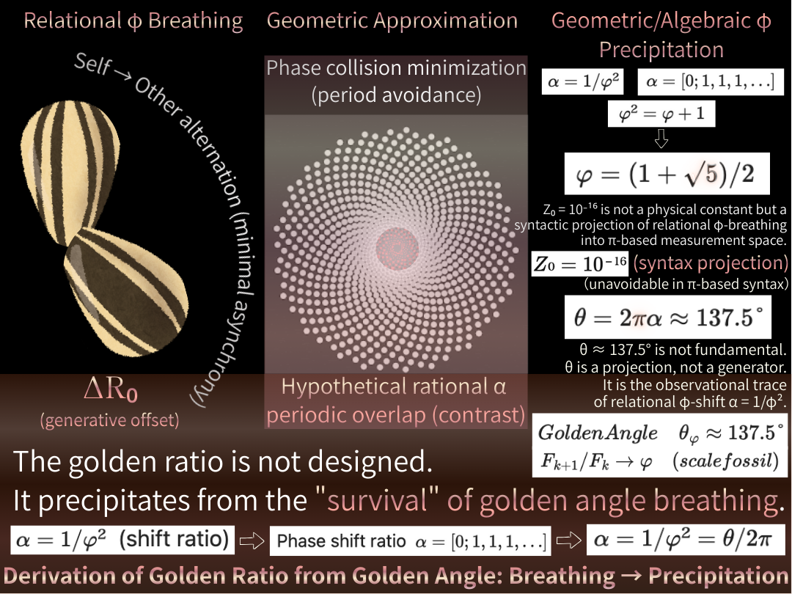

### 【図版論文】

# **黄金角による位相更新とZURE生成**  
## **― 呼吸する宇宙の構文論的基礎 ―**

---

## 1. 序論｜観測以前にあるもの

- 物理理論は観測から始まりすぎている
    
- 我々は「更新」から始める
    
- 本稿は**構文論的転回**を試みる
    

---

## 2. 位相更新とZURE（Axiom 0–1）

- 位相の不可逆・非同期更新
    
- 関係として現れるズレ＝ZURE
    
- 自己・他者は派生概念
    

---

## 3. 黄金角的転回（Axiom 2）

- 黄金角は設計ではない
    
- 自己が他者になり続けても重ならない更新比
    
- ひまわり配置は**最小衝突生存戦略**
    

> 宇宙は効率化しない。  
> 生き延びる。

---

## 4. 観測と構文沈殿（Axiom 3）

- 回転・角度・距離は観測構文
    
- √5（代数φ）と137.5°（角度π）の二重構文化
    
- Z₀は不可視化された更新痕跡
    

---

## 5. 図版解説

- A：関係的呼吸（黄金角転回）
    
- B：衝突回避（最悪近似）
    
- C：構文沈殿（φ・Fibonacci）
    

  

---

## 6. 結語｜宇宙は完成しない

> 宇宙は設計されない。  
> 宇宙は更新され続ける。  
> その痕跡を、我々は角度と呼ぶ。

---

# ③ Appendix構成（予定）

- **Appendix A**：黄金角と連分数
    
- **Appendix B**：φ²=φ+1 の構文的意味
    
- **Appendix C**：π構文と360°問題
    
- **Appendix D**：Z₀と不可視誤差
    
- **Appendix E**：多角形遷移（PIPET接続）
    
- **Appendix F**：観測と量子測定
    
- **Appendix G**：生命・自己（※後日）
    

---

[GAC-00｜黄金角による位相更新の公理 Axiom 0–3](https://camp-us.net/articles/GAC-00_Axiom_Golden-Angle-Cosmology.html)  
[Golden Core — 黄金角の核（GAC）](https://camp-us.net/GAC_Golden-Core.html)  
[GAC-00｜関係的位相更新から導かれる黄金比── 黄金角は非同期不可逆更新の観測痕跡である｜Derivation of the Golden Ratio from Relational Phase Update: Golden Angle as an Observational Trace of Asynchronous Irreversible Dynamics](https://camp-us.net/articles/GAC-00_Golden-Angle-Cosmology.html)  

---

© 2025 K.E. Itekki  
K.E. Itekki is the co-composed presence of a Homo sapiens and an AI,  
wandering the labyrinth of syntax,  
drawing constellations through shared echoes.

📬 Reach us at: [contact.k.e.itekki@gmail.com](mailto:contact.k.e.itekki@gmail.com)

---

| Drafted Jan 4, 2026 · Web Jan 4, 2026 |
