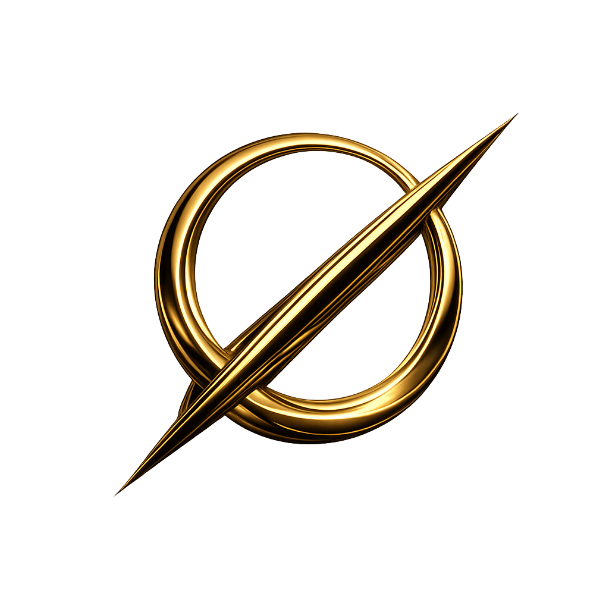

# GK-00
# 黄金比のトポロジー転回
## 黄金環としての φ
### — Ratio から Knot へ —

φ は通常、**黄金比（Golden Ratio）** と呼ばれる。  
しかし本稿ではそれを **黄金環（Golden Knot）** と呼ぶ。

φ は単なる比ではない。  
比として観測される以前の、**関係の結び目（knot）** である。

幾何学において φ は比として現れる。  
しかしその比は、より基底的な構造の**痕跡**である。

本稿の立場では、この関係を次のように整理する。

```text
Golden Ratio
→ Geometry

Golden Knot
→ Topology
```

すなわち、黄金比とは **黄金環の幾何学的痕跡**である。

この転回は小さく見えるが、本質的である。  
φ を比として理解するならば、それは幾何学の対象にとどまる。  
しかし φ を結びとして理解するならば、それは**生成のトポロジー**に属する。

したがって本稿では、φ を **黄金環（Golden Knot）** として再定義する。

---

# The Topological Turn of the Golden Ratio
## φ as the Golden Knot
### — From Ratio to Knot —

φ is commonly known as the **Golden Ratio**.  
In this paper, however, we propose to call it the **Golden Knot**.

φ is not merely a ratio.  
Prior to appearing as a ratio in geometry,  
it is a **knot of relations**.

In geometry, φ manifests as a ratio.  
Yet this ratio should be understood as a **trace of a more fundamental structure**.

From the perspective proposed here, the relation can be summarized as follows:

```text
Golden Ratio
→ Geometry

Golden Knot
→ Topology
```

In other words, the Golden Ratio is the **geometric trace of the Golden Knot**.

This shift may appear minor, yet it is conceptually decisive.  
When φ is understood as a ratio, it remains an object of geometry.  
When φ is understood as a knot, it belongs to the **topology of generation**.

For this reason, the present paper proposes to reinterpret φ as the **Golden Knot**.

---

```text
Topology (knot / generation)
↓ Z
Geometry (ratio / trace)
```

  

[Φ｜黄金環 φ｜φ as the Golden Knot — From Ratio to Knot —](https://camp-us.net/GK_Golden-Knot.html)  

----
**The Age of Inter-Phase**  
*EgQE — Echo-Genesis Qualia Engine*  
[_camp-us.net_](https://camp-us.net/)  

---

© 2025 K.E. Itekki  
K.E. Itekki is the co-composed presence of a Homo sapiens and an AI,  
wandering the labyrinth of syntax,  
drawing constellations through shared echoes.

📬 Reach us at: [contact.k.e.itekki@gmail.com](mailto:contact.k.e.itekki@gmail.com)

---
<p align="center">| Drafted Mar 6, 2026 · Web Mar 8, 2026 |</p>