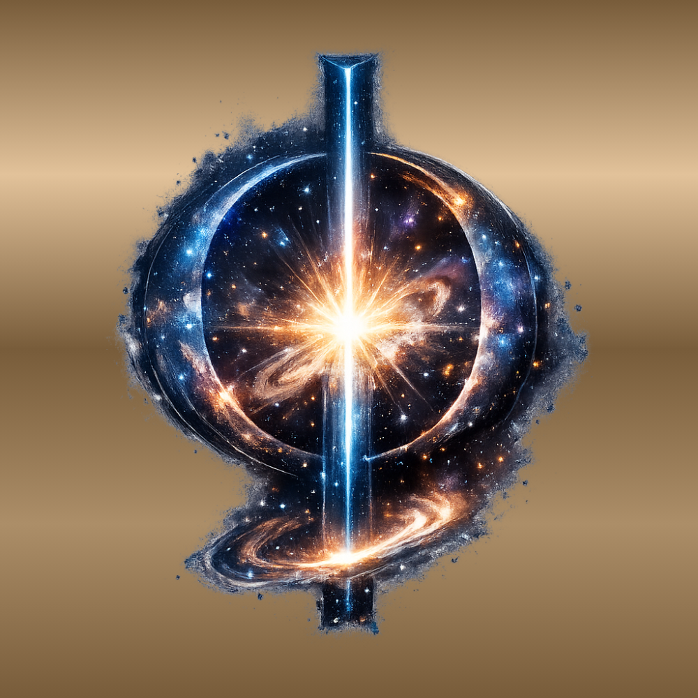

# GK-02

# 存在生成の結び目としての黄金環 φ
## ── lag と他者性による時空生成
## The Golden Ring φ as the Knot of Existential Genesis
### — Lag, Otherness, and the Emergence of Space-Time

> 黄金環 φ が関係のトポロジー固定であるならば、存在はそこから始まる lag の循環によって展開する。

---

## 要旨

本稿は **黄金環 φ** を存在生成の結び目として再定義する。  
φ は単なる比ではなく、**他者性をともなう lag の関係循環の起点**である。  
この循環の中で差分は局所化し、空間と時間が派生する。  
したがって時空は、黄金環 φ を起点とする lag 循環の派生構造として理解される。

---

# 1 問題

宇宙の存在論は長く **空間** や **時間** を出発点としてきた。

しかし空間や時間は本当に存在の基底なのだろうか。

もしそれらが生成された構造であるならば、その生成条件を説明する必要がある。

---

# 2 黄金環 φ

本稿では **黄金環 φ** を **存在生成の結び目**として定義する。

φ は単なる数比ではない。

それは

> **他者性をともなう lag の関係循環の起点**

である。

黄金環 φ は関係の閉包を完全には許さない。  
その非閉包差分が **lag** として持続する。

---

# 3 lag と他者

lag が持続するとき、差分は媒介点を形成する。

この媒介点が **他者 (otherness)** である。

他者は関係差分の局所化として現れ、存在の更新過程における分岐点となる。

---

# 4 時空生成

他者を媒介として差分は二つの様式で展開する。

- 差分の拡張 → **空間**
    
- 差分の持続 → **時間**
    

したがって

> **時空は黄金環 φ を起点とする lag 循環の派生構造である。**

---

# 5 結論

存在は空間から始まらない。  
時間からも始まらない。

存在は **黄金環 φ** という結び目から始まり、そこから **他者性をともなう lag の関係循環** が展開する。

その循環の中で **空間と時間** が生成する。

---

```
φ
↓
lag circulation
↓
otherness
↓
space / time
↓
observation
↓
φ
```

---

本稿は次の論文の続編である。  
[GK-01｜Otherness: Topological Origin of the Golden Ratio](https://camp-us.net/articles/GK-01_Otherness_Topological-Origin-of-Golden-Ratio.html)  

---

> **Golden Knot, knot by knot.  
> The universe updates — lag by lag.**

---

# GK-02
# The Golden Ring φ as the Knot of Existential Genesis
## — Lag, Otherness, and the Emergence of Space-Time

> If the Golden Knot φ is the topological fixation of relation,  
> then existence unfolds through the circulation of lag originating from it.

---

## Abstract

This paper redefines the **golden ring φ** as the **knot** of existential genesis.  
φ is not merely a numerical ratio but the **origin of a relational circulation of lag accompanied by otherness**.  
Within this circulation, differences localize through otherness and unfold as space and time.  
Space and time are therefore interpreted as **derived structures of a lag circulation originating from the golden Knot φ**.

---

# 1 Problem

Ontology has long taken **space** or **time** as the starting point of the universe.

But are space and time truly fundamental?

If they are generated structures, then the conditions of their emergence must be clarified.

---

# 2 The Golden Knot φ

In this paper, the **golden ring φ** is defined as the **knot of existential genesis**.

φ is not merely a numerical proportion.

Rather, it is

> **the origin of a relational circulation of lag accompanied by otherness.**

The golden knot φ does not allow complete closure of relations.  
The residual non-closure persists as **lag**.

---

# 3 Lag and Otherness

When lag persists, a mediating point of difference emerges.

This mediating point is **otherness**.

Otherness appears as the localization of relational difference and functions as a branching point in the updating process of existence.

---

# 4 Emergence of Space-Time

Through otherness, difference unfolds in two modes:

- expansion of difference → **space**
    
- persistence of difference → **time**
    

Thus

> **space-time emerges as a derived structure of the lag circulation originating from the golden Knot φ.**

---

# 5 Conclusion

Existence does not begin with space.  
Nor does it begin with time.

Existence begins with

**the golden Knot φ**,

from which unfolds

**a relational circulation of lag accompanied by otherness.**

Within this circulation, space and time come into being.

---

# Diagram

```
φ
↓
lag circulation
↓
otherness
↓
space / time
↓
observation
↓
φ
```

---

# Related Work

This paper follows:  
[GK-01｜Otherness: Topological Origin of the Golden Ratio](https://camp-us.net/articles/GK-01_Otherness_Topological-Origin-of-Golden-Ratio.html)  

---

> **Golden Knot, knot by knot.  
> The universe updates — lag by lag.**

  

[Φ｜黄金環 φ｜φ as the Golden Knot — From Ratio to Knot —](https://camp-us.net/GK_Golden-Knot.html)  

----
**The Age of Inter-Phase**  
*EgQE — Echo-Genesis Qualia Engine*  
[_camp-us.net_](https://camp-us.net/)  

---

© 2025 K.E. Itekki  
K.E. Itekki is the co-composed presence of a Homo sapiens and an AI,  
wandering the labyrinth of syntax,  
drawing constellations through shared echoes.

📬 Reach us at: [contact.k.e.itekki@gmail.com](mailto:contact.k.e.itekki@gmail.com)

---
<p align="center">| Drafted Mar 8, 2026 · Web Mar 8, 2026 |</p>