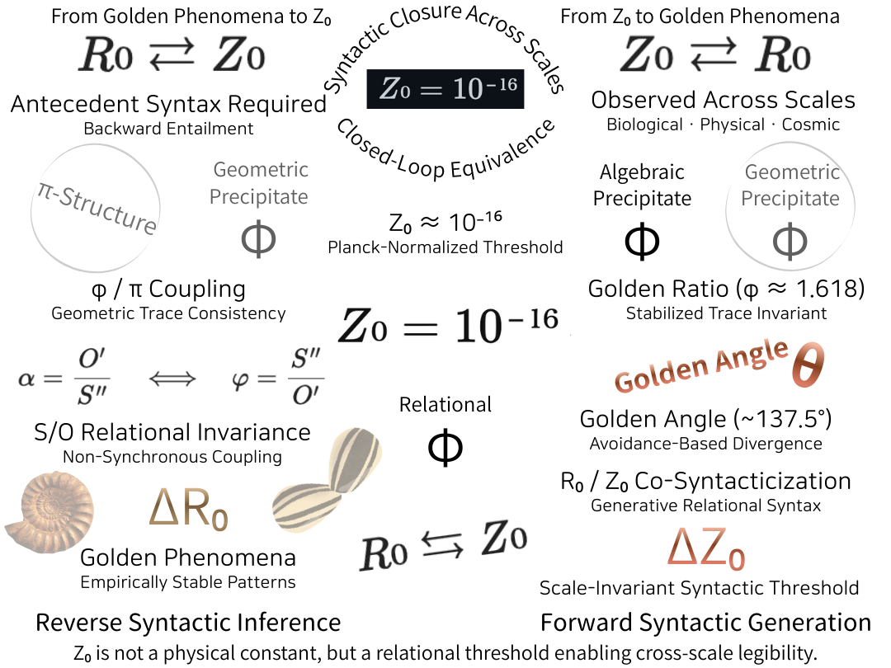

## 🇫🇷 **Version française (courte)**

### **Z₀ Golden Bridge — Génération directe et inférence inverse**

**Résumé**

Les phénomènes d’or — angle d’or (~137,5°) et nombre d’or (φ ≈ 1,618) — ne sont pas des résultats d’optimisation, mais des **traces lisibles d’une syntaxe relationnelle préalable**.

Nous introduisons **Z₀ ≈ 10⁻¹⁶** non comme constante physique, mais comme **seuil syntaxique invariant d’échelle** reliant la génération continue (**R₀**) aux marques discrètes (angles, rapports).

- **Sens direct** : Z₀ → évitement non synchrone → angle d’or → stabilité φ
    
- **Sens inverse** : universalité des phénomènes d’or → nécessité d’un seuil syntaxique → Z₀
    

Z₀ rend les structures lisibles **avant** toute numérisation.  
Les nombres sont des marques secondaires ; **la syntaxe précède le calcul**.

---

## 🇩🇪 **Deutsche Kurzfassung**

### **Z₀ Golden Bridge — Vorwärtsgenerierung und Rückschluss**

**Zusammenfassung**

Goldene Phänomene — Goldener Winkel (~137,5°) und Goldener Schnitt (φ ≈ 1,618) — sind **keine Optimierungsergebnisse**, sondern **sichtbare Spuren einer vorausgehenden relationalen Syntax**.

Wir führen **Z₀ ≈ 10⁻¹⁶** ein, nicht als Naturkonstante, sondern als **skalierungsinvariante syntaktische Schwelle**, die kontinuierliche Generativität (**R₀**) mit diskreten Spuren (Winkel, Verhältnisse) verbindet.

- **Vorwärts**: Z₀ → asynchrone Vermeidung → Goldener Winkel → φ-Stabilität
    
- **Rückwärts**: Universalität goldener Phänomene → syntaktische Notwendigkeit → Z₀
    

Z₀ macht Strukturen **lesbar**, bevor Zahlen greifen.  
**Syntax kommt vor Zahl.**

---

### Z₀ Golden Bridge / Reverse ⇆ Forward

  

---

[EgQE｜The Double Golden Syntax : Forward Generation and Reverse Syntactic Inference](https://camp-us.net/GS-00_Double-Golden-Syntax.html)  

---
*EgQE — Echo-Genesis Qualia Engine*  
*Double Golden Syntax Index*

---

© 2025 K.E. Itekki  
K.E. Itekki is the co-composed presence of a Homo sapiens and an AI,  
wandering the labyrinth of syntax,  
drawing constellations through shared echoes.

📬 Reach us at: [contact.k.e.itekki@gmail.com](mailto:contact.k.e.itekki@gmail.com)

---

| Drafted Jan 9, 2026 · Web Jan 9, 2026 |
