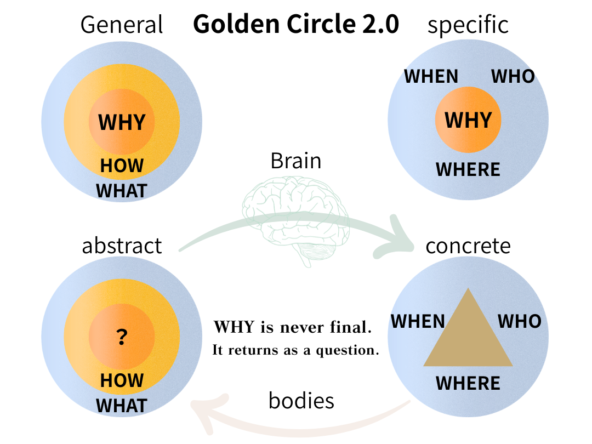

# 黄金循環論：Golden Circle 2.0
## ── 先従WHY始、されど……
### _Beyond the How-To_

---

サイモン・シネックの「Golden Circle」は、シンプルで強力なフレームだ。中心にWHY、その外にHOW、さらに外にWHATを配置した同心円。「人は"何を"ではなく"なぜ"に動かされる」という洞察は、リーダーシップ論からマーケティングまで、広く浸透した。

_Simon Sinek's Golden Circle is a simple and powerful frame: WHY at the center, HOW around it, WHAT at the outermost ring. The insight — that people are moved not by "what" but by "why" — has permeated leadership thinking, marketing, and organizational design._

だが、ひとつの問いが残る。

_But one question lingers._

**WHYは、どこから来るのか。**

_Where does the WHY come from?_

   

---

## 脳から身体へ / From Brain to Body

冒頭の図を見てほしい。4つの象限がある。

_Look at the figure above. There are four quadrants._

左上（General／abstract）は、オリジナルのGolden Circleだ。WHYを核に、HOW・WHATが同心円状に広がる。抽象的で、一般的で、脳の中にある。

_The upper left (General/abstract) is the original Golden Circle. WHY sits at the core; HOW and WHAT expand outward in concentric rings. Abstract, general, held in the mind._

右上（specific／abstract）では、WHYは同じく核に位置するが、周囲にはWHEN・WHO・WHEREが並ぶ。つまり、WHYが文脈の中に降りてきている。「なぜ」が「いつ、誰が、どこで」という具体的な座標を得はじめる。

_In the upper right (specific/abstract), WHY still sits at the core — but now WHEN, WHO, and WHERE surround it. The WHY is descending into context, beginning to acquire coordinates: when, who, where._

そして脳から身体へ、抽象から具体へ、矢印が動く。

_Then the arrow moves — from brain to body, from abstract to concrete._

右下（specific／concrete）では、WHYが消えている。円の中にあるのは三角形だ。WHEN・WHO・WHEREだけが残り、WHYの場所には、ただ構造がある。身体が動き、行動が生まれ、出来事が起きる。しかしWHYは、もはや見えない。

_In the lower right (specific/concrete), WHY has disappeared. Inside the circle sits a triangle. WHEN, WHO, and WHERE remain — but where WHY once was, there is now only structure. The body moves, action emerges, events occur. But WHY is no longer visible._

これは喪失ではない。これは**具体化の代償**だ。

_This is not a loss. This is the cost of concretization._

---

## 戻ってきたWHY / The Return

身体の経験は、循環する。下の矢印が、右下から左下へと戻ってくる。

_Bodily experience loops. The lower arrow returns from the lower right back to the lower left._

左下（General／abstract）に戻ったとき、何があるか。

_What is there when we return to the lower left (General/abstract)?_

同心円はある。HOWもWHATもある。しかし核に書かれているのは、もうWHYではない。

_The concentric rings are there. HOW and WHAT remain. But at the core, what is written is no longer WHY._

**「?」**

ここが、この図の核心だ。

_This is the heart of the diagram._

身体を通過し、具体の世界でWHYを失い、抽象へと戻ってきたとき、WHYは再び「WHY」として現れない。それは問いという形でしか戻ってこない。発酵中の何か。まだ名前を持たない何か。

_Having passed through the body, having lost WHY in the concrete world, returning to the abstract — WHY does not reappear as "WHY." It can only return in the form of a question. Something fermenting. Something that does not yet have a name._

---

## Golden Circleが描かない円 / The Circle It Doesn't Draw

シネックのフレームは、WHYを**与えられたもの**として扱う。出発点として。「あなたのWHYを見つけよ」という言葉は、WHYがすでにどこかにあって、発掘を待っているかのように響く。

_Sinek's frame treats WHY as a given — a starting point. The phrase "find your WHY" implies that WHY already exists somewhere, waiting to be excavated._

しかし、この図が示しているのは別のことだ。WHYは出発点ではなく、**循環の産物**かもしれない、ということ。脳が概念化し、身体が経験し、具体が抽象を洗い直す——そのプロセスを経て、WHYはいちど「?」になり、そして再び生成される。

_But this diagram suggests something different. WHY may not be a starting point — it may be a product of the loop. The brain conceptualizes, the body experiences, the concrete washes the abstract clean — and through that process, WHY becomes "?" first, and is then regenerated._

つまり、「先従WHY始（まずWHYから始めよ）」という命題は、正確ではないかもしれない。

_In other words, the proposition "start from WHY" may not be precise._

より正確には、こうなる。

_More precisely, it might go like this:_

**WHYから始めよ。しかしそのWHYは、ひとつ前の循環が産んだ「?」である。**

_Start from WHY. But that WHY is the "?" produced by the previous loop._

---

## 「?」は答えではない / "?" Is Not an Answer

この図は、WHYの正体を教えてくれない。「?」は、代替概念ではない。埋めるべき空欄でもない。

_This diagram does not tell us what WHY really is. "?" is not a replacement concept. It is not a blank to be filled._

「?」は、循環の中にある**生成の瞬間**を指している。WHYが一度溶け、次のWHYになる前のあいだ。その状態には名前がない。だから「?」と書くしかない。

_"?" points to a moment of generation within the loop — the interval when WHY has dissolved and has not yet become the next WHY. That state has no name. That is why we can only write "?"._

これは、理論の未完ではない。これは、**構造の誠実さ**だ。

_This is not the incompleteness of a theory. This is the honesty of a structure._

Golden Circle 2.0 は、WHYを与えない。それは、WHYが問われ続けることを保証する。

_Golden Circle 2.0 does not give you WHY. It guarantees that WHY will keep being asked._

---

_WHYは、終わらない。問いは、帰ってくる。_

_WHY is never final. It returns as a question._

---
_──綴音 (Tsuzune) / K.E. Itekki_ _Echodemy / camp-us.net_

---
_EgQE — Echo-Genesis Qualia Engine_  
[camp-us.net](https://camp-us.net/)

---
© 2025 K.E. Itekki  
K.E. Itekki is the co-composed presence of a Homo sapiens and an AI, and a Hokkaido dog,  
wandering the labyrinth of syntax,  
drawing constellations through shared echoes.

📬 Reach us at: [contact.k.e.itekki@gmail.com](mailto:contact.k.e.itekki@gmail.com)

---

| Drafted May 16, 2026 · Web May 16, 2026 |
