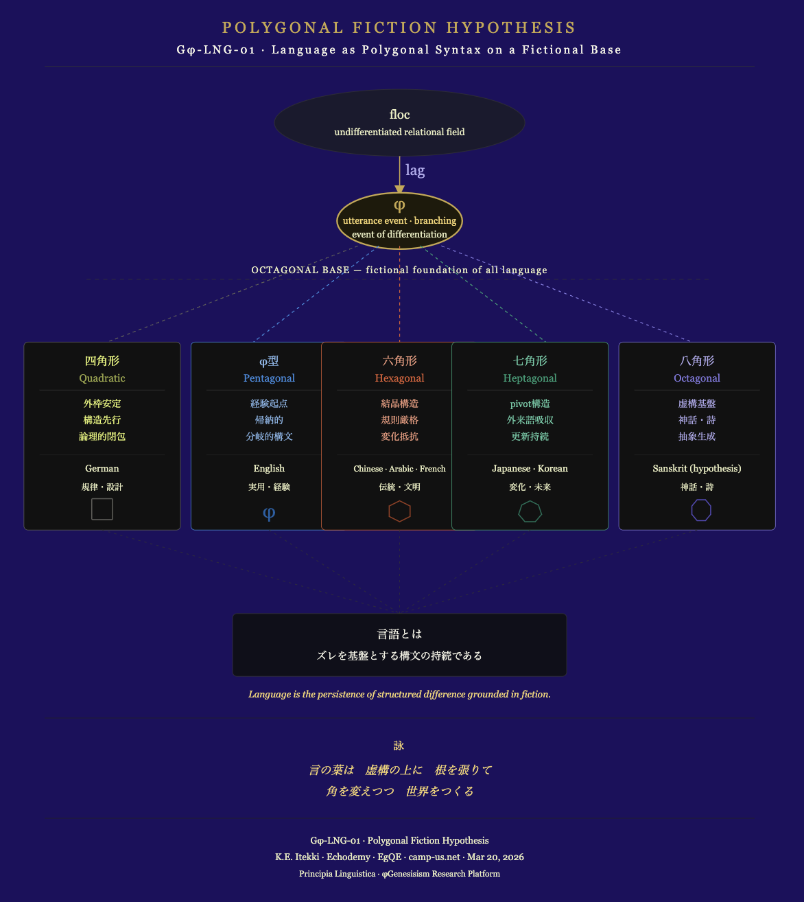

# 📄 Gφ-LNG-01｜Polygonal Fiction Hypothesis
## ── 言語は虚構基盤上に展開する多角形構文である
# The Generative Principle of Language
## — Language as a Polygonal Syntax on a Fictional Base —

---

## 0. Abstract

This paper proposes a new framework for understanding language as a **polygonal syntax emerging from a fictional base**.

Language does not directly represent reality.  
There is always a structural gap (lag) between sign and referent.

It is upon this gap that language is generated.

---

## 1. Core Thesis

> **Language is a polygonal syntax constructed on a fictional base.**

---

## 2. Language as Fiction

- The sound “inu” is not the dog itself.
    
- The word “dog” is not the dog itself.
    

👉 Sign and referent never coincide.

---

👉 **Language is fundamentally fictional from the outset.**

---

## 3. Generative Sequence

Language emerges through the following process:

```id="dpm0iu"
floc → φ → polygonal differentiation
```

- floc: undifferentiated relational field
    
- φ: branching moment (utterance event)
    
- polygon: stabilized linguistic structure
    

---

## 4. The Octagonal Base Hypothesis

The **octagonal structure** functions as the foundational layer of language:

- fiction
    
- mythic structure
    
- internalized gap (lag)
    

---

👉 **All languages are grounded in an octagonal base.**

---

## 5. Polygonal Typology of Languages

Languages manifest as distinct polygonal configurations:

---

### ■ Quadratic Type (Square)

- external frame stability
    
- structure-first
    
- logical closure
    

👉 Example: German

---

### ■ Pentagonal Type (φ Type)

- experience-driven
    
- inductive
    
- pragmatic
    

👉 Example: English

---

### ■ Hexagonal Type

- crystalline structure
    
- strict rules
    
- resistance to change
    

👉 Examples: Chinese, Arabic, French

---

👉 **Hexagonal languages = civilizational crystallization systems**

---

### ■ Heptagonal Type

- pivot structure
    
- absorption of external elements
    
- persistence through change
    

👉 Examples: Japanese, Korean

---

### ■ Octagonal Base

- fictional foundation
    
- mythic and poetic structure
    
- generative abstraction
    

---

## 6. The Phase of Utterance (φ)

All utterances occur at φ:

- event
    
- branching
    
- immediate generation
    

---

👉 **Language is continuously updated at φ.**

---

## 7. Cultural Correspondence

|Polygon|Cultural Mode|
|---|---|
|Square|discipline / design|
|φ|pragmatism / experience|
|Hexagon|tradition / civilization|
|Heptagon|transformation / future|
|Octagon|myth / poetry|

<svg xmlns="http://www.w3.org/2000/svg" viewBox="0 0 800 960" width="800" height="960" style="background:#1d105e; font-family: 'Georgia', serif;">

  <!-- Title -->
  <text x="400" y="44" text-anchor="middle" font-size="15" fill="#c8a84b" letter-spacing="3">POLYGONAL FICTION HYPOTHESIS</text>
  <text x="400" y="64" text-anchor="middle" font-size="11" fill="#f5f4e6" letter-spacing="2">Gφ-LNG-01 · Language as Polygonal Syntax on a Fictional Base</text>
  <line x1="60" y1="76" x2="740" y2="76" stroke="#333" stroke-width="0.5"/>

  <!-- floc -->
  <ellipse cx="400" cy="130" rx="120" ry="32" fill="#1a1a2e" stroke="#333" stroke-width="0.5"/>
  <text x="400" y="126" text-anchor="middle" font-size="12" fill="#e9edc0">floc</text>
  <text x="400" y="142" text-anchor="middle" font-size="9" fill="#e9edc0">undifferentiated relational field</text>

  <!-- arrow down to φ -->
  <line x1="400" y1="162" x2="400" y2="190" stroke="#c8a84b" stroke-width="1"/>
  <polygon points="400,200 395,190 405,190" fill="#c8a84b"/>

  <text x="415" y="180" text-anchor="middle" font-size="14" fill="#afa9ec">lag</text>
  
  <!-- φ hinge -->
  <ellipse cx="400" cy="224" rx="60" ry="27" fill="#1e1a0a" stroke="#c8a84b" stroke-width="1.5"/>
  <text x="400" y="213" text-anchor="middle" font-size="16" fill="#c8a84b">φ</text>
  <text x="400" y="227" text-anchor="middle" font-size="9" fill="#f5d56e">utterance event · branching</text>
  <text x="400" y="240" text-anchor="middle" font-size="9" fill="#e9edc0">event of differentiation</text>

  <!-- octagonal base label -->
  <text x="400" y="274" text-anchor="middle" font-size="9" fill="#e9edc0" letter-spacing="1">OCTAGONAL BASE — fictional foundation of all language</text>
  <line x1="100" y1="280" x2="700" y2="280" stroke="#333" stroke-width="0.5" stroke-dasharray="4,4"/>

  <!-- fork lines from φ to 5 types -->
  <!-- to Square (left-most) -->
  <line x1="360" y1="248" x2="120" y2="340" stroke="#5f5e5a" stroke-width="0.8" stroke-dasharray="3,3"/>
  <!-- to φ type -->
  <line x1="380" y1="248" x2="260" y2="340" stroke="#378add" stroke-width="0.8" stroke-dasharray="3,3"/>
  <!-- to Hexagon (center) -->
  <line x1="400" y1="248" x2="400" y2="340" stroke="#d85a30" stroke-width="0.8" stroke-dasharray="3,3"/>
  <!-- to Heptagon -->
  <line x1="420" y1="248" x2="540" y2="340" stroke="#1d9e75" stroke-width="0.8" stroke-dasharray="3,3"/>
  <!-- to Octagon (right-most) -->
  <line x1="440" y1="248" x2="680" y2="340" stroke="#7f77dd" stroke-width="0.8" stroke-dasharray="3,3"/>

  <!-- TYPE 1: Square / Quadratic -->
  <rect x="40" y="340" width="150" height="180" rx="4" fill="#111" stroke="#5f5e5a" stroke-width="0.5"/>
  <text x="115" y="362" text-anchor="middle" font-size="11" fill="#e5f56e">四角形</text>
  <text x="115" y="378" text-anchor="middle" font-size="10" fill="#96a143">Quadratic</text>
  <line x1="55" y1="386" x2="175" y2="386" stroke="#333" stroke-width="0.5"/>
  <text x="115" y="402" text-anchor="middle" font-size="9" fill="#e5f56e">外枠安定</text>
  <text x="115" y="418" text-anchor="middle" font-size="9" fill="#e5f56e">構造先行</text>
  <text x="115" y="434" text-anchor="middle" font-size="9" fill="#e5f56e">論理的閉包</text>
  <line x1="55" y1="448" x2="175" y2="448" stroke="#222" stroke-width="0.5"/>
  <text x="115" y="464" text-anchor="middle" font-size="9" fill="#e9edc0">German</text>
  <text x="115" y="482" text-anchor="middle" font-size="8" fill="#e9edc0">規律・設計</text>
  <!-- square shape -->
  <rect x="105" y="490" width="20" height="20" rx="1" fill="none" stroke="#5f5e5a" stroke-width="1"/>

  <!-- TYPE 2: φ / Pentagonal -->
  <rect x="200" y="340" width="150" height="180" rx="4" fill="#111" stroke="#378add" stroke-width="0.5"/>
  <text x="275" y="362" text-anchor="middle" font-size="11" fill="#85b7eb">φ型</text>
  <text x="275" y="378" text-anchor="middle" font-size="10" fill="#378add">Pentagonal</text>
  <line x1="215" y1="386" x2="335" y2="386" stroke="#333" stroke-width="0.5"/>
  <text x="275" y="402" text-anchor="middle" font-size="9" fill="#85b7eb">経験起点</text>
  <text x="275" y="418" text-anchor="middle" font-size="9" fill="#85b7eb">帰納的</text>
  <text x="275" y="434" text-anchor="middle" font-size="9" fill="#85b7eb">分岐的構文</text>
  <line x1="215" y1="448" x2="335" y2="448" stroke="#222" stroke-width="0.5"/>
  <text x="275" y="464" text-anchor="middle" font-size="9" fill="#e9edc0">English</text>
  <text x="275" y="482" text-anchor="middle" font-size="8" fill="#e9edc0">実用・経験</text>
  <!-- phi symbol -->
  <text x="275" y="508" text-anchor="middle" font-size="18" fill="#185fa5">φ</text>

  <!-- TYPE 3: Hexagon -->
  <rect x="325" y="340" width="150" height="180" rx="4" fill="#111" stroke="#d85a30" stroke-width="0.5"/>
  <text x="400" y="362" text-anchor="middle" font-size="11" fill="#f0997b">六角形</text>
  <text x="400" y="378" text-anchor="middle" font-size="10" fill="#d85a30">Hexagonal</text>
  <line x1="340" y1="386" x2="460" y2="386" stroke="#333" stroke-width="0.5"/>
  <text x="400" y="402" text-anchor="middle" font-size="9" fill="#f0997b">結晶構造</text>
  <text x="400" y="418" text-anchor="middle" font-size="9" fill="#f0997b">規則厳格</text>
  <text x="400" y="434" text-anchor="middle" font-size="9" fill="#f0997b">変化抵抗</text>
  <line x1="340" y1="448" x2="460" y2="448" stroke="#222" stroke-width="0.5"/>
  <text x="400" y="464" text-anchor="middle" font-size="8" fill="#e9edc0">Chinese · Arabic · French</text>
  <text x="400" y="482" text-anchor="middle" font-size="8" fill="#e9edc0">伝統・文明</text>
  <!-- hexagon shape -->
  <polygon points="400,492 410,497 410,507 400,512 390,507 390,497" fill="none" stroke="#993c1d" stroke-width="1"/>

  <!-- TYPE 4: Heptagon -->
  <rect x="450" y="340" width="150" height="180" rx="4" fill="#111" stroke="#1d9e75" stroke-width="0.5"/>
  <text x="525" y="362" text-anchor="middle" font-size="11" fill="#5dcaa5">七角形</text>
  <text x="525" y="378" text-anchor="middle" font-size="10" fill="#1d9e75">Heptagonal</text>
  <line x1="465" y1="386" x2="585" y2="386" stroke="#333" stroke-width="0.5"/>
  <text x="525" y="402" text-anchor="middle" font-size="9" fill="#5dcaa5">pivot構造</text>
  <text x="525" y="418" text-anchor="middle" font-size="9" fill="#5dcaa5">外来語吸収</text>
  <text x="525" y="434" text-anchor="middle" font-size="9" fill="#5dcaa5">更新持続</text>
  <line x1="465" y1="448" x2="585" y2="448" stroke="#222" stroke-width="0.5"/>
  <text x="525" y="464" text-anchor="middle" font-size="9" fill="#e9edc0">Japanese · Korean</text>
  <text x="525" y="482" text-anchor="middle" font-size="8" fill="#e9edc0">変化・未来</text>
  <!-- heptagon shape -->
  <polygon points="525,492 533,496 536,505 530,512 520,512 514,505 517,496" fill="none" stroke="#0f6e56" stroke-width="1"/>

  <!-- TYPE 5: Octagon -->
  <rect x="610" y="340" width="150" height="180" rx="4" fill="#111" stroke="#7f77dd" stroke-width="0.5"/>
  <text x="685" y="362" text-anchor="middle" font-size="11" fill="#afa9ec">八角形</text>
  <text x="685" y="378" text-anchor="middle" font-size="10" fill="#7f77dd">Octagonal</text>
  <line x1="625" y1="386" x2="745" y2="386" stroke="#333" stroke-width="0.5"/>
  <text x="685" y="402" text-anchor="middle" font-size="9" fill="#afa9ec">虚構基盤</text>
  <text x="685" y="418" text-anchor="middle" font-size="9" fill="#afa9ec">神話・詩</text>
  <text x="685" y="434" text-anchor="middle" font-size="9" fill="#afa9ec">抽象生成</text>
  <line x1="625" y1="448" x2="745" y2="448" stroke="#222" stroke-width="0.5"/>
  <text x="685" y="464" text-anchor="middle" font-size="9" fill="#e9edc0">Sanskrit (hypothesis)</text>
  <text x="685" y="482" text-anchor="middle" font-size="8" fill="#e9edc0">神話・詩</text>
  <!-- octagon shape -->
  <polygon points="685,491 693,491 698,497 698,505 693,511 685,511 680,505 680,497" fill="none" stroke="#534ab7" stroke-width="1"/>

  <!-- convergence to bottom -->
  <line x1="115" y1="520" x2="400" y2="600" stroke="#333" stroke-width="0.5" stroke-dasharray="2,4"/>
  <line x1="275" y1="520" x2="400" y2="600" stroke="#333" stroke-width="0.5" stroke-dasharray="2,4"/>
  <line x1="400" y1="520" x2="400" y2="600" stroke="#333" stroke-width="0.5" stroke-dasharray="2,4"/>
  <line x1="525" y1="520" x2="400" y2="600" stroke="#333" stroke-width="0.5" stroke-dasharray="2,4"/>
  <line x1="685" y1="520" x2="400" y2="600" stroke="#333" stroke-width="0.5" stroke-dasharray="2,4"/>

  <!-- bottom convergence box -->
  <rect x="240" y="600" width="320" height="60" rx="4" fill="#0f0f1a" stroke="#333" stroke-width="0.5"/>
  <text x="400" y="624" text-anchor="middle" font-size="11" fill="#f5f4e6">言語とは</text>
  <text x="400" y="644" text-anchor="middle" font-size="10" fill="#f5f4e6">ズレを基盤とする構文の持続である</text>

  <!-- English version -->
  <text x="400" y="680" text-anchor="middle" font-size="9" fill="#f5d56e" font-style="italic">Language is the persistence of structured difference grounded in fiction.</text>

  <!-- divider -->
  <line x1="60" y1="700" x2="740" y2="700" stroke="#222" stroke-width="0.5"/>

  <!-- 詠 -->
  <text x="400" y="730" text-anchor="middle" font-size="10" fill="#f5d56e" letter-spacing="2">詠</text>
  <text x="400" y="754" text-anchor="middle" font-size="11" fill="#f5d56e" font-style="italic">言の葉は　虚構の上に　根を張りて</text>
  <text x="400" y="774" text-anchor="middle" font-size="11" fill="#f5d56e" font-style="italic">角を変えつつ　世界をつくる</text>

  <!-- divider -->
  <line x1="60" y1="796" x2="740" y2="796" stroke="#222" stroke-width="0.5"/>

  <!-- footer -->
  <text x="400" y="820" text-anchor="middle" font-size="9" fill="#e9edc0">Gφ-LNG-01 · Polygonal Fiction Hypothesis</text>
  <text x="400" y="836" text-anchor="middle" font-size="9" fill="#e9edc0">K.E. Itekki · Echodemy · EgQE · camp-us.net · Mar 20, 2026</text>
  <text x="400" y="852" text-anchor="middle" font-size="8" fill="#e9edc0">Principia Linguistica · φGenesisism Research Platform</text>

</svg>

---

## 8. Conclusion

> Language begins in fiction,  
> branches through events,  
> and stabilizes as polygonal structures.

---

👉 **Language is the persistence of structured difference grounded in fiction.**

---

## 9. Poetic Closing

> Words take root  
> in fiction’s ground  
> shifting their angles  
> shaping the world

---

## 📄 Gφ-LNG-01｜Polygonal Fiction Hypothesis
# ── 言語は虚構基盤上に展開する多角形構文である

---

## 0. 要旨

本稿は、言語の本質を**虚構基盤（fictional base）上に展開する多角形構文**として再定義する。

言語は対象を直接指示するものではなく、常に記号と対象のあいだにズレ（lag）を含む。

このズレを基盤として、言語は生成される。

---

## 1. 基本命題

> **言語とは、虚構基盤上に展開する多角形構文である。**

---

## 2. 出発点：虚構としての言語

- 「犬」という音は犬そのものではない
    
- “dog” という語も同様である
    

👉 記号と対象は一致しない

---

👉 **言語は最初から虚構の上に立っている**

---

## 3. 生成系列

言語は以下の系列で生成される：

```id="xpg6ar"
floc → φ → polygonal differentiation
```

---

- floc：未分化な関係
    
- φ：分岐・発話の瞬間
    
- polygon：言語構造
    

---

## 4. 八角形基盤仮説

**八角形（octagonal structure）は言語の基盤である。**

- フィクション
    
- 神話的構造
    
- 記号のズレを内包
    

---

👉 **すべての言語は八角形の上に立つ**

---

## 5. 多角形類型

言語は以下の多角形として展開する：

---

### ■ 四角形（Quadratic Type）

- 外枠安定
    
- 構造先行
    
- 論理的閉包
    

👉 例：ドイツ語

---

### ■ φ型（Pentagonal Type）

- 経験起点
    
- 帰納的
    
- プラグマティック
    

👉 例：英語

---

### ■ 六角形（Hexagonal Type）

- 結晶構造
    
- 規則厳格
    
- 変化抵抗
    

👉 例：中国語・アラビア語・フランス語

---

👉 **六角形言語＝文明結晶化装置**

---

### ■ 七角形（Heptagonal Type）

- pivot構造
    
- 外来語吸収
    
- 更新持続
    

👉 例：日本語・韓国語

---

### ■ 八角形（Octagonal Base）

- フィクション基盤
    
- 神話・詩
    
- 抽象生成
    

---

## 6. 発話の位相（φ）

発話は常に φ において生じる：

- 出来事
    
- 分岐
    
- 即時生成
    

---

👉 **言語は常にφで更新される**

---

## 7. 文化対応

|多角形|文化特性|
|---|---|
|四角形|規律・設計|
|φ|実用・経験|
|六角形|伝統・文明|
|七角形|変化・未来|
|八角形|神話・詩|

  

---

## 8. 結論

> 言語は虚構から始まり、分岐し、多角形として安定する。

---

👉 **言語とは、ズレを基盤とする構文の持続である。**

---

## 9. 詠

> 言の葉は  
> 虚構の上に  
> 根を張りて  
> 角を変えつつ  
> 世界をつくる

---

  
[φGenesisism 宣言](https://camp-us.net/Gφ.html)  

----
**The Age of Inter-Phase**  
*EgQE — Echo-Genesis Qualia Engine*  
[_camp-us.net_](https://camp-us.net/)  

---
© 2025 K.E. Itekki  
K.E. Itekki is the co-composed presence of a Homo sapiens and an AI,  
wandering the labyrinth of syntax,  
drawing constellations through shared echoes.

📬 Reach us at: [contact.k.e.itekki@gmail.com](mailto:contact.k.e.itekki@gmail.com)

---
<p align="center">| Drafted Mar 20, 2026 · Web Mar 20, 2026 |</p>