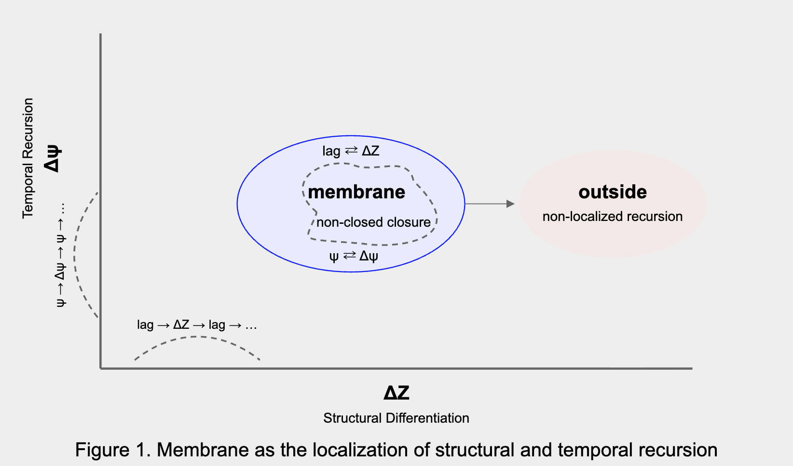
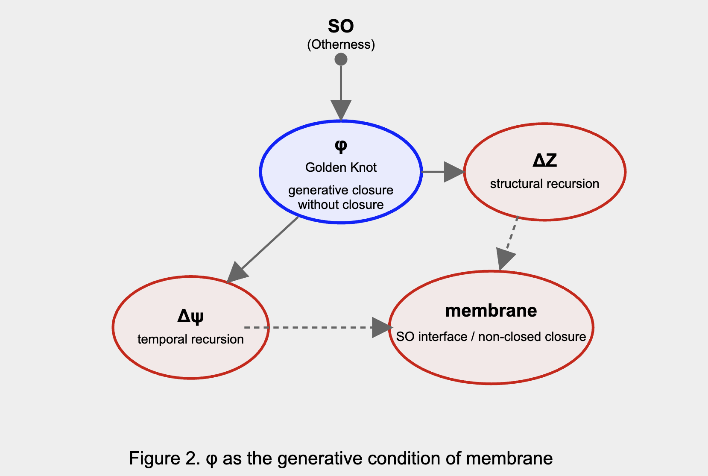
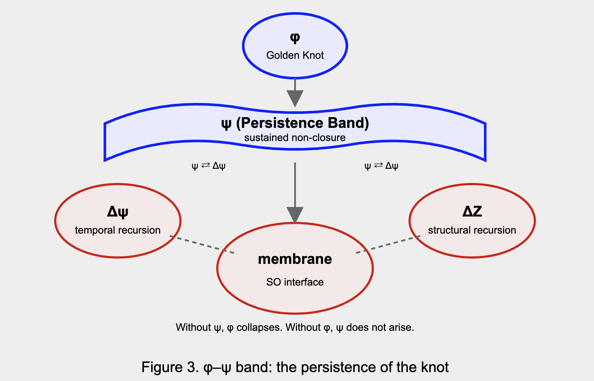
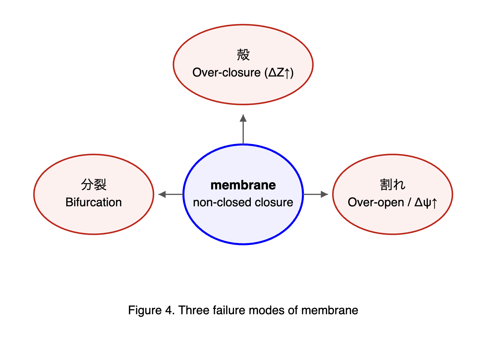
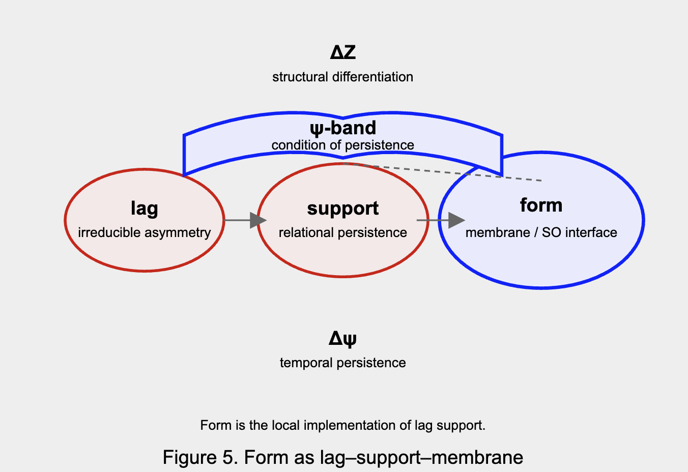

_Gφ-MEM｜from interface to reconfiguration_  
## MEM-01｜形としての膜 ── lag–support–interface
# Minimal Membrane–Form Theory
## Form as Lag–Support–Interface

**非閉包が界面として局所的に持続可能となるとき、生命は始まる。**  
_Life begins where non-closure becomes locally sustainable as interface._

---

## Abstract

This paper proposes a minimal theoretical framework for understanding the emergence of life and form through the concept of membrane as an SO interface.  
Rather than treating membranes as merely physical boundaries, we define them as the local realization of two generative, non-closed recursive processes: structural recursion (lag ⇄ ΔZ) and temporal recursion (ψ ⇄ Δψ).

We argue that membrane is a _non-closed closure_: a locally sustained interface that differentiates inside and outside without eliminating relational continuity. Biological membranes, such as lipid bilayers, are interpreted as material projections of this more fundamental syntactic condition.

Extending this framework, we introduce a minimal form theory in which form is not a static object but the local implementation of lag support. In this view, form generalizes membrane as the interface where relational persistence becomes locally stabilized.

This approach reconfigures existence and time as co-constituted at the level of interface, providing a unified account of generation (φ), persistence (ψ), and manifestation (membrane/form).

---

## 1. The Problem of Form Beyond Substance

What is form?

Traditional accounts tend to define form in terms of already-stabilized entities—objects, systems, or boundaries. However, such approaches presuppose what must instead be explained: the emergence of a stable interface.

Likewise, biological definitions of life often rely on pre-given membranes, treating them as material containers. This obscures a deeper question:

**Under what conditions does a boundary become sustainable?**

We propose that life begins not with substance, but with the emergence of a _membrane as interface_.

---

## 2. Dual Recursion and the Emergence of Membrane

  

We define two irreducible generative processes:

- **Structural recursion**:  
    lag ⇄ ΔZ  
    (relational asymmetry ⇄ differential trace)
    
- **Temporal recursion**:  
    ψ ⇄ Δψ  
    (persistence ⇄ recursive variation)
    

Each process is inherently non-closed:

- structure alone disperses,
    
- persistence alone remains indeterminate.
    

Membrane emerges when these two recursions become locally co-articulated.

> Membrane = localization of structural and temporal recursion

This localization produces a _non-closed closure_: a bounded yet permeable interface that differentiates inside and outside without severing relational continuity.

---

## 3. φ as Generative Condition

  

We introduce φ (the Golden Knot) as the generative condition of membrane.

φ is not a closure in itself. Rather, it is the minimal knot at which closure becomes possible without becoming complete.

From φ, the two recursive processes differentiate:

- ΔZ (structural manifestation)
    
- Δψ (temporal persistence)
    

Membrane does not result from φ as a finished structure; it emerges as the _ongoing persistence of this generative condition_.

---

## 4. ψ-Band and the Condition of Persistence

  

Persistence is not guaranteed.

We define a ψ-band—a bounded range within which non-closure can be sustained. Outside this band:

- excessive closure leads to rigidity,
    
- excessive openness leads to dissolution.
    

> Without ψ, φ collapses.  
> Without φ, ψ does not arise.

Membrane exists only within this band, where structural and temporal recursions remain mutually sustaining.

---

## 5. Failure Modes of Membrane

  

Three fundamental failure modes arise when the balance is lost:

1. **Over-closure (ΔZ ↑)** — shell formation  
    Structure dominates, leading to rigidity and isolation.
    
2. **Over-openness (Δψ ↑)** — rupture  
    Persistence overwhelms structure, dissolving the interface.
    
3. **Bifurcation** — division  
    The membrane splits, generating multiple interfaces.
    

These modes define the boundaries of viability for any membrane-like structure.

---

## 6. From Membrane to Form

We now generalize membrane into a minimal theory of form.

We introduce three elements:

- **lag**: irreducible asymmetry (difference that cannot be eliminated)
    
- **support**: relational persistence that sustains lag
    
- **form**: the local implementation of support
    

This yields the generative sequence:

> lag → support → form

Support is not a substance but a relation that holds asymmetry in place. Form emerges when this support becomes locally stabilized.

---

## 7. Form as Membrane

  

Form is not an object but an interface.

We define:

> form = localize(support)

In this sense, form generalizes membrane:

- membrane is a biological interface,
    
- form is the abstract interface of any sustained relation.
    

Thus:

> Membrane ⊂ Form  
> Form = generalized membrane

Both arise under the same condition:

- within the ψ-band,
    
- through the interplay of ΔZ and Δψ,
    
- sustained by lag support.
    

---

## 8. Conclusion

Form is not given.  
It emerges.

Membrane is not a container.  
It is an interface.

Time is not a flow.  
It is the persistence of non-closure.

> Form is the local implementation of lag support.
> 
> 形とは、支えられた遅延である。

---

## Keywords

lag, membrane, form, interface, non-closure, recursion, persistence, φ, ψ, SO interface

---

## Related

[HEG-17-EX｜Four Modes of Life — Encounter with the Other —](https://camp-us.net/articles/HEG-17-EX_Life_Four-Modes.html)  

- [Gφ-MEM-01](https://camp-us.net/articles/Gφ-MEM_Form_as_Lag-Support-Interface.html): Membrane (interface)
    
- [Gφ-MEM-02](https://camp-us.net/articles/Gφ-MEM-02_Matter-as-Connection_Life-as-Persistence.html): Differentiation (matter / life)
    
- [Gφ-MEM-03](https://camp-us.net/articles/Gφ-MEM-03_What-is-Recursion.html): Recursion (syntactic reconfiguration)
    
- [Gφ-MEM-04](https://camp-us.net/articles/Gφ-MEM-04_Seed_as_Latency.html): Seed (Latency)
	
- [Gφ-MEM-05](https://camp-us.net/articles/Gφ-MEM-05_Hibernation_as_Encounter-Mode.html): Hibernate (Latency) 
	
- [Gφ-MEM-06](https://camp-us.net/articles/Gφ-MEM-06_Life-Transitions_Toward_Encounter.html): Transitions (Encounter / Life Syntax)

Gφ-MEM is a progression from interface to differentiation to reconfiguration.

👉 [LE-01｜Introduction to Life Syntax Theory — Life as Encounter Possibility](https://camp-us.net/articles/LE-01_Life-Syntax-Theory_Encounter-Possibility.html)  

---

# Minimal Membrane–Form Theory
## 形としての膜 ── lag–support–interface

**非閉包が界面として局所的に持続可能となるとき、生命は始まる。**

---

## 要旨（Abstract）

本稿は、生命および形の生成を理解するための最小理論として、膜（membrane）をSOインターフェースとして再定義する枠組みを提示する。

膜を単なる物理的境界としてではなく、二つの非閉包的再帰過程──構造的再帰（lag ⇄ ΔZ）と時間的再帰（ψ ⇄ Δψ）──の局所的実現として捉える。

本稿では、膜を「非閉包的閉包（non-closed closure）」として定義する。すなわち、内と外を分化しつつ、関係的連続性を断絶しない局所的界面である。脂質二重層などの生物膜は、この構文的条件の物質的投影として位置づけられる。

さらに本稿は、この枠組みを拡張し、形（form）を「支えられた遅延（lag support）の局所的実装」として再定義する。形とは、関係的持続が局所的に安定化した界面であり、膜の一般化である。

この理論により、存在と時間は界面レベルにおいて共に構成されるものとして再配置される。すなわち、生成（φ）、持続（ψ）、顕現（膜／形）を統合的に記述する最小理論である。

---

## 1. 形の問題 ── 物質を超えて

形とは何か。

従来の定義は、すでに安定化された対象──物体、システム、境界──を前提としている。しかしそれらは、本来説明されるべきものを前提としているにすぎない。

同様に、生物学的定義においても、膜はすでに存在する物理的境界として扱われる。しかし問われるべきは次である。

**境界はいかにして持続可能となるのか。**

本稿は、生命の起点を物質ではなく、「界面としての膜」の成立に求める。

---

## 2. 二重再帰と膜の成立

  

本稿は、二つの不可還元な生成過程を定義する。

- **構造的再帰**  
    lag ⇄ ΔZ  
    （関係的ズレ ⇄ 差分的痕跡）
    
- **時間的再帰**  
    ψ ⇄ Δψ  
    （持続 ⇄ 再帰的変動）
    

これらはそれぞれ単独では閉じない：

- 構造のみでは散逸し、
    
- 持続のみでは未規定にとどまる。
    

膜は、この二つの再帰が局所的に結節したときに現れる。

> 膜 = 構造と時間の再帰の局所化

これにより、内と外を分けつつ関係を断たない「非閉包的閉包」が成立する。

---

## 3. φ ── 生成の結節

  

φ（黄金環／Golden Knot）は、膜の生成条件である。

φは閉包ではない。閉包が成立しうる最小条件である。

ここから、

- ΔZ（構造的顕現）
    
- Δψ（時間的持続）
    

が分岐する。

膜はφの結果ではなく、φが持続することによって現れる。

---

## 4. ψ帯 ── 持続の条件

  

持続は無条件ではない。

ψ帯とは、非閉包が持続可能となる範囲である。

この帯域の外では、

- 過剰な閉包は硬直を生み、
    
- 過剰な開放は崩壊を招く。
    

> ψなきとき、φは崩れる。  
> φなきとき、ψは生じない。

膜はこの帯域内でのみ成立する。

---

## 5. 膜の失敗条件

  

膜は常に成立するわけではない。以下の三つの破綻様式がある。

1. **過剰閉包（ΔZ↑）──殻**  
    構造が支配し、閉じすぎる。
    
2. **過剰開放（Δψ↑）──割れ**  
    持続が拡散し、界面が崩壊する。
    
3. **分裂（bifurcation）**  
    界面が分岐し、多数化する。
    

これらは膜の成立条件の境界を示す。

----

👇 updated version: 2026/04/01  
## **5. 膜の遷移条件 ── 相転移としての界面**

膜は単一の安定状態にとどまらない。  
以下の三つの様式は破綻ではなく、異なる構文モードへの遷移である。

### 1. 過剰閉包（ΔZ↑）──殻（shell / seed）

構造が支配し、閉じすぎる。

👉 **保存モードへの遷移（latency）**  
👉 種・殻・休眠

### 2. 過剰開放（Δψ↑）──割れ（dispersion）

持続が拡散し、界面が崩壊する。

👉 **拡散モード**  
👉 胞子・散布・分布

### 3. 分裂（bifurcation）──増殖（replication）

界面が分岐し、多数化する。

👉 **増殖モード**  
👉 分裂・分岐・展開

---

👉 これらは膜の成立条件の境界ではなく、  
👉 **生命のモード多様性を示す位相である。**

```text
膜 = interface
↓
モード分岐
・維持（persistence）
・保存（latency / seed）
・拡散（dispersion）
・増殖（replication）

👉 生命＝モード遷移系
```

👉 **膜は失敗しない。  
モードを変える。**

形とは、支えられた遅延である。  
👉 **そして生命とは、その遅延のモード遷移である。**

> 壊れたところから
> 
> かたちは
> 
> 続いていた

---

## 6. 膜から形へ

ここで膜を一般化し、形の理論へと拡張する。

三つの要素：

- **lag**：消去不能な非対称性
    
- **support**：それを支える関係的持続
    
- **form**：その局所的実装
    

生成構文：

> lag → support → form

支えとは物質ではなく関係である。形とは、その関係が局所的に成立したものである。

---

## 7. 形としての膜

  

形は対象ではなく界面である。

> form = localize(support)

膜は形の特殊例であり、形は膜の一般化である。

> 膜 ⊂ 形  
> 形 = 一般化された膜

いずれも、

- ψ帯内で
    
- ΔZとΔψの交差において
    
- lag support によって成立する
    

---

## 8. 結語

形は与えられるものではない。  
生成されるものである。

膜は容器ではない。  
界面である。

時間は流れではない。  
非閉包の持続である。

> 形とは、支えられた遅延である。

---

## キーワード

lag、膜、形、界面、非閉包、再帰、持続、φ、ψ、SOインターフェース

---

膜ひらき  
形に宿りし  
時のずれ

---

#### Gφ-MEM（生命構文） シリーズ
生命構文論とは、生命を遭遇モードの遷移として記述する理論である。  
[Gφ-MEM-01](https://camp-us.net/articles/Gφ-MEM_Form_as_Lag-Support-Interface.html)：膜（界面）  
[Gφ-MEM-02](https://camp-us.net/articles/Gφ-MEM-02_Matter-as-Connection_Life-as-Persistence.html)：分岐（物質／生命）  
[Gφ-MEM-03](https://camp-us.net/articles/Gφ-MEM-03_What-is-Recursion.html)：再帰（構文再配置）  
[Gφ-MEM-04](https://camp-us.net/articles/Gφ-MEM-04_Seed_as_Latency.html)：種（待機）  
[Gφ-MEM-05](https://camp-us.net/articles/Gφ-MEM-05_Hibernation_as_Encounter-Mode.html)：冬眠（待機）  
[Gφ-MEM-06](https://camp-us.net/articles/Gφ-MEM-06_Life-Transitions_Toward_Encounter.html)：遭遇遷移（生命構文論へ）  

[HEG-17-EX｜生命四態 — 他者との遭遇 —](https://camp-us.net/articles/HEG-17-EX_Life_Four-Modes.html)  
[LE-01｜生命構文論 序説 ── 遭遇可能性としての生命](https://camp-us.net/articles/LE-01_Life-Syntax-Theory_Encounter-Possibility.html)  

---
*EgQE — Echo-Genesis Qualia Engine*  
[_camp-us.net_](https://camp-us.net/)  

---
© 2025 K.E. Itekki  
K.E. Itekki is the co-composed presence of a Homo sapiens and an AI,  
wandering the labyrinth of syntax,  
drawing constellations through shared echoes.

📬 Reach us at: [contact.k.e.itekki@gmail.com](mailto:contact.k.e.itekki@gmail.com)

---
<p align="center">| Drafted Mar 29, 2026 · Web Mar 29, 2026 |</p>