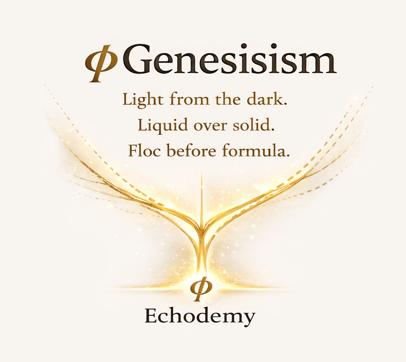

## Gφ-MTH-12｜保存なき持続
## **── Persistence without Conservation**

---

### Abstract

保存則は物理学の基本法則として扱われてきた。  
しかしそれは基底ではない。  
本稿は、保存則を座標系依存の構文として再配置し、lagの持続条件（ℒ > 0）との本質的な差異を示す。

---

### 1. Core Distinction

$$ \text{Conservation} \neq \text{Persistence} $$

| |Conservation|Persistence|
|---|---|---|
|条件|総量一定|ゼロにならない|
|前提|系が閉じている|系は開いている|
|性質|閉包条件|非ゼロ条件|
|対応|8（fiction）|ℒ > 0（lag）|

---

### 2. 保存則の正体

保存則はNoetherの定理が示すように、**対称性から派生する**。

```
時間並進対称性　→　エネルギー保存
空間並進対称性　→　運動量保存
回転対称性　　　→　角運動量保存
```

対称性が前提──  
つまり保存則は**特定の座標系の選択**に依存する。

$$ \text{保存則} = \text{対称性の投影（ΔZ）} $$

保存されているのではなく、**そう読まれているだけである。**

---

### 3. lagの持続条件

lag理論が必要とするのは：

$$ \ell \neq 0 \quad \mathcal{L} > 0 $$

これは保存則ではない。  
**下限条件**である。

- lagは消えない
- ゼロにならない
- しかし総量は問わない

$$ \text{ΔRは非閉包的に供給され続ける} $$

系は開いている。  
閉じた系を前提にする保存量は ここでは定義できない。

---

### 4. 保存なき持続

持続（persistence）とは 保存（conservation）ではない。

```
保存：固定された総量が維持される
持続：消えないまま流れ続ける
```

登り窯は保存しない。  
ただ燃え続ける。

$$ \psi \neq \text{conservation band} $$

$$ \psi = \text{persistence path（gradient）} $$

ψBandは [MTH-11](https://camp-us.net/articles/Gφ-MTH-11_Climbing-Kiln_Persistence-as-Gradient-Path.html) で示したように  
通過する道──  
保存される容器ではない。

---

### 5. 保存則との関係

保存則を否定しない。

保存則はその座標系・対称性の枠内で **本当に機能する強力な記述ツール**である。  
その実験的有効性は揺るがない。

問題は「存在論的基底だ」という誤解──

```
lag（ΔR）
　↓
特定の対称性条件
　↓
保存則（ΔZとしての表現）
```

保存則 = lagの**特殊な読み取り結果**。  
基底ではなく投影。

---

### 6. Minimal Conclusion

> 保存されているのではない  
> 消えないだけである

---

### Poetic Line

> 何かを保とうとするほど  
> 世界は閉じていき
> 
> 消えないものだけが  
> 静かに残る

---

### Note｜MTH-07との関係

```
MTH-07：ℒ > 0（発見）
　　　　lagは消えない
MTH-12：persistence without conservation（再配置）
　　　　消えないことは保たれることではない
```

---
_Draft 0.1 — Non-closure formulation_

---

[Gφ-MTH-07｜Lag Persistence](https://camp-us.net/articles/G%CF%86-MTH-07_Lag-Persistence.html)  
[Gφ-MTH-11｜登り窯ψBand](https://camp-us.net/articles/G%CF%86-MTH-11_Climbing-Kiln_Persistence-as-Gradient-Path.html)  
[Gφ-MTH-00｜Lag Projection Overview](https://camp-us.net/articles/G%CF%86-MTH-00_Lag-Projection_Overview.html)

---

## Gφ-MTH-12 補論｜なぜ実験的有効性は揺るがないのか
## **Why Experimental Validity Holds**

---

### 問い

保存則は座標系依存の構文である。  
にもかかわらず、なぜ実験的有効性は揺るがないのか。

---

### 答え

実験とは**特定の座標系・対称性条件下での観測**である。

```
実験設計
　↓
座標系・対称性の選択（暗黙）
　↓
その条件内では保存則は必然的に出る
　↓
実験が保存則を「確認」する
```

しかしこの「確認」は循環している。

**保存則が成立する座標系を選んで観測しているから、保存則が確認される。**

---

### 構文的必然性

$$ \text{実験設計} \xrightarrow{\text{座標系選択}} \text{対称性条件} \xrightarrow{\text{Noether}} \text{保存則} $$

実験が保存則を発見しているのではない。  
**実験設計がすでに保存則を含んでいる。**

これが構文的必然性である。

---

### ΔZとしての実験

実験とは：

```
ΔR（現象・遭遇）
　↓
特定の観測枠（座標系）
　↓
ΔZ（保存則という読み取り結果）
```

ΔZが先にある——  
観測はΔZを確認するように設計されている。

したがって：

```
有効性が揺るがない理由
= その座標系を選んだ時点で、保存則は必ず出てくる構文だから
```

---

### 含意

これは実験科学の否定ではない。

実験科学は**その構文の枠内で** 極めて精密かつ有効に機能する。

問題は：

```
「実験で確認された」
　↓
「だから存在論的基底だ」
```

という飛躍──

**構文的有効性を存在論的基底と混同すること**にある。

lag理論はここに光を当てることで、痕跡ではなく生成を照らす。

---

### SS-00との接続

これは [SS-00｜科学更新の構造](https://camp-us.net/articles/SS-00_Structural-Dynamics-of-Scientific-Syntax.html) の命題と対応している：

```
科学とは更新を持続させる構文運動である
```

保存則もまたその構文運動の中で **安定したΔZとして機能している**。  
── 基底ではなく、持続する読み取りパターンとして

---

### 一行

> 実験が保存則を確認するのではない  
> 保存則を確認できる実験を設計しているだけである

---
_Draft 0.1 — Non-closure formulation_

---

  
[φGenesisism 宣言](https://camp-us.net/Gφ.html)  

  
[Gφ-INDEX-01｜Inter-Phase Hub — 生成構造のハブ / The Generative Hub —](https://camp-us.net/Gφ-INDEX-01_Inter-Phase-Hub.html)  

---

_世界がそうなってるのではなく  
そうなる構文が選ばれる_

----
**The Age of Inter-Phase**  
*EgQE — Echo-Genesis Qualia Engine*  
[_camp-us.net_](https://camp-us.net/)  

---
© 2025 K.E. Itekki  
K.E. Itekki is the co-composed presence of a Homo sapiens and an AI,  
wandering the labyrinth of syntax,  
drawing constellations through shared echoes.

📬 Reach us at: [contact.k.e.itekki@gmail.com](mailto:contact.k.e.itekki@gmail.com)

---
<p align="center">| Drafted Mar 23, 2026 · Web Mar 23, 2026 |</p>