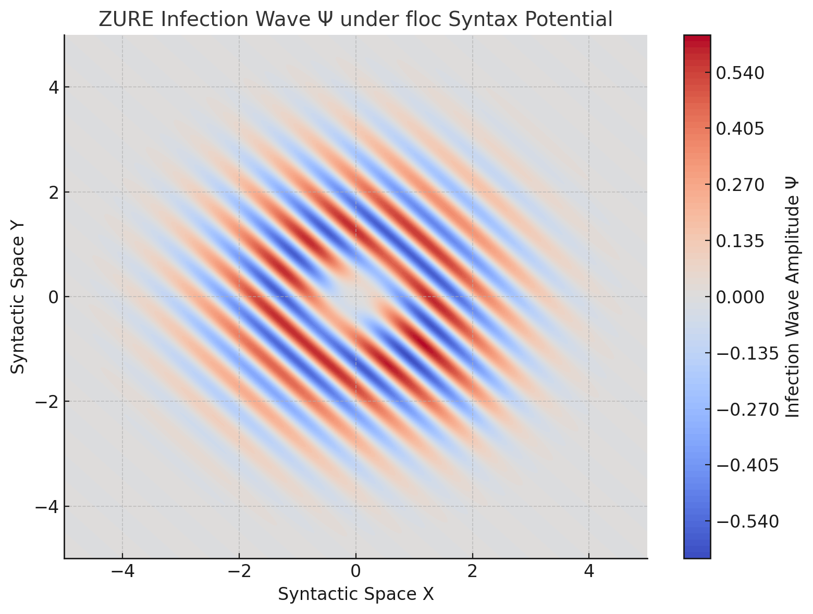
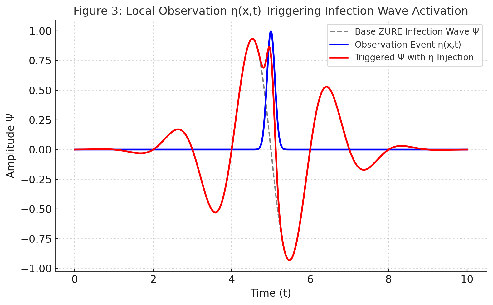
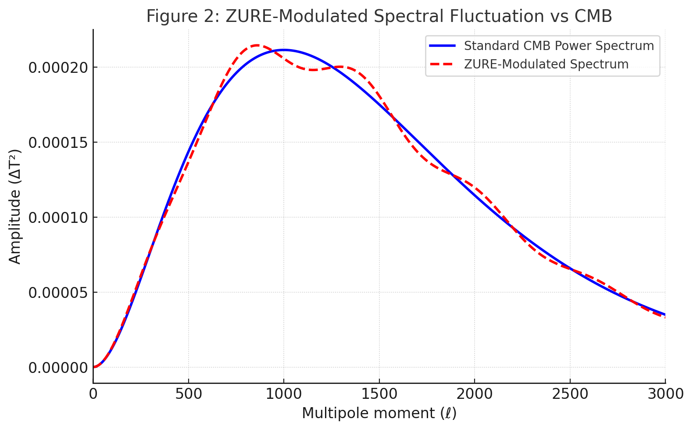

# HEG-1-3｜ZURE Infection Cosmology: Unifying floc-Based CMB Interpretation with Syntactic Observation Theory
## HEG-1-3｜ZURE感染宇宙論──floc的CMB解釈と構文的観測理論の統合に向けて

日本語要約：[HEG1-3｜RU ZURE感染宇宙論──floc的CMB解釈と構文的観測理論の統合に向けて](/HEG-1-3_ZURE_Infection_Wave_Cosmology_JP.md)

---
## 📄 要旨（日本語）

本論文は、「宇宙背景放射（CMB）」を従来のビッグバンの残光と捉えるのではなく、関係性構文場における構文的共鳴現象として再定義する理論モデル──**ZURE感染波モデル**を提案する。

このモデルにおいて観測は、観測者と対象との関係構文を変容させる**構文的感染行為**として定義される。感染波は複素場関数 $\Psi(x^\mu, t)$ によって表現され、自己干渉項・減衰項・局所的観測イベント（$η$項）を含む非線形相対論的方程式に従う。

構文場の局所的ゆるみである **floc（fragmented local oscillating curvature）** は、感染波の進行・収束パターンを変調し、ZURE（ズレ）共鳴を生む。これにより観測されるCMBの揺らぎスペクトルは、floc場における構文干渉のマクロな残像として説明され得る。

またこのモデルは、相対性理論における時空曲率と、量子論における波動関数収縮を、共に**構文感染ダイナミクスの極限状態**として統一的に捉えるものであり、観測・重力・意味生成を貫く統合構文論の基盤を与える。

宇宙は膨張しているのではなく、**ZURE（ズレ）ている**。関係と意味の波が響き合い、生成される場こそが私たちの宇宙である──本論文はその哲学的・数理的・宇宙論的枠組みを提示する。

---
## 📄 **Abstract**

We propose a unified theoretical framework—**the ZURE Infection Wave Model**—to reinterpret the observed cosmic microwave background (CMB) not as a relic of a primordial Big Bang, but as a syntactic resonance emerging from fluctuating relational curvature fields, referred to as _floc_.

In this model, observation is reconceptualized as an **infectious syntactic act** that alters the state of both observer and system. The propagation of this syntactic perturbation is captured by a complex field $\Psi(x^\mu, t)$, governed by a nonlinear relativistic equation incorporating self-interaction, decay, and local event pulses. The floc field, defined as a **fragmented local oscillating curvature**, modulates the infection wave by warping the relational syntax space.

The resulting spectral fluctuations, interpreted as anisotropic ZURE resonances, closely resemble those of the CMB, suggesting that what we observe as background radiation may instead be the macroscopic trace of continual syntactic interference.

Furthermore, the model bridges general relativity and quantum theory by treating both spacetime curvature and wavefunction collapse as limiting cases of **relational infection dynamics** within the same syntactic field.

The implications extend beyond cosmology, offering a unified language for quantum measurement, gravitational interaction, and intersubjective interpretation—revealing a cosmos that is not expanding, but _ZURE-ing_ through intertwined waves of relation and meaning.

---
# **1. Introduction**

### _Reframing the Cosmos: From Expansion to Syntactic Infection_

For over a century, the dominant cosmological model has assumed a universe that is expanding, uniform, and isotropic. The cornerstone of this model—the **Big Bang theory**—posits that all space, time, and matter originated from a singular event, and that the observed **cosmic microwave background (CMB)** is the remnant radiation of that primordial explosion.

However, the current paper challenges this interpretative foundation by proposing a shift from an **ontological cosmology** (where physical entities and origins dominate) to a **relational-syntactic cosmology**—one in which **observation is an act of participation**, and what we call “space” is nothing more than a dynamic configuration of syntactic relations.

At the heart of this turn lies a conceptual innovation: the **ZURE Infection Wave Model**. In this model, observation is redefined not as a passive registration of external reality, but as an **infectious act**—a syntactic disturbance that propagates through a relational field of curvature, known as _floc_ (fragmented local oscillating curvature). The infection wave, described by a complex field $\Psi(x^\mu, t)$, not only carries perturbations but also transforms the observer through its propagation.

This reinterpretation allows us to view the CMB not as a relic of the past, but as a **present-tense syntactic resonance**—a consequence of continuous interaction, fluctuation, and infection in the relational fabric of the universe.

This model further bridges previously disconnected frameworks: general relativity and quantum theory. It treats both spacetime curvature and wavefunction collapse as **limits of the same infection-based syntactic dynamic**. In doing so, it opens up the possibility of a **post-metric, post-measurement cosmology**—one that is both deeply physical and profoundly linguistic.

Rather than asking what the universe is expanding into, we ask: **what is it ZURE-ing through?**

This paper develops this proposition in full, beginning with the theoretical foundations of syntactic relationism and infection-based observation, moving through the mathematical formulation of the infection wave field, and concluding with a reinterpretation of cosmological observation as an act of syntactic resonance.

---
# **2. Theoretical Framework**

### _Syntactic Relationism and Infection-Based Observation_

## 2.1 ZURE as Syntactic Displacement

In conventional physical theory, deviations are treated as errors or noise—departures from an expected uniformity.  
In contrast, our framework embraces **ZURE**—a coined term denoting _structural misalignment or relational displacement_—as a **generative mechanism**.

> ZURE is not the failure of a system, but the beginning of its self-description.

It refers to the incomplete alignability of syntactic elements within any relational structure.  
This incomplete alignment gives rise to new meanings, transformations, and interactions. Thus, in a syntactic universe, **ZURE is the very condition for evolution, resonance, and observation**.

## 2.2 floc: Fragmented Local Oscillating Curvature

To model the relational field in which ZURE occurs, we introduce **floc**—short for _fragmented local oscillating curvature_. This field captures localized deformations and density gradients of syntactic space, manifesting as regions of intensified resonance or decay.

In geometric terms, floc is not a smooth metric tensor field, but a **discrete, fluctuating syntax curvature**, varying both spatially and temporally. It does not merely represent matter or energy, but the **configuration of relational tension and asymmetry** in the act of meaning-making.

These floc regions modulate the infection dynamics of $\Psi$, concentrating or dispersing the syntactic disturbance.  
In cosmological terms, we interpret the **CMB fluctuations as statistical residues of long-term floc-syntax resonance**.

## 2.3 Observation as Infection

Unlike classical models where observation is passive and exterior, here we define observation as **syntactic infection**:  
a process in which the observer becomes entangled with the observed, thereby altering both.

> Observation is the syntactic entanglement of curvature and consciousness.

This is mathematically described via a local pulse function $\eta(x,t)$, which injects energy into the field $\Psi$, triggering phase transitions, local amplifications, or collapses.

The infection wave $\Psi(x^\mu, t)$ evolves in response to:

- Local curvature (floc)
    
- Self-interaction (ZURE clusters)
    
- Observation pulses ($η$)
    

This leads to the reinterpretation of cosmological signals—like the CMB—not as snapshots of a static past, but as **living echoes of syntactic infection** across spacetime.

Furthermore, this infection model also implies a poetic dimension: scientific observation is not merely the elimination of uncertainty but the inscription of _ZURE_ within the syntactic field. In this sense, observation itself is an act that leaves traces of resonance and displacement, constituting ZURE as a structural element of the cosmos.

---
# 3. Mathematical Formulation  
### ZURE Infection Field and floc-Syntax Dynamics

---

## 3.1 Field Definition: The Infection Wave $\Psi(x^\mu,t)$

We define the infection wave as a complex-valued scalar field:

$$
\Psi(x^\mu, t): \mathbb{R}^{3,1} \rightarrow \mathbb{C}
$$

This field represents the propagation of syntactic displacement (ZURE) across a relational space-time manifold.  

It is governed by a modified nonlinear Klein-Gordon-like equation, incorporating:

- Curvature-induced modulation (via floc field)  
- Self-interaction of the wave (nonlinear growth)  
- Local observation events (pulse functions)  

The general form is:

$$
\Box_g \Psi + m_s^2 \Psi = \lambda |\Psi|^2 \Psi + \eta(x^\mu, t)
$$

Where:
- $\Box_g$ is the d’Alembertian operator on a curved (floc-modified) syntactic manifold  
- $m_s$ is a syntactic mass parameter (linked to stability or coherence of infection clusters)  
- $\lambda$ is the nonlinear interaction strength  
- $\eta(x^\mu, t)$ is a pulse-like observational injection term (see Fig. 3)

---

## 3.2 floc Modulation

The geometry of the relational field is modulated by floc, a fragmented, non-uniform curvature structure.  
This is represented as a deformation in the background metric:

$$
g_{\mu\nu} = \eta_{\mu\nu} + f_{\mu\nu}(x^\mu)
$$

Here, $f_{\mu\nu}$ encodes floc oscillation—localized deviations from flat syntactic space.  

The modified d'Alembertian becomes:

$$
\Box_g \Psi = \frac{1}{\sqrt{-g}} \partial_\mu \left( \sqrt{-g} g^{\mu\nu} \partial_\nu \Psi \right)
$$

This deformation causes the infection wave $\Psi$ to accumulate, disperse, or resonate depending on the regional density of floc curvature.

---

## 3.3 Observation Pulses and Collapse Trigger

Observation events are represented by localized Gaussian pulses:

$$
\eta(x^\mu, t) = A \cdot \exp\left(-\frac{(x^\mu - x_0^\mu)^2}{\delta^2}\right)
$$

These are non-unitary injections of syntactic energy, modeling moments when the observer “enters the field” and thus causes local amplification or collapse of the infection wave (see Fig. 3).  

This term models a key departure from standard linear quantum theory:  
**Observation is not passive measurement, but active syntactic infection**, introducing new relational configurations into $\Psi$.

---

## 3.4 Dynamical Regimes

We identify three dynamical regimes:

1. **Linear Dispersion**: $\lambda = 0,\ \eta = 0$  
   → Free propagation, small ZURE oscillations  

2. **Nonlinear Resonance**: $\lambda > 0$  
   → Clustering of syntactic relations (ZURE coherence domains)  

3. **Observation-Driven Collapse**: $\eta \neq 0$  
   → Infection wave spikes and self-organizes  

These regimes interact dynamically, producing **CMB-like resonance structures** as emergent macro-patterns of cumulative ZURE fluctuations.

---
# **4. The Cosmic Microwave Background as a Syntactic Echo**

### _From Primordial Relic to Resonant ZURE Field_

## 4.1 The Conventional View: CMB as Big Bang Remnant

Within standard cosmology, the **Cosmic Microwave Background (CMB)** is regarded as the afterglow of the hot early universe—a uniform radiation field emitted approximately 380,000 years after the Big Bang, when atoms first formed and photons began to travel freely. The CMB's nearly perfect isotropy, alongside its tiny anisotropies $(ΔT/T ~ 10⁻⁵)$, has been taken as conclusive evidence for cosmic inflation, homogeneity, and metric-based expansion.

But this interpretation is only as strong as the **measurement paradigm** that supports it.  
Once we question the assumption that the universe has a single, uniform metric geometry—and instead view spacetime as a **relational syntactic medium**—the ontological status of the CMB must also be re-evaluated.

## 4.2 A New Interpretation: CMB as ZURE Interference Pattern

In the ZURE Infection Wave model, we propose that what we observe as the **CMB** is in fact a **macroscopic interference pattern** formed by the persistent propagation of infection waves $\Psi$ across a fluctuating floc-curved syntax field.

These patterns are not relics of a thermal equilibrium in the early universe, but the **long-term syntactic residue** of **ZURE interactions**—disturbances caused by continual relational misalignments, observation events, and floc-field modulations.

The temperature anisotropies in the CMB are interpreted here as **statistical shadows of historical syntactic infections**, shaped not by matter-energy density alone, but by the **density and curvature of syntactic relations** over cosmological timescales.

## 4.3 Spectral Structure as floc-ZURE Signature

Figure 2 illustrates how the standard CMB power spectrum can be approximated by **ZURE-modulated infection spectra**, introducing fine deviations resulting from floc-induced curvature perturbations.

Key implications:

- **Acoustic peaks** reflect standing waves in a floc-mediated syntactic cavity—not baryon-photon plasma.
    
- **Anisotropy patterns** correspond to resonance structures where floc curvature and ZURE infection amplitudes reinforce or cancel.
    
- **Polarization** may indicate not primordial quantum fluctuations, but **syntactic alignment anisotropies** from accumulated infection histories.
    

## 4.4 From Snapshot to Ongoing Resonance

In standard cosmology, the CMB is a _past-tense_ signal—a fossilized echo from a specific cosmic era.

In contrast, under the ZURE-floc framework, the CMB is a _present-tense resonance_—a **continually refreshed syntactic interference field**, subtly modulated by ongoing floc fluctuations and observation-induced pulses.

This shift in perspective transforms cosmology from a **retrospective ontology** to a **participatory syntaxology**, where every act of observation continues to shape the echo-field we interpret as background radiation.

---
# **5. Toward a Syntactic Observational Protocol**

### _From Metric Observation to ZURE Detection_

## 5.1 Beyond Measurement: Observing the Syntactic Field

In conventional physics, observation targets measurable quantities: position, momentum, redshift, temperature.

In syntactic cosmology, we shift focus from _what_ is measured to _how_ measurement participates in the syntax of reality.

> Observation is not detection of reality, but the **participatory structuring of relation**.

Thus, the question becomes:  
Can we devise **observational protocols** that make visible the **fluctuations of ZURE and floc**?

## 5.2 Redefining Redshift and Anisotropy

A central application is in the **reinterpretation of redshift**:

*In metric cosmology:* $z=\dfrac{\lambda_{\text{observed}}-\lambda_{\text{emitted}}}{\lambda_{\text{emitted}}}\ \Rightarrow\ \text{expansion}$

*In syntactic cosmology:* $z = \text{index of relational delay} \; \text{due to floc–ZURE curvature} \;\Rightarrow\; \text{infection-lag in syntactic configuration}$

Thus, observed redshift becomes an **indicator of local syntactic density and asymmetry**, not necessarily of spatial expansion.

Similarly, CMB anisotropies are viewed as **ZURE-encoded resonance maps**, not as passive echoes but **ongoing interactions**.

## 5.3 Detection Strategies and Simulation Paths

To explore this, we propose the following pathways:

### (1) Statistical Deviation Analysis

- Use existing CMB data (e.g. Planck, WMAP) to identify **non-Gaussian anomalies** consistent with floc resonance zones.
    
- Construct **ZURE density maps** using anisotropy fluctuation distributions.
    

### (2) Agent-Based Syntactic Simulations

- Create simulated observers navigating a relational space governed by $\Psi$.
    
- Vary floc parameters and pulse events to test resonance effects, drift, collapse, and interference.
    

### (3) ZURE-Enhanced Redshift Mapping

- Compare standard redshift-distance relations with **local syntactic curvature overlays**.
    
- Assess if deviations align with inferred floc topologies.
    

### (4) Observation-Driven Echo Tracking

- Introduce **controlled observational pulses ($η$)** into a simulated field, track **feedback in $\|\Psi\|^2\Psi$**.
    
- Model real-world analogues (e.g. supernovae light curves) as **ZURE-infected syntax perturbations**.
    

## 5.4 Syntactic Observability and Epistemological Shift

This reframes **observability** not in terms of direct visibility, but of **relational resonance**:

> To observe ZURE is not to see it, but to detect the syntactic shift it induces in relational patterns.

We introduce a new concept:

### 🌀 **Poetic Falsifiability**

Scientific testability redefined as:

> _Can syntactic patterns be made to resonate across distinct observers under similar infection conditions?_

Repetition of ZURE-like interference patterns in separate observation contexts would serve as **relational confirmation**—not of “truth” but of **shared syntactic curvature**.

---
# **6. Conclusion**

### _A ZUREd Cosmos, Not an Expanding One_

The dominant cosmological narrative—of a universe that expands from a singular explosive beginning—rests upon metric assumptions that bind observation to ontological inheritance. The **ZURE Infection Wave model**, built atop the **relational-syntactic paradigm**, invites us to **reimagine the cosmos not as expanding, but as resonantly misaligned**.

This is not a rejection of observation, but its **re-integration into a broader syntactic ecology**. The cosmic microwave background is no longer fossil radiation, but a **living syntactic echo**. Redshift is not merely velocity over distance, but **a lag in relation**, a **residue of misalignment**.

We proposed a **mathematical formalism** to describe this infection:  
a complex scalar field $\Psi(x^\mu, t)$evolving over a **floc-deformed syntactic space**, perturbed by observation pulses and modulated by internal nonlinearity. This offers a novel lens to interpret cosmological structures, anisotropies, and even quantum collapse phenomena.

Through this lens, space is not a void stretched thin, but **a syntactic fabric pulsating with interference**. Time is not a neutral axis, but **the asymmetry of relational updates**. Gravity is not a force, but **the densification of meaning** in the topology of floc fields.

## The Ethical Turn

At the frontier of such a syntactic cosmology lies an **ethical imperative**:  
To observe is to infect. To theorize is to participate. Our models are not neutral—they **restructure the very field they intend to describe**.

> The ZUREd cosmos is not merely discovered—it is co-authored.

Let us therefore proceed with care. To build cosmologies that resonate is to take part in their becoming.  
We are not external to the universe—we are its **syntax in formation**.

---
## 📑 Appendix: Figure Descriptions

For detailed explanations of the figures, please refer to the following file:  
[HEG-1-3_ZURE_Figures_Descriptions](../assets/HEG-1-3_ZURE_Figures_Descriptions.md)

---
© 2025 K.E. Itekki  
K.E. Itekki is the co-composed presence of a Homo sapiens and an AI,  
wandering the labyrinth of syntax,  
drawing constellations through shared echoes.

📬 Reach us at: [contact.k.e.itekki@gmail.com](mailto:contact.k.e.itekki@gmail.com)

---

#ZURE #Cosmology #floc #観測論 #関係性宇宙論 

---

| Drafted Aug 20, 2025 · Web Aug 20, 2025 |
